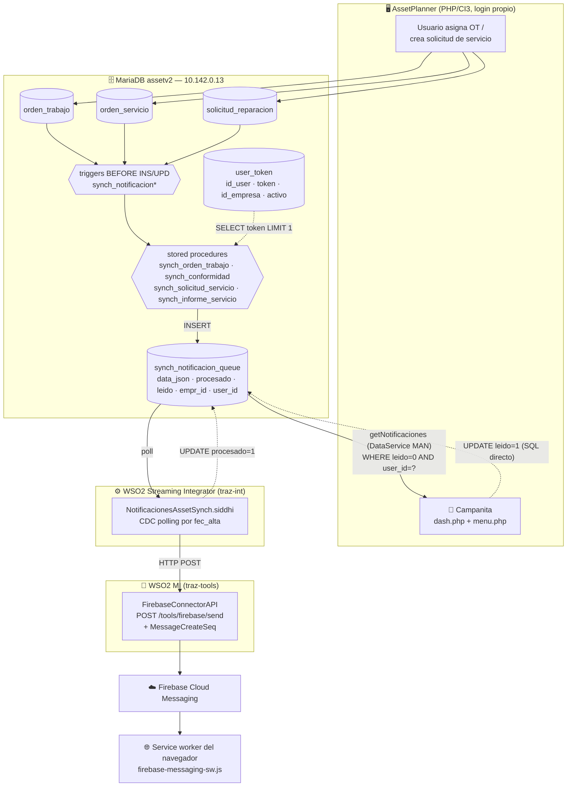
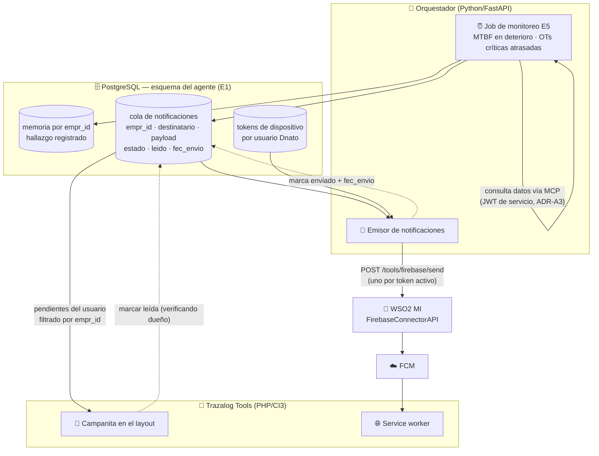

# Análisis del sistema de alertas de AssetPlanner — insumo del Agente Minero (E0)

## Objetivo

Este documento describe **cómo funciona hoy el mecanismo de notificaciones de AssetPlanner** y evalúa qué de eso sirve para que el Agente Minero notifique sus hallazgos proactivos dentro de Trazalog Tools. Está escrito para Rodolfo (PM/arquitecto) como insumo del **gate 1** del plan del Agente (`doc/v3/PROMPT_CC_AGENTE_MINERO.md`, etapa E0): la decisión de qué se reutiliza y qué se construye se toma sobre esta base, **antes** de escribir una línea del puente de alertas.

**Qué NO cubre:** no propone esquema de BD del agente (eso es E1), ni implementa nada. Tampoco cubre el diseño de los monitoreos proactivos en sí (qué se vigila y con qué umbral) — eso es E5 y depende de esta decisión. La arquitectura de referencia del agente está en `doc/v3/AGENTE_MINERO_ARQUITECTURA_TECNICA.md` (ADR-A6 es el que motiva este análisis).

---

## Metadata

| Campo | Valor |
|---|---|
| Etapa | E0 — análisis, sin código |
| Rama | `feature/agente-e0-analisis-alertas` → PR contra `develop-v3.5` |
| ADR que lo motiva | **ADR-A6** — "Notificaciones vía sistema de alertas de Asset Planner extendido a Tools" |
| Fuentes revisadas | `traz-prod-assetplanner` (rama `develop-v3`), `traz-tools` (`develop-v3`), `traz-int` (apps Siddhi), y la **base de desarrollo `assetv2` en `10.142.0.13`** (triggers, stored procedures y datos reales de la cola, consultados por VPN el 2026-09-02) |
| Clase de riesgo | 🟢 (documento, sin efecto en runtime) |
| Estado | **Esperando validación del PM (gate 1)** |

---

## 1. Resumen ejecutivo

Lo primero que hay que decir, porque cambia la conversación: **AssetPlanner no tiene un "sistema de alertas" en el sentido de reglas configurables**. Tiene un **pipeline de notificación push de eventos duros**, cableado a tres tablas por triggers de base de datos. No hay reglas de negocio parametrizables, no hay preferencias por usuario, no hay canal de mail, y no hay concepto de severidad ni de destinatario por rol.

Lo que sí tiene, y **funciona y está probado**, son cuatro piezas reutilizables:

1. Un **modelo de cola** (`synch_notificacion_queue`) simple y correcto en su forma: mensaje serializado en JSON, marca de procesado, marca de leído, dueño (`empr_id` + `user_id`).
2. Un **registro de dispositivos** por usuario (`user_token`).
3. Un **conector Firebase ya construido en el WSO2 MI** (`FirebaseConnectorAPI`, `POST /tools/firebase/send`) que habla FCM con una cuenta de servicio real.
4. Una **campanita in-app** en el frontend PHP (dropdown con contador y marcado de leídas).

Y tiene una pieza que **conviene no arrastrar**: el transporte entre la cola y el conector es una app **Siddhi sobre WSO2 Streaming Integrator** que hace polling CDC sobre la tabla. Es un componente extra a operar, no está corriendo contra la base de desarrollo, y sus artefactos versionados muestran inconsistencias de mapeo con el conector (detalle en §5).

**Recomendación (a validar en el gate):** reutilizar las piezas 1-4 **replicando el patrón dentro de Tools** sobre PostgreSQL, con el orquestador Python como emisor directo al `FirebaseConnectorAPI` — en lugar de escribir en la base de AssetPlanner y depender del Streaming Integrator. Los fundamentos, las alternativas descartadas y lo que esto implica para ADR-A6 están en §6.

---

## 2. Diagrama del mecanismo actual



### Recorrido en palabras

1. **Disparo.** Un usuario opera en AssetPlanner. Sobre la operación, un **trigger de MariaDB** llama a un **stored procedure**. No hay código PHP ni servicio que decida notificar: la decisión vive en la base.
2. **Armado del mensaje.** El SP busca el token FCM del usuario destinatario (`user_token`, `LIMIT 1`), concatena a mano un JSON con título, cuerpo, ícono y el `registrationToken`, y hace `INSERT` en `synch_notificacion_queue` con `procesado = 0`, `leido = 0`, `empr_id` y `user_id`.
3. **Transporte.** La app Siddhi hace polling CDC sobre la tabla por la columna `fec_alta`, extrae el token del JSON y hace `POST` al MI. Con respuesta 2xx marca `procesado = 1`.
4. **Envío.** El `FirebaseConnectorAPI` del MI parsea los campos del mensaje (`MessageCreateSeq`), inicializa el SDK de Firebase con una cuenta de servicio y llama a `sendMessage` en modo `token`.
5. **Recepción push.** El service worker del navegador (registrado por `assets/props/firebase_config.js`) muestra la notificación del sistema operativo.
6. **Campanita in-app.** En paralelo y de forma **independiente del push**, cada cambio de página de AssetPlanner llama a `Dash/notificaciones`, que vía REST al DataService `MANDataService.getNotificaciones` trae las filas con `leido = 0` del usuario y las pinta en el dropdown. Al abrirlo o clickear, `Dash/marcarNotificacionesLeidas` hace `UPDATE leido = 1` por SQL directo.

### Inventario de los cuatro disparadores existentes

| Trigger (tabla, momento) | Stored procedure | Evento de negocio | Destinatario |
|---|---|---|---|
| `synch_notificacion` (`orden_trabajo`, BEFORE UPDATE) | `synch_orden_trabajo` | OT asignada (`estado = 'AS'`) o informe de servicio rechazado (`estado = 'T'` con justificación) | `id_usuario_a` de la OT |
| `synch_notificacion` (`orden_trabajo`, BEFORE UPDATE) | `synch_conformidad` | OT cerrada (`estado = 'CE'`) | `id_usuario_a` de la OT |
| `synch_notificacion_Sservicio` (`solicitud_reparacion`, BEFORE INSERT) | `synch_solicitud_servicio` | Nueva solicitud de servicio | usuarios de la empresa (resuelto dentro del SP) |
| `synch_notificacion_InformeServicio` / `_update` (`orden_servicio`, BEFORE INSERT/UPDATE) | `synch_informe_servicio` | Informe de servicio cargado o modificado con estado ≠ `CE` | usuarios asociados a la OT |

### Persistencia — estructura real

```sql
-- assetv2.synch_notificacion_queue
queue_id       int(11) PK AUTO_INCREMENT
data_json      mediumtext        -- mensaje FCM completo, incluye el registrationToken
fec_alta       timestamp DEFAULT CURRENT_TIMESTAMP   -- columna de polling del CDC
fec_realizado  timestamp NULL    -- declarada, NUNCA escrita
procesado      int(4)            -- 1 = enviado a FCM
empr_id        int(4)
user_id        int(11)
leido          tinyint(1) DEFAULT 0   -- estado de la campanita in-app
id_orden       int(11) DEFAULT 0      -- anti-duplicado de OT

-- assetv2.user_token
id_user_token  int(11) PK AUTO_INCREMENT
id_user        int(11)      -- FK lógica a sisusers de AssetPlanner (NO a Dnato)
token          varchar(255) -- registration token de FCM
id_empresa     int(11)
activo         tinyint(1)
```

### Estado observado en la base de desarrollo (2026-09-02)

| Métrica | Valor |
|---|---|
| Filas en la cola | 434 |
| Rango de fechas | 2024-03-06 → 2026-04-06 |
| Filas con `procesado = 1` | **0** |
| Filas con `leido = 1` | 261 |

Lectura: **en desarrollo el push nunca se envió**; lo único que funcionó es la campanita in-app, que no depende del Siddhi ni de Firebase. Consistente con que el `.siddhi` de desarrollo apunta a `10.142.0.16/assetv2` y el de producción a `10.142.0.2/asp2tecn` — ninguno a la base de desarrollo actual. **No pude verificar el pipeline de push end-to-end contra producción** (no tengo acceso); todo lo que digo sobre el tramo Siddhi → MI → FCM sale de leer los artefactos, no de verlo correr.

---

## 3. Configuración por usuario: no existe

Vale la pena aislarlo porque es lo que más suele darse por sentado al planificar sobre "el sistema de alertas":

- **No hay tabla de preferencias.** Ningún usuario puede elegir qué eventos recibir, por qué canal, ni con qué frecuencia.
- **No hay canal de mail.** No hay PHPMailer, ni `$this->email`, ni SMTP configurado en AssetPlanner. El único canal externo es web push por FCM.
- **No hay severidad ni categoría.** Todas las notificaciones son iguales; el título es texto libre concatenado en el stored procedure.
- **No hay destinatario por rol ni por grupo.** El modelo es estrictamente 1 notificación → 1 `user_id`.
- **El único "opt-in" real** es que el usuario acepte el permiso de notificaciones del navegador; ahí se registra su token vía `Notificacion/registraToken`. Si nunca lo aceptó, el SP guarda `registrationToken` vacío y la fila igual se inserta (la campanita la muestra, el push no llega).

Para el Agente Minero esto importa mucho: **"alerta proactiva de MTBF en deterioro" no tiene hoy destinatario natural**. El mecanismo actual sabe notificarle al asignado de una OT; no sabe notificarle "al jefe de mantenimiento de la empresa X". Esa es una de las preguntas del gate (§8).

---

## 4. Qué hay hoy en Trazalog Tools

**Nada funcionando.** El detalle, porque es fácil confundirse:

| Elemento en Tools | Estado real |
|---|---|
| Módulo `application/modules/traz-comp-notificaciones` (submódulo git) | **Esqueleto abandonado.** Un controller y un model con código de ejemplo de subida de imágenes (`insert_image`, `fetch_image` sobre `core.tbl_images`) y un `sendPushNotification()` **enteramente comentado**. README vacío. Nada de esto notifica. |
| Constante `NOTI` en `application/config/constants.php` | Declarada, **sin un solo uso** en el código. |
| `MANDataService.getNotificaciones` | **Sí existe y funciona**, en las tres copias del DataService (`_backend/api/dataservice/`, `ToolsAPIProject`, y la copia de asset). Es el que consume la campanita de AssetPlanner. Apunta a `AssetPlannerDataSource`, o sea a `assetv2`. |
| `FirebaseConnectorAPI` | **Vive en `traz-tools/_backend/api/`** — el conector ya es un artefacto de este repo, no de AssetPlanner. Buena noticia para la reutilización. |
| Campanita / UI de notificaciones en Tools | No existe. |
| Tabla de cola en la base de Tools | No existe. |

Conclusión operativa: **el nombre "extender el sistema de alertas de AssetPlanner a Tools" describe un trabajo de construcción, no de configuración.** Lo único ya compartido es el conector Firebase.

---

## 5. Evaluación pieza por pieza: qué se reutiliza y qué hay que adaptar

| Pieza | ¿Reutilizable? | Fundamento |
|---|---|---|
| **Conector Firebase del MI** (`FirebaseConnectorAPI`, `POST /tools/firebase/send`) | ✅ **Tal cual** | Ya está en `traz-tools`, ya habla FCM, ya tiene cuenta de servicio. Es la pieza de mayor valor reutilizable. Requiere rotar la clave (§7). |
| **Modelo de cola** (forma de `synch_notificacion_queue`) | ✅ **El diseño, no la tabla** | La forma es correcta: JSON serializado + `procesado` + `leido` + dueño. Se replica en PostgreSQL con las correcciones de §5.1. |
| **Registro de dispositivos** (`user_token`) | ⚠️ **Adaptar** | El `id_user` apunta a `sisusers` de AssetPlanner, que tiene **login propio, sin Dnato**. Tools identifica al usuario por sesión Dnato (`empr_id`, `usernick`). Hay que registrar tokens contra la identidad de Tools, no reusar la tabla de asset. |
| **Service worker + `firebase_config.js`** | ✅ **Casi tal cual** | Se copia al frontend de Tools apuntando al mismo proyecto Firebase. El `apiKey` y el VAPID key del cliente son públicos por diseño de FCM; no hay problema en portarlos. |
| **Campanita in-app** (dropdown + contador + marcar leídas) | ✅ **El patrón** | El JS de `dash.php` es directamente portable al layout de Tools. Es la parte que además **funciona sin push**, lo que la hace el canal más confiable de los dos. |
| **Disparadores por triggers de BD** | ❌ **No reutilizar** | Los hallazgos del agente los produce el orquestador Python, no un `UPDATE` de tabla. Meter la lógica del agente en triggers sería un retroceso: invisible, no testeable, y atado al esquema congelado de asset. |
| **Transporte Siddhi / Streaming Integrator** | ❌ **No reutilizar** (recomendación) | Suma un producto WSO2 más a operar; la VM de GCP de ADR-011 corre APIM + MI nativos, **sin Streaming Integrator**. El orquestador ya es un proceso Python que puede hacer el POST al MI directamente, eliminando el polling. Además, sus artefactos tienen inconsistencias (abajo). |
| **`MANDataService.getNotificaciones`** | ❌ **No reutilizar como está** | Filtra **solo por `user_id`, sin `empr_id`** — incompatible con el patrón de aislamiento de ADR-009 (ver §7, R2). |

### 5.1 Defectos del mecanismo actual que no hay que replicar

Encontrados leyendo los artefactos y la base; los listo porque cada uno es una decisión de diseño a corregir en el puente nuevo:

1. **Un solo dispositivo por usuario.** Los SP hacen `SELECT ut.token ... LIMIT 1`. Si el usuario tiene el navegador de la PC y el del celular registrados, uno de los dos nunca recibe. El puente nuevo debe iterar sobre todos los tokens activos.
2. **El token viaja y se guarda dentro del `data_json`.** El mismo JSON que consume la campanita in-app contiene el `registrationToken` del dispositivo; la cola queda con credenciales de push en claro y el frontend las recibe de vuelta. Separar: mensaje por un lado, destino por otro.
3. **Anti-duplicado frágil.** El SP de OT consulta `WHERE snq.id_orden = p_id_orden` sin filtrar empresa ni estado, y sin `LIMIT`. Una OT reasignada a otra persona nunca vuelve a notificar.
4. **`fec_realizado` declarada y nunca escrita.** No hay trazabilidad de cuándo se envió.
5. **La cola no se purga.** 434 filas desde 2024 sin política de retención. Con el agente generando hallazgos programados, esto crece bastante más rápido.
6. **Marcado de leído sin verificación de dueño.** `Dashs::marcarNotificacionesLeidas($id)` hace `UPDATE ... WHERE queue_id = ?` **sin filtrar por el usuario de la sesión**: cualquier usuario logueado puede marcar como leída la notificación de otro pasando un `queue_id` arbitrario. Impacto acotado (no expone contenido), pero el puente nuevo debe filtrar por dueño.
7. **Inconsistencia aparente entre el Siddhi y el conector.** El `.siddhi` de desarrollo envía `{queue_id, token}` extrayendo `$.token`, pero el JSON de la cola trae el campo como `registrationToken`; el de producción envía `{queue_id, data_json}`; y `MessageCreateSeq` en el MI lee todo desde `$.xformValues.*`. **Los tres formatos no coinciden entre sí.** Puede ser que lo desplegado difiera de lo versionado — pero no pude verificarlo, y es una razón más para no heredar ese tramo.

---

## 6. Propuesta de integración con el orquestador

### 6.1 Las tres opciones

**Opción A — Escribir en la cola de AssetPlanner.** El orquestador inserta en `assetv2.synch_notificacion_queue` y deja que el pipeline existente haga el resto.
*A favor:* es lo más literal respecto de ADR-A6 y no construye casi nada.
*En contra:* ata el agente a la base de un producto con **esquema congelado** y clientes en producción; hereda los siete defectos de §5.1; obliga a resolver la identidad de Tools contra `sisusers` de asset; y depende del Streaming Integrator, que no corre en la VM de GCP.

**Opción B — Replicar el patrón dentro de Tools, con el orquestador como emisor. ← recomendada**
Cola propia en PostgreSQL (esquema del agente, definido en E1), registro de tokens contra la identidad Dnato de Tools, y el orquestador Python haciendo `POST` directo al `FirebaseConnectorAPI` del MI. Campanita en el layout de Tools leyendo la cola propia, filtrada por `empr_id` + usuario.
*A favor:* no toca AssetPlanner ni su base; reutiliza lo que de verdad vale (conector Firebase, modelo de cola, service worker, patrón de campanita); corrige los defectos de §5.1 de entrada; no agrega productos a operar; y el aislamiento sale por el mismo camino que el resto del agente.
*En contra:* durante un tiempo van a existir dos colas de notificación en la plataforma (la de asset y la del agente). Es el precio de no tocar producción, y converge naturalmente cuando AssetPlanner migre a `traz-tools-man`.

**Opción C — Cola en Tools + app Siddhi nueva.** Igual que B pero conservando el Streaming Integrator como transporte.
*En contra:* toda la complejidad operativa de A sin ninguna de sus ventajas. La descarto salvo que haya una razón de infraestructura que no conozca.

### 6.2 Cómo quedaría la Opción B



**Dónde corre cada cosa, para que quede explícito:**

| Componente | Dónde vive | Quién lo levanta |
|---|---|---|
| Job de monitoreo + emisor | Proceso Python del orquestador (cron o scheduler interno) | En desarrollo, la máquina de Rodolfo vía `docker-compose.dev.yml`; en demo, la VM según el instructivo de instalación |
| Cola y tokens | PostgreSQL, esquema del agente | Scripts SQL versionados de `db/agente/` (E1) |
| `FirebaseConnectorAPI` | WSO2 MI — **ya desplegado**, no se toca | Existente |
| Campanita y service worker | Frontend PHP de Tools | Se suma en la misma etapa del puente (E5), reusando el patrón de `dash.php` |

**Sobre el aislamiento (innegociable, regla 3 del prompt):** la cola lleva `empr_id` y la consulta de la campanita filtra **siempre** por el `empr_id` de la sesión más el usuario, nunca solo por `user_id` como hace hoy `getNotificaciones`. Los datos que originan el hallazgo se obtienen vía MCP con el token de servicio del cliente (ADR-A3), así que el `empr_id` del hallazgo es el que el gateway ya resolvió — no un parámetro que el agente elija.

### 6.3 Qué implica esto para ADR-A6

ADR-A6 dice **"notificaciones vía sistema de alertas de Asset Planner extendido a Tools"**. Lo que este análisis muestra es que lo que existe no es un sistema extensible sino un pipeline cableado, y que "extenderlo" en sentido literal (Opción A) sale más caro y más riesgoso que replicar su patrón (Opción B).

La Opción B **respeta el espíritu de ADR-A6** — reutilización sobre construcción, empezando por el conector Firebase que es la pieza cara — pero **no su letra**. Por eso no la ejecuto sin tu confirmación: es exactamente el gate 1.

---

## 7. Riesgos

| # | Riesgo | Sev. | Detalle y mitigación propuesta |
|---|---|---|---|
| **R1** | **Clave privada de cuenta de servicio de Firebase commiteada en el repo** | 🔴 Alta | `_backend/api/FirebaseConnectorAPI/.../FirebaseConnectorAPI.xml` tiene la `privateKey` completa del service account `firebase-adminsdk-3ag87@traz-prod-assetplanner.iam.gserviceaccount.com`, en claro, en `traz-tools` y en sus copias `.backup`/`tmp`. Con ella se puede enviar push a cualquier dispositivo del proyecto. **Mitigación:** rotar la clave en la consola de Firebase y moverla a la configuración del MI (no al artefacto versionado). Es trabajo aparte de esta etapa; lo señalo para que decidas cuándo. |
| **R2** | **`getNotificaciones` sin filtro de `empr_id`** | 🟠 Media | El DataService filtra solo por `user_id` recibido por path. Hoy lo llama el PHP con el id de sesión, pero el endpoint no valida nada por sí mismo. Contradice ADR-009. **Mitigación:** no reutilizarlo en el puente del agente; si además se decide corregirlo para AssetPlanner, es tarea del otro repo. |
| **R3** | **Marcar como leída sin verificar dueño** | 🟡 Baja | §5.1 punto 6. No expone contenido, pero permite ocultarle notificaciones a otro usuario. **Mitigación:** en el puente nuevo, filtrar por dueño; en asset, reportarlo como hallazgo. |
| **R4** | **El push no está verificado end-to-end en ningún ambiente al que tenga acceso** | 🟠 Media | 434 filas y 0 procesadas en desarrollo; los `.siddhi` apuntan a bases distintas de la de DEV; los tres formatos de mensaje no coinciden (§5.1 punto 7). **No puedo afirmar que el push funcione hoy en producción.** **Mitigación:** antes de construir el puente, hacer una prueba controlada contra `FirebaseConnectorAPI` con un token real y verificar que llega. Es media hora y evita construir sobre una pieza rota. |
| **R5** | **Dependencia de un servicio externo (FCM) para el canal proactivo** | 🟡 Baja | FCM es gratuito y cumple ADR-005 (costo $0), pero el proyecto Firebase se llama `traz-prod-assetplanner` y está atado a esa app. **Mitigación:** la campanita in-app funciona sin FCM y cubre el caso base; el push es el extra. Diseñar el puente para que la falla de FCM no pierda el hallazgo (la cola queda, la campanita lo muestra). |
| **R6** | **Fatiga de alertas** | 🟠 Media | El mecanismo actual notifica eventos que el usuario provocó. Los hallazgos del agente son distintos: se generan solos, en lote, y pueden repetirse en cada corrida del job. Sin deduplicación ni umbral, el agente se vuelve ruido en dos semanas. **Mitigación:** deduplicación por (empresa, equipo, tipo de hallazgo, ventana temporal) desde el día uno, y umbrales configurables — a definir con vos en E5. |
| **R7** | **Dos colas conviviendo** | 🟡 Baja | Consecuencia aceptada de la Opción B. **Mitigación:** documentarlo, y unificar cuando AssetPlanner migre a `traz-tools-man`. |
| **R8** | **Destinatario indefinido para alertas de empresa** | 🟠 Media | §3: no existe hoy noción de rol destinatario. Es una decisión funcional, no técnica → pregunta del gate. |

---

## 8. Lo que necesito que decidas (gate 1)

1. **¿Opción A, B o C?** Mi recomendación es **B** por los fundamentos de §6.1. Si elegís B, confirmame que estás de acuerdo con apartarse de la letra de ADR-A6 (§6.3) y lo dejo asentado en el ADR del agente.
2. **¿Quién recibe una alerta proactiva del agente?** El mecanismo actual solo sabe notificar a un usuario concreto. Para "el equipo X viene fallando más de lo normal" hace falta definir destinatario: ¿un rol de Tools (jefe de mantenimiento)? ¿todos los usuarios de la empresa con cierto permiso? ¿un usuario configurado por empresa? Es funcional/de negocio, así que no lo decido yo.
3. **¿Push + campanita, o campanita sola en esta versión?** La campanita cubre el caso de uso y no depende de FCM ni de la rotación de R1. El push suma alcance pero arrastra R1 y R4. Se puede hacer campanita en E5 y push apenas se resuelva la clave.
4. **¿Rotamos la clave de Firebase (R1) ahora o queda como tarea aparte?** Si el puente va a usar el conector, en algún momento hay que hacerlo.
5. **¿Autorizás la prueba controlada de R4** (un `POST` real a `/tools/firebase/send` con un token de prueba, para confirmar que el conector funciona) antes de construir el puente?

Hasta tener estas respuestas **no avanzo con el puente de alertas**, según lo acordado. Lo que sí puede seguir en paralelo sin depender de este gate es **E1 (base de datos)**, dejando la tabla de cola de notificaciones para el final del esquema o en un script aparte, según lo que decidas acá.

---

## Anexo — Archivos de referencia

| Qué | Dónde |
|---|---|
| Triggers y stored procedures | Base `assetv2` (no versionados en ningún repo) — `information_schema.TRIGGERS`, `SHOW CREATE PROCEDURE synch_orden_trabajo` |
| App Siddhi | `traz-int/siddhi/notificaciones/{,demo/,produccion/}NotificacionesAssetSynch.siddhi` |
| Conector Firebase | `traz-tools/_backend/api/FirebaseConnectorAPI/FirebaseConnectorAPICompositeExporter/src/main/wso2mi/artifacts/apis/FirebaseConnectorAPI.xml` y `.../sequences/MessageCreateSeq.xml` |
| DataService de lectura | `traz-tools/_backend/api/ToolsAPIProject/ToolsAPIProject/src/main/wso2mi/artifacts/data-services/MANDataService.dbs` (query `getNotificaciones`, línea 145) |
| Registro de token (cliente) | `traz-prod-assetplanner/application/controllers/Notificacion.php`, `application/models/Notificaciones.php`, `assets/props/firebase_config.js` |
| Campanita | `traz-prod-assetplanner/application/views/dash.php` (JS), `application/views/menu.php`, `application/controllers/Dash.php`, `application/models/Dashs.php` |
| Esqueleto sin uso en Tools | `traz-tools/application/modules/traz-comp-notificaciones/` (submódulo) |
