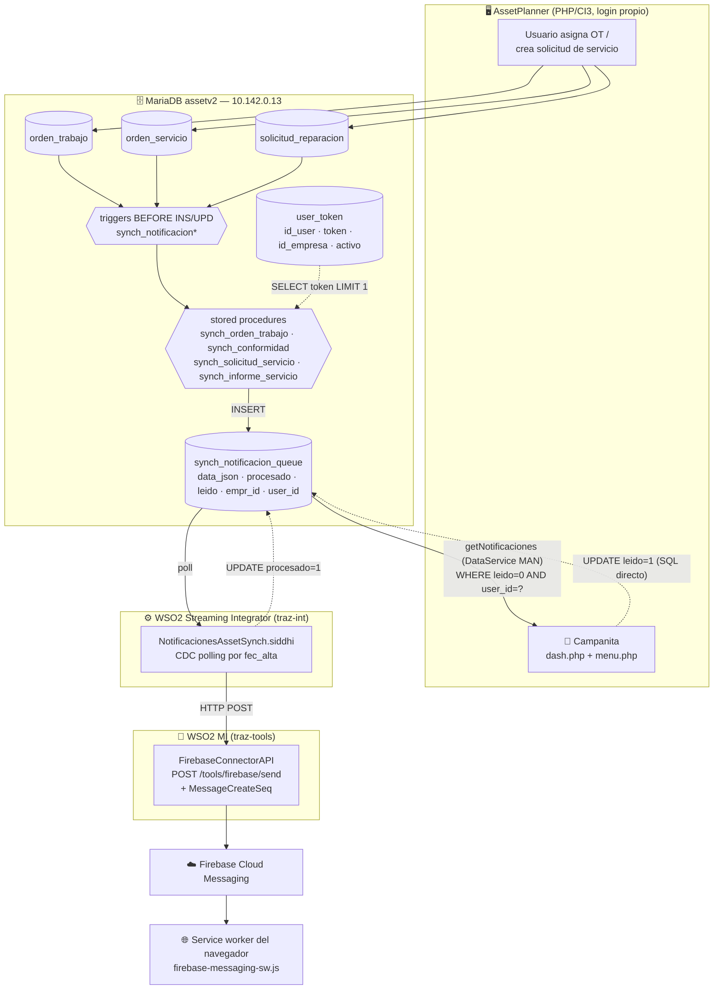
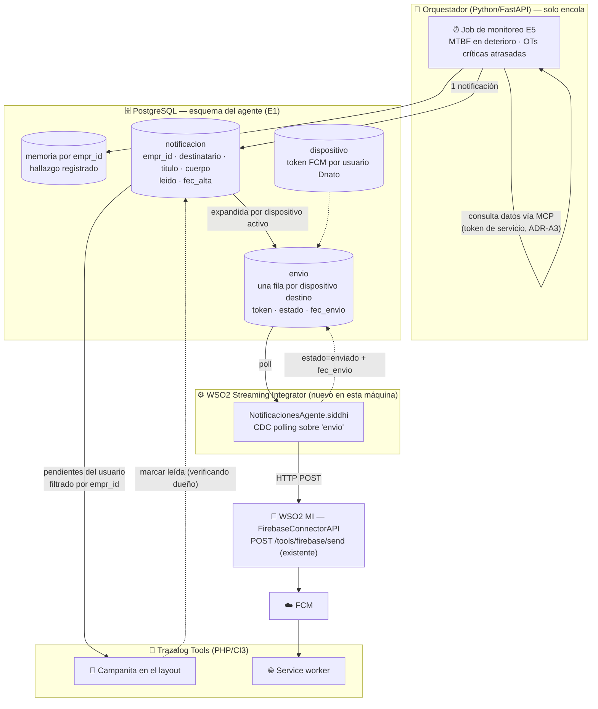

# Análisis del sistema de alertas de AssetPlanner — insumo del Agente Minero (E0)

## Objetivo

Este documento describe **cómo funciona hoy el mecanismo de notificaciones de AssetPlanner** y evalúa qué de eso sirve para que el Agente Minero notifique sus hallazgos proactivos dentro de Trazalog Tools. Está escrito para Rodolfo (PM/arquitecto) como insumo del **gate 1** del plan del Agente (`doc/v3/PROMPT_CC_AGENTE_MINERO.md`, etapa E0): la decisión de qué se reutiliza y qué se construye se toma sobre esta base, **antes** de escribir una línea del puente de alertas.

**Qué NO cubre:** no propone esquema de BD del agente (eso es E1), ni implementa nada. Tampoco cubre el diseño de los monitoreos proactivos en sí (qué se vigila y con qué umbral) — eso es E5 y depende de esta decisión. La arquitectura de referencia del agente está en `doc/v3/AGENTE_MINERO_ARQUITECTURA_TECNICA.md` (ADR-A6 es el que motiva este análisis).

---

## Metadata

| Campo | Valor |
|---|---|
| Etapa | E0 — análisis, sin código |
| Rama | `feature/agente-e0-analisis-alertas` → PR contra `develop-v3.5` |
| ADR que lo motiva | **ADR-A6** — "Notificaciones vía sistema de alertas de Asset Planner extendido a Tools" |
| Fuentes revisadas | `traz-prod-assetplanner` (rama `develop-v3`), `traz-tools` (`develop-v3`), `traz-int` (apps Siddhi), y la **base de desarrollo `assetv2` en `10.142.0.13`** (triggers, stored procedures y datos reales de la cola, consultados por VPN el 2026-09-02) |
| Clase de riesgo | 🟢 (documento, sin efecto en runtime) |
| Estado | **Gate 1 parcialmente resuelto.** El PM decidió la **Opción C** el 2026-09-02 (§6.1). Quedan abiertas 4 definiciones menores y un bloqueo de infraestructura (§8) |

---

## 1. Resumen ejecutivo

Lo primero que hay que decir, porque cambia la conversación: **AssetPlanner no tiene un "sistema de alertas" en el sentido de reglas configurables**. Tiene un **pipeline de notificación push de eventos duros**, cableado a tres tablas por triggers de base de datos. No hay reglas de negocio parametrizables, no hay preferencias por usuario, no hay canal de mail, y no hay concepto de severidad ni de destinatario por rol.

Lo que sí tiene, y **funciona y está probado**, son cuatro piezas reutilizables:

1. Un **modelo de cola** (`synch_notificacion_queue`) simple y correcto en su forma: mensaje serializado en JSON, marca de procesado, marca de leído, dueño (`empr_id` + `user_id`).
2. Un **registro de dispositivos** por usuario (`user_token`).
3. Un **conector Firebase ya construido en el WSO2 MI** (`FirebaseConnectorAPI`, `POST /tools/firebase/send`) que habla FCM con una cuenta de servicio real.
4. Una **campanita in-app** en el frontend PHP (dropdown con contador y marcado de leídas).

El transporte entre la cola y el conector es una app **Siddhi sobre WSO2 Streaming Integrator** que hace polling CDC sobre la tabla. No está corriendo contra la base de desarrollo y sus artefactos versionados muestran inconsistencias de mapeo con el conector (detalle en §5), pero **el PM decidió conservar el SI como pieza estándar de la arquitectura** por la extensibilidad futura del sistema de alarmas — ver §6.1.

**Decisión del PM (2026-09-02): Opción C.** Se replica el patrón completo dentro de Tools —cola propia en PostgreSQL, app Siddhi nueva sobre el Streaming Integrator, y el `FirebaseConnectorAPI` existente— sin tocar `assetv2`. El orquestador solo encola; el transporte es del SI, que se instala como pieza estándar por la extensibilidad futura de las alarmas. Fundamentos, alternativas descartadas y las implicancias técnicas, en §6.

---

## 2. Diagrama del mecanismo actual



### Recorrido en palabras

1. **Disparo.** Un usuario opera en AssetPlanner. Sobre la operación, un **trigger de MariaDB** llama a un **stored procedure**. No hay código PHP ni servicio que decida notificar: la decisión vive en la base.
2. **Armado del mensaje.** El SP busca el token FCM del usuario destinatario (`user_token`, `LIMIT 1`), concatena a mano un JSON con título, cuerpo, ícono y el `registrationToken`, y hace `INSERT` en `synch_notificacion_queue` con `procesado = 0`, `leido = 0`, `empr_id` y `user_id`.
3. **Transporte.** La app Siddhi hace polling CDC sobre la tabla por la columna `fec_alta`, extrae el token del JSON y hace `POST` al MI. Con respuesta 2xx marca `procesado = 1`.
4. **Envío.** El `FirebaseConnectorAPI` del MI parsea los campos del mensaje (`MessageCreateSeq`), inicializa el SDK de Firebase con una cuenta de servicio y llama a `sendMessage` en modo `token`.
5. **Recepción push.** El service worker del navegador (registrado por `assets/props/firebase_config.js`) muestra la notificación del sistema operativo.
6. **Campanita in-app.** En paralelo y de forma **independiente del push**, cada cambio de página de AssetPlanner llama a `Dash/notificaciones`, que vía REST al DataService `MANDataService.getNotificaciones` trae las filas con `leido = 0` del usuario y las pinta en el dropdown. Al abrirlo o clickear, `Dash/marcarNotificacionesLeidas` hace `UPDATE leido = 1` por SQL directo.

### Inventario de los cuatro disparadores existentes

| Trigger (tabla, momento) | Stored procedure | Evento de negocio | Destinatario |
|---|---|---|---|
| `synch_notificacion` (`orden_trabajo`, BEFORE UPDATE) | `synch_orden_trabajo` | OT asignada (`estado = 'AS'`) o informe de servicio rechazado (`estado = 'T'` con justificación) | `id_usuario_a` de la OT |
| `synch_notificacion` (`orden_trabajo`, BEFORE UPDATE) | `synch_conformidad` | OT cerrada (`estado = 'CE'`) | `id_usuario_a` de la OT |
| `synch_notificacion_Sservicio` (`solicitud_reparacion`, BEFORE INSERT) | `synch_solicitud_servicio` | Nueva solicitud de servicio | usuarios de la empresa (resuelto dentro del SP) |
| `synch_notificacion_InformeServicio` / `_update` (`orden_servicio`, BEFORE INSERT/UPDATE) | `synch_informe_servicio` | Informe de servicio cargado o modificado con estado ≠ `CE` | usuarios asociados a la OT |

### Persistencia — estructura real

```sql
-- assetv2.synch_notificacion_queue
queue_id       int(11) PK AUTO_INCREMENT
data_json      mediumtext        -- mensaje FCM completo, incluye el registrationToken
fec_alta       timestamp DEFAULT CURRENT_TIMESTAMP   -- columna de polling del CDC
fec_realizado  timestamp NULL    -- declarada, NUNCA escrita
procesado      int(4)            -- 1 = enviado a FCM
empr_id        int(4)
user_id        int(11)
leido          tinyint(1) DEFAULT 0   -- estado de la campanita in-app
id_orden       int(11) DEFAULT 0      -- anti-duplicado de OT

-- assetv2.user_token
id_user_token  int(11) PK AUTO_INCREMENT
id_user        int(11)      -- FK lógica a sisusers de AssetPlanner (NO a Dnato)
token          varchar(255) -- registration token de FCM
id_empresa     int(11)
activo         tinyint(1)
```

### Estado observado en la base de desarrollo (2026-09-02)

| Métrica | Valor |
|---|---|
| Filas en la cola | 434 |
| Rango de fechas | 2024-03-06 → 2026-04-06 |
| Filas con `procesado = 1` | **0** |
| Filas con `leido = 1` | 261 |

Lectura: **en desarrollo el push nunca se envió**; lo único que funcionó es la campanita in-app, que no depende del Siddhi ni de Firebase. Consistente con que el `.siddhi` de desarrollo apunta a `10.142.0.16/assetv2` y el de producción a `10.142.0.2/asp2tecn` — ninguno a la base de desarrollo actual. **No pude verificar el pipeline de push end-to-end contra producción** (no tengo acceso); todo lo que digo sobre el tramo Siddhi → MI → FCM sale de leer los artefactos, no de verlo correr.

---

## 3. Configuración por usuario: no existe

Vale la pena aislarlo porque es lo que más suele darse por sentado al planificar sobre "el sistema de alertas":

- **No hay tabla de preferencias.** Ningún usuario puede elegir qué eventos recibir, por qué canal, ni con qué frecuencia.
- **No hay canal de mail.** No hay PHPMailer, ni `$this->email`, ni SMTP configurado en AssetPlanner. El único canal externo es web push por FCM.
- **No hay severidad ni categoría.** Todas las notificaciones son iguales; el título es texto libre concatenado en el stored procedure.
- **No hay destinatario por rol ni por grupo.** El modelo es estrictamente 1 notificación → 1 `user_id`.
- **El único "opt-in" real** es que el usuario acepte el permiso de notificaciones del navegador; ahí se registra su token vía `Notificacion/registraToken`. Si nunca lo aceptó, el SP guarda `registrationToken` vacío y la fila igual se inserta (la campanita la muestra, el push no llega).

Para el Agente Minero esto importa mucho: **"alerta proactiva de MTBF en deterioro" no tiene hoy destinatario natural**. El mecanismo actual sabe notificarle al asignado de una OT; no sabe notificarle "al jefe de mantenimiento de la empresa X". Esa es una de las preguntas del gate (§8).

---

## 4. Qué hay hoy en Trazalog Tools

**Nada funcionando.** El detalle, porque es fácil confundirse:

| Elemento en Tools | Estado real |
|---|---|
| Módulo `application/modules/traz-comp-notificaciones` (submódulo git) | **Esqueleto abandonado.** Un controller y un model con código de ejemplo de subida de imágenes (`insert_image`, `fetch_image` sobre `core.tbl_images`) y un `sendPushNotification()` **enteramente comentado**. README vacío. Nada de esto notifica. |
| Constante `NOTI` en `application/config/constants.php` | Declarada, **sin un solo uso** en el código. |
| `MANDataService.getNotificaciones` | **Sí existe y funciona**, en las tres copias del DataService (`_backend/api/dataservice/`, `ToolsAPIProject`, y la copia de asset). Es el que consume la campanita de AssetPlanner. Apunta a `AssetPlannerDataSource`, o sea a `assetv2`. |
| `FirebaseConnectorAPI` | **Vive en `traz-tools/_backend/api/`** — el conector ya es un artefacto de este repo, no de AssetPlanner. Buena noticia para la reutilización. |
| Campanita / UI de notificaciones en Tools | No existe. |
| Tabla de cola en la base de Tools | No existe. |

Conclusión operativa: **el nombre "extender el sistema de alertas de AssetPlanner a Tools" describe un trabajo de construcción, no de configuración.** Lo único ya compartido es el conector Firebase.

---

## 5. Evaluación pieza por pieza: qué se reutiliza y qué hay que adaptar

| Pieza | ¿Reutilizable? | Fundamento |
|---|---|---|
| **Conector Firebase del MI** (`FirebaseConnectorAPI`, `POST /tools/firebase/send`) | ✅ **Tal cual** | Ya está en `traz-tools`, ya habla FCM, ya tiene cuenta de servicio. Es la pieza de mayor valor reutilizable. Requiere rotar la clave (§7). |
| **Modelo de cola** (forma de `synch_notificacion_queue`) | ✅ **El diseño, no la tabla** | La forma es correcta: JSON serializado + `procesado` + `leido` + dueño. Se replica en PostgreSQL con las correcciones de §5.1. |
| **Registro de dispositivos** (`user_token`) | ⚠️ **Adaptar** | El `id_user` apunta a `sisusers` de AssetPlanner, que tiene **login propio, sin Dnato**. Tools identifica al usuario por sesión Dnato (`empr_id`, `usernick`). Hay que registrar tokens contra la identidad de Tools, no reusar la tabla de asset. |
| **Service worker + `firebase_config.js`** | ✅ **Casi tal cual** | Se copia al frontend de Tools apuntando al mismo proyecto Firebase. El `apiKey` y el VAPID key del cliente son públicos por diseño de FCM; no hay problema en portarlos. |
| **Campanita in-app** (dropdown + contador + marcar leídas) | ✅ **El patrón** | El JS de `dash.php` es directamente portable al layout de Tools. Es la parte que además **funciona sin push**, lo que la hace el canal más confiable de los dos. |
| **Disparadores por triggers de BD** | ❌ **No reutilizar** | Los hallazgos del agente los produce el orquestador Python, no un `UPDATE` de tabla. Meter la lógica del agente en triggers sería un retroceso: invisible, no testeable, y atado al esquema congelado de asset. |
| **Transporte Siddhi / Streaming Integrator** | ✅ **El patrón, con app nueva** (decisión del PM, §6.1) | Se conserva como pieza estándar de la arquitectura por la extensibilidad futura del sistema de alarmas. Implica instalar el SI —hoy no está en la máquina de desarrollo ni en la VM de GCP de ADR-011, que corre APIM + MI nativos— y escribir una app nueva contra PostgreSQL, sin heredar los defectos de las existentes (§6.3 y §6.4). |
| **`MANDataService.getNotificaciones`** | ❌ **No reutilizar como está** | Filtra **solo por `user_id`, sin `empr_id`** — incompatible con el patrón de aislamiento de ADR-009 (ver §7, R2). |

### 5.1 Defectos del mecanismo actual que no hay que replicar

Encontrados leyendo los artefactos y la base; los listo porque cada uno es una decisión de diseño a corregir en el puente nuevo:

1. **Un solo dispositivo por usuario.** Los SP hacen `SELECT ut.token ... LIMIT 1`. Si el usuario tiene el navegador de la PC y el del celular registrados, uno de los dos nunca recibe. El puente nuevo debe iterar sobre todos los tokens activos.
2. **El token viaja y se guarda dentro del `data_json`.** El mismo JSON que consume la campanita in-app contiene el `registrationToken` del dispositivo; la cola queda con credenciales de push en claro y el frontend las recibe de vuelta. Separar: mensaje por un lado, destino por otro.
3. **Anti-duplicado frágil.** El SP de OT consulta `WHERE snq.id_orden = p_id_orden` sin filtrar empresa ni estado, y sin `LIMIT`. Una OT reasignada a otra persona nunca vuelve a notificar.
4. **`fec_realizado` declarada y nunca escrita.** No hay trazabilidad de cuándo se envió.
5. **La cola no se purga.** 434 filas desde 2024 sin política de retención. Con el agente generando hallazgos programados, esto crece bastante más rápido.
6. **Marcado de leído sin verificación de dueño.** `Dashs::marcarNotificacionesLeidas($id)` hace `UPDATE ... WHERE queue_id = ?` **sin filtrar por el usuario de la sesión**: cualquier usuario logueado puede marcar como leída la notificación de otro pasando un `queue_id` arbitrario. Impacto acotado (no expone contenido), pero el puente nuevo debe filtrar por dueño.
7. **Inconsistencia aparente entre el Siddhi y el conector.** El `.siddhi` de desarrollo envía `{queue_id, token}` extrayendo `$.token`, pero el JSON de la cola trae el campo como `registrationToken`; el de producción envía `{queue_id, data_json}`; y `MessageCreateSeq` en el MI lee todo desde `$.xformValues.*`. **Los tres formatos no coinciden entre sí.** Puede ser que lo desplegado difiera de lo versionado — pero no pude verificarlo, y es una razón más para no heredar ese tramo.

---

## 6. Propuesta de integración con el orquestador

### 6.1 Las tres opciones evaluadas — y la decisión

**Opción A — Escribir en la cola de AssetPlanner.** El orquestador inserta en `assetv2.synch_notificacion_queue` y deja que el pipeline existente haga el resto.
*A favor:* es lo más literal respecto de ADR-A6 y no construye casi nada.
*En contra:* ata el agente a la base de un producto con **esquema congelado** y clientes en producción; hereda los siete defectos de §5.1; obliga a resolver la identidad de Tools contra `sisusers` de asset; y depende de que el Streaming Integrator lea esa base.

**Opción B — Replicar el patrón en Tools con el orquestador como emisor directo.** Cola propia en PostgreSQL y el orquestador Python haciendo `POST` al conector Firebase del MI, sin Streaming Integrator.
*A favor:* un componente menos que operar, sin polling.
*En contra:* pone al orquestador a hacer de transporte además de razonar, y **descarta el motor de streaming** — que es justamente la pieza que permitiría, más adelante, alarmas definidas por reglas sin escribir código nuevo.

**Opción C — Cola en Tools + app Siddhi nueva sobre el Streaming Integrator. ✅ DECIDIDA (PM, 2026-09-02)**
Cola propia en PostgreSQL (esquema del agente, E1), el orquestador Python solo **encola**, y una app Siddhi nueva sobre el SI hace CDC polling sobre esa tabla y postea al `FirebaseConnectorAPI` del MI, que ya existe.

**Fundamento de la decisión (PM):** mantener el Streaming Integrator como pieza estándar de la arquitectura, por la extensibilidad futura del sistema de alarmas — el día que las alertas necesiten reglas, ventanas temporales o correlación de eventos, el motor ya está y no hay que construirlo. Y no sumar responsabilidades al orquestador: el agente razona y encola; el transporte es del SI.

> **Nota sobre el orquestador:** el servicio Python/FastAPI no es un componente nuevo — está aprobado como el caso de uso de Python en la arquitectura (lógica de IA). Lo que la Opción C evita es que además cumpla el rol de emisor de notificaciones.

### 6.2 Cómo queda la arquitectura del puente



**Dónde corre cada cosa, para que quede explícito:**

| Componente | Dónde vive | Estado |
|---|---|---|
| Job de monitoreo (E5) | Proceso Python del orquestador | A construir |
| Tablas `notificacion` / `envio` / `dispositivo` | PostgreSQL, esquema del agente | A construir en **E1** |
| `NotificacionesAgente.siddhi` | WSO2 Streaming Integrator | A construir; el SI **se instala primero** en la máquina de desarrollo |
| `FirebaseConnectorAPI` | WSO2 MI | **Ya desplegado, no se toca** |
| Campanita y service worker | Frontend PHP de Tools | A construir en **E5**, reusando el patrón de `dash.php` |

**Aislamiento (regla innegociable):** `notificacion` lleva `empr_id`, y la consulta de la campanita filtra **siempre** por el `empr_id` de la sesión más el usuario — nunca solo por `user_id` como hace hoy `getNotificaciones`. El `empr_id` del hallazgo es el que el MCP Gateway ya resolvió del token de servicio (ADR-A3); no es un parámetro que el agente elija.

### 6.3 Decisiones de diseño que corrigen los defectos de §5.1

La Opción C reutiliza el patrón, **no sus errores**. Lo que cambia respecto del mecanismo de AssetPlanner:

1. **Notificación y envío se separan en dos tablas.** Una `notificacion` (lo que el usuario lee en la campanita) y N filas de `envio`, una por dispositivo activo del destinatario. Resuelve el "un solo dispositivo por usuario" del `LIMIT 1`, y deja el Siddhi trivial: lee una fila, postea, marca.
2. **El token FCM nunca entra en el contenido que ve el frontend.** Vive solo en `envio`; la campanita lee `notificacion`, que no lo tiene.
3. **`fec_envio` se escribe de verdad** (el `fec_realizado` de asset está declarado y nunca se usa), y `estado` distingue pendiente / enviado / fallido.
4. **Deduplicación explícita** por (empresa, entidad, tipo de hallazgo, ventana temporal) antes de encolar — es lo que evita que el monitoreo programado se vuelva ruido (R6).
5. **Marcar como leída verifica dueño** (`empr_id` + usuario), no solo el id de la fila.
6. **Política de retención** desde el arranque: la cola de asset lleva 434 filas sin purga desde 2024, y el agente genera bastante más volumen.

### 6.4 Implicancias técnicas de sumar el Streaming Integrator

Cosas a resolver, en orden, que salen de haber elegido C:

| # | Punto | Detalle |
|---|---|---|
| 1 | **Instalación del SI** | Versión actual: **WSO2 Integrator: SI 4.4.0** (mayo 2026), 110 MB comprimido. Se instala primero en la máquina de desarrollo; para demo y producción se documenta el despliegue y se arma el flujo allí. **Bloqueado por espacio en disco** — ver §8. |
| 2 | **JDK** | El SI 4.3.0 estaba probado con JDK 11 y 17. La máquina tiene JDK 17 como default de `sdkman` y Temurin 21 instalado (que es el que pide APIM 4.6.0). Se levanta el SI con `JAVA_HOME` propio apuntando a 17, sin tocar el del APIM. **A confirmar contra la doc de 4.4.0 al instalar.** |
| 3 | **Driver JDBC de PostgreSQL** | Las apps Siddhi existentes usan `com.mysql.jdbc.Driver` contra MariaDB. La cola del agente vive en PostgreSQL: hay que dejar el driver de Postgres en `lib/` del SI y usar `org.postgresql.Driver`. |
| 4 | **Columna de polling** | El `cdc` source en modo `polling` necesita una columna monótona. La tabla `envio` la lleva desde el diseño (`fec_alta` o un `id` serial), definida en E1. |
| 5 | **Credenciales fuera del `.siddhi`** | Los tres `.siddhi` de `traz-int` tienen usuario y contraseña de base **en claro**. La app nueva usa referencias del `deployment.yaml` del SI / secure vault. No repetir el patrón. |
| 6 | **Formato del mensaje — ✅ RESUELTO 2026-09-02** | **El formato correcto es `{"xformValues": {...}}`**, confirmado con un `POST` real contra el MI local: `MessageCreateSeq` parseó los campos y logueó `notificationTitle` correctamente. Ninguna de las tres apps Siddhi existentes emite ese formato — de ahí la inconsistencia de §5.1 punto 7. La app del agente debe emitir el JSON envuelto en `xformValues`, con al menos `registrationToken`, `notificationTitle`, `webPushNotificationBody`, `webPushNotificationIcon` y `webPushNotificationDirection`. |
| 7 | **Dónde versionar la app Siddhi** | Las existentes viven en `traz-int/siddhi/notificaciones/`. La del agente es del frente v3.5: propongo `_backend/siddhi/` en **este** repo (que ya tiene la carpeta declarada en la estructura del CLAUDE.md), para que el frente quede completo en un solo lugar. **A confirmar.** |

### 6.5 Qué implica esto para ADR-A6

ADR-A6 dice **"notificaciones vía sistema de alertas de Asset Planner extendido a Tools"**. La Opción C lo respeta **en su letra**: se conserva el mecanismo completo —cola → Streaming Integrator → conector Firebase → FCM → campanita—, se reutiliza el conector tal cual, y lo que se agrega es una instancia del patrón para el agente en la base de Tools, sin tocar `assetv2`.

No hace falta ADR nuevo ni modificar A6. Sí corresponde dejar asentado en el ADR del agente que el SI pasa a ser **pieza estándar de la arquitectura**, por la extensibilidad futura del sistema de alarmas — eso es información nueva respecto de lo que A6 decía.

### 6.6 Resultado de la prueba real contra el conector (2026-09-02)

Se desplegó `FirebaseConnectorAPI` en el **MI local de desarrollo** (antes solo tenía `ToolsAPIProject`) y se hizo un `POST` contra `http://localhost:8290/tools/firebase/send`. Tres resultados:

**1. ✅ El formato de mensaje quedó determinado.** El cuerpo tiene que ir envuelto en `xformValues`:

```json
{
  "xformValues": {
    "registrationToken": "<token FCM del dispositivo>",
    "notificationTitle": "Nueva Orden de Trabajo asignada",
    "webPushNotificationBody": "Por favor revise su bandeja.",
    "webPushNotificationIcon": "https://...",
    "webPushNotificationDirection": "AUTO"
  }
}
```

`MessageCreateSeq` lo parseó bien y logueó los campos. **Ninguna de las tres apps Siddhi existentes emite este formato** — la de desarrollo manda `{queue_id, token}` y la de producción `{queue_id, data_json}`. Eso confirma la inconsistencia de §5.1 punto 7 y da la especificación exacta que debe cumplir la app del agente.

**2. 🔴 El conector devuelve 202 aunque falle.** Ver R4. Es el hallazgo más importante de la prueba: invalida la premisa de que "2xx = enviado" sobre la que está construido el `post-grabacion` de las apps Siddhi actuales.

**3. ✅ El conector quedó operativo, y hubo que resolver dos cosas para lograrlo.** El hot deploy del CAR no registra el connector: hace falta **reiniciar el MI**. Y una vez registrado, fallaba al instanciar con `NoClassDefFoundError: com/google/firebase/messaging/FirebaseMessagingException`, porque **el `googlefirebase-connector-1.0.2.zip` trae solo las clases del conector, sin el SDK de Firebase**. Se resolvió resolviendo el árbol de `com.google.firebase:firebase-admin:6.12.2` con Maven (67 jars) y copiando a `<MI_HOME>/lib` los **60 que el MI no tenía** — los 7 solapados (`guava`, `gson`, `jackson-core`, `commons-codec`, `commons-lang3`, `commons-logging`, `slf4j-api`) se omitieron a propósito para no pisar las versiones del runtime. Detalle en `doc/agente/instalacion.md`.

**Con eso el circuito quedó verificado hasta Google:** el conector se autentica con la cuenta de servicio, llega a `https://fcm.googleapis.com/v1/projects/traz-prod-assetplanner/messages:send`, y FCM responde. Con un token inválido responde el rechazo esperado — que es exactamente la prueba que expuso R4.

**Lo único que falta** para cerrar el push de punta a punta es un token FCM real: abrir AssetPlanner en el navegador, aceptar el permiso de notificaciones, y usar el token que quede registrado. Todo lo que define el diseño del `.siddhi` —el formato del mensaje y cómo detectar un fallo— ya está resuelto.

## 7. Riesgos

| # | Riesgo | Sev. | Detalle y mitigación propuesta |
|---|---|---|---|
| **R1** | **Clave privada de cuenta de servicio de Firebase commiteada en el repo** | 🔴 Alta | `_backend/api/FirebaseConnectorAPI/.../FirebaseConnectorAPI.xml` tiene la `privateKey` completa del service account `firebase-adminsdk-3ag87@traz-prod-assetplanner.iam.gserviceaccount.com`, en claro, en `traz-tools` y en sus copias `.backup`/`tmp`. Con ella se puede enviar push a cualquier dispositivo del proyecto. **Mitigación:** rotar la clave en la consola de Firebase y moverla a la configuración del MI (no al artefacto versionado). Es trabajo aparte de esta etapa; lo señalo para que decidas cuándo. |
| **R2** | **`getNotificaciones` sin filtro de `empr_id`** | 🟠 Media | El DataService filtra solo por `user_id` recibido por path. Hoy lo llama el PHP con el id de sesión, pero el endpoint no valida nada por sí mismo. Contradice ADR-009. **Mitigación:** no reutilizarlo en el puente del agente; si además se decide corregirlo para AssetPlanner, es tarea del otro repo. |
| **R3** | **Marcar como leída sin verificar dueño** | 🟡 Baja | §5.1 punto 6. No expone contenido, pero permite ocultarle notificaciones a otro usuario. **Mitigación:** en el puente nuevo, filtrar por dueño; en asset, reportarlo como hallazgo. |
| **R4** | **El conector responde 2xx aunque FCM rechace el envío** | 🔴 **Alta — confirmado con evidencia directa 2026-09-02** | Con el conector ya operativo, un `POST` con un token inválido devolvió **`HTTP 200`** y el error de FCM escondido en el cuerpo: `{"Result":{"Error":"400 Bad Request ... The registration token is not a valid FCM registration token"}}`. No es solo que el `faultSequence` esté vacío —que lo está—: es que **un rechazo explícito de Google sale como 200 OK**. Para la Opción C es determinante, porque el `post-grabacion` de las apps Siddhi marca `procesado = 1` mirando únicamente el status code. Resultado: **la notificación se pierde en silencio y queda registrada como enviada**. Es la explicación más probable de las 434 filas encoladas desde 2024 que nadie miró. **Dos mitigaciones, ambas obligatorias antes de conectar el agente:** (1) completar el `faultSequence` para que un fallo salga como 5xx; (2) que la app Siddhi **parsee el cuerpo** y solo marque `enviado` si no viene `Result.Error` — el status code no alcanza. |
| **R5** | **Dependencia de un servicio externo (FCM) para el canal proactivo** | 🟡 Baja | FCM es gratuito y cumple ADR-005 (costo $0), pero el proyecto Firebase se llama `traz-prod-assetplanner` y está atado a esa app. **Mitigación:** la campanita in-app funciona sin FCM y cubre el caso base; el push es el extra. Diseñar el puente para que la falla de FCM no pierda el hallazgo (la cola queda, la campanita lo muestra). |
| **R6** | **Fatiga de alertas** | 🟠 Media | El mecanismo actual notifica eventos que el usuario provocó. Los hallazgos del agente son distintos: se generan solos, en lote, y pueden repetirse en cada corrida del job. Sin deduplicación ni umbral, el agente se vuelve ruido en dos semanas. **Mitigación:** deduplicación por (empresa, equipo, tipo de hallazgo, ventana temporal) desde el día uno, y umbrales configurables — a definir con vos en E5. |
| **R7** | **Dos colas conviviendo** | 🟡 Baja | Consecuencia aceptada de la Opción B. **Mitigación:** documentarlo, y unificar cuando AssetPlanner migre a `traz-tools-man`. |
| **R8** | **Destinatario indefinido para alertas de empresa** | 🟠 Media | §3: no existe hoy noción de rol destinatario. Es una decisión funcional, no técnica → pregunta del gate. |

---

## 8. Estado del gate 1 y qué falta definir

### ✅ Resuelto — Opción C (PM, 2026-09-02)

El puente se construye conservando el Streaming Integrator: orquestador → cola en PostgreSQL → app Siddhi nueva → `FirebaseConnectorAPI` del MI → FCM, más la campanita en Tools. Fundamento: mantener el SI como pieza estándar por la extensibilidad futura del sistema de alarmas, y no cargar al orquestador con el transporte. ADR-A6 queda respetado en su letra (§6.5).

Se instala el SI primero en la máquina de desarrollo; para demo y producción se documenta el despliegue y se arma el flujo allí, donde ya va a estar instalado.

### 🚧 Bloqueo de infraestructura — espacio en disco

La partición raíz de la máquina de desarrollo (Ubuntu 24.04, `/dev/nvme0n1p5`) está al **99%: 1,5 GB libres sobre 117 GB**. El instalable de SI 4.4.0 son 110 MB comprimidos y varias veces eso descomprimido, más los logs y el estado de runtime. **No hay margen para instalarlo en `/` sin liberar espacio antes.** `/mnt/win` (NTFS) tiene 9,3 GB libres, pero no es buen lugar para un runtime Java por el manejo de locks y permisos.

Opciones, para que elijas: liberar espacio en `/` (con ~3-4 GB alcanza cómodo), instalarlo igual en `/mnt/win` asumiendo el riesgo, o dejar el SI para la VM de demo y desarrollar contra ella. **No avanzo con la instalación hasta que definas.**

### ❓ Definiciones abiertas (ninguna bloquea E1)

1. **¿Quién recibe una alerta proactiva del agente?** El mecanismo actual solo sabe notificar a un usuario concreto (el asignado de una OT). Para "el equipo X viene fallando más de lo normal" hace falta destinatario: ¿un rol de Tools (jefe de mantenimiento)? ¿todos los usuarios de la empresa con cierto permiso? ¿un usuario configurado por empresa? Es funcional/de negocio. **Bloquea E5, no E1** — la tabla se modela con destinatario genérico y la resolución se define después.
2. **¿Push + campanita, o campanita sola en esta versión?** La campanita cubre el caso de uso y no depende de FCM ni de la rotación de la clave. El push suma alcance pero arrastra R1 y R4.
3. **¿Rotamos la clave privada de Firebase (R1) ahora o queda como tarea aparte?** Si el puente va a usar el conector, en algún momento hay que hacerlo.
4. ✅ **Prueba del conector: hecha** (§6.6). El formato quedó determinado (`xformValues`) y apareció un riesgo nuevo de severidad alta: **el conector responde 202 aunque el envío falle**, lo que hace que el patrón "2xx = enviado" de las apps Siddhi actuales pierda notificaciones en silencio. **Falta tu decisión sobre dos cosas:** reiniciar el MI local para que registre el connector `googlefirebase` (no lo hice, lleva días corriendo), y si el `faultSequence` vacío del conector se corrige ahora — es requisito para que el agente pueda confiar en el envío.
5. **¿Dónde se versiona la app Siddhi del agente?** Las de AssetPlanner viven en `traz-int/siddhi/notificaciones/`. Propongo `_backend/siddhi/` en **este** repo —la carpeta ya está declarada en la estructura del `CLAUDE.md`— para que el frente v3.5 quede completo en un solo lugar.

**E1 (base de datos) puede arrancar ya**, sin depender de ninguna de estas. Las tablas `notificacion`, `envio` y `dispositivo` quedan definidas según §6.2 y §6.3, con la columna de polling que el CDC del SI necesita.

---

## Anexo — Archivos de referencia

| Qué | Dónde |
|---|---|
| Triggers y stored procedures | Base `assetv2` (no versionados en ningún repo) — `information_schema.TRIGGERS`, `SHOW CREATE PROCEDURE synch_orden_trabajo` |
| App Siddhi | `traz-int/siddhi/notificaciones/{,demo/,produccion/}NotificacionesAssetSynch.siddhi` |
| Conector Firebase | `traz-tools/_backend/api/FirebaseConnectorAPI/FirebaseConnectorAPICompositeExporter/src/main/wso2mi/artifacts/apis/FirebaseConnectorAPI.xml` y `.../sequences/MessageCreateSeq.xml` |
| DataService de lectura | `traz-tools/_backend/api/ToolsAPIProject/ToolsAPIProject/src/main/wso2mi/artifacts/data-services/MANDataService.dbs` (query `getNotificaciones`, línea 145) |
| Registro de token (cliente) | `traz-prod-assetplanner/application/controllers/Notificacion.php`, `application/models/Notificaciones.php`, `assets/props/firebase_config.js` |
| Campanita | `traz-prod-assetplanner/application/views/dash.php` (JS), `application/views/menu.php`, `application/controllers/Dash.php`, `application/models/Dashs.php` |
| Esqueleto sin uso en Tools | `traz-tools/application/modules/traz-comp-notificaciones/` (submódulo) |
