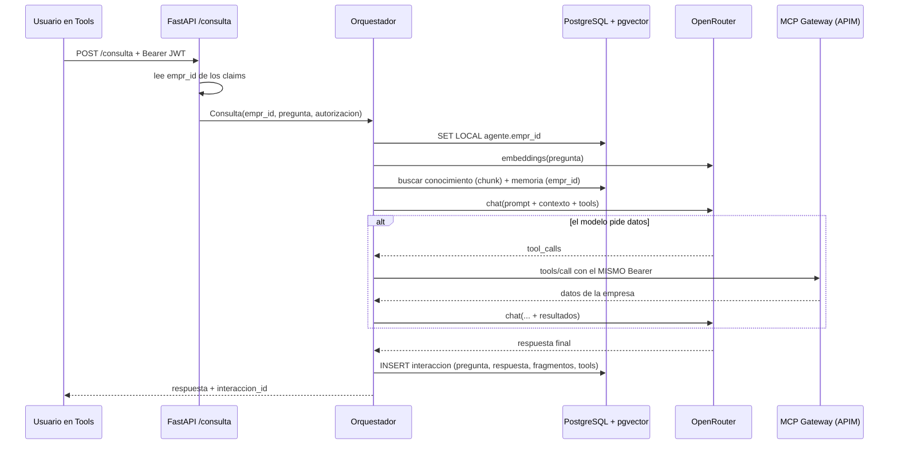

# Agente Minero — cómo quedó implementado

## Objetivo

Este documento describe **cómo está construido el Agente Minero en el código**, pieza por pieza: qué hace cada módulo, cómo se conectan y por qué se resolvió así. Es para quien va a tocar el código o necesita entender qué pasa cuando alguien hace una pregunta.

**Qué NO cubre:** no es el diseño conceptual —eso está en `doc/v3/AGENTE_MINERO_ARQUITECTURA_TECNICA.md` con los ADR-A1 a A6—, ni cómo instalarlo (`doc/agente/instalacion.md`), ni cómo operarlo día a día (`doc/agente/operacion.md`).

---

## El recorrido de una consulta



El `interaccion_id` que vuelve es el que después usa el control de feedback: sin él, un pulgar abajo no se puede asociar a nada.

---

## Módulos

| Archivo | Qué hace |
|---|---|
| `agente/config.py` | Toda la configuración, por variables de entorno. Ningún modelo ni URL hardcodeado. `validar()` devuelve la lista de problemas, que `/salud` expone |
| `agente/prompt.py` | Carga `prompts/agente-minero.md`, saca los comentarios HTML y detecta los bloques que el PM todavía no definió. Relee si el archivo cambió: se puede ajustar el prompt sin reiniciar |
| `agente/llm.py` | Cliente de OpenRouter (ADR-A1). Chat con tool-calling y embeddings. Valida que la dimensión del embedding coincida con la del esquema |
| `agente/rag.py` | Acceso a pgvector: conocimiento compartido, memoria por empresa, y el armado del bloque de contexto que ve el modelo |
| `agente/mcp_client.py` | Cliente MCP (ADR-A3). Passthrough del Bearer, dos modos (`apim` / `mi`), y traza de cada llamada |
| `agente/orquestador.py` | El loop: recupera, conversa, ejecuta tools, registra |
| `agente/api.py` | FastAPI: `/salud`, `/consulta`, `/feedback`, `/admin/feedback` |
| `agente/ingesta.py` | CLI de ingesta documental: PDF/MD/TXT → chunks → embeddings → `agente.chunk` |

---

## Decisiones que vale la pena conocer

### Quién decide si usar RAG, MCP o ambos: el modelo

No hay una heurística nuestra que clasifique la pregunta. El modelo recibe el contexto ya recuperado **y** las tools declaradas, y elige. El prompt de sistema le explica cuándo corresponde cada fuente: conocimiento para el "cómo debería ser", datos para el "cómo está", memoria para el "qué venía pasando".

Se hizo así porque cualquier clasificador que escribiéramos sería peor que el modelo y habría que mantenerlo. El costo es una llamada extra cuando el modelo decide pedir datos.

### El `empr_id` no viaja nunca como parámetro

Sale del JWT, y el JWT lo valida el gateway. Tres barreras, en tres capas distintas:

1. `api.py` lo lee de los claims. **No lo acepta por body**: si lo aceptara, cualquiera podría pedir los datos de cualquier empresa.
2. `rag.py` hace `SET LOCAL agente.empr_id` antes de tocar nada, y las policies de RLS filtran. Sin contexto seteado no se ve nada — falla cerrado.
3. `mcp_client.py` **descarta un `empr_id`** si el modelo lo alucina en los argumentos de una tool, antes de que salga.

`tests/test_aislamiento.py` verifica las tres.

### `SET LOCAL`, no `SET`

El contexto de empresa muere con la transacción. Es lo que evita la fuga más difícil de encontrar el día que haya un pool: si el contexto sobreviviera al commit, la siguiente consulta que tomara esa conexión heredaría la empresa de la anterior. Hay un test dedicado a eso.

### El JWT se lee sin validar la firma, y está bien

`api.py` decodifica los claims sin verificar la firma. No es un descuido: la validación la hace el APIM antes de que el request llegue (ADR-008/ADR-009), y el acceso a los datos del cliente vuelve a pasar por el gateway con el mismo token. El orquestador solo necesita saber de qué empresa es la consulta para elegir la partición de memoria.

**La consecuencia operativa es que este servicio no puede quedar expuesto sin el gateway adelante.** Está anotado en el código y en `operacion.md`.

### Un fallo de tool no corta la conversación

Cuando una tool MCP falla, el error vuelve al modelo **como contenido del mensaje**, no como excepción. Así el agente puede decir "no pude consultar tus equipos en este momento" en lugar de que el usuario reciba un error técnico. Queda registrado en `tools_llamadas` con `status: "error"`.

### Todo queda registrado, incluidos los errores

Cada consulta escribe una fila en `agente.interaccion` con la pregunta, la respuesta, **qué fragmentos se recuperaron y qué tools se llamaron**. Eso es lo que hace accionable un pulgar abajo: sin esa traza, un "no me sirvió" no dice si el problema fue el conocimiento, los datos o el modelo.

Las interacciones con error también se guardan. Son las más informativas.

Si el registro falla, la respuesta igual se entrega: se pierde la traza, no la respuesta.

### El orquestador no puede borrar interacciones

`agente_app` tiene `SELECT`/`INSERT`/`UPDATE` sobre `interaccion`, pero no `DELETE`. El historial es la evidencia de qué dijo el agente y el insumo del ciclo de mejora; un bug del runtime no tiene que poder borrarlo. Hay un test que lo verifica.

---

## Los dos modos de MCP

| Modo | Cómo habla | Auth | Dónde se usa |
|---|---|---|---|
| `apim` | JSON-RPC MCP contra el Virtual MCP Server | `Authorization: Bearer` del usuario, tal cual | Demo y producción |
| `mi` | REST directo al MI | `X-JWT-Assertion` | **Solo desarrollo** |

El modo `mi` existe para poder trabajar sin un APIM levantado, reusando el patrón de `scripts/dev/mcp_tools_client.py`. **No se usa fuera de desarrollo**: el MI decodifica la assertion sin validar la firma, porque en el flujo real eso lo hace el gateway. Además solo expone tools de lectura, para no crear OTs sin querer mientras se prueba.

---

## Tests

```
./agente/dev.sh test
```

| Archivo | Qué cubre |
|---|---|
| `tests/test_prompt.py` | Que los comentarios no le lleguen al modelo, que el contenido sobreviva, y que los bloques sin definir se detecten |
| `tests/test_mcp_client.py` | Passthrough del token, que el `empr_id` no viaje, trazabilidad, y el parseo de SSE |
| `tests/test_orquestador.py` | El loop completo con OpenRouter mockeado: sin tools, con tools, tool que falla, LLM que falla, tope de iteraciones, registro |
| `tests/test_aislamiento.py` | **El que no puede fallar nunca.** Que una empresa no vea ni escriba la memoria de otra, que sin contexto no se vea nada, que el conocimiento compartido sea de solo lectura, y que el contexto no quede pegado entre transacciones |
| `tests/test_smoke_real.py` | Apagado por defecto. Con `AGENTE_SMOKE_REAL=1` verifica contra OpenRouter real que la key anda, que el modelo hace tool-calling y que los embeddings tienen la dimensión del esquema |

**Ningún test gasta tokens** salvo el smoke, que hay que pedir explícitamente.
