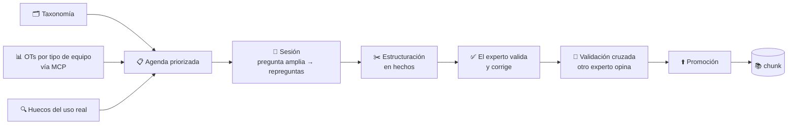

# Agente entrevistador — captura de conocimiento experto

## Objetivo

Explica **cómo el agente le saca conocimiento a un experto humano y lo convierte en conocimiento del sistema**: cómo se decide qué preguntar, cómo es la sesión, quién valida y cuándo eso llega a la base de conocimiento. Es para quien va a conducir las entrevistas y para quien tenga que tocar el código.

**Qué NO cubre:** la ingesta de documentos (`doc/agente/operacion.md`), el chat de consulta (`doc/agente/arquitectura.md`) ni el esquema (`db/agente/README.md`).

---

## Por qué existe

De las tres vías por las que entra conocimiento, esta es **la más cara y la que más vale**:

| Vía | Esfuerzo humano | Qué aporta |
|---|---|---|
| 📄 Documental | Bajo — subir y etiquetar | Lo que ya está escrito: manuales, normas |
| 🎙️ **Experto** | **Alto — hora de una persona con oficio** | **Lo que no está escrito en ningún lado** |
| ⚙️ Operativo | Automático + curaduría | Patrones que se repiten entre clientes |

El conocimiento que diferencia al producto —qué mira un mecánico con veinte años antes de decidir, qué se equivoca siempre la gente nueva— **no está en ningún manual**. Está en la cabeza de alguien, y esa persona no lo va a escribir: un formulario en blanco intimida y da resultados pobres.

Por eso el agente **entrevista** en vez de pedir que llenen algo. Hablar es fácil; escribir estructurado, no.

---

## El circuito



**Nada llega a `agente.chunk` sin que una persona lo apruebe** (ADR-A4). El agente propone redacciones; el experto decide.

---

## 1. La agenda: qué preguntar primero

Una hora de experto rinde muy distinto según qué se pregunte. La agenda ordena los temas por prioridad, y esa prioridad **se calcula, no se estima**:

| Fuente | Cuánto pesa | De dónde sale |
|---|---|---|
| **Peso base** (taxonomía) | Hasta 95 | `db/agente/010-seed-taxonomia.sql` |
| **OTs por familia de equipo** | Hasta 50 | Las tools MCP. **Es la más potente**: si las chancadoras generan el 40% de las OTs, ese conocimiento va primero |
| **Huecos del uso real** | Hasta 30 | Consultas que el agente no pudo responder |

Cada aporte queda registrado en `tema.origen_prioridad`, así que **la agenda es auditable**: se puede saber por qué un tema está donde está.

```
SELECT nombre, prioridad, origen_prioridad
FROM agente.tema WHERE estado = 'pendiente' ORDER BY prioridad DESC LIMIT 10;
```

La taxonomía inicial cubre las dos áreas del agente —18 temas entre mantenimiento, almacenes y transversales— y **está escrita para que la corrijas**: es una propuesta, no un dogma. Editar `010-seed-taxonomia.sql` y volver a aplicarlo actualiza los temas por nombre, sin duplicar ni perder lo ya capturado.

---

## 2. La sesión

Arranca amplia y se va cerrando. El prompt del entrevistador (`prompts/entrevistador.md`) le da tres repreguntas que son las que más rinden:

1. **Números** — *"¿cuánto es 'alta' en ese caso?"*. Un procedimiento sin números no se puede seguir.
2. **Un caso concreto** — la gente recuerda casos mucho mejor de lo que enuncia reglas.
3. **El error típico** — *"¿qué es lo que más se equivoca la gente con esto?"*. Casi siempre trae lo mejor de la entrevista.

Y tres prohibiciones que importan más que las preguntas:

- **No poner palabras en su boca.** Si le sugerís la respuesta, te la confirma y no sabés si es lo que hace de verdad.
- **No opinar ni corregir.** Puede que sepa algo que vos no.
- **No completar lo que no dijo.**

El agente **cierra solo** cuando ya tiene procedimiento, números y un caso, o cuando las últimas respuestas no agregan nada. No estira para llenar un cupo: tres hechos sólidos valen más que diez vagos.

**La transcripción se guarda completa**, no solo los hechos. La estructuración pierde matices, y a veces esos matices son lo que hace falta después.

---

## 3. Los hechos

La conversación se convierte en **afirmaciones sueltas que se entienden solas**:

> *"En chancadoras cónicas, las muelas se cambian cada 500 horas de operación o cuando el desgaste supera los 15 mm, lo que ocurra primero."*

Cada hecho lleva `tipo_equipo`, `situacion`, `modulo` y una **confianza**:

| Confianza | Cuándo |
|---|---|
| 0.9 | Lo dijo con números concretos y un caso que lo respalda |
| 0.7 | Con claridad, pero sin números o sin ejemplo |
| 0.5 | Con dudas, "en general", o hubo que interpretar |
| < 0.5 | **No se registra.** El código lo descarta, no solo el prompt |

Dos filtros más, en `_parsear_hechos()`: se descartan los hechos de menos de 20 caracteres —una línea suelta no se sostiene fuera de contexto— y se tolera que el modelo envuelva el JSON en ``` aunque se le pida que no.

**El experto revisa y corrige** antes de que nada se apruebe. Si edita el texto, **se guarda el suyo**: es su conocimiento, no la redacción del modelo.

---

## 4. Validación cruzada

Con más de un experto, cada hecho se contrasta. `agente.validacion_cruzada` guarda el veredicto: `coincide`, `discrepa`, `matiza` o `no_opina`.

**Un experto nunca ve sus propios hechos para validar** — hay un filtro en la consulta y un trigger en la base. Si alguien validara lo suyo, la validación cruzada no significaría nada.

Y si **discrepan, el hecho no se descarta**: queda como `zona_gris`. Un desacuerdo entre dos personas con oficio es información, y tirarla sería perder justo lo que más conviene revisar. Cuando se promueve, va con la confianza bajada a 0.5 como máximo, para que el agente pueda decir que es terreno discutido.

---

## 5. La promoción

Es el **único punto** por el que una entrevista llega al conocimiento compartido, y es explícito: nada se promueve solo.

Requiere el rol **`agente_curador`**. Con las credenciales del orquestador falla con `permission denied for table chunk`, y está bien: por ADR-A4 el runtime no escribe conocimiento compartido.

Al promover, el chunk queda con `metadata` que apunta al `hecho_id`, al curador y al estado de validación — así cada afirmación del agente se puede rastrear hasta la sesión y la persona que la dijo.

---

## Cómo se usa

**Menú → Agente Minero → Capturar conocimiento.**

1. Elegís quién responde (los expertos se dan de alta en `POST /entrevista/expertos`).
2. Elegís un tema de la agenda, que viene ordenada.
3. Conversás. El agente repregunta hasta que considera cubierto el tema, o cortás vos con "Terminar y ordenar lo que conté".
4. Revisás los hechos, corregís el texto donde haga falta, aprobás o descartás.
5. Cerrás. Si quedó algo aprobado, el tema pasa a `cubierto`; si no, sigue pendiente para volver.

> Necesita una `OPENROUTER_API_KEY` válida: sin ella el agente no puede formular preguntas.

---

## Lo que quedó fuera de esta versión

- **Entrada por voz.** Es la mejora más importante pendiente: un experto de terreno habla mucho mejor de lo que tipea, y la entrevista por voz cambiaría la calidad de lo capturado. Requiere transcripción (Whisper vía OpenRouter o local).
- **La UI de validación cruzada.** Los endpoints (`/entrevista/para-validar`, `/entrevista/opinar`) y el modelo están completos y probados; falta la pantalla. Se decidió así en el alcance de E4.
- **El recálculo automático de la agenda.** `recalcular_prioridades()` está implementado y probado, pero todavía no hay un job que lo corra con datos MCP reales — eso entra con el scheduler de E5.
