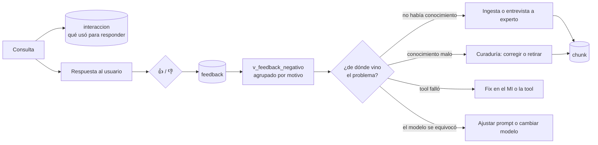

# Agente Minero — el ciclo de mejora

## Objetivo

Explica **cómo el agente mejora con el uso**: qué se registra de cada consulta, cómo el usuario califica una respuesta, y qué se hace después con eso. Es para quien va a revisar el feedback y decidir qué corregir.

**Qué NO cubre:** no explica el código (`doc/agente/arquitectura.md`) ni el esquema de base (`db/agente/README.md`).

---

## Por qué un pulgar abajo, solo, no sirve

Si lo único que guardáramos fuera "esta respuesta no sirvió", tendríamos una estadística y ninguna acción posible. La misma respuesta mala puede venir de cuatro lugares distintos:

1. **No había conocimiento** que respondiera la pregunta.
2. **Había conocimiento pero era malo** — desactualizado, mal capturado, contradictorio.
3. **La tool MCP falló** o devolvió datos que el agente interpretó mal.
4. **El modelo se equivocó** teniendo todo lo necesario a mano.

Cada una se arregla de una forma completamente distinta: la primera con ingesta o una entrevista a un experto, la segunda con curaduría, la tercera con un fix en el MI, la cuarta con el prompt o con otro modelo.

Por eso cada consulta guarda **qué usó para responder**, no solo qué respondió.

---

## Qué se registra

`agente.interaccion`, una fila por consulta:

| Campo | Para qué sirve al revisar |
|---|---|
| `pregunta` / `respuesta` | El caso concreto |
| `fragmentos_rag` | Qué fragmentos de conocimiento y memoria recuperó, con su distancia. **Vacío = no había nada que responder** → caso 1 |
| `tools_llamadas` | Qué tools llamó, con status y latencia. Un `status: "error"` → caso 3 |
| `modelo` | Cuál respondió. Necesario porque es configurable |
| `tokens_*`, `latencia_ms` | Costo y performance por consulta |
| `error` | Si falló, qué pasó. **Las interacciones con error también se guardan**: son las más informativas |

`agente.feedback`, la calificación:

| Campo | Notas |
|---|---|
| `util` | `true` = pulgar arriba, `false` = abajo |
| `comentario` | Texto libre del usuario |
| `motivo` | Categoría opcional: `respuesta_incorrecta`, `incompleta`, `no_entendio`, `datos_desactualizados`, `lenta`, `otro`. Es lo que hace agrupable el feedback negativo |
| `triaje` | `pendiente` → `revisado` → `accionado` \| `descartado`. Para no revisar dos veces lo mismo |

Una persona califica una interacción **una sola vez**; puede cambiar de opinión, pero no acumular pulgares.

---

## El circuito



---

## Cómo se revisa

El endpoint de administración devuelve el feedback negativo sin triar, agrupado por motivo y con el detalle:

```
curl -s -H "Authorization: Bearer <token>" http://127.0.0.1:8099/admin/feedback | python3 -m json.tool
```

O directo contra la base, que da más libertad para investigar:

```
psql -h 127.0.0.1 -U postgres -d agente_minero -c "SELECT motivo, count(*) FROM agente.v_feedback_negativo GROUP BY 1 ORDER BY 2 DESC;"
```

La vista `agente.v_feedback_negativo` ya trae la pregunta, la respuesta, cuántos fragmentos se usaron y cuántas tools se llamaron. **Una fila con `cant_fragmentos = 0` es un hueco de conocimiento**: el agente no tenía nada que decir. Esos son los casos que alimentan la agenda del entrevistador (E4).

Al resolver un caso, marcarlo:

```
psql -h 127.0.0.1 -U postgres -d agente_minero -c "UPDATE agente.feedback SET triaje = 'accionado' WHERE feedback_id = <id>;"
```

---

## Qué NO hace el ciclo automáticamente

**Nada llega al conocimiento compartido sin revisión humana** (ADR-A4). El feedback no reentrena nada ni corrige fragmentos solo. Lo que puede pasar automáticamente es que un patrón se proponga en `agente.candidato`, y ahí espera a un curador.

Es a propósito: el conocimiento curado es el activo del producto. Dejar que se corrija solo con señales de uso es la forma más rápida de degradarlo.

---

## Lo que todavía no está

- **La UI del control de feedback** (👍/👎 + comentario en cada respuesta) es parte de **E3**, la vista de chat en Tools. La API ya está: `POST /feedback` con el `interaccion_id` que devuelve `/consulta`.
- **La promoción automática de patrones a `agente.candidato`** es parte del circuito de curaduría, todavía no implementada. La tabla y sus reglas ya existen.
- **Retención**: las interacciones se acumulan sin purga. Con volumen real hay que definir cuánto se guarda; el registro es evidencia de qué dijo el agente, así que la decisión no es solo técnica.
