# Flujo de datos de ALM

## Objetivo

Qué produce cada caso de uso y qué necesita para poder ejecutarse. Sirve para dos cosas: escribir pruebas que **generen sus propios datos** en vez de asumir que ya están, y entender en qué orden se usa el módulo cuando la empresa es nueva y todo está vacío.

**No** cubre qué hace cada pantalla —eso está en cada caso, en `doctest/catalogo/alm/`— ni cómo se corren las pruebas, que está en la [guía](../../doctest/GUIA-PRUEBAS-Y-AYUDAS.md).

> Generado por `doctest/generators/flujo-de-datos.ts` desde los campos `produce` y `depende_de` del catálogo. No editar a mano.

---

## Por dónde se empieza

Estos casos no dependen de ningún otro del módulo: son la puerta de entrada.

- **ALM-UC-002** — Dar de alta un artículo · *Responsable de Almacén*

### De qué depende el módulo para poder arrancar

Lo que ALM necesita y no produce: si esto no está, no se puede empezar.

- **DNATO-UC-004** → lo necesita ALM-UC-002 (Dar de alta un artículo)

## Qué deja cada caso

Solo los que producen algo que otros necesitan.

| Caso | Qué deja en el sistema |
|---|---|
| **ALM-UC-002** Dar de alta un artículo | Un artículo en el maestro de artículos de la empresa, que es lo que todo el resto del módulo necesita para existir |
| **ALM-UC-006** Pedir materiales al almacén | Un pedido de materiales en estado `Creada`, y el proceso de aprobación lanzado en Bonita |
| **ALM-UC-009** Registrar la recepción de materiales de un proveedor | **Stock**: un lote del artículo en un depósito. Es la fuente de la que sale toda existencia del módulo: sin una recepción no hay nada que consultar, entregar, ajustar ni mover |
| **ALM-UC-010** Entregar materiales contra un pedido | Una entrega registrada contra el pedido, y el descuento del stock entregado |
| **ALM-UC-011** Entregar materiales sin pedido previo (entrega directa) | Una entrega registrada sin pedido previo, y el descuento del stock entregado |
| **ALM-UC-014** Registrar un ajuste de stock | Un ajuste de stock con su justificación, y la corrección de la cantidad del lote |
| **ALM-UC-016** Mover mercadería entre depósitos — salida | Un movimiento interno en estado `En Curso`, con la mercadería fuera del depósito de origen y todavía no en el de destino |
| **ALM-UC-017** Mover mercadería entre depósitos — recepción | El movimiento interno en estado `Recibido` y la mercadería disponible en el depósito de destino |

## El mapa completo

Las cajas resaltadas son las que producen datos; las flechas van del que produce al que necesita.

```mermaid
flowchart TD
    ALM-UC-001["ALM-UC-001<br/>Ver el listado de artículos del almacén"]
    ALM-UC-002["ALM-UC-002<br/>Dar de alta un artículo"]:::produce
    ALM-UC-003["ALM-UC-003<br/>Editar un artículo"]
    ALM-UC-004["ALM-UC-004<br/>Dar de baja un artículo"]
    ALM-UC-005["ALM-UC-005<br/>Consultar el stock por establecimiento y depósito"]
    ALM-UC-006["ALM-UC-006<br/>Pedir materiales al almacén"]:::produce
    ALM-UC-007["ALM-UC-007<br/>Ver el detalle de un pedido de materiales"]
    ALM-UC-009["ALM-UC-009<br/>Registrar la recepción de materiales de un proveedor"]:::produce
    ALM-UC-010["ALM-UC-010<br/>Entregar materiales contra un pedido"]:::produce
    ALM-UC-011["ALM-UC-011<br/>Entregar materiales sin pedido previo (entrega directa)"]:::produce
    ALM-UC-012["ALM-UC-012<br/>Consultar el detalle de las entregas de un período"]
    ALM-UC-013["ALM-UC-013<br/>Consultar el stock valorizado"]
    ALM-UC-014["ALM-UC-014<br/>Registrar un ajuste de stock"]:::produce
    ALM-UC-015["ALM-UC-015<br/>Ver los artículos que llegaron al punto de pedido"]
    ALM-UC-016["ALM-UC-016<br/>Mover mercadería entre depósitos — salida"]:::produce
    ALM-UC-017["ALM-UC-017<br/>Mover mercadería entre depósitos — recepción"]:::produce
    ALM-UC-018["ALM-UC-018<br/>Consultar los movimientos históricos de un artículo"]
    ALM-UC-019["ALM-UC-019<br/>Consultar el stock de producción por lote"]
    ALM-UC-020["ALM-UC-020<br/>Ver el listado de movimientos internos"]
    ALM-UC-021["ALM-UC-021<br/>Imprimir el remito de un movimiento interno"]
    ALM-UC-022["ALM-UC-022<br/>El ciclo de vida de un movimiento interno"]
    ALM-UC-023["ALM-UC-023<br/>Ver el listado de ajustes de stock"]
    ALM-UC-024["ALM-UC-024<br/>Ver el detalle de un ajuste de stock"]
    ALM-UC-025["ALM-UC-025<br/>Imprimir el comprobante de un ajuste de stock"]
    ALM-UC-002 --> ALM-UC-001
    DNATO-UC-004 --> ALM-UC-002
    ALM-UC-002 --> ALM-UC-003
    ALM-UC-002 --> ALM-UC-004
    ALM-UC-009 --> ALM-UC-005
    ALM-UC-002 --> ALM-UC-006
    ALM-UC-006 --> ALM-UC-007
    ALM-UC-002 --> ALM-UC-009
    ALM-UC-006 --> ALM-UC-010
    ALM-UC-009 --> ALM-UC-010
    ALM-UC-009 --> ALM-UC-011
    ALM-UC-010 --> ALM-UC-012
    ALM-UC-011 --> ALM-UC-012
    ALM-UC-009 --> ALM-UC-013
    ALM-UC-009 --> ALM-UC-014
    ALM-UC-002 --> ALM-UC-015
    ALM-UC-009 --> ALM-UC-015
    ALM-UC-009 --> ALM-UC-016
    ALM-UC-016 --> ALM-UC-017
    ALM-UC-009 --> ALM-UC-018
    ALM-UC-010 --> ALM-UC-018
    ALM-UC-014 --> ALM-UC-018
    ALM-UC-016 --> ALM-UC-018
    ALM-UC-002 --> ALM-UC-019
    ALM-UC-016 --> ALM-UC-020
    ALM-UC-016 --> ALM-UC-021
    ALM-UC-009 --> ALM-UC-022
    ALM-UC-014 --> ALM-UC-023
    ALM-UC-014 --> ALM-UC-024
    ALM-UC-014 --> ALM-UC-025
    classDef produce fill:#fff3cd,stroke:#856404
```

## Casos sin dependencias declaradas

Ninguno: todos los casos vivos declaran de dónde salen sus datos o qué producen.
