# Flujo de datos de DNATO

## Objetivo

Qué produce cada caso de uso y qué necesita para poder ejecutarse. Sirve para dos cosas: escribir pruebas que **generen sus propios datos** en vez de asumir que ya están, y entender en qué orden se usa el módulo cuando la empresa es nueva y todo está vacío.

**No** cubre qué hace cada pantalla —eso está en cada caso, en `doctest/catalogo/dnato/`— ni cómo se corren las pruebas, que está en la [guía](../../doctest/GUIA-PRUEBAS-Y-AYUDAS.md).

> Generado por `doctest/generators/flujo-de-datos.ts` desde los campos `produce` y `depende_de` del catálogo. No editar a mano.

---

## Por dónde se empieza

Estos casos no dependen de ningún otro del módulo: son la puerta de entrada.

- **DNATO-UC-001** — Registrar una empresa nueva (paso 1 - datos de contacto) · *Visitante*
- **DNATO-UC-002** — Activar la cuenta y definir la contraseña · *Visitante*
- **DNATO-UC-003** — Completar el formulario de información adicional del registro · *Administrador*
- **DNATO-UC-004** — Dar de alta la empresa y su configuración inicial · *Administrador*
- **DNATO-UC-005** — Ver la pantalla de bienvenida con los usuarios iniciales · *Administrador*
- **DNATO-UC-006** — Iniciar sesión eligiendo la empresa · *Usuario*
- **DNATO-UC-007** — Cerrar sesión · *Usuario*
- **DNATO-UC-008** — Recuperar la contraseña olvidada · *Usuario*
- **DNATO-UC-009** — Iniciar sesión desde un agente de IA (OAuth 2.1) · *Usuario*
- **DNATO-UC-010** — Ver el perfil propio · *Usuario*
- **DNATO-UC-011** — Editar los datos del perfil propio · *Usuario*
- **DNATO-UC-012** — Cambiar la contraseña propia · *Usuario*
- **DNATO-UC-013** — Ver la lista de usuarios de la empresa · *Administrador*
- **DNATO-UC-014** — Dar de alta un usuario de la empresa · *Administrador*
- **DNATO-UC-015** — Editar un usuario de la empresa · *Administrador*
- **DNATO-UC-016** — Habilitar o inhabilitar un usuario · *Administrador*
- **DNATO-UC-017** — Eliminar un usuario de la empresa · *Administrador*
- **DNATO-UC-018** — Asignar y quitar roles de trabajo a un usuario en una empresa · *Administrador*
- **DNATO-UC-019** — Cambiar el perfil de un usuario en DNATO · *Administrador*
- **DNATO-UC-020** — Dar de alta un usuario de una empresa externa · *Administrador*
- **DNATO-UC-022** — Ver la lista de empresas del sistema · *Superusuario*
- **DNATO-UC-023** — Dar de alta una empresa desde la administración · *Superusuario*
- **DNATO-UC-024** — Administrar las opciones de menú del sistema · *Administrador*
- **DNATO-UC-025** — Asignar opciones de menú a un rol de una empresa · *Administrador*
- **DNATO-UC-026** — Descargar la plantilla de carga masiva · *Administrador*
- **DNATO-UC-027** — Cargar datos masivamente desde una planilla · *Administrador*
- **DNATO-UC-028** — Eliminar una empresa · *Superusuario*

## Qué deja cada caso

Solo los que producen algo que otros necesitan.

| Caso | Qué deja en el sistema |
|---|---|

## El mapa completo

Las cajas resaltadas son las que producen datos; las flechas van del que produce al que necesita.

```mermaid
flowchart TD
    DNATO-UC-001["DNATO-UC-001<br/>Registrar una empresa nueva (paso 1 - datos de contacto)"]
    DNATO-UC-002["DNATO-UC-002<br/>Activar la cuenta y definir la contraseña"]
    DNATO-UC-003["DNATO-UC-003<br/>Completar el formulario de información adicional del registro"]
    DNATO-UC-004["DNATO-UC-004<br/>Dar de alta la empresa y su configuración inicial"]
    DNATO-UC-005["DNATO-UC-005<br/>Ver la pantalla de bienvenida con los usuarios iniciales"]
    DNATO-UC-006["DNATO-UC-006<br/>Iniciar sesión eligiendo la empresa"]
    DNATO-UC-007["DNATO-UC-007<br/>Cerrar sesión"]
    DNATO-UC-008["DNATO-UC-008<br/>Recuperar la contraseña olvidada"]
    DNATO-UC-009["DNATO-UC-009<br/>Iniciar sesión desde un agente de IA (OAuth 2.1)"]
    DNATO-UC-010["DNATO-UC-010<br/>Ver el perfil propio"]
    DNATO-UC-011["DNATO-UC-011<br/>Editar los datos del perfil propio"]
    DNATO-UC-012["DNATO-UC-012<br/>Cambiar la contraseña propia"]
    DNATO-UC-013["DNATO-UC-013<br/>Ver la lista de usuarios de la empresa"]
    DNATO-UC-014["DNATO-UC-014<br/>Dar de alta un usuario de la empresa"]
    DNATO-UC-015["DNATO-UC-015<br/>Editar un usuario de la empresa"]
    DNATO-UC-016["DNATO-UC-016<br/>Habilitar o inhabilitar un usuario"]
    DNATO-UC-017["DNATO-UC-017<br/>Eliminar un usuario de la empresa"]
    DNATO-UC-018["DNATO-UC-018<br/>Asignar y quitar roles de trabajo a un usuario en una empresa"]
    DNATO-UC-019["DNATO-UC-019<br/>Cambiar el perfil de un usuario en DNATO"]
    DNATO-UC-020["DNATO-UC-020<br/>Dar de alta un usuario de una empresa externa"]
    DNATO-UC-022["DNATO-UC-022<br/>Ver la lista de empresas del sistema"]
    DNATO-UC-023["DNATO-UC-023<br/>Dar de alta una empresa desde la administración"]
    DNATO-UC-024["DNATO-UC-024<br/>Administrar las opciones de menú del sistema"]
    DNATO-UC-025["DNATO-UC-025<br/>Asignar opciones de menú a un rol de una empresa"]
    DNATO-UC-026["DNATO-UC-026<br/>Descargar la plantilla de carga masiva"]
    DNATO-UC-027["DNATO-UC-027<br/>Cargar datos masivamente desde una planilla"]
    DNATO-UC-028["DNATO-UC-028<br/>Eliminar una empresa"]
    classDef produce fill:#fff3cd,stroke:#856404
```

## Casos sin dependencias declaradas

- DNATO-UC-001 — Registrar una empresa nueva (paso 1 - datos de contacto)
- DNATO-UC-002 — Activar la cuenta y definir la contraseña
- DNATO-UC-003 — Completar el formulario de información adicional del registro
- DNATO-UC-004 — Dar de alta la empresa y su configuración inicial
- DNATO-UC-005 — Ver la pantalla de bienvenida con los usuarios iniciales
- DNATO-UC-006 — Iniciar sesión eligiendo la empresa
- DNATO-UC-007 — Cerrar sesión
- DNATO-UC-008 — Recuperar la contraseña olvidada
- DNATO-UC-009 — Iniciar sesión desde un agente de IA (OAuth 2.1)
- DNATO-UC-010 — Ver el perfil propio
- DNATO-UC-011 — Editar los datos del perfil propio
- DNATO-UC-012 — Cambiar la contraseña propia
- DNATO-UC-013 — Ver la lista de usuarios de la empresa
- DNATO-UC-014 — Dar de alta un usuario de la empresa
- DNATO-UC-015 — Editar un usuario de la empresa
- DNATO-UC-016 — Habilitar o inhabilitar un usuario
- DNATO-UC-017 — Eliminar un usuario de la empresa
- DNATO-UC-018 — Asignar y quitar roles de trabajo a un usuario en una empresa
- DNATO-UC-019 — Cambiar el perfil de un usuario en DNATO
- DNATO-UC-020 — Dar de alta un usuario de una empresa externa
- DNATO-UC-022 — Ver la lista de empresas del sistema
- DNATO-UC-023 — Dar de alta una empresa desde la administración
- DNATO-UC-024 — Administrar las opciones de menú del sistema
- DNATO-UC-025 — Asignar opciones de menú a un rol de una empresa
- DNATO-UC-026 — Descargar la plantilla de carga masiva
- DNATO-UC-027 — Cargar datos masivamente desde una planilla
- DNATO-UC-028 — Eliminar una empresa

Si alguno necesita datos que no produce, le falta declarar su `depende_de`.
