# Flujo de datos de MAN

## Objetivo

Qué produce cada caso de uso y qué necesita para poder ejecutarse. Sirve para dos cosas: escribir pruebas que **generen sus propios datos** en vez de asumir que ya están, y entender en qué orden se usa el módulo cuando la empresa es nueva y todo está vacío.

**No** cubre qué hace cada pantalla —eso está en cada caso, en `doctest/catalogo/man/`— ni cómo se corren las pruebas, que está en la [guía](../../doctest/GUIA-PRUEBAS-Y-AYUDAS.md).

> Generado por `doctest/generators/flujo-de-datos.ts` desde los campos `produce` y `depende_de` del catálogo. No editar a mano.

---

## Por dónde se empieza

Estos casos no dependen de ningún otro del módulo: son la puerta de entrada.

- **MAN-UC-002** — Dar de alta un equipo · *Supervisor*
- **MAN-UC-005** — Dar de alta un componente · *Supervisor*

### De qué depende el módulo para poder arrancar

Lo que MAN necesita y no produce: si esto no está, no se puede empezar.

- **DNATO-UC-004** → lo necesita MAN-UC-002 (Dar de alta un equipo)
- **DNATO-UC-004** → lo necesita MAN-UC-005 (Dar de alta un componente)

## Qué deja cada caso

Solo los que producen algo que otros necesitan.

| Caso | Qué deja en el sistema |
|---|---|
| **MAN-UC-002** Dar de alta un equipo | Un equipo en el padrón de la empresa: es la raíz de todo Mantenimiento — no se pide un servicio, ni se planifica, ni se mide nada que no sea sobre un equipo |
| **MAN-UC-005** Dar de alta un componente | Un componente disponible para asignar a un equipo |
| **MAN-UC-006** Asignar componentes a un equipo | La asociación entre un equipo y sus componentes |
| **MAN-UC-007** Pedir un servicio cuando algo falla | Una solicitud de servicio en estado `S` (Solicitada), y el proceso de mantenimiento lanzado en Bonita |
| **MAN-UC-008** Analizar una solicitud y decidir qué hacer | La solicitud aceptada y clasificada por urgencia: si es urgente sigue derecho a asignación, si no va al backlog |
| **MAN-UC-009** Programar una orden de trabajo desde el plan de mantenimiento | Una orden de trabajo en estado `PL` (Planificada), con su mantenedor asignado |
| **MAN-UC-011** Ejecutar una orden de trabajo y pedir los materiales | La orden de trabajo en curso (`C`) y, si hizo falta material, un pedido al almacén |
| **MAN-UC-012** Cargar el informe de servicio | El informe de servicio de la orden, que la deja Terminada (`T`) |
| **MAN-UC-013** Verificar el informe y dar la conformidad | La conformidad del solicitante: `CN` si la acepta. Si la rechaza, **la solicitud vuelve a `S`** y el circuito se reabre |
| **MAN-UC-014** Definir un mantenimiento preventivo | Un plan de mantenimiento preventivo, que es lo que genera trabajo programado sin que nadie lo pida |
| **MAN-UC-015** Anotar trabajo pendiente en el backlog | Un pendiente en el backlog, a la espera de ser programado |
| **MAN-UC-016** Definir qué parámetros se le miden a un equipo | La definición de qué parámetros se le miden a un equipo |
| **MAN-UC-017** Registrar la lectura de un parámetro | Una lectura del parámetro, que es lo que dispara el predictivo cuando cruza un límite |
| **MAN-UC-018** Definir un mantenimiento predictivo | Un plan de mantenimiento predictivo, que genera trabajo cuando la lectura cruza el límite |
| **MAN-UC-024** Registrar una lectura desde el equipo y reportar una falla | Una lectura tomada en el equipo y, si algo anda mal, una solicitud de servicio |

## El mapa completo

Las cajas resaltadas son las que producen datos; las flechas van del que produce al que necesita.

```mermaid
flowchart TD
    MAN-UC-001["MAN-UC-001<br/>Ver el listado de equipos"]
    MAN-UC-002["MAN-UC-002<br/>Dar de alta un equipo"]:::produce
    MAN-UC-003["MAN-UC-003<br/>Editar un equipo"]
    MAN-UC-004["MAN-UC-004<br/>Eliminar un equipo"]
    MAN-UC-005["MAN-UC-005<br/>Dar de alta un componente"]:::produce
    MAN-UC-006["MAN-UC-006<br/>Asignar componentes a un equipo"]:::produce
    MAN-UC-007["MAN-UC-007<br/>Pedir un servicio cuando algo falla"]:::produce
    MAN-UC-008["MAN-UC-008<br/>Analizar una solicitud y decidir qué hacer"]:::produce
    MAN-UC-009["MAN-UC-009<br/>Programar una orden de trabajo desde el plan de mantenimiento"]:::produce
    MAN-UC-010["MAN-UC-010<br/>Ver y filtrar las órdenes de trabajo"]
    MAN-UC-011["MAN-UC-011<br/>Ejecutar una orden de trabajo y pedir los materiales"]:::produce
    MAN-UC-012["MAN-UC-012<br/>Cargar el informe de servicio"]:::produce
    MAN-UC-013["MAN-UC-013<br/>Verificar el informe y dar la conformidad"]:::produce
    MAN-UC-014["MAN-UC-014<br/>Definir un mantenimiento preventivo"]:::produce
    MAN-UC-015["MAN-UC-015<br/>Anotar trabajo pendiente en el backlog"]:::produce
    MAN-UC-016["MAN-UC-016<br/>Definir qué parámetros se le miden a un equipo"]:::produce
    MAN-UC-017["MAN-UC-017<br/>Registrar la lectura de un parámetro"]:::produce
    MAN-UC-018["MAN-UC-018<br/>Definir un mantenimiento predictivo"]:::produce
    MAN-UC-019["MAN-UC-019<br/>Trabajar desde la bandeja de tareas"]
    MAN-UC-020["MAN-UC-020<br/>Consultar los reportes e indicadores de mantenimiento"]
    MAN-UC-022["MAN-UC-022<br/>Habilitar o inhabilitar un equipo"]
    MAN-UC-023["MAN-UC-023<br/>Asignar contratistas a un equipo"]
    MAN-UC-024["MAN-UC-024<br/>Registrar una lectura desde el equipo y reportar una falla"]:::produce
    MAN-UC-025["MAN-UC-025<br/>Ver y corregir el historial de lecturas de un equipo"]
    MAN-UC-026["MAN-UC-026<br/>Asignar una meta a un equipo"]
    MAN-UC-027["MAN-UC-027<br/>Adjuntar documentación a un equipo"]
    MAN-UC-028["MAN-UC-028<br/>El ciclo de vida de un equipo"]
    MAN-UC-029["MAN-UC-029<br/>El ciclo de vida de una solicitud de servicio"]
    MAN-UC-030["MAN-UC-030<br/>El ciclo de vida de una orden de trabajo"]
    MAN-UC-031["MAN-UC-031<br/>El ciclo de vida de un backlog"]
    MAN-UC-032["MAN-UC-032<br/>El ciclo de vida de un plan preventivo"]
    MAN-UC-033["MAN-UC-033<br/>Editar o eliminar un plan preventivo"]
    MAN-UC-034["MAN-UC-034<br/>Editar o eliminar un plan predictivo"]
    MAN-UC-035["MAN-UC-035<br/>Editar o eliminar un pendiente del backlog"]
    MAN-UC-036["MAN-UC-036<br/>Editar o quitar la asociación de un componente"]
    MAN-UC-037["MAN-UC-037<br/>Ver el detalle de un informe de servicio"]
    MAN-UC-002 --> MAN-UC-001
    DNATO-UC-004 --> MAN-UC-002
    MAN-UC-002 --> MAN-UC-003
    MAN-UC-002 --> MAN-UC-004
    DNATO-UC-004 --> MAN-UC-005
    MAN-UC-002 --> MAN-UC-006
    MAN-UC-005 --> MAN-UC-006
    MAN-UC-002 --> MAN-UC-007
    MAN-UC-007 --> MAN-UC-008
    MAN-UC-008 --> MAN-UC-009
    MAN-UC-014 --> MAN-UC-009
    MAN-UC-015 --> MAN-UC-009
    MAN-UC-018 --> MAN-UC-009
    MAN-UC-009 --> MAN-UC-010
    MAN-UC-009 --> MAN-UC-011
    MAN-UC-011 --> MAN-UC-012
    MAN-UC-012 --> MAN-UC-013
    MAN-UC-002 --> MAN-UC-014
    MAN-UC-002 --> MAN-UC-015
    MAN-UC-002 --> MAN-UC-016
    MAN-UC-016 --> MAN-UC-017
    MAN-UC-016 --> MAN-UC-018
    MAN-UC-007 --> MAN-UC-019
    MAN-UC-012 --> MAN-UC-020
    MAN-UC-002 --> MAN-UC-022
    MAN-UC-002 --> MAN-UC-023
    MAN-UC-016 --> MAN-UC-024
    MAN-UC-017 --> MAN-UC-025
    MAN-UC-002 --> MAN-UC-026
    MAN-UC-002 --> MAN-UC-027
    MAN-UC-002 --> MAN-UC-028
    MAN-UC-007 --> MAN-UC-029
    MAN-UC-009 --> MAN-UC-030
    MAN-UC-015 --> MAN-UC-031
    MAN-UC-014 --> MAN-UC-032
    MAN-UC-014 --> MAN-UC-033
    MAN-UC-018 --> MAN-UC-034
    MAN-UC-015 --> MAN-UC-035
    MAN-UC-006 --> MAN-UC-036
    MAN-UC-012 --> MAN-UC-037
    classDef produce fill:#fff3cd,stroke:#856404
```

## Casos sin dependencias declaradas

Ninguno: todos los casos vivos declaran de dónde salen sus datos o qué producen.
