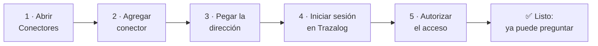
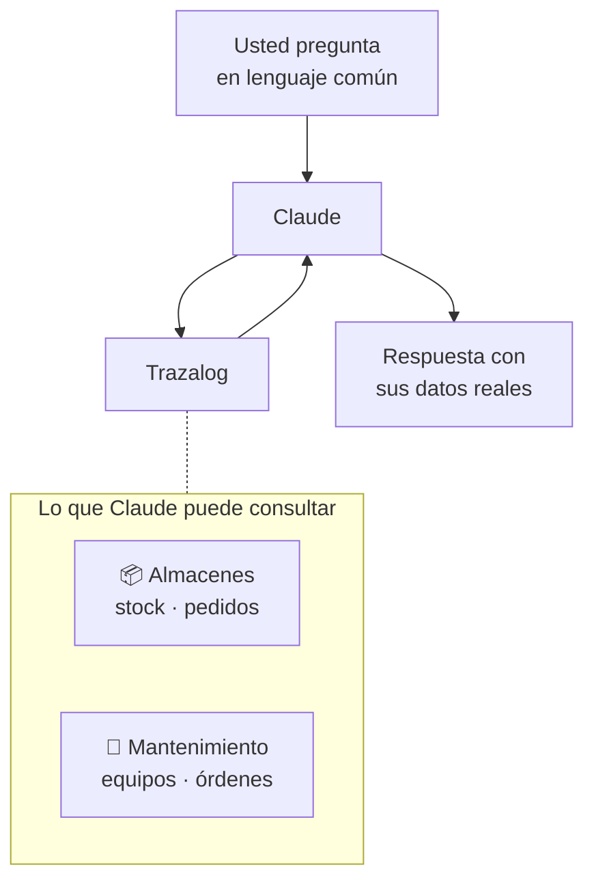

# Conectar Claude a Trazalog

## Objetivo

Guía paso a paso para conectar Claude con su sistema Trazalog, de modo que pueda consultarle
por su stock, sus equipos y sus órdenes de trabajo escribiendo en lenguaje común, sin entrar
al sistema. Está escrita para el usuario del sistema — no hace falta ningún conocimiento
técnico ni instalar nada.

Se hace **una sola vez**: una vez conectado, queda disponible en todas sus conversaciones.

**No cubre** el uso general de Claude ni la configuración del servidor. Si es técnico de
Trazalog y necesita desplegar o mantener la integración, vea
[`doc/v3/deployment-gcp.md`](../v3/deployment-gcp.md).

---

## Antes de empezar

Necesita tener a mano:

| Qué | Detalle |
|---|---|
| **Su usuario y contraseña de Trazalog** | Los mismos con los que entra al sistema todos los días |
| **La dirección del servidor** | `https://mcp.cloudtrazalog.com/trazalog/mcp/1.0/mcp` |
| **Claude** | En la aplicación de escritorio o en `claude.ai` desde el navegador |

> **Importante:** Claude solo va a ver los datos **de su empresa**. Aunque el sistema tenga
> información de otras empresas, usted nunca las ve — su usuario define a qué datos accede,
> igual que cuando entra a Trazalog normalmente.

---

## El proceso en una mirada

Toma unos 3 minutos.

---

## Paso 1 — Abrir la configuración de conectores

En Claude, entre a **Configuración** y busque la sección **Conectores** en el menú de la
izquierda.

- En la **aplicación de escritorio**: haga clic en su nombre o foto (abajo a la izquierda) →
  **Configuración**.
- En **claude.ai** (navegador): haga clic en su nombre o foto (arriba a la derecha) →
  **Configuración**.

<!-- CAPTURA 1: pantalla de Configuración con "Conectores" señalado en el menú lateral.
     Archivo sugerido: img/01-menu-conectores.png -->

---

## Paso 2 — Agregar un conector nuevo

Dentro de **Conectores**, busque el botón **Agregar conector personalizado**
(o *Add custom connector*).

<!-- CAPTURA 2: la lista de conectores con el botón "Agregar conector personalizado" señalado.
     Archivo sugerido: img/02-agregar-conector.png -->

---

## Paso 3 — Completar los datos

Se abre un formulario con dos campos:

| Campo | Qué poner |
|---|---|
| **Nombre** | `Trazalog` — es solo una etiqueta para que usted lo reconozca; puede poner lo que quiera |
| **URL del servidor** | `https://mcp.cloudtrazalog.com/trazalog/mcp/1.0/mcp` |

**Copie la dirección exactamente como está.** Si el formulario muestra campos adicionales
(por ejemplo *Client ID* o *Client Secret*), **déjelos vacíos**: se completan solos.

Haga clic en **Agregar** o **Guardar**.

<!-- CAPTURA 3: el formulario completo, con Nombre y URL cargados.
     Archivo sugerido: img/03-formulario.png -->

---

## Paso 4 — Iniciar sesión en Trazalog

Ahora haga clic en **Conectar**. Se va a abrir una ventana con la pantalla de acceso de
**Trazalog** — es el mismo sistema de siempre, pidiéndole que confirme quién es.

Ingrese su **usuario y contraseña de Trazalog**.

<!-- CAPTURA 4: la pantalla de login de Trazalog que aparece al conectar.
     Archivo sugerido: img/04-login-trazalog.png -->

> **Si no le pide usuario y contraseña**, no se preocupe: significa que su sesión de Trazalog
> ya estaba abierta en ese navegador y el sistema lo reconoció. Puede seguir al paso 5.

---

## Paso 5 — Autorizar el acceso

Trazalog le va a preguntar si autoriza a **Claude** a acceder a sus datos. Confirme.

Esto es lo mismo que cuando una aplicación le pide permiso para usar su cuenta de Google:
usted le está dando permiso a Claude para consultar **su** información de Trazalog, y puede
revocarlo cuando quiera (ver *Desconectar* más abajo).

<!-- CAPTURA 5: la pantalla de autorización ("Claude solicita acceder a Trazalog").
     Archivo sugerido: img/05-autorizar.png -->

Al confirmar, vuelve a Claude y el conector aparece como **conectado**.

<!-- CAPTURA 6: el conector ya conectado, mostrando la lista de herramientas disponibles.
     Archivo sugerido: img/06-conectado.png -->

---

## Listo: ¿qué le puede preguntar?

Escriba en el chat como le hablaría a un compañero de trabajo. Claude consulta Trazalog y le
responde con **sus** datos reales.

### Almacenes

- «¿Cuánto stock de barra de acero cortada tengo?»
- «Mostrame todos los artículos con stock»
- «¿Qué artículos están por debajo del punto de pedido?»
- «Listame los pedidos de materiales pendientes»
- «Creá un pedido de materiales de 20 metros de barra de acero»

### Mantenimiento

- «Listá mis equipos»
- «¿Qué equipos están en reparación?»
- «Mostrame el detalle del equipo BOMB-001»
- «¿Qué órdenes de trabajo tengo abiertas?»
- «Creá una orden de trabajo para el compresor por vibración excesiva»

### También puede combinar y analizar

Claude no solo consulta: puede razonar sobre lo que trae.

- «De los equipos en reparación, ¿cuáles son los más críticos?»
- «Armame un resumen del estado del almacén para la reunión de mañana»
- «¿Hay algún artículo que convenga pedir esta semana?»

> **Antes de crear algo** (un pedido o una orden de trabajo), Claude le va a pedir
> confirmación. Nunca modifica nada sin que usted lo apruebe.

---

## Si algo no funciona

| Qué ve | Qué hacer |
|---|---|
| **Pide volver a autorizar** («token expired» o similar) | Es normal cada tanto por seguridad. Haga clic en **Conectar** y vuelva a ingresar. |
| **Las respuestas vienen vacías** | Verifique en Trazalog que su usuario tenga datos cargados en ese módulo. Si en el sistema ve la información pero Claude no, avise a soporte. |
| **No aparece la pantalla de Trazalog al conectar** | Cierre la ventana, **elimine** el conector (no solo desconectar) y agréguelo de nuevo desde el paso 2. |
| **Dice que no se pudo conectar** | Revise que la dirección esté escrita exactamente igual, sin espacios al final. Si persiste, verifique que tenga acceso normal a internet y a `claude.ai`. |
| **Ve datos que no son de su empresa** | **Avise a soporte inmediatamente.** No debería pasar nunca. |

---

## Desconectar

Si quiere sacarle el acceso a Claude en cualquier momento:

**Configuración → Conectores → Trazalog → Desconectar** (o **Eliminar** para borrarlo del todo).

Desde ese momento Claude deja de tener acceso a sus datos. Puede volver a conectarlo cuando
quiera repitiendo esta guía.

---

## Preguntas frecuentes

**¿Claude guarda mis datos de Trazalog?**
No. Los consulta en el momento para responderle y no los almacena.

**¿Otros usuarios de Claude pueden ver mis datos?**
No. La conexión es suya y usa su usuario de Trazalog. Cada persona que conecte Claude ve
únicamente lo que su propio usuario tiene permitido ver.

**¿Puedo usarlo desde el celular?**
Sí. Una vez conectado desde la computadora, la conexión queda asociada a su cuenta de Claude y
funciona también desde la aplicación móvil.

**¿Necesito hacer esto cada vez?**
No, se hace una sola vez. Cada tanto puede pedirle que vuelva a iniciar sesión, por seguridad.

**¿Puede Claude borrar o romper algo en Trazalog?**
Puede crear pedidos de materiales y órdenes de trabajo, siempre pidiéndole confirmación antes.
No puede borrar información.

---

Ante cualquier duda, contacte a soporte de Trazalog.
