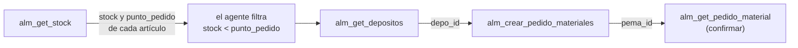

# Escenarios de uso encadenado y suite de regresión

## Objetivo

Los escenarios de uso real de las tools MCP: qué le pregunta un usuario a Claude, qué tools se
encadenan para responderle, y qué tiene que devolver cada una. Sirve para tres cosas: entender
funcionalmente para qué existe cada tool, ejecutar las pruebas a mano (QA), y correr la suite
automática como regresión antes de un release.

Escrito para quien tenga que validar la capa MCP después de un cambio, o entender por qué falta
una tool.

**No cubre** el despliegue ni la conexión del conector — eso está en
[`deployment-gcp.md`](../v3/deployment-gcp.md) y
[`conectar-claude-a-trazalog.md`](../manuales/conectar-claude-a-trazalog.md).

| | |
|---|---|
| **Última ejecución** | 2026-08-12 — 12/12 escenarios OK, con escrituras reales |
| **Entorno** | MI local `:8290` + bases de desarrollo (`10.142.0.13`) |
| **Suite** | `scripts/dev/mcp_escenarios.py` |

---

## 1. Por qué escenarios encadenados y no tools sueltas

Probar cada tool por separado no encuentra el problema más común: **que una tool pida un dato
que ninguna otra devuelve**. El agente queda trabado a mitad de camino aunque todas las tools
"funcionen".

Ejemplo real que motivó este documento (2026-08-11): el usuario pidió los artículos bajo punto
de pedido y después quiso crear el pedido de reposición. `alm_crear_pedido_materiales` exige un
`depo_id` por artículo — y **ninguna tool devolvía los depósitos**. Las 9 tools pasaban sus
pruebas individuales; el flujo real era imposible de completar.

De ahí salió `alm_get_depositos`. La suite ahora cubre ese encadenado para que no se repita.

---

## 2. Datos de prueba (base de desarrollo)

La empresa **Empresa_Test** tiene datos en las dos bases, y es la que usan los escenarios:

| | PostgreSQL `tools_prod_t` | MySQL `assetv2` |
|---|---|---|
| **ID** | `empr_id = 1` | `id_empresa = 1` |
| **Datos** | 311 artículos · 25 depósitos · 371 pedidos | 4 equipos · 52 solicitudes |

Sus 4 equipos son representativos de una faena:

| ID | Código | Equipo | Estado |
|---|---|---|---|
| 130 | COMP-001 | Compresor de aire Atlas Copco GA37 | AC (activo) |
| 131 | BOMB-001 | Bomba centrífuga Grundfos CM10 | **RE (en reparación)** |
| 132 | GHOR-001 | Grúa horquilla Caterpillar GP25N | AC |
| 133 | GEN-001 | Generador Sullair 750kVA | AC |

Para las pruebas de aislamiento se usa **SEADS** (`empr_id = 87` / `id_empresa = 8`).

> El `id_empresa` de MySQL **no** es el `empr_id` de PostgreSQL. En desarrollo ambos son `1`
> para Empresa_Test por casualidad; en otros ambientes la correspondencia la da
> `core.empresas.empr_id_mysql`.

---

## 3. Los escenarios

### E1 · Reponer un artículo bajo punto de pedido

**Contexto.** El jefe de almacén revisa qué está por debajo del mínimo antes de que falte en
plena operación, y arma el pedido de reposición.

**Lo que le dice a Claude:**
> «¿Qué artículos tengo por debajo del punto de pedido?»
> «Armá un pedido de reposición para el primero, al depósito principal»

**Encadenado:**



| # | Tool | Qué aporta al paso siguiente |
|---|---|---|
| 1 | `alm_get_stock` | `id`, `stock`, `punto_pedido` de los 311 artículos |
| 2 | *(el agente filtra)* | los 21 que están bajo el mínimo |
| 3 | `alm_get_depositos` | **el `depo_id`** que exige el alta |
| 4 | `alm_crear_pedido_materiales` | `pema_id` del pedido creado |
| 5 | `alm_get_pedido_material` | confirma que quedó registrado |

**Resultado esperado:** el pedido queda en estado `Solicitado` con su `case_id` de Bonita.
Última corrida: `pema_id=1483`.

**Sin `alm_get_depositos` este escenario es imposible** — es la razón de ser de esa tool.

---

### E2 · Equipo en falla: diagnóstico y orden de trabajo

**Contexto.** El supervisor de mantenimiento revisa qué equipos están detenidos y abre la orden
de trabajo correspondiente.

**Lo que le dice a Claude:**
> «¿Qué equipos tengo en reparación?»
> «Mostrame el detalle de la bomba»
> «Creá una orden de trabajo por vibración excesiva»

**Encadenado:**

| # | Tool | Qué aporta |
|---|---|---|
| 1 | `man_get_equipos` | los 4 equipos con su `estado` |
| 2 | *(el agente filtra)* | el que está en `RE` → BOMB-001 (`id_equipo=131`) |
| 3 | `man_get_equipo(131)` | marca, sector, área, **criticidad** |
| 4 | `man_create_ot` | crea la solicitud + instancia el proceso en Bonita |
| 5 | `man_get_ot` | confirma estado `S` (solicitada) |

**Resultado esperado:** OT creada con `ot_id` y `case_id`. Última corrida: `ot_id=293`,
`case_id=30006`.

---

### E3 · Auditar las órdenes de trabajo abiertas

**Contexto.** Reunión de planificación: qué hay pendiente y dónde.

**Lo que le dice a Claude:**
> «¿Qué órdenes de trabajo tengo abiertas?»
> «¿Dónde está el equipo de la más reciente?»

| # | Tool | Qué aporta |
|---|---|---|
| 1 | `man_get_ots` | las 53 solicitudes con estado |
| 2 | `man_get_ots(estado="S")` | filtro server-side; **todas deben venir en ese estado** |
| 3 | `man_get_ot(id)` | equipo, sector y **ubicación física** |

**Resultado esperado:** el detalle ubica el equipo (ej. *"Sala de bombas Circuito 2"*), que es
lo que el técnico necesita para ir.

---

### E4 · Seguir el estado de los pedidos de materiales

**Contexto.** Compras quiere saber qué se pidió y en qué anda.

**Lo que le dice a Claude:**
> «¿Cómo vienen mis pedidos de materiales?»
> «Mostrame qué tiene el último»

| # | Tool | Qué aporta |
|---|---|---|
| 1 | `alm_get_pedidos_materiales` | los 372 pedidos con su estado |
| 2 | *(el agente agrupa)* | Solicitado 130 · Entregado 90 · Planificado 39 |
| 3 | `alm_get_pedido_material(id)` | encabezado **+ las líneas de artículos** |

**Resultado esperado:** el detalle incluye `detalles.detalle[]` con `arti_id`, `cantidad`,
`descripcion` y `barcode` de cada línea.

---

### E5 · Aislamiento multi-tenant (ADR-012)

**Contexto.** No es un caso de uso: es la garantía de que una empresa nunca ve datos de otra.
Es el escenario más importante de la suite.

Se ejecutan las mismas tools con dos identidades distintas (Empresa_Test y SEADS) y se verifica:

| Verificación | Esperado |
|---|---|
| Artículos de una vs otra | **0 en común** (311 vs 7) |
| Depósitos de una vs otra | **0 en común** (25 vs 3) |
| Pedir por ID un pedido ajeno | respuesta **vacía**, sin error |
| Pedir por ID un equipo ajeno | respuesta **vacía**, sin error |

> La respuesta a un recurso ajeno es **vacía, no un error**: así el agente no puede inferir si
> el ID existe en otra empresa.

---

### E6 · Coherencia entre listado y detalle

**Contexto.** Que la misma entidad no se describa distinto según por dónde se la consulte — si
`man_get_equipos` dice que un equipo está activo y `man_get_equipo` dice otra cosa, el agente
razona sobre datos contradictorios.

| Verificación | Esperado |
|---|---|
| `código`, `descripción`, `estado` del equipo | idénticos en listado y detalle |
| `estado` del pedido | idéntico en listado y detalle |
| Acentos en las descripciones | sin mojibake (ver §5) |

---

### E8 · Preventivos vencidos y cobertura del plan

**Contexto.** La consulta que el jefe de mantenimiento hace todos los días, y la que las mineras
auditan: ¿el plan existe, se cumple, y cubre los equipos que importan?

**Lo que le dice a Claude:**
> «¿Qué mantenimientos tengo vencidos?»
> «¿Qué equipos no tienen plan preventivo? ¿Alguno es crítico?»

| # | Tool | Qué aporta |
|---|---|---|
| 1 | `man_get_preventivos` | plan, periodicidad, intervalo, `estadoprev` y criticidad del equipo |
| 2 | *(el agente filtra)* | los que están en `VE` (vencido) |
| 3 | *(el agente cruza con `man_get_equipos`)* | los equipos que **no aparecen** no tienen plan |

**Resultado esperado:** además de los vencidos, detecta los equipos sin cobertura y los prioriza
por criticidad. En los datos de prueba: 2 de 4 equipos sin plan, **ambos críticos**
(GEN-001 Muy Alta, GHOR-001 Alta).

---

### E9 · Aislamiento del plan preventivo

Verifica que dos empresas no compartan planes, y —específicamente— que no se filtren los
registros donde `preventivo.id_empresa` no coincide con el del equipo. En la base de desarrollo
hay 130 así (datos basura confirmados con el PM): el filtro estricto los excluye.

---

### E10 · Stock filtrado por depósito, tipo y búsqueda

**Contexto.** El stock total no sirve si el material está en otra faena, y con catálogos grandes
tampoco sirve traerlo entero.

**Lo que le dice a Claude:**
> «¿Cuántos insumos tengo en el depósito de Zaranda?»
> «¿Tengo filtros de aire y aceite hidráulico?»

Los tres filtros de `alm_get_stock` son opcionales y combinables:

| Filtro | Efecto |
|---|---|
| `depo_id` | solo artículos con stock ahí, y el `stock` pasa a ser el de ese depósito |
| `tipo` | por nombre legible: Insumo, Materia Prima, Producto… |
| `buscar` | texto libre sobre la descripción |

**`buscar` es la pieza del caso donde Claude aporta el conocimiento de dominio**: releva por su
cuenta qué insumos son clave en minería y después consulta por esos.

El escenario verifica que cada filtro devuelva **solo** lo que corresponde, que combinarlos
acumule, y que **sin filtros la respuesta sea idéntica a la de antes** (retrocompatible).

---

### E11 · Lotes vencidos y por vencer

**Contexto.** Lubricantes, adhesivos y reactivos tienen vida útil; un lote vencido usado en un
mantenimiento es un problema de calidad.

`alm_get_vencimientos` devuelve los lotes **con stock** y fecha, ya clasificados: `Vencido` ·
`Critico` (menos de 10 días) · `Activo`, con los días restantes.

El escenario verifica que la clasificación coincida con los días en **todos** los lotes (344 en
los datos de prueba, de los cuales 55 vencidos).

---

### E12 · Equipos sin control de lecturas

**Contexto.** Un preventivo por Horas/Km/Ciclos **no se puede evaluar** si nadie toma la lectura.
Este escenario audita el plan de medición, no el de mantenimiento.

`man_get_lecturas` devuelve un registro por equipo — incluidos los que **nunca** tuvieron una
lectura, que son los relevantes.

**Resultado en datos reales** (empresa 8): de 68 equipos, **42 sin ninguna lectura** y 26 con más
de 90 días; **14 de esos son críticos**, el peor con 2296 días.

El escenario además cruza con `man_get_preventivos` para detectar **planes por uso sobre equipos
sin lecturas**: planes que nadie puede saber si vencieron.

---

### E7 · El contrato publicado no se desincroniza de lo implementado

**Contexto.** La OpenAPI (`doc/api/trazalog-operaciones.yaml`) es lo que consume el Virtual MCP
Server del APIM para generar las tools. Es un artefacto **separado** del `toolsMCPAPI.xml` del
MI, así que pueden divergir sin que nadie lo note:

| Divergencia | Qué pasa |
|---|---|
| Declarada en la OpenAPI, no implementada en el MI | la tool aparece en Claude y **falla con 404** al usarla |
| Implementada en el MI, no declarada | la tool es **invisible** para el agente |

Se verifica que ambos conjuntos de rutas coincidan y que no haya `operationId` duplicados. Es el
único escenario que no necesita el MI corriendo — solo lee los dos archivos.

**Resultado esperado:** 9 rutas declaradas, todas implementadas, 10 `operationId` únicos.

---

## 4. Cómo ejecutar

### Automático (regresión)

```bash
# Requiere: MI local en :8290 con el CAR desplegado, y VPN a las bases de desarrollo
python3 scripts/dev/mcp_escenarios.py              # solo lectura — seguro, no crea nada
python3 scripts/dev/mcp_escenarios.py --escrituras # incluye crear OT y pedido reales
python3 scripts/dev/mcp_escenarios.py --lista      # ver los escenarios sin ejecutar
```

Variables: `MI_URL` (default `http://localhost:8290`), `EMPR_ID`, `EMPR_ID_MYSQL`,
`OTRA_EMPR`, `OTRA_EMPR_MYSQL`.

Devuelve **exit code ≠ 0** si algún escenario falla → apto para CI.

> **`--escrituras` crea datos reales**: un pedido de materiales y una orden de trabajo, ambas
> con la justificación `[TEST Ex descartable]` y una instancia real en Bonita. Correr solo
> contra desarrollo. Sin ese flag, los escenarios de escritura validan todo el encadenado hasta
> el paso previo al alta.

### Manual (QA desde Claude)

Con el conector configurado, escribir en el chat las preguntas de cada escenario (están en
*"Lo que le dice a Claude"*) y verificar:

1. Que Claude use **las tools esperadas** — se ven en el panel de herramientas de la conversación.
2. Que **no pida datos que debería poder buscar solo**. Si pregunta "¿a qué depósito?" en vez de
   consultar `alm_get_depositos`, hay un problema de descripción de la tool, no de datos.
3. Que **pida confirmación antes de escribir** (crear OT o pedido).
4. Que los números coincidan con los de la app v2 para la misma empresa.

---

## 5. Hallazgos abiertos

### 5.1 Mojibake en las descripciones de equipos 🟡

`man_get_equipos` devuelve `"Bomba centrífuga"` en vez de `"Bomba centrífuga"` para 3 de los 88
equipos de la base de desarrollo.

**Causa (verificada):** la columna `equipos.descripcion` de `assetv2` es **latin1**, pero esas 3
filas tienen bytes **UTF-8** guardados adentro. Cuando el driver JDBC pide los datos como UTF-8,
MySQL convierte latin1→UTF-8 y produce el doble encoding: `c3 ad` (í correcto) se transforma en
`c3 83 c2 ad`.

**No se puede arreglar cambiando el datasource**, y este es el punto importante: de las 8 filas
con acentos, **5 están en latin1 correcto y 3 en UTF-8**. La configuración actual
(`characterEncoding=UTF-8`) es la correcta para las 5 buenas; cambiarla arreglaría las 3 malas y
rompería las otras 5.

| Guardado como | Filas | Ejemplo | Hoy se ve |
|---|---|---|---|
| latin1 (correcto) | 5 | `Noqueador Neumático STUN-BP1` | bien |
| UTF-8 en columna latin1 | 3 | `Bomba centrífuga Grundfos CM10` | **mal** |

Las 3 afectadas (BOMB-001, GHOR-001, BOMB-SJ-001) son las que se cargaron en el smoke test de
Sprint 2 — o sea que el problema lo introduce la vía por la que se cargaron esos datos, no la
capa MCP.

**Es corrección de datos, no de configuración** (🔴, requiere decisión): hay que normalizar esas
filas puntuales. Diagnóstico reproducible:

```sql
SELECT id_equipo, codigo, HEX(descripcion) FROM equipos WHERE descripcion REGEXP '[^ -~]';
```

Los valores cuyos bytes sean UTF-8 válido son los que están mal guardados.

### 5.2 Escenarios no cubiertos todavía

- **Vencimientos de lotes.** `getLotesVencimientos` ya existe en `ALMDataService` y clasifica en
  Crítico/Advertencia. Relevante para insumos con vida útil (lubricantes, filtros). No hay tool
  que lo exponga.
- **Movimientos históricos de stock.** `getHistoricoMovimientos` existe; permitiría responder
  «¿cuánto consumimos de este artículo el mes pasado?».
- **Ajustes de stock y recepción de materiales.** Existen en el DataService; son escrituras, así
  que requieren la misma cautela que `alm_crear_pedido_materiales`.

---

## 6. Contrato de las respuestas (para escribir tests)

Cada tool envuelve el resultado con un nombre propio. Equivocarse de wrapper hace que un test
lea 0 elementos y parezca un bug de datos — pasó al escribir esta suite.

| Tool | Camino en el JSON |
|---|---|
| `man_get_equipos` | `equipos.equipo[]` |
| `man_get_preventivos` | `preventivos.preventivo[]` |
| `man_get_lecturas` | `lecturas.equipo[]` |
| `man_get_equipo` | `equipo` (objeto) |
| `man_get_ots` | `solicitudes.solicitud[]` |
| `man_get_ot` | `solicitudes.solicitud[]` |
| `man_create_ot` | `resultado`, `ot_id`, `case_id`, `estado` |
| `alm_get_stock` | `materias.materia[]` |
| `alm_get_depositos` | `depositos.deposito[]` |
| `alm_get_vencimientos` | `vencimientos.lote[]` |
| `alm_get_pedidos_materiales` | `pedidos.pedido[]` |
| `alm_get_pedido_material` | `pedidos.pedido[]` (con `detalles.detalle[]`) |
| `alm_crear_pedido_materiales` | `resultado`, `pema_id`, `case_id`, `estado` |

> Cuando no hay resultados el wrapper viene **vacío** (`{"materias":{}}`), y cuando hay **uno
> solo** viene como objeto en vez de lista. El helper `lista()` de `mcp_tools_client.py`
> normaliza los tres casos.
