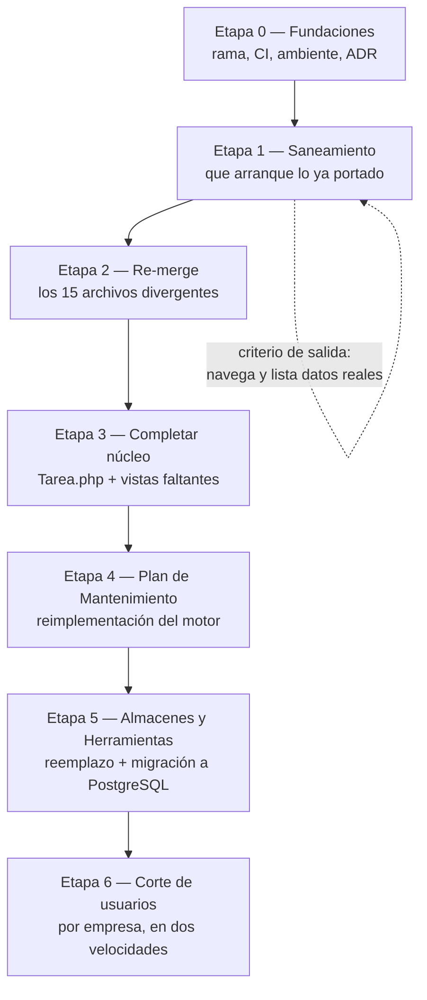
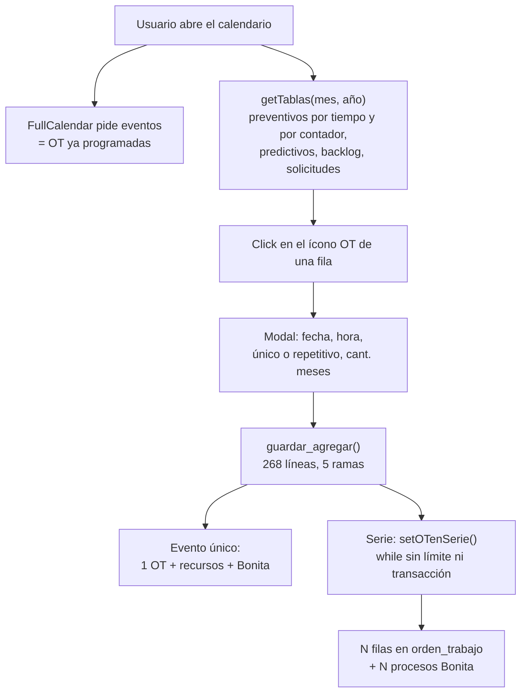

# Migración de AssetPlanner a traz-tools (módulo `traz-tools-man`)

## Objetivo

Este documento releva el estado real de la migración de `traz-prod-assetplanner` (app standalone de mantenimiento) al submódulo `traz-tools-man` de traz-tools, reconstruye la mecánica que usó el desarrollador anterior, y define la estrategia, las etapas y el plan de calidad para terminarla. Está escrito para el PM y para quien vaya a ejecutar la migración; se puede leer sin conocer la historia previa del proyecto.

**Qué NO cubre:** el detalle de ejecución del reemplazo de almacenes y herramientas por los módulos de traz-tools (la estrategia está en §5.8, pero cada uno necesita su propio plan de migración de datos), los ABMs de catálogo, reportes/KPIs, y la decisión de qué pasa con Bonita BPM en v3. Tampoco es una guía de instalación de traz-tools ni del stack WSO2 (ver [`doc/infra/ambientes.md`](../infra/ambientes.md) y [`doc/v3/deployment-gcp.md`](../v3/deployment-gcp.md)).

---

**Metadata**

| Campo | Valor |
|---|---|
| Fecha del relevamiento | 2026-08-12 |
| Repos analizados | `traz-prod-assetplanner` rama `master` (`7d8ca44`, 2026-04-17) · `traz-tools-man` rama `rnsanchez` (`343dbb0`, 2024-09-09) · `traz-tools` rama `develop-v3` |
| Autor del trabajo previo | Rogelio Sanchez (ya no está en la empresa; tampoco la PM de entonces) |
| Clase de riesgo de este documento | 🟢 (sólo análisis y documentación, no toca runtime ni datos) |
| Decisiones que habilita | Ver §6 — cuatro puntos requieren workshop antes de ejecutar |

---

## Resumen ejecutivo

Hay más trabajo hecho del que sugiere el repo, y menos del que sugiere el backlog.

Rogelio portó **43 archivos, ~36.100 líneas** (12 controllers, 13 models, 18 vistas): el núcleo de Equipos, Órdenes de Trabajo, Backlog, Preventivo, Predictivo y Componentes. Eligió los archivos grandes del dominio, así que cubrió ~40% de las líneas de controllers con sólo 18% de los archivos. Su patrón de adaptación es correcto donde lo aplicó.

Pero hay tres hechos que cambian el punto de partida:

1. **El trabajo nunca se integró.** El submódulo en traz-tools apunta a `02cca43` ("First commit", un README de una línea) en `develop-v3`, `master` y HEAD por igual. El código vive en la rama `rnsanchez`, que ningún repo referencia.
2. **El módulo no arranca.** No es "casi terminado": la conversión quedó a medias en tres dimensiones simultáneas (sesión, acceso a datos, vistas), y cada una produce fallos fatales. Detalle en §1.3.
3. **El calendario nunca se tocó.** Y el calendario no es una pantalla: es el motor que genera las órdenes de trabajo a partir de los planes. Detalle en §5.7.

La contrapartida buena: **la divergencia es chica y está concentrada**. De los 43 archivos portados, sólo 15 cambiaron en assetplanner en los ~20 meses siguientes, casi todos en Tareas/Bonita e Informe de Servicio. Rescatar el fork es claramente mejor negocio que re-migrar.

El hallazgo que más condiciona el plan es otro: para el núcleo de mantenimiento, tools y asset apuntarían a **la misma base MariaDB `assetv2`**. Eso hace posible una convivencia real con corte gradual por empresa y rollback instantáneo, a cambio de congelar el esquema mientras asset siga en producción.

Pero eso vale sólo para el núcleo. **Almacenes y herramientas son distintos**: no se migran, se reemplazan por los módulos que ya existen en traz-tools (`traz-comp-almacenes` y `traz-comp-pan`), que corren sobre PostgreSQL. Ahí sí hay migración de datos de clientes en el cutover, y el rollback deja de ser gratis. El cutover es entonces **de dos velocidades** (§5.8-§5.9).

---

## 1. Estado de la migración

### 1.1 Dónde está cada cosa

| Repo / rama | Contenido | Último commit |
|---|---|---|
| `traz-prod-assetplanner` `master` | App completa en producción. 66 controllers, 67 models, 77 dirs de vistas, ~160k LOC PHP | `7d8ca44`, 2026-04-17 |
| `traz-tools-man` `main` | Sólo `controllers/Sservicio.php` y un README | `02cca43`, 2024-07-08 |
| `traz-tools-man` `rnsanchez` | **El trabajo real.** 43 archivos, 36.122 LOC | `343dbb0`, 2024-09-09 |
| `traz-tools` (host) | Puntero del submódulo en `02cca43` + 5 archivos tocados por Rogelio | `cf7c6a8d3`, 2024-09-10 |

`master` de assetplanner es la fuente de verdad: contiene todo `develop` y va 16 commits adelante (merges de tags `v2.9.x`).

Los 5 archivos que Rogelio tocó en el host (commit `cf7c6a8d3`):

| Archivo | Cambio |
|---|---|
| `application/config/constants.php` | `define('MAN', 'traz-tools-man/')`, `BPM_PROCESS_ID_MANTENIMIENTO`, `DT_SIZE_ROWS`, `EMPRESAS_FORM` |
| `application/config/database.php` | `$db['asset_db']` → MariaDB `assetv2` |
| `application/helpers/menu_helper.php` | Fix de un tag |
| `application/views/layout/general_scripts.php` | jquery-migrate (agregado y luego comentado) |
| `.gitmodules` / puntero | Alta del submódulo |

**No creó ningún helper, librería ni ruta nueva.** Se apoyó en lo que ya existía en el host.

### 1.2 Inventario de lo migrado

Estado: **COMPLETO** = port íntegro, sin funciones perdidas · **PARCIAL** = faltan funciones del original.

**Controllers** (`traz-tools-man/controllers/`)

| Archivo | LOC | Funciones (tools/asset) | Estado |
|---|---|---|---|
| `Equipo.php` | 1090 | 63/63 | COMPLETO |
| `Otrabajo.php` | 1460 | 61/62 | COMPLETO — falta `reasignaOt` (post-corte) |
| `Calendario.php` | 906 | 31/31 | Copia literal, **sin adaptar** (ver §1.3) |
| `Preventivo.php` | 647 | 29/30 | COMPLETO — falta `gettareaxPatron` (post-corte) |
| `Backlog.php` | 526 | 15/15 | COMPLETO |
| `Predictivo.php` | 417 | 13/13 | COMPLETO |
| `Componente.php` | 389 | 19/19 | COMPLETO |
| `Ordenservicio.php` | 372 | 27/28 | COMPLETO — falta `cierreMasivoVerificaInforme` (post-corte) |
| `Sservicio.php` | 253 | 19/22 | **PARCIAL** — faltan `paginado`, `eliminar_solicitud`, `validaUsuario` |
| `Parametro.php` | 246 | 15/23 | **PARCIAL** — faltan 7 funciones de `setparam` |
| `Proceso.php` | 80 | 6/6 | COMPLETO |
| `Area.php` | 76 | 6/6 | COMPLETO |

**Models** (`traz-tools-man/models/`)

| Archivo | LOC | Funciones (tools/asset) | Estado |
|---|---|---|---|
| `Equipos.php` | 1868 | 77/77 | COMPLETO |
| `Otrabajos.php` | 1564 | 83/83 | COMPLETO |
| `Calendarios.php` | 1262 | 48/48 | Sólo conversión mecánica |
| `Tareas.php` | 1244 | 63/64 | COMPLETO — falta `getOrdenesPorCaseIds` (post-corte) |
| `Preventivos.php` | 837 | 43/44 | COMPLETO — falta `gettareaxPatron` |
| `Ordenservicios.php` | 729 | 30/33 | COMPLETO vs corte — faltan 3 de evidencias (post-corte) |
| `Sservicios.php` | 395 | 18/24 | **PARCIAL** — faltan 6 funciones |
| `Predictivos.php` | 299 | 18/18 | COMPLETO |
| `Componentes.php` | 293 | 17/17 | COMPLETO |
| `Backlogs.php` | 288 | 18/18 | COMPLETO |
| `Parametros.php` | 156 | 10/14 | **PARCIAL** — faltan 5 funciones `setparames` |
| `Procesos.php` | 71 | 6/6 | COMPLETO |
| `Areas.php` | 68 | 6/6 | COMPLETO |

> ⚠️ `models/Tareas.php` está migrado pero **`controllers/Tarea.php` (1231 LOC) no existe** en el fork. Es el gap individual más grande.

**Vistas** — 18 archivos, 20.586 LOC. Migradas: `backlog/` (list, view_), `componente/` (list, view_), `Equipo/` (list, view_), `ordenservicios/list`, `otrabajos/` (list, tabla_opciones, view_agregarOT), `parametro/list`, `predictivo/` (list, view_), `preventivo/` (list, view_), `Sservicios/` (list_bpm, view_), `tareas/view_presta_presta_conf_modal`.

Dos casos a mirar:
- `Sservicios/list_bpm.php`: 1210 LOC contra 1881 del original actual — **PARCIAL**, 64%.
- `ordenservicios/list.php`: 337 LOC contra 499 — parcial y además muy divergente.

### 1.3 Por qué el módulo no arranca hoy

Cuatro defectos, todos verificados, cada uno suficiente para romper la ejecución:

**a) Acceso a datos convertido sólo a medias.** Rogelio reemplazó `$this->db` por `$this->assetDB` (la segunda conexión, a MariaDB) **únicamente en los models**:

| | assetplanner | `traz-tools-man` |
|---|---|---|
| `$this->db->` en models | 1840 | **0** |
| `$this->assetDB->` en models | 0 | **1718** |
| `$this->db->` en **controllers** | 79 | **62** |

Como `$db['default']` del host es **PostgreSQL** (`application/config/database.php:74-96`), esos 62 accesos golpean el motor equivocado contra tablas que no existen ahí. El caso más denso es `controllers/Calendario.php:413-495` y `:827-830` — 39 ocurrencias consultando `tbl_back`, `solicitud_reparacion`, `orden_trabajo`, `preventivo`, `predictivo`.

Variante silenciosa del mismo problema: `controllers/Preventivo.php:537` hace `$id = $this->db->insert_id()` justo después de un insert que ocurrió en `assetDB` — devuelve el id de **otra conexión**. Mismo patrón en `Otrabajo.php:404,779,796,811,826,855`, `Equipo.php:373,781,796,812`, `Componente.php:145`.

**b) Sesión convertida sólo en los métodos que tocó.** assetplanner guardaba un array `user_data` con forma `[0]['id_empresa']`; traz-tools/DNato guarda escalares planos (`empr_id`, `groupBpm`, seteados en `application/controllers/Dash.php:52-53`). Rogelio usó el helper correcto del host —`empresa()` en `application/helpers/sesion_helper.php:212-217`— pero sólo en 40 sitios. Quedan **89 accesos activos** a `userdata('user_data')` (96 ocurrencias, 7 comentadas), y como el host nunca escribe esa clave, devuelven `NULL`.

Los dos mecanismos conviven en líneas consecutivas:

```php
// traz-tools-man/controllers/Sservicio.php:128-129
$userdata = $this->session->userdata('user_data');   // NULL en tools
$empId = empresa();                                   // correcto
```

Y hay controllers enteros sin tocar. `controllers/Otrabajo.php:18-38` conserva el gate de login de assetplanner, con redirect a un `login` que en tools no existe:

```php
if(empty($data['user_data'][0]['usrName'])){
    ...
    echo ("<script>location.href='login'</script>");
```

El mismo bloque **sí** fue comentado en `controllers/Equipo.php:22-28`. Sin tocar: `Area.php:13-21`, `Proceso.php:14-22`, `Componente.php:12-20`.

**c) 23 vistas referenciadas que nunca se portaron.** Cada `load->view()` de esta lista es un fatal error. Incluye la home del módulo y **todo el calendario**:

```
otrabajos/dashOriginal   ← controllers/Otrabajo.php:36, es el index() del módulo
otrabajos/view_, asignacion, printot, printotback, printotpred, printotprev, printotsolserv
calendar/calendar1, calendar2, filtro, tablas, view_OtEjecutar_modal   ← el calendario completo
Sservicios/list, list_term · ordenservicios/view_ · area/view_ · proceso/view_
componente/listabm · equipo/asigna · equipo/ventana
tareas/view_inf_servicio_modal, view_edicion_inf_servicio_modal
```

**d) Case mismatch fatal en Linux.** El directorio se renombró a `views/Equipo/` (mayúscula) y se actualizó `controllers/Equipo.php:37`, pero no `:646` ni `:652`, que siguen cargando `equipo/ventana` y `equipo/asigna`.

Deuda menor del mismo tipo: **92 URLs** quedaron con el estilo viejo (`index.php/X` o `base_url()?>index.php/X`) en vez de la constante `MAN`, conviviendo los tres estilos en el mismo archivo (`views/predictivo/list.php` usa `MAN` en 5 líneas e `index.php/` en 8).

### 1.4 Divergencia post-corte — lo que hay que re-mergear

assetplanner recibió 67 commits desde el corte, pero sólo **15 de los 43 archivos migrados** cambiaron. Ordenados por volumen:

| Archivo (assetplanner) | Commits | +/- | Temas |
|---|---:|---|---|
| `controllers/Tarea.php` ⚠️ *no migrado* | 5 | +1220/-1028 | Asignar tarea en Bonita; paginación de bandeja; cierre masivo; issues 313/269/310, 306/308/96 |
| `models/Ordenservicios.php` | 5 | +499/-455 | Requerimientos de cliente; múltiples informes de servicio; cierre masivo |
| `controllers/Ordenservicio.php` | 2 | +452/-328 | Verificar múltiples informes de servicio |
| `views/ordenservicios/list.php` | 3 | +444/-323 | Requerimientos de cliente; múltiples informes |
| `views/Sservicios/list_bpm.php` | 6 | +254/-107 | Modal de OT (#314); estado "Cerrar" (#292); tabla de tareas (#305); múltiples adjuntos |
| `models/Tareas.php` | 2 | +211/-132 | Paginación de bandeja; cierre masivo |
| `controllers/Calendario.php` | 2 | +76/-72 | Issues 313/269/310; botón "Editar asignado" (#300) |
| `views/tareas/view_presta_presta_conf_modal.php` | 1 | +66/-1 | Issues 306/308/96 |
| `controllers/Otrabajo.php` | 3 | +54/-2 | Impresión desde OT; botón "Editar asignado" |
| `models/Sservicios.php` | 2 | +35/-5 | Múltiples adjuntos; botón "Editar asignado" |
| `views/otrabajos/list.php` | 3 | +8/-20 | Horarios, cantidad de personas, export (#306) |
| `views/preventivo/list.php` | 1 | +26/-1 | Issues 313/269/310 |
| `controllers/Sservicio.php` | 2 | +8/-5 | Múltiples adjuntos |
| `views/equipo/list.php` | 1 | +1/-1 | Códigos de equipos (#216) |
| `models/Preventivos.php` | 1 | +1/-0 | Issues 313/269/310 |

**Sin cambios post-corte: 28 archivos** — todos los ABMs de activos (Area, Backlog, Componente, Equipo, Parametro, Predictivo, Preventivo, Proceso y sus models y vistas).

Archivos calientes **fuera** del set migrado, relevantes para las etapas siguientes: `views/tareas/list.php` (1345 Δ), `models/Reportes.php` (311), `views/tareas/view_inf_servicio_modal.php` (273), `libraries/BPM.php` (151), `views/calendar/calendar1.php` (102).

**Conclusión:** el vector de divergencia es Tareas/Bonita e Informe de Servicio, no el dominio de activos.

### 1.5 Lo que falta migrar

**Núcleo de mantenimiento (sí entra en alcance)**

| Bloque | LOC aprox |
|---|---:|
| `controllers/Tarea.php` + 17 vistas de `views/tareas/` | 1231 + ~6.900 |
| Vistas de `otrabajos/` (12 archivos) | ~4.859 |
| Vistas de `equipo/` (5 archivos) | ~3.941 |
| Vistas de `Sservicios/` (list, list_solicitante, list_term) | ~1.861 |
| Vistas de `ordenservicios/` (view_, view_validacion) | ~1.933 |
| `backlog/nuevo_edicion_view_.php` | 1.294 |
| `Lectura`/`Lecturas`, `Ficha`/`Fichas` | ~538 |
| `componente/listabm.php`, vistas de area/proceso/tarea | ~700 |

Total estimado: **~24.000 LOC**.

**No migrar (código muerto verificado):** `views/preventivo/partes.php` (453 LOC, copia congelada del `<script>` de `preventivo/list.php`, sin ninguna referencia), `models/Calendar.php` (239) y `models/Calendars.php` (178, nunca se carga), `views/calendar/Calendario.php` (un CI_Controller dentro de `views/`), `views/calendar/programer_.php`, `reprogramer_.php`, `tabla_preventivo_por_horas.php`, y los `.orig` versionados (`calendar1.php.orig`, `tablas.php.orig`, 1813 LOC entre ambos).

**Fuera de alcance — se reemplaza por módulos de tools, no se migra**

| Bloque de assetplanner | Reemplazo en traz-tools |
|---|---|
| Almacenes / depósitos / compras (~20.000 LOC entre `traz-comp-almacen/`, duplicados en raíz y vistas) | `traz-comp-almacenes` + `ALMDataService` (estrategia en §5.8) |
| **Herramientas / pañol** — `controllers/Herramienta.php` (125), `models/Herramientas.php` (143), `views/herramienta/list.php`. Es la **versión vieja** del módulo | `traz-comp-pan` (pañol) + `PANDataservice` (estrategia en §5.8) |
| Login, User, Group, Menu, Administracion (~1.100 LOC) | Core de traz-tools + DNato |
| Notificacion/Notificaciones | `traz-comp-notificaciones` |
| Form/Forms y variantes (~950 LOC) | `traz-comp-formularios` |
| 17 ABMs de catálogo (Criticidad, Marca, Family, Grupo, Sector, Sucursal, Cliente, Proveedor, etc.) | A definir: ABM genérico de tools |
| Reportes / KPIs / KoolReport (~3.200 LOC) | Etapa posterior |

---

## 2. La mecánica de Rogelio, y sus problemas

### 2.1 Los seis pasos que aplicó

Reconstruidos comparando pares de archivos homólogos. La mecánica base es **copiar el archivo entero y editarlo in situ**, no reescribir.

| # | Paso | Cómo lo hizo | Estado |
|---|---|---|---|
| 1 | **Copiar y normalizar** | Copia 1:1, reindentado (tabs → espacios), PHPDoc agregado, `log_message` `#TRAZA` al inicio de los métodos que tocaba | Consistente |
| 2 | **Sesión** | `$userdata[0]['id_empresa']` → `empresa()` del host. Eliminó el guard de login duplicado de cada `index()` (15 líneas) y lo reemplazó por `index($permission = "Add-Edit-Del-")` | **A medias — 89 restos** |
| 3 | **Datos** | `sed` de `$this->db` → `$this->assetDB` + segunda conexión `asset_db` en el host | **Sólo en models — 62 restos en controllers** |
| 4 | **Maqueta** | Desmontó `section.content > row > col > box` a `box box-primary` directo; eliminó `header`/`footer` propios y heredó `layout/Admin` del host | **Sólo en los `list.php`; 6 `view_.php` sin convertir** |
| 5 | **URLs** | `index.php/X` → `<?php echo MAN; ?>X`, a mano, archivo por archivo. `MAN` aparece 154 veces | **92 URLs sin convertir** |
| 6 | **Front / jQuery** | Subió de jQuery 2 a 3 (el host ya usaba 3) sin adaptar el código; parcheó con jquery-migrate; rompió AdminLTE; quitó el parche | **Donde se detuvo** |

### 2.2 Lo que hizo bien y hay que conservar

- **El helper de sesión correcto.** Usó `empresa()` de `application/helpers/sesion_helper.php`, que ya existía. No inventó un mecanismo paralelo. Para lo que falta hay además `userId()`, `userNick()`, `userIdBpm()` y `empr_id_BPM()` en el mismo helper — no hay que crear nada nuevo.
- **Eliminar el guard de login duplicado.** assetplanner repetía un bloque de 15 líneas de verificación de sesión en el `index()` de cada controller. Reemplazarlo por la firma `index($permission = "Add-Edit-Del-")` es la mejora estructural más valiosa del fork.
- **La conexión dedicada.** El patrón `$this->assetDB = $this->load->database('asset_db', TRUE)` en el constructor de cada model es limpio y consistente (13/13 models).
- **Limpieza de código muerto en Parámetro.** `controllers/Parametro.php` (246 vs 403) y `models/Parametros.php` (156 vs 220) son los archivos mejor migrados: eliminó funciones comentadas y bloques duplicados. Es el estándar a replicar.
- **PHPDoc y trazabilidad.** 193 métodos con `log_message('DEBUG', "#TRAZA | TRAZ-TOOLS-MAN | Clase | metodo()")`, el formato que pide `CLAUDE.md`.

### 2.3 Los problemas de la mecánica

**Problema 1 — Conversión por método, no por archivo.** Éste es el defecto de raíz, y explica los tres síntomas de §1.3. Rogelio convertía sesión y datos **sólo en el método que estaba tocando en ese momento**, dejando el resto del archivo en el estado original. El resultado es que ningún archivo está enteramente en un estado ni en el otro, y no hay forma de saber por inspección rápida qué está convertido.

**Mitigación para la nueva etapa:** la unidad de conversión es el **archivo completo**, con un checklist verificable por archivo (cero `user_data`, cero `$this->db`, cero URLs viejas, vistas referenciadas existentes). Automatizable como check de CI (§4).

**Problema 2 — Sin PRs ni revisión.** Tres commits en dos meses, titulados "Backup ofi", "1er back con avances de la migración" y "Back up avances de migracion", en una rama personal. Sin descripción de qué entra en cada uno, sin criterio de completitud. **Ésta es la causa raíz de que hoy nadie sepa qué quedó hecho** — el análisis de este documento tomó reconstruirlo archivo por archivo.

**Mitigación:** PR obligatorio por bloque funcional, con la plantilla del repo (Qué cambia / Por qué / Cómo lo verifiqué) y branch protection.

**Problema 3 — Cero documentación.** El README del submódulo dice literalmente `traz-tools-man`. Todo el conocimiento de la mecánica quedó en la cabeza de una persona que ya no está. La única pista escrita es la nota del último commit.

**Problema 4 — El orden de ataque dejó lo difícil para el final.** Migró primero los ABMs y las pantallas de listado, y dejó el calendario (el motor) sin empezar. Cuando llegó al problema de jQuery ya tenía 36k líneas portadas y ninguna probable de punta a punta.

**Mitigación:** en la nueva estrategia, la Etapa 1 es hacer que arranque **lo que ya está**, antes de portar una línea más.

### 2.4 Dónde se detuvo exactamente, y por qué

La nota de su último commit:

> *"La librearía de jquery migrate genera errores con el admin LTE. La removi de general scripts y lo siguiente es buscar una forma de resolver el error que generan los AUTOCOMPLETE de jquery UI."*

El problema de fondo: assetplanner corre sobre **jQuery 2.1.4**; traz-tools sobre **jQuery 3**. Entre las dos versiones se removieron `jqXHR.success()` y `jqXHR.error()`. La salida rápida fue jquery-migrate, que arregló eso pero rompió AdminLTE. Al quitarlo quedaron dos familias de roturas:

**(A) 11 callbacks `.success()/.error()`** que ahora tiran `TypeError`:

| Archivo | Líneas |
|---|---|
| `views/Equipo/list.php` | 1081, 2061, 2065, 2107, 2142 |
| `views/backlog/list.php` | 729, 778 |
| `views/otrabajos/list.php` | 581, 628 |
| `views/predictivo/list.php` | 422, 470 |

Corrección mecánica: `.success()` → `.done()`, `.error()` → `.fail()`.

**(B) 48 inicializaciones de `.autocomplete()` de jQuery UI.** El host carga jQuery UI **dos veces**: 1.11.4 en `application/views/layout/general_scripts.php:5` y 1.10.4 arrastrada por jHTree en `:115`, más un `$.widget.bridge('uibutton', $.ui.button)` en `:14-16`. Los 15 sitios más frágiles son los que acceden al widget interno vía `.data("ui-autocomplete")._renderItem`, que rompe si el widget lo registró la otra versión:

| Archivo | Líneas con `_renderItem` |
|---|---|
| `views/predictivo/view_.php` | 706, 733, 865 |
| `views/backlog/view_.php` | 763, 790, 918 |
| `views/otrabajos/view_agregarOT.php` | 796, 823, 955 |
| `views/otrabajos/list.php` | 767, 794 |
| `views/Sservicios/list_bpm.php` | 643, 733 |
| `views/componente/view_.php` | 306 |

**La corrección de raíz es eliminar la doble carga de jQuery UI**, no parchear los 48 call sites.

### 2.5 Deuda que el fork arrastró sin tocar

- **Debug activo en código de producción:** `models/Calendarios.php:776` (`dump()` sin comentar, escupe HTML al response), `models/Tareas.php:678` (`var_dump` en un catch), `controllers/Parametro.php:69,87,142,150,151,158` (`print_r` como mecanismo de respuesta), `controllers/Calendario.php:486` (`last_query()`).
- **Un `$empId = 6;` hardcodeado** en `models/Preventivos.php:109` (`getEquipoNuevoPrevent`) — id de empresa fijo.
- **Logging fuera de norma:** `controllers/Otrabajo.php:314,1057` loguean `#ASSET` en vez de `#TRAZ-TOOLS-MAN`, y nombran la clase `Sservicio` dentro de `Otrabajo`. `controllers/Backlog.php` (7 sitios) conserva el formato viejo. Cobertura real de `#TRAZA`: 193 de ~800 funciones (~24%).
- **57 `alert()` nativos**, pese a que el host provee `sweetalert2` y `alertify` (0 usos en el módulo). Sí adoptó `WaitingOpen()` del host (39 usos).
- **Integración con almacenes iniciada y abandonada:** referencias a `ALM` en código comentado (`views/otrabajos/list.php:1460,1463`).

---

## 3. Riesgos y mitigación

### 3.1 Riesgos de producto y proceso

| # | Riesgo | Prob. | Impacto | Mitigación | Dueño |
|---|---|---|---|---|---|
| R1 | **La divergencia vuelve a crecer** y la migración persigue un blanco móvil, como pasó 2024-2026 | Alta | Alto | Freeze de features en asset, sólo bugfixes con cherry-pick a ambos lados. Revisión quincenal de la lista de 15 archivos | PM |
| R2 | **Pérdida de conocimiento** — el trabajo previo no dejó documentación y sus autores no están | Ya ocurrió | Alto | Este documento + PR obligatorio con descripción + checklist por archivo. Prohibido el commit "backup" | Dev |
| R3 | **No hay dónde probar.** No existe staging del frontend PHP | Alta | Bloqueante | Levantar entorno de test (Apache/PHP + réplica de `assetv2`) **antes** de la Etapa 1. Ver §5.10 | Rodolfo |
| R4 | **Doble escritura durante la convivencia** — dos frontends sobre las mismas tablas | Media | Alto | Corte por empresa, no por usuario: una empresa entera usa un solo frontend a la vez (§5.8) | PM |
| R5 | **Cada bugfix se aplica dos veces** durante la convivencia | Alta | Medio | Acotar la ventana de convivencia. Criterios de salida por empresa | PM |
| R6 | **Subestimación del calendario** — es el motor, no una pantalla | Media | Alto | Tratarlo como etapa propia con reimplementación (§5.7), no como "portar unas vistas" | Dev |
| R7 | **Bonita bloquea la creación de OT** y no está desacoplado | Alta | Alto | Decisión de arquitectura pendiente (§6.1). Mientras tanto, replicar la coreografía exacta | Workshop |
| R8 | **Deriva de artefactos WSO2** — assetplanner mantiene copias propias de `toolsMANAPI.xml`, `MANDataService.xml`, `COREDataService.xml` | Ya ocurrió | Medio | Decidir fuente única (§6.2) | Workshop |
| R9 | **Pérdida o corrupción de datos al migrar almacenes y herramientas a PostgreSQL.** El modelo no es equivalente: marca/modelo mezclados en texto libre, depósito ≠ pañol, latin1 → UTF-8 | Media | 🔴 Crítico | Dry-run con reporte de filas no mapeables; reconciliación obligatoria (§4 nivel 6); MariaDB intacta como respaldo; ensayo previo en TEST con datos reales (§5.8) | Dev + PM |
| R10 | **El rollback deja de ser gratis** una vez migrados los datos. Volver atrás exige restore y reconciliar la ventana | Media | Alto | Migrar con la operación detenida, ventana corta, y sólo después de estabilizar el núcleo. Herramientas primero como ensayo, por ser 75× más chico que almacenes | PM |
| R11 | **FK cruzando de motor.** Ocho tablas de asociación quedan en MariaDB apuntando a entidades que pasaron a PostgreSQL (~150 referencias) | Alta | Alto | Decidir el mecanismo de puente antes de migrar (§6.5). Hay precedente interno: `empr_id` / `empr_id_mysql` de ADR-009 | Workshop |
| R12 | **Mojibake al pasar de latin1 a UTF-8.** Ya ocurrió en este proyecto con `equipos.descripcion`: filas latin1 con bytes UTF-8 adentro, donde ningún charset único las arregla a todas | Media | Medio | Detectar y normalizar las filas afectadas **antes** de migrar, no durante. Ver STATE.md, 2026-08-11 | Dev |

### 3.2 Riesgos técnicos heredados del origen

Estos bugs **existen hoy en producción** en assetplanner. No los introdujo la migración, pero migrarlos tal cual los perpetúa.

| # | Hallazgo | Severidad | Evidencia | Mitigación |
|---|---|---|---|---|
| T1 | **Fuga de aislamiento multi-tenant.** `WHERE id_empresa = $empId AND id_equipo = $x AND estadoprev = 'M' OR estadoprev = 'C' OR estadoprev = 'PL'` — sin paréntesis, el `OR` anula el filtro de empresa y trae preventivos de **cualquier empresa** | 🔴 Crítica | `application/models/Equipos.php:830-832` | Paréntesis + test de aislamiento automatizado (§4). Misma clase de bug que el equipo ya encontró en las tools MCP (STATE.md, 2026-08-11) |
| T2 | **SQL injection.** ~15 queries por concatenación con datos de `$_POST` o de la URI | 🔴 Crítica | `models/Calendarios.php:124-147`, `:599-631`, `:651-698`; `models/Preventivos.php:797-814`, `:559-593`; `models/Parametros.php:30-88` | Query builder o binding. Semgrep en CI |
| T3 | **Bucle de recurrencia sin guardas.** `while` sin límite de iteraciones, sin transacción, y sin verificar el status de Bonita antes de leer `$result['data']['caseId']`. Si `$diasFrecuencia` vale 0, crea OTs y lanza procesos Bonita hasta el timeout | 🔴 Crítica | `controllers/Calendario.php:523-556` | Límite duro de iteraciones + transacción + validación de frecuencia > 0 + validar `cant_meses` (hoy es un input de texto libre) |
| T4 | **Fechas `'0000-00-00 00:00:00'` hardcodeadas.** Inválidas en MySQL 5.7+ con `NO_ZERO_DATE`, prohibidas en MySQL 8. Dos de ellas asignan un datetime a campos **numéricos** de lectura de contador | 🟡 Alta | `controllers/Calendario.php:161,171,176` | Bloquean cualquier upgrade de motor. Corregir en la reimplementación |
| T5 | **Credenciales en claro en el repo**, incluido un JWT completo | 🔴 Crítica | `application/config/database.php:99-105`; `application/config/constants.php:247` | Variables de entorno + gitleaks en CI + rotación de las credenciales expuestas |
| T6 | **Conversión de periodicidad rota.** `getDiasDuracion()` mapea Mensual=30 (los planes mensuales derivan ~5 días/año) y manda Horas/Ciclos/Km al `default`, convirtiendo "500 horas" en **500 días** | 🟡 Alta | `controllers/Calendario.php:497-521`, con TODO del propio autor en `:467` | Reimplementación con RRULE (§5.7) |
| T7 | **Dos fuentes de verdad para la lectura del contador.** Un model usa `equipos.ultima_lectura`, otro `MAX(historial_lecturas)`. Y `setLecturas()` inserta en el historial pero **no actualiza** `equipos.ultima_lectura` | 🟡 Alta | `models/Calendarios.php:106` vs `models/Preventivos.php:747`; `models/Equipos.php:803-882` | Los planes por contador se disparan con datos viejos. Unificar en la reimplementación |
| T8 | **Regla de alerta implementada 4 veces con 3 fórmulas distintas** (controller, SQL, y dos vistas) | 🟡 Alta | `controllers/Calendario.php:88-100`; `models/Calendarios.php:106`; `views/calendar/tablas.php:235-242`; `views/calendar/tabla_preventivo_por_horas.php:36-40` | Fuente única en el servicio de planificación |
| T9 | **Bug en el host:** clave duplicada en el array `BPM_PROCESS`. La entrada `'Proc. Mantenimiento'` usa el ID de pedidos extraordinarios y pisa a `'Ped. Materiales Ext'`; `BPM_PROCESS_ID_MANTENIMIENTO` nunca entra al array | 🟡 Alta | `application/config/constants.php:161` | Corregir antes de integrar la bandeja de tareas |
| T10 | **Errores latentes de PHP 8** en el origen: `$result = fase;` (constante inexistente), `$i = $i++` (nunca incrementa), `+ $x` en vez de `+= $x`, modelos usados sin cargar | 🟡 Alta | `controllers/Predictivo.php:401`, `:78`; `models/Preventivos.php:453`; `models/Equipos.php:839`; `controllers/Preventivo.php:475,507` | PHPStan en CI. `$result = fase;` es fatal en PHP 8 |

> Las credenciales de T5 no se transcriben acá a propósito. Están en las líneas citadas; hay que rotarlas, no sólo moverlas a variables de entorno.

---

## 4. Casos de prueba automatizados

La premisa que hace esto viable: **durante la migración, asset y tools consultan la misma base `assetv2`**. Eso permite comparar salidas de los dos sistemas para el mismo input, que es la prueba directa de "migrado correctamente".

| Nivel | Qué verifica | Herramienta | Cuándo corre |
|---|---|---|---|
| 0 | **Sintaxis.** `php -l` sobre todo el módulo | `php -l` | Cada PR (bloqueante) |
| 0b | **Checklist de conversión.** Cero `userdata('user_data')`, cero `$this->db` en controllers, cero URLs sin `MAN`, toda vista referenciada existe | Script propio (grep) | Cada PR (bloqueante) |
| 1 | **Paridad de datos.** Mismo input → misma salida en asset y en tools | Script propio | Cada PR + nightly |
| 2 | **Endpoints AJAX** del módulo | Hurl | Cada PR |
| 3 | **Aislamiento multi-tenant.** Empresa A no ve datos de empresa B | Script propio | Cada PR (bloqueante) |
| 4 | **Motor de planificación.** Unitarios del código nuevo | PHPUnit | Cada PR (bloqueante) |
| 5 | **Flujos críticos E2E** | Playwright | Nightly + pre-release |
| 6 | **Reconciliación de datos migrados** a PostgreSQL (almacenes y herramientas) | Script propio | Antes y después de cada corte |

**Nivel 0b** es el que ataca directamente el defecto de raíz de §2.3. Es barato (grep) y convierte "¿está convertido este archivo?" en una pregunta con respuesta automática. Baseline actual: `php -l` pasa en 43/43 archivos del fork.

**Nivel 1 — paridad**, el de mayor retorno. Para cada endpoint migrado, invocar el homólogo en ambos sistemas con el mismo usuario/empresa y comparar el JSON normalizado. Detecta regresiones que ninguna otra prueba ve, porque el oráculo es el sistema viejo funcionando.

**Nivel 3 — aislamiento.** Replicar el patrón de `scripts/dev/verify-mcp-isolation.py`, que ya existe y se usa para las tools MCP. Prioritario por T1: hay al menos una fuga confirmada, y el patrón `->result()[0]` sin verificar filas está repartido por el código.

**Nivel 4 — golden tests de recurrencia.** Dado un plan (equipo, tarea, periodicidad, fecha base, ventana), la serie de fechas generada debe coincidir con la del sistema viejo. Es el contrato funcional del motor reescrito.

**Nivel 6 — reconciliación**, obligatorio en el cutover de almacenes y herramientas (§5.8). No es una prueba de código sino de datos, y corre dos veces: en el dry-run sobre TEST y en el corte real. Verifica, por empresa:

- Conteo de filas origen (MariaDB) contra destino (PostgreSQL), y la lista de las que no se pudieron mapear.
- Que ninguna herramienta o artículo referenciado por las ocho tablas de asociación quede huérfano tras el cambio de id (R11).
- Integridad de texto: ninguna descripción con mojibake tras el pasaje latin1 → UTF-8 (R12).
- Unicidad de `codigo` al consolidar, que en asset era una restricción global.
- Que los totales que ve el usuario (stock por depósito, herramientas por pañol) coincidan antes y después.

**Casos negativos obligatorios:**
- Frecuencia 0 → no debe colgar (hoy cuelga, T3).
- `cant_meses` fuera de rango → rechazo con mensaje, no 30.000 OTs.
- Plan por contador sin `lectura_base` → error controlado.
- Usuario de empresa A pidiendo un plan de empresa B → 403, no datos (T1).
- Periodicidad "Horas" en un predictivo → hoy se acepta y el plan nunca vence.

**Lo que no se automatiza:** validación de UX/maqueta, y la equivalencia visual de las pantallas migradas. Eso lo valida QC a ojo, como hoy.

---

## 5. Nueva estrategia de migración

### 5.1 Decisiones de base (tomadas por el PM)

| Decisión | Elección | Consecuencia |
|---|---|---|
| Punto de partida | Rescatar el fork de Rogelio y re-mergear encima | Se aprovechan 36k LOC; hay que sanear primero (Etapa 1) |
| Alcance | Núcleo de mantenimiento primero | ABMs y reportes quedan para después |
| Almacenes y herramientas | **No se migran: se reemplazan.** Los models de asset pasan a llamar a `ALMDataService` y `PANDataservice`, y se usan las pantallas de `traz-comp-almacenes` y `traz-comp-pan` | Los datos de los clientes se migran a PostgreSQL en el cutover (§5.8). El de asset es la versión vieja en ambos casos |
| Acceso a datos | Directo por `$db['asset_db']` a MariaDB | Excepción acotada a `CLAUDE.md`, formalizada como ADR |
| Desarrollo de asset | Freeze de features, sólo bugfixes | Cherry-pick a ambos lados |
| Esquema de `assetv2` | **No cambia** durante la migración | asset sigue en producción sobre la misma base |

### 5.2 Modelo de etapas



Las etapas 2 y 3 pueden solaparse parcialmente; 1 y 4 no — la 1 es prerrequisito de todo y la 4 necesita el núcleo completo.

La etapa 5 es de naturaleza distinta a las anteriores: no porta código, lo reemplaza, y es la única que mueve datos de clientes entre motores. Puede empezar en paralelo a la 4 (el relevamiento del mapeo no depende del calendario), pero su ejecución en producción va después del corte del núcleo, empresa por empresa (§5.9).

### 5.3 Etapa 0 — Fundaciones

Sin esto, la etapa 1 no se puede verificar.

1. **Rama de integración** `feature/man-migracion` en `traz-tools-man`, con branch protection y PR obligatorio. Prohibido el commit "backup" directo a rama personal.
2. **Actualizar el puntero del submódulo**, hoy en `02cca43` ("First commit").
3. **Ambiente de test** del frontend PHP (§5.10). Es el bloqueante duro.
4. **CI mínimo** (§5.10): `php -l` + checklist de conversión + gitleaks.
5. **Sacar las credenciales** de `asset_db` a variables de entorno **y rotarlas** (T5).
6. **ADR-014** — formalizar la excepción a "sin queries directas desde PHP" para el módulo MAN, acotada y con plan de salida a DataServices. Actualizar `doc/v3/CONTEXT-PACK.md` en el mismo PR (fila en la tabla de decisiones + bump de versión), como pide el DoD de `CLAUDE.md`.
7. **Actualizar `doc/vision-v3-context.md:112`**, que hoy declara esta migración como planificada para v4.
8. **Acordar el freeze** de features en asset y el protocolo de cherry-pick.

### 5.4 Etapa 1 — Saneamiento del fork

Terminar lo que quedó a medias. **Unidad de trabajo: el archivo completo**, no el método.

| Tarea | Volumen |
|---|---|
| `userdata('user_data')` → `empresa()` / `userId()` / `userNick()` de `sesion_helper.php` | 89 sitios |
| `$this->db` → `$this->assetDB` en controllers | 62 sitios |
| Portar las 23 vistas faltantes | 23 archivos |
| Resolver case mismatch `Equipo/` ↔ `equipo/` | `controllers/Equipo.php:646,652` |
| URLs → constante `MAN` | 92 sitios |
| `.success()/.error()` → `.done()/.fail()` | 11 sitios |
| Eliminar la doble carga de jQuery UI y validar los autocompletes | `general_scripts.php:5` y `:115` + 48 call sites |
| Quitar debug activo (`dump`, `var_dump`, `print_r`, `last_query`) | ~10 sitios |
| Quitar el `$empId = 6` hardcodeado | `models/Preventivos.php:109` |
| Convertir los 6 `<section class="content">` restantes | 6 vistas |
| Normalizar el logging `#TRAZA` | `Otrabajo.php:314,1057`; `Backlog.php` ×7 |

**Criterio de salida:** el módulo se abre desde el menú de tools, se navegan los ABMs, y se listan equipos y OTs reales de una empresa de prueba. Nivel 0b del plan de pruebas en verde.

### 5.5 Etapa 2 — Re-merge de la divergencia

Los 15 archivos de §1.4, por volumen descendente: `models/Ordenservicios.php`, `controllers/Ordenservicio.php`, `views/ordenservicios/list.php`, `views/Sservicios/list_bpm.php`, y después el resto.

**Cherry-pick semántico, no textual.** El fork está reindentado y con PHPDoc agregado, así que un merge de git conflictúa en prácticamente todas las líneas. El método es: leer el commit del origen, entender el cambio funcional, y reaplicarlo a mano sobre la versión migrada. Un commit del origen = un commit acá, citando el SHA de origen en el mensaje para poder auditar la trazabilidad después.

`controllers/Tarea.php` **no** entra acá: no está migrado, va en la Etapa 3 y se trae ya en su versión actual.

### 5.6 Etapa 3 — Completar el núcleo

Orden sugerido, por dependencia:

1. **`controllers/Tarea.php` + las 17 vistas de `views/tareas/`.** El gap más grande y el más caliente. Traer la versión post-divergencia.
2. **`Lectura`/`Lecturas`** — alimenta el régimen predictivo por contador; prerrequisito de la Etapa 4.
3. **Vistas de `otrabajos/`, `equipo/`, `ordenservicios/`, `Sservicios/`.**
4. **`Ficha`/`Fichas`, `Herramienta`/`Herramientas`, `componente/listabm`.**

No portar el código muerto listado en §1.5.

### 5.7 Etapa 4 — Plan de Mantenimiento (reimplementación)

Único bloque donde se reescribe en vez de portar.

**Por qué no se puede portar.** El calendario de assetplanner usa **FullCalendar 2.2.5** (2013), que depende de jQuery 2 y trae Moment bundleado — exactamente el conflicto que trabó a Rogelio. Pero el problema mayor es de diseño: `Calendario::guardar_agregar()` (268 líneas) **es el motor de planificación**, no una vista. Genera las OT de los 5 tipos de origen, materializa la recurrencia creando N filas en `orden_trabajo`, y llama a Bonita tres veces. Además el calendario nunca se migró: `views/calendar/` no existe en el fork.

**Flujo actual, reconstruido:**



**Alcance de la reimplementación:**

- **Extraer el motor a una library `PlanificadorOT`.** El controller queda como capa delgada. Es la condición para poder testearlo (nivel 4).
- **Recurrencia con RRULE (RFC 5545)** en vez de los magic numbers de `getDiasDuracion()` (T6). Resuelve la deriva de los planes mensuales y el bug de "500 horas → 500 días".
- **Guardas obligatorias** en la generación de series (T3): límite duro de iteraciones, transacción, validación de frecuencia > 0, validación de `cant_meses`, y verificación del status de Bonita **dentro** del bucle.
- **Unificar los dos regímenes** (tiempo y contador) tras una interfaz, con **una sola** implementación de la regla de alerta (T8) y una sola fuente de verdad para la lectura del contador (T7).
- **Unificar Preventivo y Predictivo.** 468 de ~1000 líneas de sus `view_.php` son idénticas, y 242 de sus `list.php`. Predictivo es hoy un preventivo degradado: mismo formulario, sin componente, sin soporte real de régimen por contador.
- **Deduplicar:** `cambiarEstado()` (3 copias), `codifNombre()` (7 copias, ya divergidas en 5 variantes distintas), getters de herramientas/insumos (3-4 copias cada uno), y el `switch` de tipo 2/3/4/5 (reimplementado en ~11 lugares).
- **Front: FullCalendar 6.x** (MIT, sin jQuery ni Moment) — resuelve de raíz el conflicto de jQuery. Alternativa a evaluar: reusar el **FullCalendar 4.4.0 con plugin `rrule`** que ya está en el submódulo `traz-comp-calendar` del ecosistema tools, lo que da precedente interno pero arrastra una versión de 2019. **Recomendación: 6.x.** En ambos casos la recurrencia se sigue materializando server-side; FullCalendar sólo visualiza.
- **Eliminar el paso de datos por posición de columna del DOM** (`views/calendar/calendar1.php:854-862`, los IDs viajan en `<td class='hidden'>` y se leen por índice — agregar una columna rompe la generación de OT) y las ~25 variables JS globales con race condition entre el AJAX que las llena y el submit que las lee.

**Fuera del alcance de esta etapa** (documentado, no ejecutado — requiere cambio de esquema, imposible con asset en producción):

- Tabla polimórfica de recursos en lugar de 12 tablas (`tbl_{preventivo,predictivo,backlog,ot}{herramientas,insumos}` + adjuntos).
- `preventivo.perido` es `varchar(50)` pero se usa como FK a `periodo.idperiodo` (int); en datos viejos contiene literales como `'Diario'`.
- `predictivo.tarea_descrip` es en realidad el FK a `tareas.id_tarea`, pese al nombre.
- Fechas cero (T4).

### 5.8 Etapa 5 — Almacenes y Herramientas: reemplazo, no migración

Este bloque no sigue la regla del resto del documento. En todo lo demás se **porta** código de asset a tools sobre la misma base MariaDB. Acá se **descarta** el código de asset, se usan las pantallas y los DataServices que traz-tools ya tiene, y los datos de los clientes **se migran a PostgreSQL**.

**Qué se reemplaza con qué**

| Bloque de asset | Reemplazo en traz-tools | DataService | Esquema destino |
|---|---|---|---|
| Almacenes / depósitos / artículos | `traz-comp-almacenes` | `ALMDataService` | `alm.*` (PostgreSQL) |
| Herramientas (versión vieja) | `traz-comp-pan` (pañol) | `PANDataservice` | `pan.*` (PostgreSQL) |

`traz-comp-pan` ya tiene `controllers/Herramienta.php`, `models/Herramientas.php` y `views/herramienta/`, y `PANDataservice` ya expone el CRUD completo (`herramientasGet`, `herramientasSet`, `herramientasUpdate`, `herramientasDelete`, `herramientasSetEstado`) más movimientos de pañol (entradas, salidas, estanterías, encargado) que asset no tiene. No hay que construir nada nuevo del lado de tools: hay que **conectar** el módulo de mantenimiento a esos servicios.

#### 5.8.1 El problema duro: claves foráneas cruzando de motor

Herramientas y artículos no son entidades aisladas: el núcleo de mantenimiento los referencia desde cuatro tablas de asociación cada uno, y esas tablas **se quedan en MariaDB**.

| Tabla de asociación (MariaDB) | Referencias en el código |
|---|---:|
| `tbl_otherramientas` | 54 |
| `tbl_preventivoherramientas` | 21 |
| `tbl_predictivoherramientas` | 12 |
| `tbl_backlogherramientas` | 12 |
| `tbl_preventivoinsumos` | 22 |
| `tbl_otinsumos` | 9 |
| `tbl_predictivoinsumos` | 12 |
| `tbl_backloginsumos` | 12 |

Más ~170 referencias directas a `herramientas` y ~331 a `articles`.

Si `herramientas.herrId` (MariaDB) pasa a ser `pan.herramientas.herr_id` (PostgreSQL) con id nuevo, esas ocho tablas quedan apuntando a un id que ya no significa nada. **Es el mismo problema que el proyecto ya resolvió para empresas** con el par `empr_id` / `empr_id_mysql` y el puente en `core.empresas` (ADR-009). Tres salidas posibles, a decidir en workshop (§6.5):

1. **Preservar el id** al migrar (forzar `herr_id` = `herrId` original). Simple, pero sólo funciona si no hay colisiones entre empresas ya cargadas en `pan.herramientas`.
2. **Tabla de mapeo** `herrId_mysql → herr_id`, igual que el patrón de ADR-009. Robusto, agrega un join a cada lectura.
3. **Mover también las tablas de asociación** a PostgreSQL. El más limpio a futuro, pero rompe la premisa de "el esquema de `assetv2` no cambia" y toca el núcleo de mantenimiento.

#### 5.8.2 El modelo de datos no es equivalente

La migración no es un dump/restore: es un mapeo con transformación, y hay conceptos sin correspondencia directa.

| asset — `herramientas` (MariaDB, latin1) | tools — `pan.herramientas` (PostgreSQL) | Fricción |
|---|---|---|
| `herrId` | `herr_id` | Ver §5.8.1 |
| `herrcodigo` (UNIQUE global) | `codigo` | Verificar unicidad al consolidar |
| `herrmarca` varchar (texto libre) | `marca` → FK a `core.tablas` | **asset mezcla marca y modelo en un texto libre** (ej. `'Escalera 7 peldaño - Ayinco'`). Requiere parseo o carga manual |
| `modid` int (FK `marcasequipos`) | `modelo` (texto) | El mapeo va cruzado respecto de lo que sugieren los nombres |
| `depositoId` (FK `abmdeposito`) | `pano_id` (FK `pan.panol`) | **Depósito ≠ pañol.** Decisión funcional (§6.5) |
| `equip_estad` varchar(4) (`'AC'`/`'AN'`) | `estado` + `eliminado` bool | Dos campos donde había uno |
| `tipoid` int | `tipo` | Verificar semántica |
| latin1 | UTF-8 | **Riesgo de mojibake.** El proyecto ya lo sufrió en `equipos.descripcion` (STATE.md, 2026-08-11): filas latin1 con bytes UTF-8 adentro, donde ningún charset único las arregla a todas |

#### 5.8.3 Orden de ejecución

1. **Relevar el mapeo campo a campo** para ambos módulos, con los datos reales del cliente a migrar (no con el dump de ejemplo).
2. **Escribir los scripts de migración** (idempotentes, con dry-run y reporte de filas no mapeables).
3. **Reemplazar los puntos de integración en el núcleo**: donde el módulo MAN lee o escribe herramientas/artículos, pasa a llamar a `PANDataservice` / `ALMDataService` en vez de a las tablas de MariaDB.
4. **Ensayar la migración en TEST** con una copia de los datos reales, y correr la reconciliación (§4, nivel 6).
5. **Ejecutar en el cutover de cada empresa**, no antes.

Herramientas conviene hacerlo **antes** que almacenes: es mucho más chico (268 LOC contra ~20.000), tiene un solo concepto a mapear, y sirve de ensayo del mecanismo completo — mapeo, script, reconciliación y rollback — antes de aplicarlo al bloque grande.

### 5.9 Etapa 6 — Corte de usuarios

El corte es **por empresa entera** (no por usuario, para evitar que dos frontends escriban en paralelo sobre las mismas filas — R4), y tiene **dos velocidades** según el bloque:

| Bloque | Base de datos | Migración de datos | Rollback |
|---|---|---|---|
| Núcleo de mantenimiento | Misma MariaDB `assetv2` | **Ninguna** | Instantáneo: volver a la URL vieja |
| Almacenes y Herramientas | De MariaDB a PostgreSQL | **Sí**, en el momento del corte | Con restore y ventana de datos a reconciliar |

**Secuencia por empresa:**

1. **Núcleo primero.** La empresa pasa a usar el módulo de mantenimiento en tools, sobre los mismos datos. Sin migración, sin ventana, sin riesgo de pérdida. Se estabiliza acá.
2. **Herramientas después**, una vez que el núcleo está estable: ventana de corte, script de migración a `pan.*`, reconciliación (§4 nivel 6), y recién ahí se habilitan las pantallas de `traz-comp-pan`.
3. **Almacenes al final**, mismo procedimiento contra `alm.*`, que es el bloque más grande.

Cada paso tiene su propio criterio de salida antes de habilitar el siguiente: N días sin incidentes críticos, paridad de datos en verde (niveles 1 y 6), y validación de QC sobre los flujos del módulo.

**Sobre el rollback de los pasos 2 y 3.** Una vez migrados los datos a PostgreSQL y con el cliente operando ahí, volver atrás implica restaurar y reconciliar lo que se escribió en el medio. Por eso:

- La ventana de corte de cada bloque debe ser corta y con la operación detenida (no migrar en caliente).
- El script de migración corre primero en modo dry-run, con reporte de filas no mapeables, y no se ejecuta en producción hasta que ese reporte esté vacío o con excepciones aceptadas explícitamente.
- Se conserva la base MariaDB intacta como respaldo durante todo el período de convivencia — no se borra nada al migrar.

**Orden entre empresas:** de menor a mayor volumen. La primera empresa es el ensayo real del mecanismo completo.

**Cierre:** cuando no queda nadie en asset, se desactiva su login y queda en sólo lectura hasta retirarlo.

Durante toda la ventana rige el freeze (R1) y el doble bugfix (R5). Cuanto más corta la ventana, menos cuestan ambos.

### 5.10 Ambientes

Estado actual: **no existe staging del frontend PHP.** `doc/infra/ambientes.md` documenta DEV/TEST/PROD sólo para el stack WSO2 (APIM + MI). Es el bloqueante duro de la Etapa 0.

Lo que hace falta:

| Ambiente | Qué | Para qué |
|---|---|---|
| DEV local | Apache/PHP + traz-tools con el submódulo + acceso a una réplica de `assetv2` | Trabajo diario |
| TEST | VM o contenedor con traz-tools desplegado + **réplica** de `assetv2` (nunca la base de producción) | Pruebas de paridad, validación de QC, piloto interno |
| PROD | traz-tools apuntando a `assetv2` real | Corte por empresa (§5.9) |

Punto crítico: la base de TEST tiene que ser una **réplica** con datos representativos de al menos dos empresas, porque sin eso no se pueden correr las pruebas de aislamiento (nivel 3), que son las que cubren T1.

### 5.11 CI/CD

Estado actual: `.github/workflows/` contiene sólo `pull_request_template.md`. **Ninguno** de los 6 workflows que describe `TRAZALOG_v3_CICD_STRATEGY.md` §4.2 está implementado. Hay infraestructura de pruebas reutilizable en `tests/security/*.hurl` y en `scripts/dev/verify-mcp-{queries,isolation}.py`.

Propuesta mínima para esta migración:

| Workflow | Trigger | Qué hace | Bloqueante |
|---|---|---|---|
| `man-ci.yml` | PR a la rama de integración | `php -l`, checklist de conversión (nivel 0b), PHP_CodeSniffer, PHPStan con baseline, PHPUnit | Sí |
| `man-parity.yml` | Nightly + manual | Pruebas de paridad contra la réplica de `assetv2` en TEST | No (reporta) |
| `man-isolation.yml` | PR | Pruebas de aislamiento multi-tenant | Sí |
| `security.yml` | PR + diario | gitleaks + Semgrep (T2, T5) | Sí para gitleaks |
| `compatibility-check.yml` | PR | Sumar `traz-tools-man` a la verificación de punteros de submódulo | Sí |

PHPStan arranca en nivel bajo **con baseline** — el objetivo es que no entre deuda nueva, no arreglar 160k líneas de legacy. Los errores de T10 (`$result = fase;`, modelos usados sin cargar) los detecta en nivel 0-1.

---

## 6. Decisiones que requieren workshop (🔴)

Estas cinco no las resuelve quien ejecuta la migración. Están fuera de lo que cubre el CONTEXT-PACK y el doc de arquitectura.

**6.1 — Qué pasa con Bonita BPM.** `guardar_agregar()` no puede crear una OT sin Bonita: si `lanzarProceso` falla, se borra la OT y se aborta (`controllers/Calendario.php:354-359`). Hay 9 nombres de actividad hardcodeados como string literal (`'Planificar Solicitud'`, `'Asignar Recursos y Tareas'`, …) — renombrar una actividad en el diagrama BPM rompe la app en silencio. Y `orden_trabajo.case_id` es una FK a un sistema externo sin integridad referencial. La reimplementación del motor tiene que replicar esta coreografía exactamente, o hay que decidir antes si Bonita sigue.

**6.2 — Las copias divergentes de artefactos WSO2.** assetplanner mantiene `api/toolsMANApi.xml`, `api/MANDataService.xml`, `_backend/api/toolsMANAPI.xml` y `_backend/api/dataservice/ASP/COREDataService.xml`, distintos de los de traz-tools (`_backend/api/ToolsAPIProject/.../toolsMANAPI.xml`, `MANDataService.dbs`). Uno de los dos conjuntos es la fuente de verdad; hoy ambos reciben cambios.

**6.3 — Cuándo y cómo se sale de `asset_db` para el núcleo.** El PM ya definió la estrategia para almacenes y herramientas: reemplazar los models por llamadas a `ALMDataService` y `PANDataservice`, con migración de datos a PostgreSQL (§5.8). Falta decidir si el **núcleo de mantenimiento** sigue el mismo camino, y cuándo — hay una capa `toolsMANAPI` + `MANDataService` que ya consume `assetv2` con el puente `empr_id_mysql` (ADR-009) y que hoy el frontend no usa.

**6.4 — Cómo se puentean las FK que cruzan de motor, y el mapeo depósito → pañol.** Dos decisiones acopladas, ambas necesarias antes de escribir una línea del script de migración:

- **El puente de ids** (§5.8.1): preservar el id original, tabla de mapeo estilo ADR-009, o mover también las tablas de asociación a PostgreSQL. La tercera opción es la más limpia a futuro pero rompe la premisa de esquema congelado.
- **Depósito ≠ pañol** (§5.8.2): en asset la herramienta cuelga de un depósito (`abmdeposito`); en tools, de un pañol (`pan.panol`). No es una equivalencia técnica sino una decisión funcional sobre cómo el cliente organiza sus herramientas. Lo mismo aplica a marca/modelo, que en asset viajan mezclados en un texto libre y en tools son un FK y un campo separados.

**6.5 — Dónde se corrigen los bugs heredados.** T1 (aislamiento), T2 (SQL injection) y T4 (fechas cero) existen hoy en producción en assetplanner. Corregirlos sólo en el módulo migrado deja a los clientes actuales expuestos durante toda la convivencia; corregirlos en ambos rompe el freeze. T1 y T2 son de seguridad, así que la decisión no debería esperar al cutover.

---

## 7. Cambios pendientes en otros archivos

Detectados durante este relevamiento, **no corregidos acá** (esta tarea es sólo análisis):

| Archivo | Qué | Ver |
|---|---|---|
| `doc/vision-v3-context.md:112` | Declara la migración como planificada para v4 | §5.3 |
| `application/config/constants.php:161` | Clave duplicada en `BPM_PROCESS` | T9 |
| `application/config/database.php:99-105` | Credenciales en claro (rotar, no sólo mover) | T5 |
| `application/config/constants.php:247` | JWT en claro | T5 |

---

## Anexo A — Cómo reproducir este relevamiento

```bash
# Clonar los dos repos
git clone https://github.com/Trazalog/traz-prod-assetplanner.git
git clone https://github.com/Trazalog/traz-tools-man.git
cd traz-tools-man && git checkout rnsanchez   # el trabajo NO está en main

# Divergencia de un archivo desde el corte
cd ../traz-prod-assetplanner
git log --since=2024-09-09 --numstat -- application/controllers/Tarea.php

# Contar restos de conversión en el fork
cd ../traz-tools-man
grep -rn "userdata('user_data')" --include=*.php .   | wc -l   # 96 (89 activos)
grep -rho '\$this->db->' controllers/*.php           | wc -l   # 62
grep -rho '\$this->assetDB->' models/*.php           | wc -l   # 1718

# Lint (baseline: 43/43 en verde)
find . -name "*.php" -exec php -l {} \; | grep -v "No syntax errors"
```

## Anexo B — Glosario

| Término | Significado |
|---|---|
| **Preventivo** | Plan recurrente: equipo + componente + tarea estándar + periodicidad. Tabla `preventivo` |
| **Predictivo** | Igual pero sin componente y sin soporte real de régimen por contador. Tabla `predictivo` |
| **Backlog** | Cola priorizada de trabajos pendientes a nivel de componente. Tabla `tbl_back` |
| **OT** | Orden de trabajo. Tabla `orden_trabajo`, con `tipo` ∈ {1..6} según el origen |
| **Régimen por tiempo** | Vencimiento por fecha: `ultimo + cantidad` días |
| **Régimen por contador** | Vencimiento por lectura: `lectura_base + cantidad` horas/ciclos/km |
| **`empr_id` / `empr_id_mysql`** | Id de empresa en PostgreSQL (tools) y su equivalente en MySQL (`assetv2`). El puente está en `core.empresas` (ADR-009) |
| **Pañol** | Depósito de herramientas. Es el módulo `traz-comp-pan` de traz-tools (esquema `pan`), que reemplaza al módulo de herramientas de asset |
| **Fork de Rogelio** | La rama `rnsanchez` de `traz-tools-man`, congelada el 2024-09-09 |
