# 🏭 Módulo PRD — Producción (`traz-prod-trazasoft`)

## 🎯 Objetivo

**Qué es este documento.** Especificación funcional y técnica del módulo de Producción de Trazalog Tools: qué resuelve, cómo modela la trazabilidad, cómo se integra con Almacenes (ALM) y Tareas (TAR), y qué hace cada tabla del esquema `prd`.

**Para quién.** Analistas funcionales (secciones 1–10), testers (secciones 5–10 + 13, casos de borde y estados), desarrolladores (secciones 11–14) y agentes de IA que necesiten contexto para diagnosticar o corregir bugs (sección 14 en particular).

**Qué NO cubre.**
- ❌ El módulo ALM (almacenes) más allá de sus puntos de contacto con PRD.
- ❌ El módulo TAR / tareas estándar (`tst`) más allá del vínculo con lotes.
- ❌ No consumibles (`nco`) en detalle — sólo su asociación a lotes.
- ❌ Logística / remitos (`log`) más allá de los recipientes de transporte.
- ❌ La capa MCP v3. **Producción todavía no está expuesta como tools MCP** (ADR-013 cubre `man_` y `alm_`). Este documento describe el estado v2/actual.
- ❌ Decisiones de arquitectura: es un relevamiento del comportamiento **existente**, no una propuesta de rediseño.

---

## 📇 Metadata

| Campo | Valor |
|---|---|
| **Módulo** | `traz-prod-trazasoft` (prefijo PHP `PRD`) |
| **Esquema BD** | `prd` (PostgreSQL) |
| **Menú** | "Producción" y "Reportes" (`seg.menues` con `modulo = 'PRD'`) |
| **Stack** | PHP 7 / CodeIgniter 3 HMVC → WSO2 MI (DataServices) → PostgreSQL 11 |
| **Fuente del relevamiento** | Base de desarrollo `tools_prod_t` @ `10.142.0.13:5432` + código en `develop-v3` |
| **Fecha de relevamiento** | 2026-08-08 |
| **Objetos relevados** | 19 tablas, 2 vistas, 13 funciones/procedures, 5 DataServices |

> ⚠️ **Nota de vigencia.** Los volúmenes de datos y los ejemplos citados salen de la base de **desarrollo**, no de producción. Las cifras sirven para dimensionar y entender patrones de uso, no como métricas de negocio.

---

## 1. 🎯 Objetivo del módulo

PRD gestiona la **transformación física de materiales a lo largo de un proceso productivo, manteniendo trazabilidad bidireccional completa** entre materia prima y producto terminado.

Concretamente resuelve cuatro cosas:

1. **📋 Modelar el proceso productivo** — definir qué etapas tiene la producción, en qué orden, qué entra y qué sale de cada una.
2. **📦 Registrar la ejecución** — cada vez que se procesa material se crea un *lote* (batch) que registra qué se consumió, qué se produjo, dónde quedó, quién lo hizo y cuándo.
3. **🔗 Encadenar los lotes** — cada lote sabe de qué lote(s) padre proviene, formando un grafo de trazabilidad navegable en ambos sentidos.
4. **📊 Reportar** — trazabilidad de un lote, producción por período/etapa/producto, producción por responsable, ingresos y salidas.

Un rasgo de diseño central: **PRD no lleva stock**. El stock vive en ALM (`alm.alm_lotes`). PRD orquesta y ALM contabiliza. Cada lote de producción tiene su contraparte de stock en almacenes vinculada por `batch_id`.

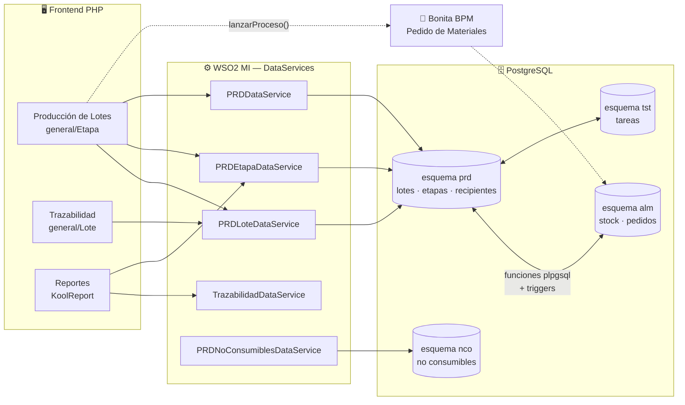

---

## 2. 👥 A qué tipo de clientes está dirigido

### Perfil funcional

PRD apunta a **PyMEs industriales con producción por lotes (batch) y necesidad de trazabilidad regulatoria o comercial**. Los rasgos que hacen encajar a un cliente:

| Rasgo | Por qué importa |
|---|---|
| 🔄 **Producción discontinua por lotes** | El modelo es batch-céntrico. Producción continua (flujo) no encaja: no hay unidad discreta que trazar. |
| 🧪 **Transformación física del material** | El valor está en encadenar padre→hijo. Si el material no se transforma ni se mezcla, alcanza con ALM solo. |
| 📜 **Obligación de trazabilidad** | Alimentos (SENASA), agro, farma, química, cosmética, minería. Un recall exige responder "¿dónde fue a parar el lote X?" en minutos. |
| 🏢 **Multi-establecimiento** | El modelo soporta varias plantas por empresa (`prd.establecimientos`). |
| 📦 **Fraccionamiento / envasado** | Etapa nativa para pasar de granel a unidades de venta. |

### Evidencia en el modelo

El vocabulario del esquema y los datos de desarrollo delatan el origen **agroindustrial**: etapas como `Finca`, `Preclasificado`, `Selección`, `Pelado`, `Pesado y Etiquetado`, `Fraccionamiento`, `FERMENTACIÓN`. Recipientes tipo `BIN`, `BOX` y `CONTENEDOR`. Movimientos de transporte con báscula (bruto / tara / neto), boleta y patente — típico de recepción de cosecha.

### Encaje con la estrategia v3 (servicios mineros San Juan)

> ⚠️ **Señalamiento para el PM.** PRD es el módulo **menos alineado** con el pivot v3 hacia proveedores de servicios mineros. Ese segmento consume Mantenimiento (MAN), Almacenes (ALM) y Tareas (TAR); la producción por lotes con trazabilidad de alimento no aplica a un taller de servicios.
>
> PRD sigue siendo relevante para: 🍇 agroindustria (vitivinicultura, olivo, frutas de Cuyo), 🧪 procesamiento químico y ♻️ tratamiento de residuos (`sema`/`RESI` reusa `PRDDataService`). Conviene tratarlo como **módulo de sostenimiento**, no de inversión, hasta que haya una decisión explícita.

---

## 3. 🔗 Cómo maneja la trazabilidad

### El concepto central: `batch_id`

Todo gira alrededor de **`prd.lotes.batch_id`** — un identificador numérico único, generado por secuencia, que representa **una porción concreta de material en un punto concreto del proceso**.

Es importante no confundirlo con `lote_id`:

| Campo | Tipo | Único | Significado |
|---|---|---|---|
| `batch_id` | `bigint` (PK, secuencia) | ✅ Sí | La instancia técnica. Un batch = un material + una etapa + un recipiente + un momento. |
| `lote_id` | `varchar` (nullable) | ❌ No | El código de lote **de negocio** que ve el usuario. Se **propaga sin cambios** al pasar de etapa. |

👉 Un mismo `lote_id` (ej. `"lote-19626"`) aparece en **muchos** `batch_id` — uno por cada etapa que atravesó. Eso permite buscar por código de lote y ver toda la cadena. Es también la razón por la que el buscador de trazabilidad ofrece las dos modalidades ("Código de lote" / "Batch ID"): buscar por `lote_id` puede devolver **varios** batches raíz.

### El grafo: `prd.lotes_hijos`

La trazabilidad se materializa en `prd.lotes_hijos`, que es una **tabla de aristas**:

```
batch_id         → el lote HIJO (el que se produjo)
batch_id_padre   → el lote PADRE (de donde salió el material); NULL = inicio de cadena
cantidad         → cuánto se produjo en el hijo
cantidad_padre   → cuánto se descontó del padre
```

⚠️ **Es un DAG, no un árbol.** Un mismo `batch_id` puede tener **varias filas** con distintos `batch_id_padre`: es el caso de una mezcla (varias materias primas → un producto). Ejemplo real de la base de desarrollo:

```
batch_id | batch_id_padre | cantidad | cantidad_padre
    1840 |           1694 |        3 |              0     ← dos padres
    1840 |           1323 |        3 |              2     ← para el mismo hijo
```

> 🐛 Esta característica es la causa raíz del bug de armado del árbol en el reporte de trazabilidad — ver [§14.B1](#b1--el-árbol-de-trazabilidad-descarta-ramas-en-lotes-con-múltiples-padres).

### Trazabilidad hacia atrás y hacia adelante

| Dirección | Pregunta que responde | Cómo se recorre |
|---|---|---|
| ⬅️ **Backward** (implementada) | "¿De qué materia prima salió este producto?" | Desde `batch_id`, subir por `batch_id_padre` recursivamente. |
| ➡️ **Forward** (⚠️ **no implementada** en UI) | "¿A qué productos fue a parar este lote de materia prima?" | Requiere bajar por `batch_id_padre = X`. El dato está en la tabla, pero **ninguna pantalla lo expone**. |

> 🐛 La ausencia de trazabilidad *forward* es una brecha funcional significativa: en un recall, la pregunta urgente es justamente "¿dónde fue a parar el lote contaminado?". Ver [§14.B2](#b2--no-existe-trazabilidad-hacia-adelante-forward).

### Qué se registra además del encadenamiento

| Dimensión | Dónde |
|---|---|
| 📍 **Ubicación física** | `lotes.reci_id` → `recipientes.depo_id` → `alm_depositos.esta_id` → `establecimientos` |
| ⚗️ **Materias primas consumidas** | `recursos_lotes` con `tipo = 'MATERIA_PRIMA'` |
| 📦 **Producto obtenido** | `recursos_lotes` con `tipo = 'PRODUCTO'` + `alm.alm_lotes` (stock) |
| 👷 **Quién** | `lotes.usuario_app`, `lotes_responsables` (usuario + turno), `recursos_lotes` con `tipo = 'HUMANO'` |
| ⏱️ **Cuándo** | `fec_planificado`, `fec_iniciado`, `fec_finalizado`, `fec_ult_modificacion` |
| 📝 **Formulario de calidad** | `lotes.info_id` → instancia de formulario en `frm` |
| 🔧 **No consumibles** | `nco.no_consumibles_lotes` (herramientas/moldes usados) |
| 🧾 **Auditoría técnica** | `lotes_audit_log` (paso a paso de la función de creación) |

### Diagrama del grafo (ejemplo real, base de desarrollo)

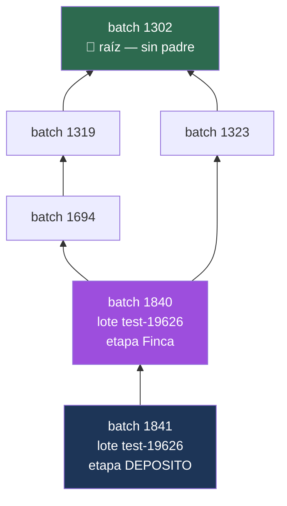

La flecha apunta **del hijo al padre** (sentido de la consulta recursiva). El batch 1840 converge dos ramas — ahí es donde el armado del árbol en PHP pierde información.

---

## 4. 🧩 ¿Qué es una etapa?

### Definición funcional

Una **etapa** (`prd.etapas`) es **un paso definido del proceso productivo**: una transformación con nombre, un orden dentro del proceso, y un contrato de qué artículos entran y qué artículos salen.

Es una **definición** (plantilla, dato maestro), no una ejecución. La ejecución de una etapa **es un lote**.

> 🔑 **Regla mental clave para leer el código:** `etapa` = plantilla · `lote` = instancia. El controlador se llama `Etapa.php` pero casi todas sus acciones (`guardar`, `editar`, `Finalizar`) operan sobre **lotes**. Es una fuente frecuente de confusión al debuggear.

### Estructura

| Campo | Descripción |
|---|---|
| `etap_id` | PK |
| `nombre` | Ej. `Selección`, `Pelado`, `Fermentación` |
| `proc_id` | Proceso productivo al que pertenece (`prd.procesos`) |
| `orden` | Secuencia dentro del proceso ⚠️ **no se valida**: hay valores como `123123`, `5555` |
| `tiet_id` | Tipo: `prd_tipos_etapaSimple` \| `prd_tipos_etapaFraccionamiento` |
| `nom_recipiente` | Etiqueta del recipiente que muestra la UI (ej. "Tanque", "Bin") |
| `form_id` | Formulario de calidad (`frm.formularios`) que se completa al ejecutar |
| `empr_id` | Empresa (multi-tenant) |
| `eliminado` | Baja lógica (`smallint`, 0/1) |

### Los tres conjuntos de artículos

Cada etapa declara tres listas de artículos, en tres tablas idénticas en forma:

| Tabla | Rol | Significado |
|---|---|---|
| `prd.etapas_materiales` | 🟡 **ENT** (entrada) | Qué materias primas se pueden pedir a almacén para esta etapa |
| `prd.etapas_productos` | 🟢 **PRO** (producto) | Qué se produce en esta etapa |
| `prd.etapas_salidas` | 🔵 **SAL** (salida) | Qué puede salir hacia la etapa siguiente |

La vista `prd.etapas_articulos_vw` unifica las tres con un discriminador `'ENT'` / `'PRO'` / `'SAL'`.

### 🔢 Etapas reservadas del sistema

Dos etapas tienen IDs fijos y semántica especial:

| `etap_id` | Nombre | Rol |
|---|---|---|
| **1000** | `TRANSPORTE` | Pseudo-etapa: el material está arriba de un camión |
| **2000** | `DEPOSITO` | Pseudo-etapa: el material terminó el proceso y está almacenado |

En PHP: `define('ETAPA_DEPOSITO', 2000)` (`config/constants.php:146`).

Por eso varias consultas usan el filtro `etap_id < 1000` para quedarse sólo con etapas productivas "reales".

> ⚠️ **Trampa multi-tenant.** En la base de desarrollo, `DEPOSITO` (2000) y `TRANSPORTE` (1000) existen **una sola vez**, con `empr_id = 1` y `proc_id = 1`. Es decir: los lotes de **todas** las empresas apuntan a etapas que pertenecen formalmente a la empresa 1. Funciona hoy, pero es una inconsistencia del modelo multi-tenant y rompe consultas que resuelven la etapa por nombre — ver [§14.B4](#b4--resolución-de-etapa-por-nombre-sin-filtro-de-empresa).

### Tipos de etapa

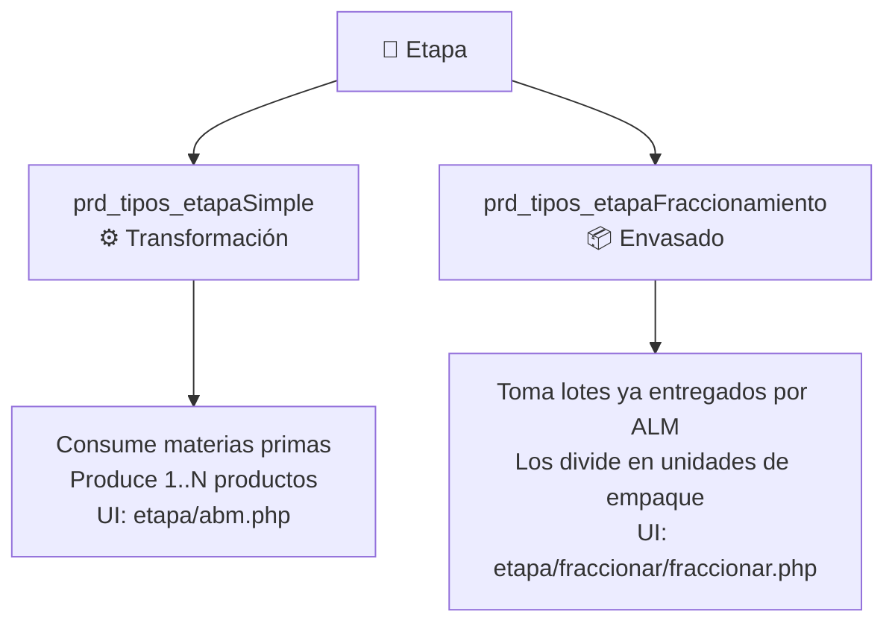

El tipo determina qué pantalla abre el listado (`Etapa::index()` reescribe el link a `Etapa/fraccionar` o `Etapa/nuevo` según `tiet_id`).

### ABM de etapas

`Etapa::abmEtapa()` → vista `etapa/abm_etapa/view_.php`. Operaciones vía `PRDEtapaDataService`:
`/etapasProductivas/insertar`, `/actualizar`, `/borrar`, `/validar/etapa/{etapa}/proceso/{proc_id}/empresa/{empr_id}` (unicidad de nombre), y `/articuloEntrada`, `/articuloProducto`, `/articuloSalida` para las tres listas.

Antes de borrar, `validarLotesxEstado()` verifica que no haya lotes asociados. ⚠️ Esa validación tiene un bug de lógica — ver [§14.B7](#b7--validarlotesxestado-nunca-bloquea-el-borrado).

---

## 5. 📦 ¿Qué es un lote?

### Definición funcional

Un **lote** (`prd.lotes`, también llamado *batch*) es **la ejecución concreta de una etapa sobre una porción concreta de material**.

Responde: *"El día D, el operario U procesó la cantidad C del material M en la etapa E, y el resultado quedó en el recipiente R"*.

Es la **unidad atómica de trazabilidad**. Todo lo demás (stock, consumos, responsables, formularios, no consumibles) cuelga del `batch_id`.

### Ciclo de vida

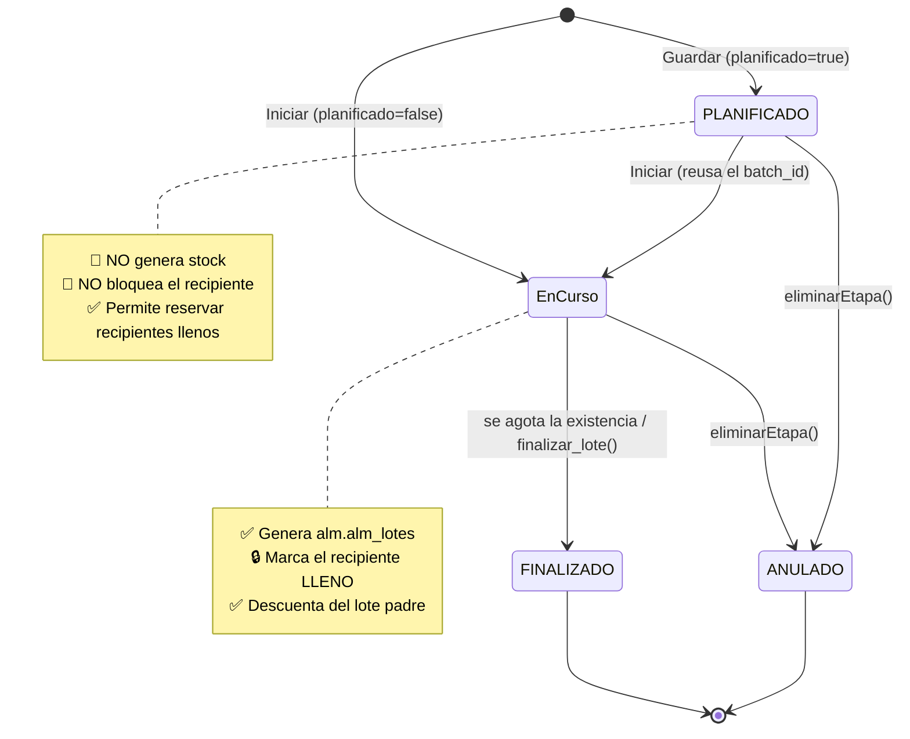

Distribución real en la base de desarrollo (625 lotes):

| Estado | Cantidad | Nota |
|---|---|---|
| `En Curso` | 441 | ⚠️ Con espacio y mayúscula/minúscula mixta — literal exacto en el código |
| `ANULADO` | 114 | |
| `FINALIZADO` | 67 | |
| `PLANIFICADO` | 3 | |

> 🐛 **Trampa para testers y devs:** el estado activo es literalmente **`'En Curso'`** (con espacio, "E" y "C" mayúsculas). Los otros tres son MAYÚSCULAS sin espacios. No hay constraint que lo garantice. Cualquier comparación debe usar el literal exacto. Ver [§14.C1](#c1--estados-de-lote-sin-constraint-y-con-convención-inconsistente).

### Campos relevantes

| Campo | Notas |
|---|---|
| `batch_id` | PK, `bigint`, secuencia |
| `lote_id` | Código de negocio, `varchar` **nullable**, **no único** |
| `estado` | Ver arriba |
| `etap_id` | Etapa que se está ejecutando (FK `ON DELETE RESTRICT`) |
| `reci_id` | Recipiente donde quedó el material |
| `arti_id` | ⚠️ Presente pero **poco usado**: el producto real se resuelve vía `alm.alm_lotes` o `recursos_lotes` |
| `num_orden_prod` | Orden de producción (texto libre) |
| `info_id` | Instancia de formulario de calidad |
| `fec_planificado` / `fec_iniciado` / `fec_finalizado` | Hitos |
| `fec_ult_modificacion` | Mantenido por trigger `core.ult_modificacion_trg()` |
| `eliminado` | `smallint`. ⚠️ **Coexiste** con `estado = 'ANULADO'` — dos mecanismos de baja |
| `empr_id` | Multi-tenant, **nullable** ⚠️ |

### Creación de un lote — la función `prd.crear_lote_noco`

Es **el corazón del módulo**. Versión vigente: `prd.crear_lote_noco` (19 parámetros), invocada desde `PRDLoteDataService` vía `POST /lote/noConsumibles/list`.

Linaje de versiones (todas conviven en la base):

| Función | Estado |
|---|---|
| `prd.crear_lote` | 🕰️ Legacy — la usa internamente `cambiar_recipiente` |
| `prd.crear_lote_v2` | Intermedia — invocada por `POST /lote` y `POST /lote/list` |
| `prd.crear_lote_v2_old` | 🗑️ Muerta |
| `prd.crear_lote_noco_old` | 🗑️ Muerta |
| **`prd.crear_lote_noco`** | ✅ **Vigente** — agrega no consumibles y `fec_iniciado` |

#### Los 6 bloques

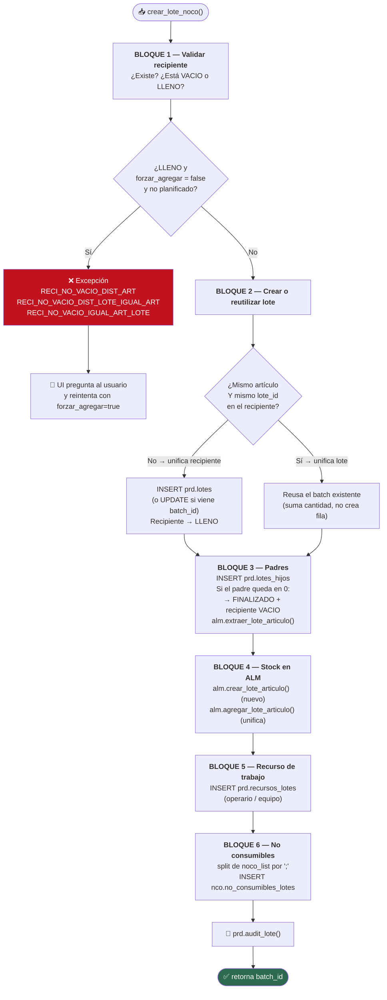

#### Manejo de errores

Toda la función está envuelta en un `exception when others` que re-lanza el error con el formato:

```
>>TOOLSERROR:<mensaje>:<paso><<
```

`v_step` va tomando valores `'1'`..`'14'` a medida que avanza, así que **el paso reportado en el error indica exactamente dónde falló**. Es la herramienta principal de diagnóstico.

El PHP lo desarma en `Etapas::SetNuevoBatch()` (`models/general/Etapas.php:152`): parte el mensaje por `-`, mapea el código a un texto vía `$this->rsp_lote[...]`, y devuelve también los pares `clave=valor` del contexto (`reci_id=`, `arti_id=`, `lote_id=`).

#### 🔀 La lógica de unificación (lo más sutil del módulo)

Cuando el recipiente destino ya está `LLENO`, la función compara el contenido con lo que se quiere ingresar:

| Caso | Condición | Código de error | Con `forzar_agregar = true` |
|---|---|---|---|
| **a** | Artículo distinto | `RECI_NO_VACIO_DIST_ART` | Crea batch nuevo, **mismo recipiente** (unifica recipiente) |
| **b** | Mismo artículo, lote distinto | `RECI_NO_VACIO_DIST_LOTE_IGUAL_ART` | Crea batch nuevo, mismo recipiente |
| **c** | Mismo artículo y mismo lote | `RECI_NO_VACIO_IGUAL_ART_LOTE` | **NO crea batch**: suma la cantidad al batch existente (unifica lote) |

👉 El caso **c** es el que confunde: la UI parece "crear un lote" pero no aparece ninguna fila nueva en `prd.lotes`. Es el comportamiento esperado.

---

## 6. 🪣 ¿Qué es un recipiente?

### Definición funcional

Un **recipiente** (`prd.recipientes`) es un **contenedor físico identificable** donde reside material: un tanque, un bin, una caja, un contenedor de transporte.

Cumple tres funciones:
1. 📍 **Ubicación** — vía `depo_id` ancla el material a un depósito y, por él, a un establecimiento.
2. 🔒 **Control de ocupación** — el estado `VACIO`/`LLENO` evita mezclas accidentales.
3. 🚚 **Vehículo de movimiento** — mover material = crear un lote nuevo en otro recipiente.

### Estructura

| Campo | Valores / notas |
|---|---|
| `reci_id` | PK |
| `nombre` | Identificador visible |
| `tipo` | `PRODUCTIVO` · `DEPOSITO` · `TRANSPORTE` · `DEPOSITO/PRODUCTIVO` (texto libre ⚠️ sin FK) |
| `estado` | `VACIO` \| `LLENO` — ✅ con CHECK constraint |
| `care_id` | Categoría → `core.tablas`: `cate_recipienteBOX` · `cate_recipienteBIN` · `cate_recipienteCONTENEDOR` |
| `depo_id` | Depósito ALM (**NOT NULL**) — el puente PRD↔ALM |
| `motr_id` | Movimiento de transporte, si es un recipiente de camión |
| `row` / `col` | Coordenadas para el mapa visual del depósito |
| `eliminado` | Baja lógica |

Distribución real (488 recipientes en desarrollo):

| tipo | estado | categoría | cant |
|---|---|---|---|
| TRANSPORTE | VACIO | BOX | 172 |
| PRODUCTIVO | LLENO | BOX | 79 |
| PRODUCTIVO | VACIO | BOX | 71 |
| TRANSPORTE | VACIO | CONTENEDOR | 61 |
| DEPOSITO | LLENO | BOX | 58 |
| DEPOSITO | VACIO | BOX | 20 |
| TRANSPORTE | LLENO | CONTENEDOR | 12 |
| … | | | |

### 🔁 Estado del recipiente: quién lo modifica

Este es un punto crítico y **la fuente de bugs más probable** del módulo: **cinco lugares distintos** escriben `recipientes.estado`.

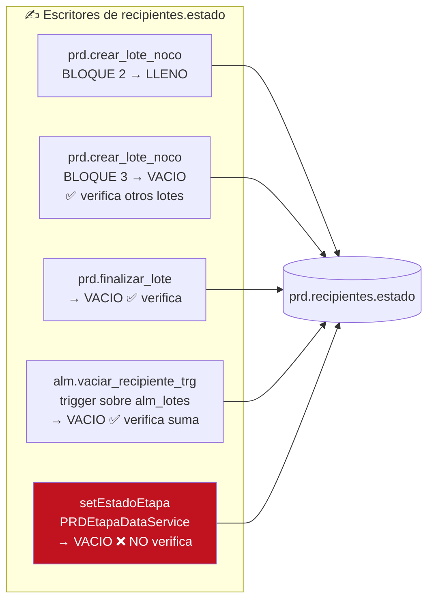

Los cuatro primeros verifican que no queden otros lotes activos antes de vaciar. **`setEstadoEtapa` no.** Ver [§14.A1](#a1--anular-un-lote-vacía-el-recipiente-aunque-tenga-otros-lotes-activos).

⚠️ Un recipiente puede contener **varios lotes activos** simultáneamente (por unificación). En la base de desarrollo el recipiente 1456 tiene **24 lotes `En Curso`**. Ese es el escenario que rompe.

### 🚚 Recipientes de transporte

Cuando se da de alta un contenedor logístico (`log.contenedores`), el trigger `prd.crear_prd_recipiente()` crea automáticamente un recipiente espejo con `tipo = 'TRANSPORTE'` y `care_id = 'cate_recipienteCONTENEDOR'`.

> 🐛 Ese trigger hardcodea **`depo_id = 5000`**. Ver [§14.C3](#c3--depósito-hardcodeado-en-crear_prd_recipiente).

### Cambio de recipiente

`prd.cambiar_recipiente(batch_origen, reci_destino, etap_destino, empr, usuario, forzar, cantidad)`:

1. Lee `lote_id`, `num_orden_prod`, `arti_id`, `prov_id`, `fec_vencimiento` del batch origen.
2. Si `cantidad = 0` → mueve **todo**; si no, valida contra la existencia (`CANT_MAYOR_EXISTENCIA`).
3. Llama a **`prd.crear_lote`** (la versión legacy) con el batch origen como padre.

👉 Mover material **no actualiza una fila: crea un lote nuevo**. El movimiento queda registrado como una arista más en el grafo de trazabilidad. Es coherente con el diseño, pero infla la cantidad de batches.

---

## 7. 📦 ¿Qué es un fraccionamiento?

### Definición funcional

**Fraccionar** es **dividir un lote a granel en unidades de empaque**: pasar de un bin de 1.000 kg a 500 bolsas de 2 kg, manteniendo la trazabilidad de cada bolsa hacia el lote de origen.

Se implementa como un **tipo especial de etapa**: `tiet_id = 'prd_tipos_etapaFraccionamiento'`.

### Diferencias contra una etapa simple

| Aspecto | ⚙️ Etapa Simple | 📦 Etapa Fraccionamiento |
|---|---|---|
| Origen del material | Materias primas pedidas a ALM | Lotes **ya entregados** por ALM (`getLoteAFraccionar`) |
| Empaque | No aplica | ✅ Central — `prd.empaque` |
| Vista | `etapa/abm.php` | `etapa/fraccionar/fraccionar.php` |
| Controlador | `Etapa::nuevo()` / `guardar()` | `Etapa::fraccionar()` / `guardarFraccionar()` |
| Cierre | `Etapa::Finalizar()` | `Etapa::finalizaFraccionar()` |
| `arti_id` del batch | El producto | **`0`** — el batch de fraccionamiento no tiene producto propio |
| Etapa destino de los hijos | La que elija el usuario | Siempre `ETAPA_DEPOSITO` (2000) |

### `prd.empaque` — la definición del envase

| Campo | Significado |
|---|---|
| `empa_id` | PK |
| `nombre` | Ej. "Bolsa 2kg" |
| `capacidad` + `unidad_medida` | Cuánto entra |
| `tara` | Peso del envase vacío |
| `arti_id` | Artículo de almacén que **es** el envase (para descontar su stock) |
| `receta` (→ `prd.formulas`) | Fórmula del empaque (envase + etiqueta + tapa…) |

### Flujo

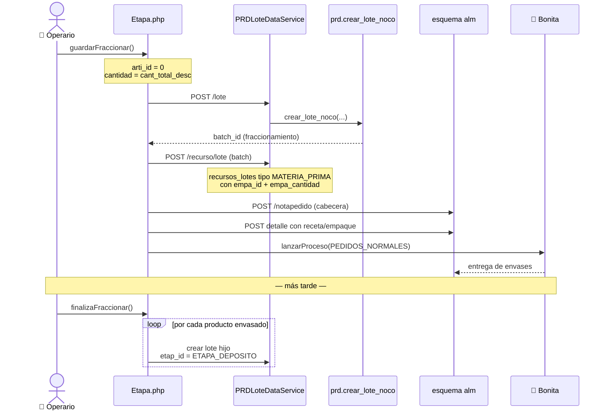

Los productos fraccionados quedan como **lotes hijos** del batch de fraccionamiento, en etapa `DEPOSITO`. Ahí es donde nace la trazabilidad unitaria del envase.

### ⚠️ El fraccionamiento tiene código muerto

Existen dos artefactos que **no funcionan**:

- `PRDDataService.setFraccionamiento` hace `INSERT INTO prd.fraccionamientos(...)` — **esa tabla no existe** en la base.
- El modelo PHP `Etapas::setFraccionamTemp()` está anotado `//TODO: BORAR DEPRECADA`.

El flujo real **no** pasa por ahí: usa `recursos_lotes` con `empa_id`. Ver [§14.A2](#a2--prdfraccionamientos-y-prdingresar_deposito-no-existen).

---

## 8. 🔄 Relación con el módulo ALM (Almacenes)

La integración PRD↔ALM es **la más profunda del sistema** y opera en cuatro niveles simultáneos.

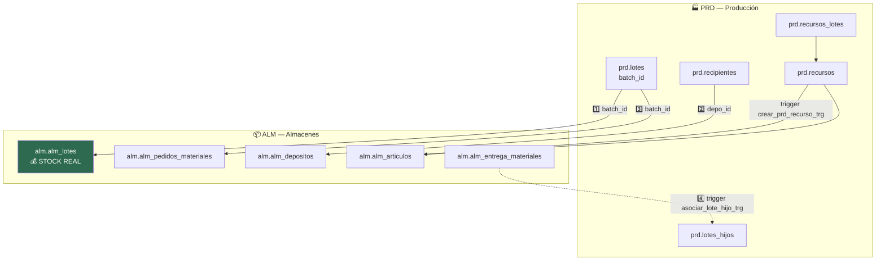

### 1️⃣ Stock — PRD orquesta, ALM contabiliza

**PRD no tiene columna de stock.** La existencia vive en `alm.alm_lotes.cantidad`, vinculada por `batch_id`.

`prd.crear_lote_noco` llama a cuatro funciones de ALM:

| Función ALM | Cuándo | Qué hace |
|---|---|---|
| `alm.crear_lote_articulo(prov, arti, depo, codigo, cant, fec_ven, empr, batch)` | Bloque 4, recipiente vacío o unificando recipiente | Crea la fila de stock |
| `alm.agregar_lote_articulo(batch, cant)` | Bloque 4, unificando lote (caso c) | Suma a la existencia |
| `alm.extraer_lote_articulo(batch, cant)` | Bloque 3 | Descuenta del lote padre |
| `alm.obtener_existencia_batch(batch)` | Bloques 3 y `finalizar_lote` | Consulta la existencia |

👉 **Implicancia para debugging:** si el stock de un lote de producción está mal, el problema puede estar en PRD (cantidad enviada) **o** en ALM (función de stock). El `lotes_audit_log` registra la cantidad que PRD envió.

### 2️⃣ Ubicación física

`prd.recipientes.depo_id` → `alm.alm_depositos.depo_id` (**NOT NULL**: todo recipiente vive en un depósito de almacenes) → `alm_depositos.esta_id` → `prd.establecimientos`.

🔁 La FK cruza en ambos sentidos: `alm.alm_depositos.esta_id` referencia a `prd.establecimientos.esta_id`. **Hay dependencia circular entre esquemas** — relevante si alguna vez se separan las bases.

### 3️⃣ Pedido de materiales (vía BPM)

Al iniciar una etapa, PRD genera un pedido de materiales a almacenes y lanza el proceso Bonita:

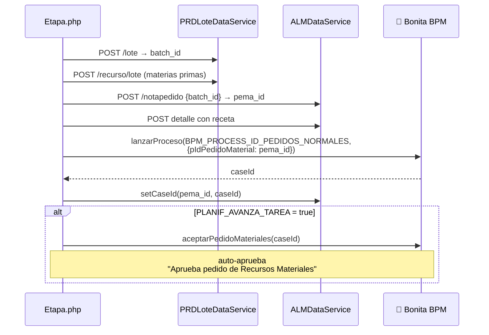

El vínculo persiste en `alm.alm_pedidos_materiales.batch_id → prd.lotes.batch_id`.

⚠️ `PLANIF_AVANZA_TAREA` está en **`true`** (`config/constants.php:100`), o sea que el paso de aprobación humana se saltea automáticamente. En el código está comentado como *"Pregunta Magica"*.

### 4️⃣ Entrega de materiales → cierra el grafo de trazabilidad

Este es el mecanismo más sutil de todo el módulo. El trigger **`prd.asociar_lote_hijo_trg()`** se dispara al insertar en `alm.alm_deta_entrega_materiales` y **completa el eslabón padre** del grafo:

1. Del `enma_id` de la entrega, resuelve el `batch_id` del pedido → ese es el **hijo**.
2. Del `lote_id` entregado, busca en `alm.alm_lotes` el `batch_id` → ese es el **padre**.
3. Si el `batch_id` viene `NULL` → el lote entró por fuera de producción (compra) → `RETURN NEW` sin hacer nada.
4. Si ya existe una fila en `lotes_hijos` con `batch_id_padre IS NULL` → la **completa** (`UPDATE`).
5. Si no → **inserta una arista nueva** (caso de múltiples materias primas → el DAG).

👉 **Por eso un lote puede tener varios padres.** Cada material entregado por almacén agrega una arista.

### 5️⃣ Recursos: espejo automático de artículos y equipos

`prd.recursos` es un catálogo unificado alimentado por triggers:

| Trigger | Origen | Crea |
|---|---|---|
| `prd.crear_prd_recurso_trg()` | `alm.alm_articulos` (INSERT) | recurso `tipo = 'MATERIAL'` |
| `prd.crear_prd_recurso_trg()` | `core.equipos` (INSERT) | recurso `tipo = 'TRABAJO'` |
| `prd.eliminar_prd_recurso_trg()` | UPDATE de `eliminado` | baja/alta lógica en cascada |

⚠️ El trigger distingue el origen **por excepción** (`exception when others` → prueba con `equi_id`), no por lógica explícita. Frágil, y el comentario del código confirma que ya falló dos veces (`v2`, `v3`).

---

## 9. ✅ Relación con el módulo TAR (Tareas)

La relación PRD↔TAR es **considerablemente más débil** que la de ALM y **está parcialmente implementada**.

### Puntos de contacto

| # | Vínculo | Estado |
|---|---|---|
| 1 | `prd.lotes_tareas_planificadas` (`tapl_id` ↔ `batch_id`) | ⚠️ **0 filas** en desarrollo — tabla vacía |
| 2 | `tst.tareas_planificadas.rece_id` → `prd.formulas.form_id` | ✅ Activo — una tarea puede llevar receta |
| 3 | `tst.rel_tareas_pedidos` (`tapl_id` ↔ `pema_id`) | ✅ Vía ALM, no directo |
| 4 | Consulta `getAsignaciones` (recursos de lote + recursos de tarea) | 🐛 Rota (ver abajo) |
| 5 | `Etapa::nuevo()` → `Tareas->eliminarTareasSinOrigen(empresa())` | ✅ Limpieza de huérfanas |
| 6 | `core.tablas['valida_tareas_produccion_lotes']` | ⚙️ Flag por empresa: exige tareas asignadas antes de iniciar un lote |
| 7 | `prd.recursos` compartido con `tst.recursos_tareas` | ✅ Mismo catálogo de recursos |
| 8 | `controllers/tareas/Tarea.php` | ⚠️ Casi todo comentado; `listarRecursosTrabajo()` devuelve `""` |

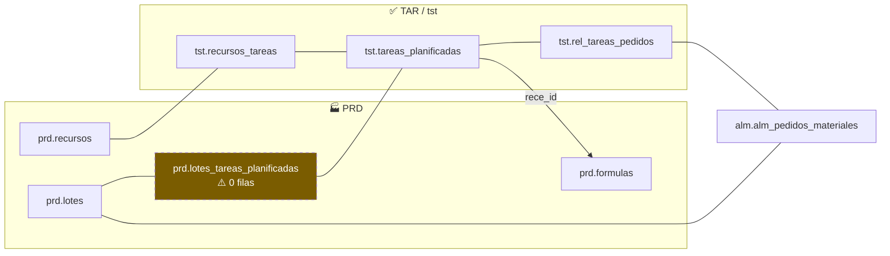

### Lectura funcional

La intención de diseño era: **un lote de producción puede tener tareas planificadas asociadas**, y los recursos consumidos por esas tareas (mano de obra, equipos) se imputan al lote — de ahí el reporte "Asignación de Recursos", que hace `UNION ALL` entre recursos directos del lote y recursos vía tareas.

**Esa integración quedó a medio camino.** La tabla puente está vacía, el controlador de tareas del módulo está mayormente comentado, y la consulta que la explota está rota.

> 📌 **Para el PM:** si el reporte "Asignación Recursos" es funcionalmente necesario, esto requiere retomar la integración, no sólo arreglar el bug. Es una decisión de producto, no una corrección técnica.

---

## 10. 📊 Cómo funciona el reporte de trazabilidad

### Acceso

Menú **Producción → Trazabilidad** → `traz-prod-trazasoft/general/Lote/informeTrazabilidad` → vista `views/produccion/lotes/trazabilidad.php`.

### Entrada

Dos modalidades, por radio button:

| Modo | Valor | Comportamiento |
|---|---|---|
| 🏷️ **Código de lote** (default) | `lote_id` | `getBatchIDLote` puede devolver **N batches** → se consulta la trazabilidad de cada uno |
| 🔢 **Batch ID** | `batch_id` | Un solo batch. Valida en JS que sea numérico |

### La consulta recursiva

`PRDLoteDataService` → `GET /lote/{batch_id}/trazabilidad` → query `trazabilidadBatch`:

```sql
WITH RECURSIVE cte AS (
    -- ancla: el batch consultado
    SELECT lh.batch_id, lh.batch_id_padre, 1 AS level,
           cast(lh.batch_id as varchar) as path,
           l.lote_id as path_lote_id
    FROM prd.lotes_hijos lh
    JOIN prd.lotes l ON l.batch_id = lh.batch_id
    WHERE lh.batch_id = cast(:batch_id as int8)
  UNION ALL
    -- recursión: sube al padre
    SELECT e.batch_id, e.batch_id_padre, cte.level + 1,
           cte.path || '-' || e.batch_id,
           cte.path_lote_id || ' | ' || l.lote_id
    FROM prd.lotes_hijos e
    JOIN cte ON e.batch_id = cte.batch_id_padre
    JOIN prd.lotes l ON l.batch_id = e.batch_id
)
SELECT c.batch_id, c.batch_id_padre, c.level, c.path, c.path_lote_id,
       l.lote_id, l.estado, l.num_orden_prod, l.fec_alta,
       r.tipo, r.nombre,          -- recipiente
       e.nombre,                  -- etapa
       a.cantidad, arti.descripcion, arti.barcode
FROM cte c
JOIN prd.lotes l      ON l.batch_id = c.batch_id
JOIN prd.etapas e     ON e.etap_id = l.etap_id
JOIN prd.recipientes r ON r.reci_id = l.reci_id
LEFT JOIN alm.alm_lotes a    ON a.batch_id = c.batch_id
LEFT JOIN alm.alm_articulos arti ON arti.arti_id = a.arti_id
WHERE l.eliminado = 0
ORDER BY level DESC
```

Puntos a tener presentes:

- ⬅️ Recorre **sólo hacia atrás** (hijo → padre).
- `ORDER BY level DESC` deja la **raíz (materia prima) primero** y el batch consultado último.
- `path` y `path_lote_id` acumulan el camino recorrido — se muestran en el detalle expandible como "Camino".
- Los `JOIN` a `etapas` y `recipientes` son **INNER**: si `reci_id` fuera `NULL`, el nodo desaparece del reporte.
- ❌ **No filtra por `empr_id`** — ver [§14.A3](#a3--la-consulta-de-trazabilidad-no-filtra-por-empresa).

### Procesamiento en PHP

`Lote::trazabilidadBatch()` (`controllers/general/Lote.php:82`) hace dos cosas con el resultado:

1. **Deduplicación** para la tabla (`$visto[$o->batch_id]`) — evita repetir batches cuando hay varias ramas.
2. **Armado del árbol** para el gráfico, envuelto con `nodo()` de `application/helpers/arbol_helper.php`.

El armado es:

```php
foreach ($data as $key => $o) {
    if ($o->batch_id_padre) {
        if (isset($arbol[$o->batch_id])) {
            $arbol[$o->batch_id] = $arbol[$o->batch_id];   // no-op
        } else {
            $o->hijos = $arbol;                            // ⚠️ toma TODO lo acumulado
            $arbol = array("$o->batch_id" => $o);          // ⚠️ y lo REEMPLAZA
        }
    } else {
        $arbol[$o->batch_id] = $o;
    }
}
```

⚠️ Marcado en el código con `#NO TOCAR PLIS`. La lógica asume una **cadena lineal**: en cada iteración descarta el acumulador anterior. Con un DAG real (batch con dos padres) **se pierden ramas**. Ver [§14.B1](#b1--el-árbol-de-trazabilidad-descarta-ramas-en-lotes-con-múltiples-padres).

### Salida

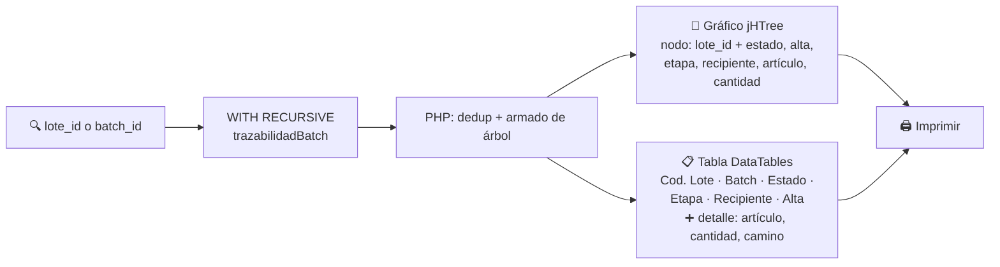

### Otros reportes del módulo

| Reporte | Ruta | Fuente | Filtra `empr_id` |
|---|---|---|---|
| 📈 Producción | `Reportes/produccion` | `PRDEtapaDataService.getProduccion` | ✅ Sí |
| 👷 Prod. Responsable | `Reportes/prodResponsable` | `TrazabilidadDataService.getProduccionPorRecurso` | ❌ **No** |
| 📥 Ingresos | `Reportes/ingresos` | `Opcionesfiltros::getIngresos` | ✅ |
| 📤 Salidas | `Reportes/salidas` | `Opcionesfiltros::getSalidas` | ✅ |
| 🧰 Asignación Recursos | `Reportes/asignacionDeRecursos` | `PRDLoteDataService.getAsignaciones` | 🐛 Roto |
| 🧾 Remitos | `Reportes/historicoRemitos` | `Opcionesfiltros::getHistoricoRemitos` | ✅ |
| 🧑‍🏭 Prod. de Lotes \| Operario | `general/Reporte/tareasOperario` | `Etapas::listarResponsables` | ✅ |

Todos usan **KoolReport** (`libraries/koolreport`), con clases en `reports/<nombre>/`.

---

## 11. 🗂️ Diccionario de tablas del esquema `prd`

19 tablas + 2 vistas. Volúmenes de la base de desarrollo al 2026-08-08.

### 11.1 📐 Modelo de datos

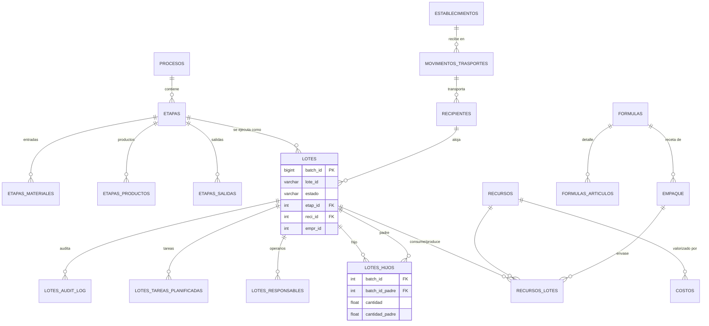

### 11.2 🧱 Núcleo del proceso

#### `prd.procesos` — 📋 Proceso productivo · 181 filas
Agrupador de etapas. Es la "línea de producción" o "receta macro".

| Campo | Nota |
|---|---|
| `proc_id` | PK ⚠️ usa la secuencia `productos_prod_id_seq` (nombre heredado de un rename) |
| `nombre` | UNIQUE por `(nombre, empr_id)` |
| `empr_id` | Multi-tenant |

🔁 El trigger `prd.crear_proceso_productivo_trg()` crea automáticamente un proceso `"Proceso Default <empresa>"` al dar de alta una empresa en `core.empresas`.

---

#### `prd.etapas` — 🧩 Etapa productiva · 47 filas
Definición de un paso del proceso. Ver [§4](#4--qué-es-una-etapa).

| Campo | Nota |
|---|---|
| `etap_id` | PK. **1000 = TRANSPORTE, 2000 = DEPOSITO** (reservadas) |
| `nombre`, `orden` | ⚠️ `orden` sin validación de unicidad ni rango |
| `proc_id`, `empr_id`, `form_id` | FKs |
| `tiet_id` | `prd_tipos_etapaSimple` \| `prd_tipos_etapaFraccionamiento` |
| `nom_recipiente` | Etiqueta de UI |
| `eliminado` | `smallint` |

⚠️ Tiene **FKs duplicadas**: `etapas_fk`/`etapas_form_id_fk` y `etapas_proc_id_fk`/`etapas_procesos_fk` apuntan al mismo destino.

---

#### `prd.etapas_materiales` · `prd.etapas_productos` · `prd.etapas_salidas` — 🟡🟢🔵
Tres tablas de estructura idéntica (`etap_id`, `arti_id`, UNIQUE en el par).

| Tabla | Rol |
|---|---|
| `etapas_materiales` | Artículos que **entran** (materias primas pedibles) |
| `etapas_productos` | Artículos que se **producen** |
| `etapas_salidas` | Artículos que **salen** hacia la etapa siguiente |

Se consultan unificadas por `prd.etapas_articulos_vw`.

---

### 11.3 📦 Ejecución

#### `prd.lotes` — 📦 Lote / batch · 625 filas
**La tabla central del módulo.** Ver [§5](#5--qué-es-un-lote).

Trigger: `lotes_ult_modificacion_trg` (BEFORE UPDATE) → mantiene `fec_ult_modificacion`.

Referenciada por 10 tablas de 5 esquemas (`alm`, `log`, `nco`, `prd`, y vía ellas `tst`).

---

#### `prd.lotes_hijos` — 🔗 Arista de trazabilidad · 727 filas
La tabla que **materializa el grafo**. Ver [§3](#3--cómo-maneja-la-trazabilidad).

| Campo | Nota |
|---|---|
| `batch_id` | Hijo. ⚠️ **`integer`**, mientras `lotes.batch_id` es `bigint` |
| `batch_id_padre` | Padre. `NULL` = raíz |
| `cantidad` | Producida en el hijo |
| `cantidad_padre` | Descontada del padre |
| `empr_id`, `eliminado` | |

⚠️ **Sin PK.** Sólo dos índices btree. Permite duplicados exactos — y de hecho hay filas repetidas en desarrollo (batch 1838 → 1836 aparece dos veces).

🔁 Trigger `synch_int_ai` (AFTER INSERT) → `int.synch_lotes_hijos_trg()`: encola un JSON de movimiento de stock en `int.jlmi_synch_queue` para sistemas externos (integración tipo Tango). Sólo actúa si el depósito y el artículo tienen `inte_id` cargado.

---

#### `prd.recursos_lotes` — ⚗️ Consumo y producción por lote · 551 filas
Qué se consumió y qué se produjo en cada lote.

| Campo | Nota |
|---|---|
| `batch_id`, `recu_id` | FKs (`ON DELETE RESTRICT`) |
| `cantidad` | |
| `tipo` | CHECK: `MATERIA_PRIMA` (428) · `HUMANO` (99) · `PRODUCTO` (24) · `EQUIPO` (0) · `CONSUMO` (0) |
| `empa_id`, `empa_cantidad` | Empaque (fraccionamiento) |

⚠️ **Sin PK.** `Replica Identity: FULL`.

---

#### `prd.lotes_responsables` — 👷 Operarios y turno · 5 filas
`batch_id` + `user_id` (`seg.users`) + `turn_id` (`core.tablas`). Sin PK.

---

#### `prd.lotes_tareas_planificadas` — ✅ Puente a TAR · **0 filas**
`(tapl_id, batch_id)` PK. Ver [§9](#9--relación-con-el-módulo-tar-tareas). Integración incompleta.

---

#### `prd.lotes_audit_log` — 📝 Auditoría técnica · 299 filas
Escrita por el procedure `prd.audit_lote(batch_id, mensaje, paso)` al final de `crear_lote_noco`.

| Campo | Contenido |
|---|---|
| `batch_id` | ⚠️ **Sin FK** — sobrevive al borrado del lote (intencional) |
| `mensaje` | Volcado de todos los parámetros de la creación |
| `paso` | Valor de `v_step` al momento de auditar |
| `fec_alta`, `usuario` | |

> 🔎 **Primera parada al diagnosticar un problema de creación de lotes.** Contiene los parámetros exactos con los que se llamó a la función.

---

### 11.4 🪣 Recursos físicos

#### `prd.recipientes` — 🪣 Contenedor físico · 488 filas
Ver [§6](#6--qué-es-un-recipiente). CHECK en `estado` (`VACIO`/`LLENO`). `depo_id` NOT NULL.

⚠️ `motr_id` es `integer` pero `movimientos_trasportes.motr_id` es `bigint`.

---

#### `prd.recursos` — 🔧 Catálogo de recursos · 1.914 filas
Espejo unificado de artículos y equipos, mantenido por triggers.

| Campo | Nota |
|---|---|
| `tipo` | CHECK: `MATERIAL` \| `TRABAJO` |
| `arti_id` | → `alm.alm_articulos` (si `MATERIAL`) |
| `equi_id` | → `core.equipos` (si `TRABAJO`) |
| `cant_capacidad`, `umed_capacidad` | Capacidad |
| `cant_tiempo_capacidad`, `umed_iempo_capacidad` | ⚠️ **typo en el nombre de columna** (falta la `t`) |

⚠️ `recursos_un UNIQUE (arti_id)` — **sólo sobre `arti_id`**. `equi_id` no tiene unicidad, así que se pueden duplicar recursos de tipo TRABAJO.

---

#### `prd.costos` — 💰 Costo de recurso · **0 filas**
PK `(fec_vigencia, recu_id)`, `valor` tipo `money`. Vacía — el costeo **no está en uso**. Existe además `core.costos_recursos` que también referencia `prd.recursos`: 🔀 **dos tablas de costos coexisten**.

---

#### `prd.establecimientos` — 🏢 Planta / sitio · 87 filas
Ubicación física con geolocalización (`lat`, `lng`) y domicilio. Referenciada por `alm.alm_depositos`, `pan.panol` y `prd.movimientos_trasportes`.

---

### 11.5 🧪 Fórmulas y empaques

#### `prd.formulas` — 🧪 Receta · 53 filas
`descripcion`, `cantidad`, `unme_id` (unidad), `aplicacion`, `empr_id`.
Referenciada por `prd.empaque.receta`, `alm.alm_deta_pedidos_materiales.receta` y `tst.tareas_planificadas.rece_id`.

⚠️ `form_id` de `prd.formulas` **colisiona conceptualmente** con `form_id` de `frm.formularios` (formularios de calidad), que es lo que usa `prd.etapas.form_id`. **Son cosas distintas con el mismo nombre de campo.** Fuente de confusión al leer código.

---

#### `prd.formulas_articulos` — 🧾 Detalle de receta
PK `(form_id, arti_id)` + `cantidad` + `unme_id`.

---

#### `prd.empaque` — 📦 Definición de envase · 33 filas
Ver [§7](#7--qué-es-un-fraccionamiento). Referenciada por `alm.alm_deta_pedidos_materiales.empaque`.

---

### 11.6 🚚 Logística de entrada

#### `prd.movimientos_trasportes` — 🚛 Movimiento de camión · 136 filas
⚠️ **Typo en el nombre de la tabla** (`trasportes` en vez de `transportes`).

Registra el pesaje de báscula en recepción/despacho:

| Campo | Nota |
|---|---|
| `boleta`, `fecha_entrada`, `patente`, `acoplado`, `conductor` | Datos del viaje |
| `bruto`, `tara`, `neto` | ⚖️ Pesaje |
| `tipo` | `RECEPCION` / otros |
| `estado` | `INICIADO` (default) · `ASIGNADO` · `FINALIZADO` |
| `prov_id`, `clie_id`, `tran_id`, `esta_id`, `reci_id`, `empr_id` | FKs |
| `transportista`, `cuit` | ⚠️ **Denormalizados** — duplican `core.transportistas`. `getMovimientosTransporte` joinea por `cuit` en vez de por `tran_id` |

---

### 11.7 👁️ Vistas

#### `prd.etapas_articulos_vw`
`UNION ALL` de las tres tablas de artículos por etapa, con discriminador `'ENT'` / `'PRO'` / `'SAL'`.
⚠️ La columna del discriminador **no tiene alias** — sale como `?column?`.

#### `prd.productos_lotes_vw`
Producto de un lote vía `recursos_lotes` con `tipo = 'PRODUCTO'`: `arti_id`, `barcode`, `cantidad`, `batch_id`. La usa `getLotes` como fallback cuando el lote no tiene stock en `alm.alm_lotes`.

---

### 11.8 ⚙️ Funciones y procedures

| Función | Rol | Estado |
|---|---|---|
| `crear_lote_noco(19 params)` | Creación de lote + no consumibles | ✅ **Vigente** |
| `crear_lote_v2(17)` | Creación de lote | ⚙️ En uso (`POST /lote`) |
| `crear_lote(17)` | Creación de lote | 🕰️ Legacy — la usa `cambiar_recipiente` |
| `crear_lote_v2_old`, `crear_lote_noco_old` | — | 🗑️ Muertas |
| `cambiar_recipiente(7)` | Mover material entre recipientes | ✅ |
| `finalizar_lote(1)` | Cerrar lote sin producto + vaciar recipiente | ✅ |
| `audit_lote(3)` | PROCEDURE de auditoría | ✅ |
| `asociar_lote_hijo_trg()` | TRIGGER en `alm_deta_entrega_materiales` → completa el grafo | ✅ **Crítico** |
| `crear_prd_recurso_trg()` | TRIGGER: artículo/equipo → recurso | ✅ |
| `eliminar_prd_recurso_trg()` | TRIGGER: baja lógica en cascada | ✅ |
| `crear_prd_recipiente()` | TRIGGER: contenedor → recipiente | ⚠️ `depo_id` hardcodeado |
| `crear_proceso_productivo_trg()` | TRIGGER: empresa → proceso default | ✅ |

**Funciones invocadas pero inexistentes:** `prd.fraccionamientos` (tabla) y `prd.ingresar_deposito` (función). Ver [§14.A2](#a2--prdfraccionamientos-y-prdingresar_deposito-no-existen).

---

## 12. 🌐 Superficie de API (DataServices)

| DataService | Constante PHP | Rol |
|---|---|---|
| `PRDLoteDataService` | `REST_PRD_LOTE` | ✅ **Principal** — lotes, trazabilidad, recursos |
| `PRDEtapaDataService` | `REST_PRD_ETAPAS` | ABM de etapas, fórmulas, reporte de producción |
| `PRDDataService` | `REST_PRD` | 🗄️ Legacy monolítico (~97 queries) — mezcla PRD, ALM, CORE |
| `PRDNoConsumiblesDataService` | `REST_PRD_NOCON` | No consumibles (esquema `nco`) |
| `TrazabilidadDataService` | `REST_TDS` | 🗄️ Legacy — reportes y creación de lotes v1 |

### Endpoints principales

| Método | Path | DataService | Función |
|---|---|---|---|
| `POST` | `/lote` | Lote | `crear_lote_v2` |
| `POST` | `/lote/list` | Lote | `crear_lote_v2` en batch |
| `POST` | `/lote/noConsumibles/list` | Lote | ✅ **`crear_lote_noco`** — el camino vigente |
| `GET` | `/lote/{batch_id}/trazabilidad` | Lote | Consulta recursiva |
| `GET` | `/lote/{lote_id}/ultimo` | Lote | `lote_id` → `batch_id` |
| `POST` | `/lote/recipiente/cambiar` | Lote | `cambiar_recipiente` |
| `PUT` | `/lote/finalizar` | Lote / Etapa | `finalizar_lote` |
| `GET` | `/lotes/{empr_id}` | Lote | Listado de lotes |
| `GET` | `/asignaciones/{batch_id}/empresa/{empr_id}` | Lote | 🐛 Reporte roto |
| `POST` \| `DELETE` | `/recurso/lote` | Lote | Recursos del lote |
| `GET` | `/etapasProductivas/list/empresa/{empr_id}` | Etapa | ABM de etapas |
| `PUT` | `/etapas/estado` | Etapa | 🐛 Anulación (`setEstadoEtapa`) |
| `GET` | `/productos/etapa/{}/desde/{}/hasta/{}/producto/{}/empr_id/{}` | Etapa | Reporte de producción |
| `POST` | `/fraccionamiento` | PRD / Etapa | ❌ Roto — tabla inexistente |
| `POST` | `/lote/deposito/ingresar` | PRD / Lote / TDS | ❌ Roto — función inexistente |

### 🔐 Aislamiento multi-tenant

**Estado actual: inconsistente.** El `empr_id` viaja como **parámetro explícito desde PHP** (`empresa()` lee la sesión), no derivado de un JWT.

> ⚠️ Esto **contradice** el patrón v3 de ADR-009 (`empr_id` derivado del backend JWT `X-JWT-Assertion` vía la sequence `EmprIdFromHeader`). Si en algún momento se expone PRD por MCP, **hay que migrar el patrón**, no exponer estos DataServices tal cual. Es una decisión de arquitectura pendiente — no la tome quien implemente, escalar a Rodolfo.

---

## 13. 🧪 Notas para testing

### Escenarios de borde a cubrir

| # | Escenario | Qué verificar |
|---|---|---|
| 1 | Crear lote en recipiente **vacío** | Batch nuevo, recipiente → `LLENO`, fila en `alm_lotes` |
| 2 | Recipiente lleno, **artículo distinto**, sin forzar | Error `RECI_NO_VACIO_DIST_ART`, nada persistido |
| 3 | Idem con `forzar_agregar = true` | Batch **nuevo** en el mismo recipiente |
| 4 | Recipiente lleno, **mismo artículo y lote**, forzando | ❗ **NO** se crea batch: suma cantidad al existente |
| 5 | Lote **PLANIFICADO** | Sin stock, recipiente **no** se marca LLENO |
| 6 | PLANIFICADO → Iniciar | **Reusa** el mismo `batch_id` (UPDATE, no INSERT) |
| 7 | Consumir **todo** el padre | Padre → `FINALIZADO`, recipiente del padre → `VACIO` |
| 8 | Consumir **parte** del padre | Padre sigue `En Curso`, recipiente sigue `LLENO` |
| 9 | Lote **sin producto** (`arti_id = 0`) | Sin fila en `alm_lotes`; `finalizar_lote` lo cierra |
| 10 | Anular lote en recipiente **compartido** | 🐛 Ver A1 — hoy vacía el recipiente indebidamente |
| 11 | Trazabilidad de lote con **2+ padres** | 🐛 Ver B1 — hoy se pierden ramas en el gráfico |
| 12 | Buscar por `lote_id` con **N batches** | Debe agregar todos los árboles |
| 13 | Entrega de materiales desde ALM | Se completa `batch_id_padre` en `lotes_hijos` |
| 14 | Entrega de lote **comprado** (sin `batch_id`) | El trigger sale sin hacer nada |
| 15 | Fraccionar | Hijos en etapa `DEPOSITO` (2000), `empa_id` cargado |

### Datos de referencia (desarrollo)

- Recipiente **1456** → 24 lotes `En Curso` (útil para el escenario 10).
- Batch **1840** → dos padres (1694, 1323) — útil para el escenario 11.
- Cadena profunda: `1841 → 1840 → {1694, 1323} → {1319, 1302} → 1302` (5 niveles).
- Etapas reservadas: **1000** TRANSPORTE, **2000** DEPOSITO.

### Consultas útiles

```sql
-- Trazabilidad completa de un batch (misma que usa el reporte)
-- ver §10

-- Lotes activos por recipiente (detectar unificaciones)
SELECT reci_id, count(*) FROM prd.lotes
WHERE estado = 'En Curso' GROUP BY 1 HAVING count(*) > 1 ORDER BY 2 DESC;

-- Auditoría de la creación de un lote
SELECT * FROM prd.lotes_audit_log WHERE batch_id = :batch ORDER BY fec_alta;

-- Lotes con múltiples padres (casos de mezcla)
SELECT batch_id, count(*) FROM prd.lotes_hijos
WHERE batch_id_padre IS NOT NULL GROUP BY 1 HAVING count(*) > 1;

-- Coherencia PRD ↔ ALM: lotes En Curso sin stock
SELECT l.batch_id, l.lote_id, l.estado
FROM prd.lotes l LEFT JOIN alm.alm_lotes a ON a.batch_id = l.batch_id
WHERE l.estado = 'En Curso' AND a.batch_id IS NULL;

-- Recipientes LLENO sin ningún lote activo (inconsistencia de estado)
SELECT r.reci_id, r.nombre FROM prd.recipientes r
WHERE r.estado = 'LLENO' AND r.eliminado = 0
  AND NOT EXISTS (SELECT 1 FROM prd.lotes l
                  WHERE l.reci_id = r.reci_id AND l.estado = 'En Curso');
```

---

## 14. 🐛 Bugs conocidos y deuda técnica

Hallazgos del relevamiento, verificados contra código y base de desarrollo. **Ninguno fue corregido** — este documento sólo los registra.

> Severidad: 🔴 **A** = afecta datos o aislamiento · 🟠 **B** = funcionalidad incorrecta · 🟡 **C** = deuda / riesgo latente

### 🔴 A — Afectan integridad de datos o aislamiento

#### A1 — Anular un lote vacía el recipiente aunque tenga otros lotes activos

**Dónde:** `PRDEtapaDataService.dbs`, query `setEstadoEtapa` (usada por `Etapas::eliminarEtapa()` → `PUT /etapas/estado`).

```sql
WITH cte AS (
    UPDATE prd.lotes SET estado = :estado WHERE batch_id = cast(:batch_id as integer)
    RETURNING *
)
UPDATE prd.recipientes SET estado = 'VACIO'
FROM cte WHERE prd.recipientes.reci_id = cte.reci_id;
```

Vacía el recipiente **incondicionalmente**. Las otras cuatro rutas que vacían un recipiente (`crear_lote_noco` bloque 3, `finalizar_lote`, `alm.vaciar_recipiente_trg`) sí verifican que no queden lotes `En Curso`.

**Impacto:** anular un lote del recipiente 1456 (24 lotes activos) lo marca `VACIO` con 23 lotes adentro. A partir de ahí se pueden ingresar materiales incompatibles sin advertencia. Corrompe silenciosamente el control de ocupación.

**Fix sugerido:** replicar el `count(*) WHERE estado = 'En Curso'` de `finalizar_lote` antes del segundo `UPDATE`.

---

#### A2 — `prd.fraccionamientos` y `prd.ingresar_deposito` no existen

**Dónde:**
- `PRDDataService.setFraccionamiento` → `INSERT INTO prd.fraccionamientos(...)` — **tabla inexistente**. Expuesta en `POST /fraccionamiento` (PRDDataService y PRDEtapaDataService).
- `ingresarLote` → `select prd.ingresar_deposito(...)` — **función inexistente**. Expuesta en `POST /lote/deposito/ingresar` (PRDDataService, PRDLoteDataService y TrazabilidadDataService).

Verificado: ninguno de los dos objetos existe en **ningún** esquema de `tools_prod_t`.

**Impacto:** cualquier invocación devuelve error de SQL. El flujo real de fraccionamiento no los usa (va por `recursos_lotes` + `empa_id`), y `Etapas::setFraccionamTemp()` ya está anotada `//TODO: BORAR DEPRECADA`.

**Fix sugerido:** eliminar las queries y los `<resource>` de los tres DataServices. Verificar antes que ningún consumidor externo (app Flutter) los llame.

---

#### A3 — La consulta de trazabilidad no filtra por empresa

**Dónde:** `PRDLoteDataService.trazabilidadBatch` (`GET /lote/{batch_id}/trazabilidad`).

No hay ninguna condición sobre `empr_id`. Con un `batch_id` de otra empresa, el endpoint devuelve su cadena completa: códigos de lote, artículos, cantidades, recipientes y establecimientos.

**Impacto:** 🔓 fuga de datos entre inquilinos. Mitigado sólo porque la UI no ofrece batches ajenos — pero el endpoint es directamente invocable.

**Relacionados (mismo patrón, sin `empr_id`):**
- `TrazabilidadDataService`: `getProduccion`, `getProduccionPorRecurso`, `getProductos`, `getAllEtapas`, `getRecursos`, `getBatchidPorRecipiente`, `getMovimientosTransporte`
- `PRDEtapaDataService.getProduccionPorRecurso` — es la que alimenta el reporte **Prod. Responsable**, o sea que **el reporte muestra datos de todas las empresas**.

**Fix sugerido:** agregar `empr_id` como parámetro y filtrar. En v3, migrar al patrón ADR-009 (derivarlo del backend JWT). ⚠️ Ese segundo paso es decisión de arquitectura.

---

### 🟠 B — Funcionalidad incorrecta

#### B1 — El árbol de trazabilidad descarta ramas en lotes con múltiples padres

**Dónde:** `controllers/general/Lote.php:197-210` (y su duplicado en las líneas 125-139), marcado `#NO TOCAR PLIS`.

El algoritmo asume una cadena lineal: en cada nodo con padre hace `$o->hijos = $arbol;` y luego `$arbol = array("$o->batch_id" => $o);`, reemplazando el acumulador completo. Con un DAG (batch con 2+ padres, ver batch 1840) **se pierden ramas** en el gráfico.

**Impacto:** el gráfico de trazabilidad de un producto mezclado muestra **una sola** de sus materias primas. La **tabla** de abajo sí las lista todas (usa `$data_filtrada`, que es independiente) — o sea que gráfico y tabla se contradicen.

**Fix sugerido:** reescribir el armado indexando por `batch_id` y agregando hijos a una lista (`$nodos[$padre]['children'][] = $hijo`), permitiendo múltiples padres. Requiere adaptar `nodo()` en `application/helpers/arbol_helper.php`.

---

#### B2 — No existe trazabilidad hacia adelante (forward)

**Dónde:** no implementado en ningún DataService ni pantalla.

Sólo se puede navegar hijo → padre. Responder *"¿a qué productos fue a parar el lote X?"* — la pregunta crítica en un recall — requiere una consulta manual a la base.

**Impacto:** brecha funcional para clientes con obligación regulatoria de trazabilidad.

**Fix sugerido:** query recursiva simétrica (`JOIN cte ON e.batch_id_padre = cte.batch_id`), nuevo recurso `GET /lote/{batch_id}/trazabilidad/adelante`, y un toggle en la UI. 📌 Es funcionalidad nueva, no una corrección — requiere validación con el PM.

---

#### B3 — El reporte "Asignación de Recursos" está roto por partida doble

**Dónde:** `models/koolreport/Opcionesfiltros.php:107` y `PRDLoteDataService.getAsignaciones`.

1. **URL que no matchea.** El PHP arma:
   `/asignaciones/{lote_id}/empresa/{empr_id}/desde/{desde}/hasta/{hasta}`
   El recurso declarado es:
   `/asignaciones/{batch_id}/empresa/{empr_id}`
   → sin `/desde/.../hasta/...`. **404.**

2. **Datos hardcodeados.** Aun con la URL correcta, la query devuelve literales:
   ```sql
   , 3333 cantidad
   , 'LT' unidad_medida
   , now() fecha
   ```
   Se repiten en las dos ramas del `UNION ALL`.

3. La segunda rama del `UNION ALL` lee `prd.lotes_tareas_planificadas`, que **está vacía** ([§9](#9--relación-con-el-módulo-tar-tareas)).

**Impacto:** el reporte no funciona; y si se arreglara la URL, mostraría "3333 LT" para todo.

**Fix sugerido:** decidir primero si el reporte es necesario (depende de completar la integración TAR). Si sí: alinear la URL, reemplazar los literales por `rl.cantidad` y la unidad real del artículo, y poblar la tabla puente.

---

#### B4 — Resolución de etapa por nombre sin filtro de empresa

**Dónde:** `PRDEtapaDataService.getProduccion`.

```sql
and lo.etap_id = (SELECT etap_id FROM prd.etapas e WHERE e.nombre = 'DEPOSITO')
AND lo_padre.etap_id NOT IN (SELECT etap_id FROM prd.etapas e
                             WHERE e.nombre = 'DEPOSITO' OR e.nombre = 'TRANSPORTE')
```

La subconselecta escalar no filtra por `empr_id`. Hoy funciona porque hay exactamente **una** etapa llamada `DEPOSITO` (id 2000, `empr_id = 1`). En cuanto un cliente cree una etapa con ese nombre, la subconsulta devuelve 2 filas → **`ERROR: more than one row returned by a subquery`** y el reporte de Producción cae para **todas** las empresas.

**Impacto:** bomba de tiempo. `prd.etapas` no tiene constraint de unicidad de nombre a nivel base (la validación de unicidad es sólo de aplicación, vía `validaNombreEtapa`, y es por proceso+empresa — no impide el choque).

**Fix sugerido:** usar las constantes `1000` / `2000` como hacen las demás consultas (`etap_id < 1000`), o filtrar la subconsulta por `empr_id`.

---

#### B5 — Variable `$cantidad` indefinida en el guardado de materias primas

**Dónde:** `controllers/general/Etapa.php:176` y `:257`.

```php
foreach ($materia as $o) {
    if ($cantidad !== "") {     // ⚠️ $cantidad nunca se asigna en este scope
```

En PHP, una variable indefinida evalúa a `null`, y `null !== ""` es `true` → la condición **siempre pasa**. Funciona por accidente, pero emite `E_NOTICE` y la guarda pretendida (saltear materias sin cantidad) **no se aplica**: se insertan filas en `recursos_lotes` y en el detalle del pedido con cantidad vacía.

**Fix sugerido:** `if ($o['cantidad'] !== "")`.

---

#### B6 — `finalizaFraccionar` nunca asocia no consumibles

**Dónde:** `controllers/general/Etapa.php:606`.

```php
foreach ($productos as $info) {          // $info se usa como ARRAY: $info['lotedestino']
    ...
    $arrayPost['noco_list'] = isset($info->nocos) ? implode(';', $info->nocos) : '';
```

Acceso con `->` sobre un array → `isset()` siempre `false` → `noco_list` siempre `''`.

**Impacto:** al fraccionar, los no consumibles seleccionados **no se asocian** a los lotes generados. `Etapa::Finalizar()` (etapa simple) sí lo hace bien (usa `$value->nocos` sobre objetos de `json_decode`).

**Fix sugerido:** `isset($info['nocos']) ? implode(';', $info['nocos']) : ''`.

---

#### B7 — `validarLotesxEstado` nunca bloquea el borrado

**Dónde:** `controllers/general/Etapa.php:885-903`.

```php
while (($aux[$i]->estado !== 'finalizado') && $i < count($aux)) { $i++; }
if ($i <= count($aux)) { /* error: la etapa tiene lotes */ }
```

Dos defectos: compara contra `'finalizado'` en minúscula (el valor real es `'FINALIZADO'`), y `$i <= count($aux)` es **siempre verdadero** al salir del `while`. Además el `while` accede a `$aux[$i]` antes de chequear el límite → notice al desbordar.

**Impacto:** la rama de "éxito" es inalcanzable; siempre reporta que la etapa tiene lotes asociados. Como `prd.lotes.etap_id` tiene FK `ON DELETE RESTRICT`, la base protege igual — pero el mensaje al usuario es incorrecto y el borrado legítimo de una etapa sin lotes queda bloqueado.

---

#### B8 — `TrazabilidadDataService.loteSet` llama a `crear_lote` con aridad incorrecta

**Dónde:** `TrazabilidadDataService.dbs`, query `loteSet`.

Invoca `prd.crear_lote(...)` con **8 argumentos**; la función tiene **17 parámetros** (12 obligatorios). No hay overload con esa firma → `ERROR: function prd.crear_lote(...) does not exist`.

**Impacto:** bajo — la query no está expuesta en ningún `<resource>` de ese DataService. Es código muerto, pero confunde a quien lee el archivo.

**Fix sugerido:** eliminar la query.

---

### 🟡 C — Deuda técnica y riesgos latentes

#### C1 — Estados de lote sin constraint y con convención inconsistente
`'En Curso'` (con espacio, capitalizado) convive con `'FINALIZADO'`, `'ANULADO'`, `'PLANIFICADO'` (mayúsculas). Sin CHECK ni FK a `core.tablas`. Cualquier typo genera un lote en un estado fantasma que ninguna consulta encuentra.

#### C2 — Doble mecanismo de baja
`prd.lotes` tiene `eliminado smallint` **y** `estado = 'ANULADO'`. `trazabilidadBatch` filtra por `eliminado = 0`; `getLotes` no filtra ninguno de los dos. Comportamiento inconsistente según la pantalla.

#### C3 — Depósito hardcodeado en `crear_prd_recipiente`
```sql
INSERT INTO prd.recipientes (tipo, estado, nombre, depo_id, care_id, empr_id)
SELECT 'TRANSPORTE', 'VACIO', new.codigo, 5000, 'cate_recipienteCONTENEDOR', tr.empr_id
```
`depo_id = 5000` fijo, sin importar la empresa. Si ese depósito no existe para un cliente nuevo, el alta de contenedor falla por FK.

#### C4 — Tipos inconsistentes en las FKs a `lotes.batch_id`
`prd.lotes.batch_id` es `bigint`, pero `lotes_hijos.batch_id`, `lotes_responsables.batch_id`, `recursos_lotes.batch_id` y `alm_pedidos_materiales.batch_id` son `integer`. Los DataServices castean a `integer` en varios lugares. Techo de ~2.100 millones de batches — lejano, pero los casts pueden truncar antes.

#### C5 — Tablas sin clave primaria
`lotes_hijos`, `recursos_lotes`, `lotes_responsables`, `lotes_audit_log`, y las tres `etapas_*` (tienen UNIQUE, no PK). Permite duplicados exactos: en desarrollo, la arista `1838 → 1836` está repetida, lo que **duplica el nodo** en el reporte de trazabilidad.

#### C6 — Constraints y FKs duplicadas
`prd.etapas` tiene `etapas_fk` + `etapas_form_id_fk` (mismo destino) y `etapas_proc_id_fk` + `etapas_procesos_fk`. `alm.alm_lotes` tiene `alm_lotes_fk_7` + `alm_lotes_fk_batch_id`. Ruido de migraciones sucesivas.

#### C7 — Typos consolidados en el esquema
- Tabla `prd.movimientos_trasportes` (falta la `n`)
- Columna `prd.recursos.umed_iempo_capacidad` (falta la `t`)
- Secuencia `prd.productos_prod_id_seq` para `prd.procesos.proc_id`

Corregirlos exige tocar todos los DataServices y el PHP. Documentados, no corregidos.

#### C8 — `form_id` significa dos cosas distintas
`prd.etapas.form_id` → `frm.formularios` (formulario de calidad).
`prd.formulas.form_id` → PK de fórmula/receta.
`tst.tareas_planificadas` usa **ambos** (`form_id` y `rece_id`). Fuente recurrente de confusión al leer código.

#### C9 — Cinco DataServices con queries solapadas
`getProduccion`, `getEmpaques`, `setFraccionamiento`, `getRecipientes`, etc. están **duplicadas** entre `PRDDataService`, `PRDEtapaDataService`, `PRDLoteDataService` y `TrazabilidadDataService`, con **implementaciones divergentes** (ej.: `getProduccion` de `PRDEtapa` filtra por `empr_id`; la de `Trazabilidad` no). Arreglar un bug en una copia no lo arregla en las demás.

#### C10 — `PLANIF_AVANZA_TAREA = true` saltea la aprobación humana
`config/constants.php:100`. Con ese flag, `lanzarPedidoEtapa()` auto-aprueba la tarea *"Aprueba pedido de Recursos Materiales"* en Bonita. El paso de control existe en el proceso BPM pero está deshabilitado globalmente. Comentado en el código como *"Pregunta Magica"*.

#### C11 — Dos tablas de costos, ambas sin uso
`prd.costos` (0 filas) y `core.costos_recursos`, ambas referenciando `prd.recursos`. El costeo de producción no está implementado.

#### C12 — Dependencia circular entre esquemas
`prd.recipientes.depo_id` → `alm.alm_depositos` **y** `alm.alm_depositos.esta_id` → `prd.establecimientos`. Impide separar los esquemas en bases distintas sin romper FKs.

#### C13 — Datos denormalizados en `movimientos_trasportes`
`transportista` y `cuit` duplican `core.transportistas`, existiendo ya la FK `tran_id`. `getMovimientosTransporte` joinea por `cuit` (texto) en vez de por `tran_id`.

#### C14 — El trigger de recursos discrimina por excepción
`crear_prd_recurso_trg()` prueba con `arti_id` y, si falla, cae en `exception when others` para probar con `equi_id`. El propio comentario del código registra dos correcciones previas (`v2`, `v3`). Cualquier error distinto queda enmascarado.

---

## 15. 📖 Glosario

| Término | Significado |
|---|---|
| **Batch** | Sinónimo de lote (`prd.lotes`). Unidad atómica de trazabilidad. |
| **`batch_id`** | PK numérica del lote. Identificador técnico único. |
| **`lote_id`** | Código de lote **de negocio**. Se propaga entre etapas. No es único. |
| **Etapa** | Definición (plantilla) de un paso del proceso productivo. |
| **Proceso** | Agrupador de etapas ordenadas. |
| **Recipiente** | Contenedor físico donde reside material. |
| **Fraccionamiento** | Etapa que divide un lote a granel en unidades de empaque. |
| **Recurso** | Artículo (`MATERIAL`) o equipo (`TRABAJO`) consumible/utilizable en un lote. |
| **Fórmula / Receta** | Composición de artículos (`prd.formulas`). ⚠️ No confundir con formulario de calidad. |
| **Empaque** | Definición de envase con capacidad, tara y receta asociada. |
| **Unificar recipiente** | Meter un batch nuevo en un recipiente que ya tiene otro material. |
| **Unificar lote** | Sumar cantidad a un batch existente en vez de crear uno nuevo (mismo artículo + mismo `lote_id`). |
| **No consumible** | Herramienta/molde reutilizable asociado a un lote (esquema `nco`). |
| **ETAPA_DEPOSITO** | Constante PHP = 2000. Pseudo-etapa de material almacenado. |
| **TOOLSERROR** | Prefijo de los errores de negocio de las funciones plpgsql: `>>TOOLSERROR:<msg>:<paso><<`. |

---

## 16. 🗺️ Mapa de archivos

```
application/modules/traz-prod-trazasoft/
├── controllers/
│   ├── general/Etapa.php        ⭐ 969 líneas — guardar/iniciar/finalizar/fraccionar
│   ├── general/Lote.php         ⭐ trazabilidad + armado del árbol
│   ├── general/Recipiente.php   ABM de recipientes
│   ├── general/Formula.php      ABM de fórmulas
│   ├── general/Establecimiento.php
│   ├── general/Noconsumible.php
│   ├── general/Reporte.php      reporte por operario
│   └── Reportes.php             ⭐ KoolReport (producción, ingresos, salidas, remitos)
├── models/general/
│   ├── Etapas.php               ⭐ 688 líneas — orquestación PRD↔ALM↔BPM
│   ├── Lotes.php                consultas de lote y trazabilidad
│   └── Recipientes.php, Formulas.php, Recursos.php, ...
├── views/
│   ├── etapa/abm.php            alta de lote (etapa simple)
│   ├── etapa/abm_editar.php     informe de etapa
│   ├── etapa/fraccionar/        fraccionamiento
│   ├── etapa/abm_etapa/         ABM de la definición de etapa
│   └── produccion/lotes/trazabilidad.php   ⭐ el reporte de trazabilidad
├── reports/                     clases KoolReport
└── config/constants.php         ⭐ ETAPA_DEPOSITO, PROVEEDOR_INTERNO, FEC_VEN...

_backend/api/dataservice/
├── PRDLoteDataService.dbs       ⭐ principal
├── PRDEtapaDataService.dbs      ⭐ etapas, fórmulas, reportes
├── PRDDataService.dbs           legacy monolítico
├── PRDNoConsumiblesDataService.dbs
└── TrazabilidadDataService.dbs  legacy

application/helpers/arbol_helper.php   ⭐ nodo() / infoNodo() del gráfico
```

---

## 17. 📚 Referencias

- `CLAUDE.md` — convenciones del repo y metodología de trabajo
- `doc/v3/CONTEXT-PACK.md` — resumen operativo v3 (v1.4, último ADR: ADR-013)
- `doc/v3/TRAZALOG_v3_MCP_ARCHITECTURE.md` — arquitectura canónica v3
- `doc/adr/ADR-009-backend-jwt-assertion.md` — patrón vigente de `empr_id` (relevante para A3)
- `doc/adr/ADR-012-almacenes-aislamiento.md` — patrón de aislamiento aplicado a ALM
- `doc/adr/ADR-013-unificacion-mcp.md` — fachada MCP unificada (PRD **no** incluido aún)

---

<sub>📅 Relevado el 2026-08-08 contra `tools_prod_t` @ 10.142.0.13 (PostgreSQL 11.18) y la rama `develop-v3`. Los bugs de §14 están **documentados, no corregidos**.</sub>
