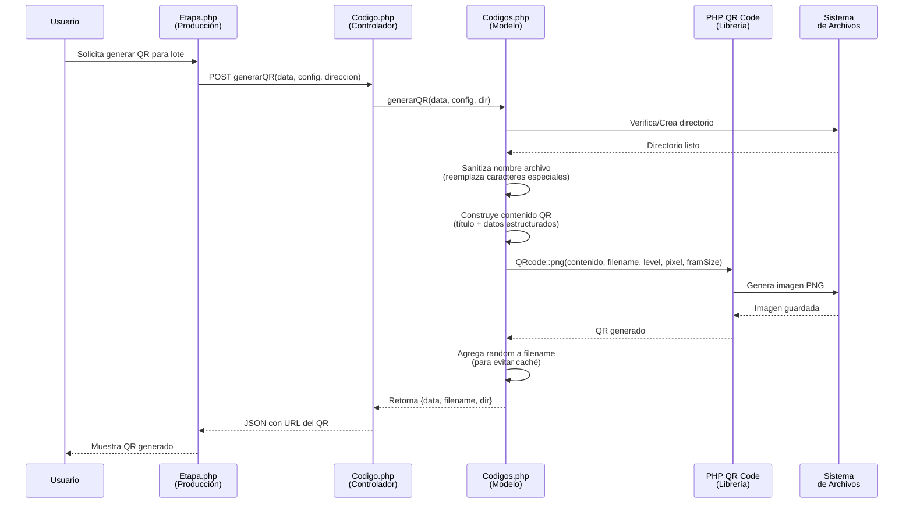
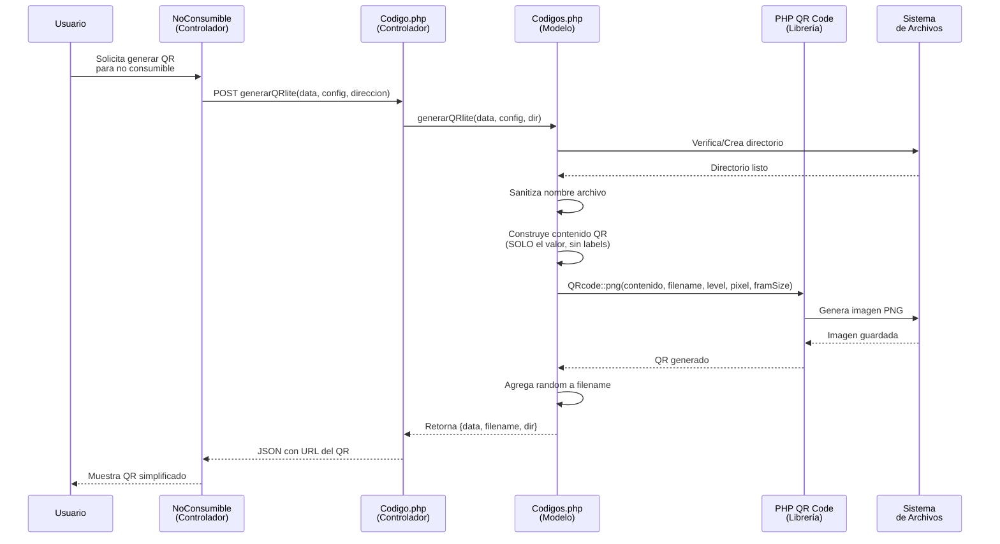
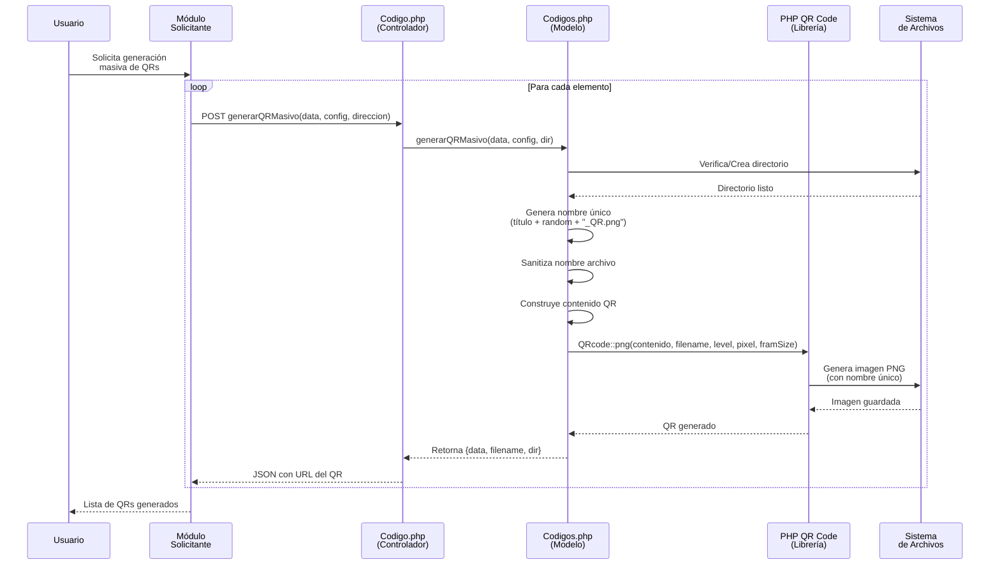
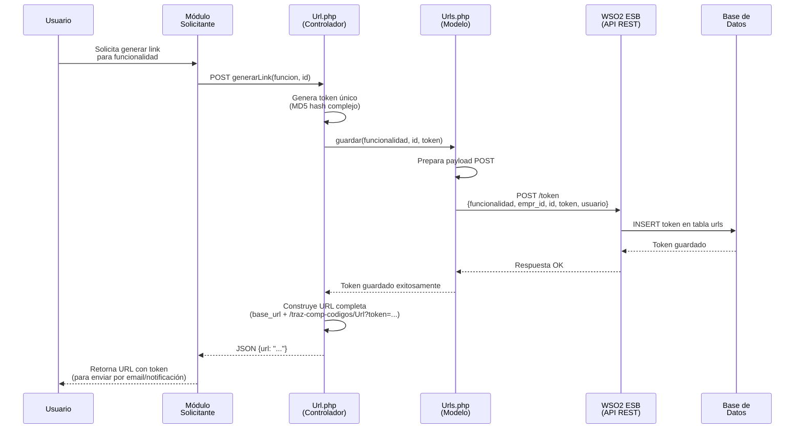
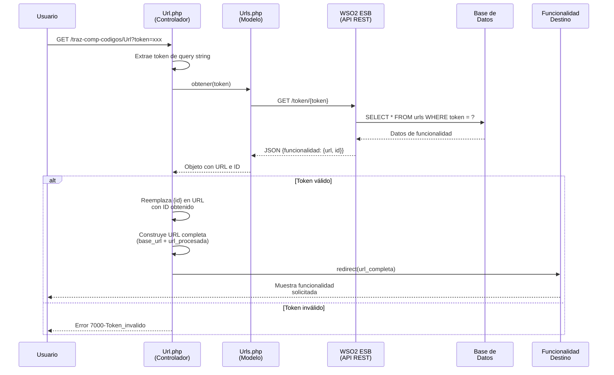
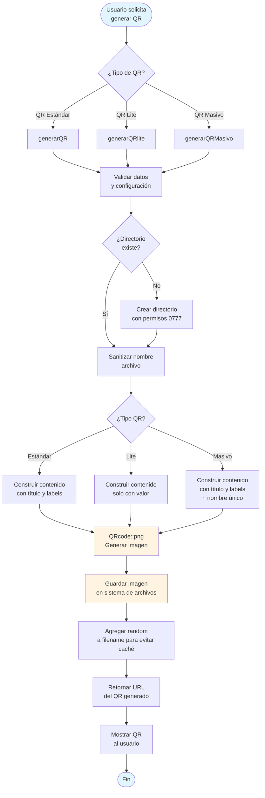
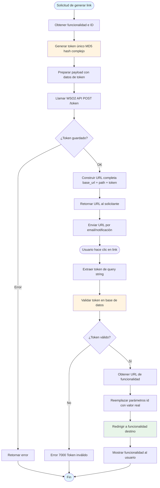

# TRAZ-COMP-CODIGOS - Documentación del Módulo

El módulo **traz-comp-codigos** es un componente especializado del sistema Trazalog Tools.

## SOBRE TRAZALOG TOOLS:

- **Arquitectura**: Sistema modular basado en CodeIgniter 3.x con estructura MVC, donde cada módulo es independiente
- **Stack Tecnológico**: PHP + PostgreSQL/MySQL, integración con WSO2 ESB, Bonita BPM, y múltiples servicios externos
- **Enfoque Principal**: Trazabilidad completa de productos desde materias primas hasta productos finales
- **Características Clave**: Control de producción, gestión de lotes, integración BPM, reportes avanzados, y sistema de roles granular
- **Patrones de Desarrollo**: Validación de sesiones, logging detallado (#TRAZA), helpers reutilizables, y respuestas JSON consistentes
- **Configuración Regional**: Sistema configurado para Argentina (San Juan) con timezone específico

---

## 1. OBJETIVO FUNCIONAL DEL MÓDULO

El módulo **traz-comp-codigos** es un componente especializado del sistema Trazalog Tools que proporciona funcionalidades para:

- **Generación de Códigos QR**: Creación de códigos QR con diferentes formatos y configuraciones para identificación de productos, lotes, no consumibles y otros elementos del sistema
- **Gestión de URLs con Tokens**: Generación de enlaces seguros con tokens únicos para acceso controlado a funcionalidades específicas del sistema
- **Trazabilidad Visual**: Facilitar la identificación rápida y el seguimiento de elementos mediante códigos QR que contienen información estructurada
- **Integración con Módulos**: Proporcionar servicios de generación de códigos QR y URLs tokenizadas para ser utilizados por otros módulos del sistema (producción, almacenes, mantenimiento, etc.)

El módulo actúa como un servicio centralizado que permite a otros componentes del sistema generar códigos QR y URLs seguras sin necesidad de implementar esta lógica en cada módulo.

---

## 2. DESCRIPCIÓN DE PRINCIPALES LIBRERÍAS Y COMPONENTES

### 2.1 Librerías Externas

#### PHP QR Code Library (phpqrcode)
- **Ubicación**: `application/libraries/codigo_qr/phpqrcode/`
- **Descripción**: Librería PHP para generación de códigos QR
- **Clase Principal**: `QRcode`
- **Método Principal**: `QRcode::png()` - Genera código QR como imagen PNG
- **Parámetros Configurables**:
  - `$level`: Nivel de corrección de errores (L, M, Q, H)
  - `$pixel`: Tamaño de píxel
  - `$framSize`: Tamaño del borde en blanco

### 2.2 Componentes del Módulo

#### Controladores

**Codigo.php**
- **Función**: Gestión de generación de códigos QR
- **Métodos Principales**:
  - `generarQR()`: Genera QR estándar con labels
  - `generarQRlite()`: Genera QR sin labels (para no consumibles)
  - `generarQRMasivo()`: Genera múltiples QRs con nombres únicos

**Url.php**
- **Función**: Gestión de URLs con tokens
- **Métodos Principales**:
  - `index()`: Resuelve token y redirige a URL configurada
  - `generarLink()`: Genera nuevo token y URL asociada

#### Modelos

**Codigos.php**
- **Función**: Lógica de negocio para generación de códigos QR
- **Métodos**:
  - `generarQR($data, $config, $dir)`: Genera QR estándar
  - `generarQRlite($data, $config, $dir)`: Genera QR simplificado
  - `generarQRMasivo($data, $config, $dir)`: Genera QR con nombre único

**Urls.php**
- **Función**: Lógica de negocio para gestión de URLs tokenizadas
- **Métodos**:
  - `obtener($token)`: Obtiene URL asociada a un token
  - `obtenerUrls()`: Obtiene todas las URLs configuradas
  - `guardar($funcionalidad, $id, $token)`: Guarda nuevo token

### 2.3 Integraciones

- **WSO2 ESB**: Para comunicación con servicios REST de tokens
- **CodeIgniter REST Library**: Para llamadas a APIs externas
- **Sistema de Archivos**: Para almacenamiento de imágenes QR generadas

---

## 3. CASOS DE USO QUE CUBRE EL SUBMÓDULO

### 3.1 Caso de Uso 1: Generación de Código QR para Lote de Producción

**Descripción**: Generar un código QR que identifique un lote de producción con información completa (título y datos estructurados).

**Actores**: 
- Usuario del sistema (operario, supervisor)
- Módulo de Producción (traz-prod-trazasoft)

**Flujo**:
1. El usuario solicita generar QR para un lote
2. El módulo de producción llama a `Codigo::generarQR()`
3. Se genera el código QR con información del lote
4. Se guarda en directorio específico
5. Se retorna la URL del QR generado

**Información Incluida en QR**:
- Título del lote
- Batch ID
- Fecha de creación
- Producto asociado
- Establecimiento
- Etapa de producción

### 3.2 Caso de Uso 2: Generación de Código QR para No Consumible

**Descripción**: Generar un código QR simplificado (sin labels) para identificar no consumibles en el sistema.

**Actores**:
- Usuario del sistema
- Módulo de Producción/Mantenimiento

**Flujo**:
1. El usuario solicita generar QR para un no consumible
2. El módulo llama a `Codigo::generarQRlite()`
3. Se genera QR con solo el valor (sin labels)
4. Se guarda en directorio específico
5. Se retorna la URL del QR generado

**Información Incluida en QR**:
- Solo el código/identificador del no consumible (sin formato con labels)

### 3.3 Caso de Uso 3: Generación Masiva de Códigos QR

**Descripción**: Generar múltiples códigos QR con nombres únicos para evitar sobrescritura en generaciones masivas.

**Actores**:
- Usuario del sistema
- Módulo que requiere generación masiva

**Flujo**:
1. El usuario solicita generación masiva de QRs
2. El módulo llama a `Codigo::generarQRMasivo()` múltiples veces
3. Cada QR se genera con nombre único (incluye random)
4. Se guardan en directorio específico
5. Se retornan las URLs de los QRs generados

**Características Especiales**:
- Nombres únicos con random para evitar colisiones
- Permite generar múltiples QRs sin sobrescribir

### 3.4 Caso de Uso 4: Generación de URL con Token para Acceso Seguro

**Descripción**: Generar un enlace seguro con token único que permite acceso controlado a funcionalidades específicas del sistema.

**Actores**:
- Usuario del sistema
- Sistema de notificaciones (para envío por email)

**Flujo**:
1. El usuario solicita generar link para una funcionalidad
2. El sistema llama a `Url::generarLink()`
3. Se genera token único (MD5 hash)
4. Se guarda token asociado a funcionalidad e ID
5. Se retorna URL completa con token
6. El usuario accede a la URL con token
7. El sistema valida token y redirige a funcionalidad

**Uso Típico**:
- Envío de links por email para aprobaciones
- Acceso directo a tareas BPM
- Links temporales para reportes

### 3.5 Caso de Uso 5: Resolución de Token y Redirección

**Descripción**: Resolver un token recibido en URL y redirigir al usuario a la funcionalidad configurada.

**Actores**:
- Usuario (que hace clic en link con token)
- Sistema de autenticación

**Flujo**:
1. Usuario accede a URL con token
2. Sistema llama a `Url::index()` con token
3. Se busca token en base de datos
4. Se obtiene URL de redirección asociada
5. Se reemplazan parámetros dinámicos ({id})
6. Se redirige al usuario a la URL final

**Validaciones**:
- Token debe existir en base de datos
- Token debe estar asociado a una funcionalidad válida
- Si token inválido, se muestra error 7000

---

## 4. DIAGRAMAS DE ACTIVIDADES

### 4.1 Diagrama: Generación de Código QR para Lote de Producción

### 4.2 Diagrama: Generación de Código QR Lite para No Consumible

### 4.3 Diagrama: Generación Masiva de Códigos QR

### 4.4 Diagrama: Generación de URL con Token para Acceso Seguro

### 4.5 Diagrama: Resolución de Token y Redirección

### 4.6 Diagrama de Actividad Completo: Flujo End-to-End de Generación y Uso de QR

### 4.7 Diagrama de Actividad Completo: Flujo End-to-End de URLs con Token

---

## NOTAS TÉCNICAS ADICIONALES

### Configuración de Códigos QR

Los parámetros de configuración típicos incluyen:
- **pixel**: Tamaño de píxel (ej: 4, 6, 8)
- **level**: Nivel de corrección de errores (L, M, Q, H)
- **framSize**: Tamaño del borde en blanco (ej: 2, 4)
- **titulo**: Título que aparece en el QR

### Sanitización de Nombres de Archivo

El sistema reemplaza caracteres especiales que pueden causar problemas en nombres de archivo:
- `/`, `:`, `*`, `|`, `<`, `>`, `?`, `"`, espacios → `_`

### Gestión de Tokens

- Los tokens se generan usando MD5 de combinación de:
  - `uniqid()`
  - `microtime()`
  - `rand()`
  - `date('m/d/Y h:i:s a', time())`
- Esto garantiza tokens únicos y seguros
- Los tokens se almacenan en base de datos asociados a funcionalidades e IDs específicos

### Integración con Otros Módulos

El módulo es utilizado por:
- **traz-prod-trazasoft**: Para QRs de lotes y no consumibles
- **yudi-tools-almproc**: Para QRs de pedidos de trabajo
- **sein-tools-almpantar**: Para QRs específicos de SEIN
- Cualquier módulo que necesite generar QRs o URLs tokenizadas

---

## CONCLUSIÓN

El módulo **traz-comp-codigos** es un componente esencial del sistema Trazalog Tools que proporciona servicios centralizados de generación de códigos QR y gestión de URLs seguras. Su diseño modular permite que otros componentes del sistema utilicen estas funcionalidades sin duplicar código, manteniendo consistencia en la generación de códigos y la gestión de accesos seguros mediante tokens.

