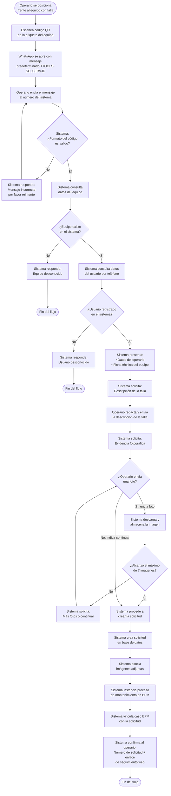
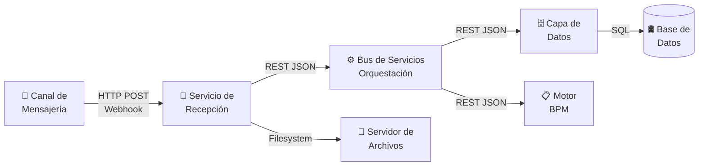
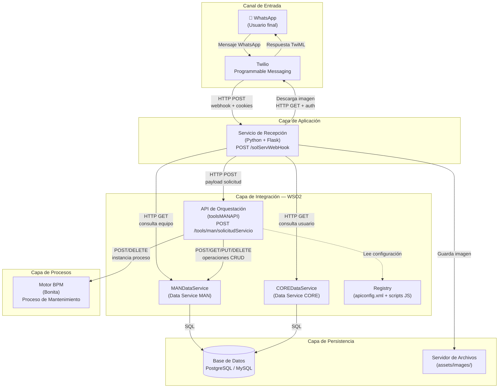
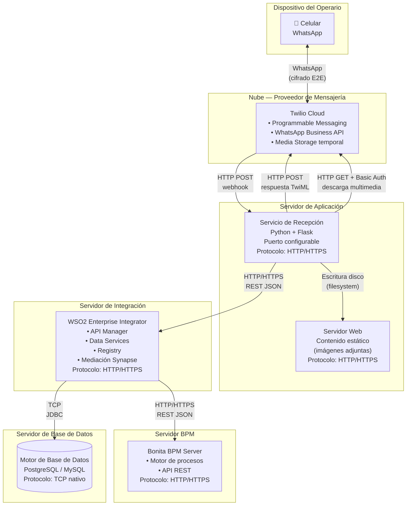
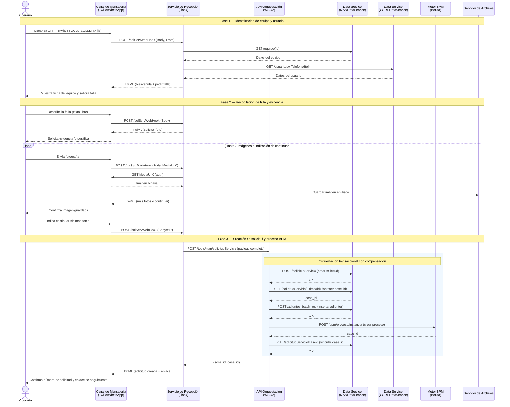
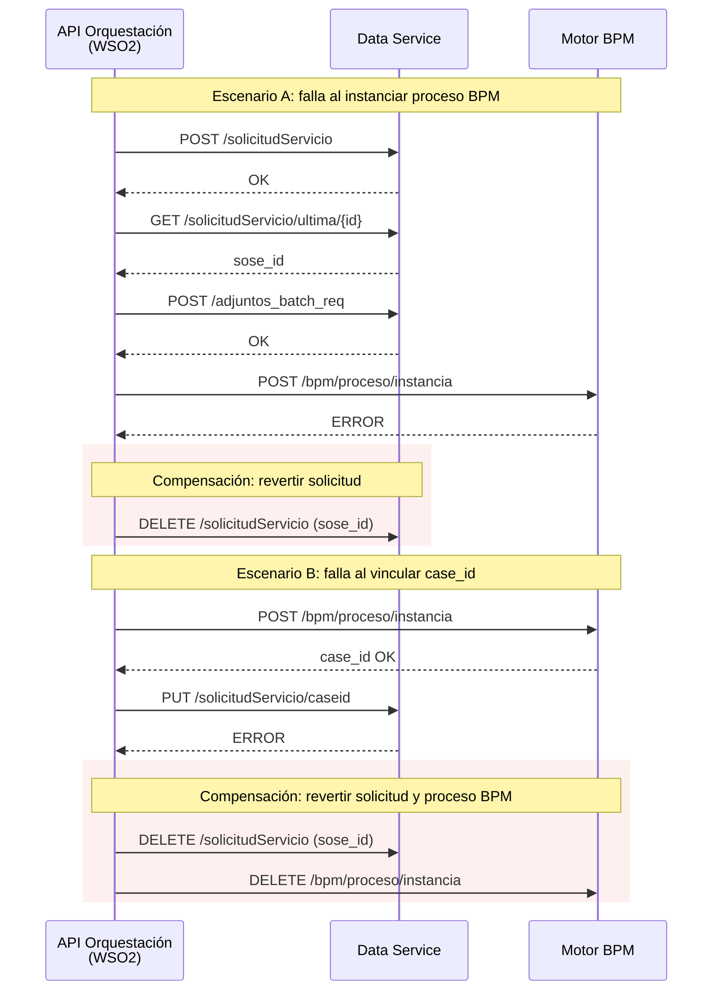

# MAN - Solicitud de Servicio vía WhatsApp

## Módulo de Mantenimiento — Trazalog Tools

**Documento técnico de arquitectura y diseño funcional**

---

## 1. CASO DE USO FUNCIONAL

### 1.1 Contexto

El módulo **MAN** (Mantenimiento) de Trazalog Tools está diseñado para gestionar el ciclo de vida de solicitudes de servicio sobre equipos y activos industriales. Su ámbito de aplicación abarca sectores de mantenimiento industrial, agroindustria, y oil & gas, donde los operarios necesitan reportar fallas de equipamiento de forma rápida y trazable desde el campo de operaciones.

La funcionalidad documentada en este artefacto corresponde al **ingreso de Solicitudes de Servicio a través de WhatsApp**, que permite a un operario iniciar un reporte de falla directamente desde su dispositivo móvil, sin necesidad de acceder a la aplicación web del sistema.

### 1.2 Descripción del caso de uso

**Actor principal:** Operario o técnico de mantenimiento con acceso a WhatsApp y usuario registrado en Trazalog Tools.

**Precondiciones:**
- El equipo o activo a reportar tiene una etiqueta física (código QR o etiqueta impresa) que contiene un código con formato `TTOOLS-SOLSERV-{id_equipo}`.
- El operario tiene registrado su número de teléfono celular en el sistema Trazalog Tools.
- El canal de mensajería WhatsApp está habilitado y vinculado al servicio de recepción de mensajes.

**Flujo principal:**

1. El operario se encuentra en campo frente al equipo con falla. Escanea el código QR de la etiqueta del equipo con su celular, lo que abre WhatsApp con un mensaje predeterminado dirigido al número del sistema.
2. Al enviar el mensaje, el sistema identifica al operario por su número de teléfono y consulta los datos del equipo asociado al código recibido.
3. El sistema responde presentando la identidad del operario y la ficha técnica del equipo (código, descripción, empresa, marca, sector, grupo, área, criticidad y proceso), y solicita al operario que describa la falla detectada.
4. El operario redacta una descripción textual de la falla y la envía.
5. El sistema solicita evidencia fotográfica. El operario puede enviar hasta 7 fotografías del equipo o la falla. En cualquier momento puede indicar que no desea agregar más imágenes.
6. Una vez completada la recopilación de datos, el sistema crea la solicitud de servicio en la base de datos, asocia las imágenes adjuntas, e instancia un proceso de gestión de mantenimiento en el motor BPM.
7. El sistema confirma al operario el número de solicitud creada y le proporciona un enlace para consultar el avance desde la aplicación web.

**Postcondiciones:**
- Existe una nueva solicitud de servicio persistida en la base de datos con estado inicial "S" (Solicitada).
- Las imágenes adjuntas están almacenadas en el servidor de archivos y vinculadas a la solicitud.
- Se ha creado una instancia del proceso "Proceso de Mantenimiento AssetPlanner" en el motor BPM, vinculada a la solicitud mediante un `case_id`.

**Flujo alternativo — Datos inválidos:**
- Si el formato del código no coincide con el patrón esperado, el sistema informa al operario y permite reintentar.
- Si el equipo no existe en el sistema o el número de teléfono no está asociado a ningún usuario, se informa al operario y se detiene el flujo.

### 1.3 Diagrama de actividad del caso de uso

El siguiente diagrama representa el flujo de actividad desde la perspectiva del operario y el sistema, mostrando las decisiones y caminos alternativos del caso de uso:

---

## 2. ARQUITECTURA Y COMPONENTES

### 2.1 Vista general

La solución implementa una arquitectura de **múltiples capas** con separación de responsabilidades, donde cada componente cumple un rol específico en la cadena de procesamiento. La selección de cada tecnología responde a criterios de madurez del producto, reconocimiento en la industria, disponibilidad de soporte y adecuación al caso de uso.

### 2.2 Diagrama de componentes

El siguiente diagrama detalla los componentes de la solución, sus tecnologías y las interacciones entre ellos:

### 2.3 Diagrama de despliegue

La distribución física de los componentes en servidores y los protocolos de comunicación entre ellos:

### 2.4 Componentes en detalle

#### 2.4.1 Canal de mensajería — Twilio + WhatsApp

| Aspecto | Detalle |
|---------|---------|
| **Rol** | Canal de entrada del usuario final |
| **Tecnología** | Twilio Programmable Messaging + WhatsApp Business API |

**Descripción funcional:**
Twilio actúa como puente entre el usuario (WhatsApp) y el servidor de recepción. Recibe los mensajes del operario, los entrega al webhook configurado mediante HTTP POST, y reenvía la respuesta TwiML al usuario como mensaje de WhatsApp. También aloja temporalmente los archivos multimedia (fotografías) enviados por el usuario, protegiéndolos con autenticación HTTP Basic vinculada a la cuenta.

El protocolo de comunicación es un webhook HTTP POST con payload `application/x-www-form-urlencoded`, donde los campos relevantes son `Body` (texto del mensaje), `From` (número del remitente en formato `whatsapp:+{código_país}{número}`) y `MediaUrl0` (URL del primer adjunto multimedia).

**Justificación de la elección de Twilio:**

Twilio es la plataforma líder global en Comunicaciones como Servicio (CPaaS). Ha sido designada **Líder en el Gartner® Magic Quadrant™ para Communications Platform as a Service (CPaaS) durante tres años consecutivos (2023, 2024 y 2025)**, obteniendo la posición más alta entre sus pares en capacidad de ejecución (*Ability to Execute*). Gartner reconoce a Twilio por su visión integral y su capacidad para entregar resultados a escala.

Entre las virtudes que hacen de Twilio la elección adecuada para esta solución:

- **Alcance global con WhatsApp Business API:** Twilio provee acceso directo a la API de WhatsApp Business, el canal de mensajería más utilizado en Latinoamérica. Esto permite llegar al operario en el campo sin exigirle instalar ninguna aplicación adicional.
- **Modelo de webhook estándar:** La arquitectura basada en webhooks HTTP permite que cualquier servidor web reciba y responda mensajes sin necesidad de mantener conexiones persistentes, simplificando el despliegue y reduciendo la complejidad operativa.
- **Gestión nativa de multimedia:** Twilio almacena temporalmente los archivos multimedia enviados por los usuarios y los expone vía URL autenticada, permitiendo que el servidor los descargue de forma asíncrona sin necesidad de implementar almacenamiento intermedio.
- **Calificación Gartner Peer Insights:** Twilio sostiene una calificación de 4.3/5 estrellas en Gartner Peer Insights, con un 92% de recomendación entre pares de la industria.
- **Adopción empresarial a escala:** Es utilizado por empresas como Mercado Libre, eBay, Intuit y Stripe para canales de mensajería, voz y correo electrónico, lo que valida su madurez para entornos de producción exigentes.
- **TwiML (Twilio Markup Language):** El lenguaje declarativo TwiML permite definir respuestas conversacionales de forma simple y estandarizada, sin dependencia de SDKs complejos en el lado del servidor.

#### 2.4.2 Servicio de recepción — Bot conversacional (Python + Flask)

| Aspecto | Detalle |
|---------|---------|
| **Rol** | Interfaz conversacional y controlador de flujo |
| **Tecnología** | Python 3 + Flask + Twilio SDK para Python |
| **Endpoint** | `POST /solServWebHook` |

**Descripción funcional:**
Implementa un flujo conversacional por pasos (máquina de estados) que guía al operario a través de la recopilación de datos necesarios para crear una solicitud de servicio. Gestiona la identificación del usuario y equipo consultando los servicios de datos, almacena temporalmente las imágenes en el servidor de archivos, y finalmente compone y envía la solicitud completa al bus de servicios.

El estado conversacional se mantiene mediante sesiones firmadas de Flask (cookie-based), indexadas por número de teléfono para soportar conversaciones concurrentes de múltiples usuarios. El canal de mensajería reenvía las cookies HTTP entre cada interacción, lo que permite la continuidad del diálogo sin infraestructura de estado adicional.

**Justificación de la elección de Python + Flask:**

- **Simplicidad y velocidad de desarrollo:** Flask es un micro-framework que permite construir webhooks y APIs REST con un código mínimo y legible. Su filosofía minimalista se alinea con la naturaleza puntual de este servicio: recibir un mensaje, procesarlo y responder.
- **Ecosistema Python:** Python ofrece uno de los ecosistemas más amplios para integración de servicios, procesamiento de datos y scripting. La disponibilidad del SDK oficial de Twilio para Python simplifica la generación de respuestas TwiML y la autenticación con la API de multimedia.
- **Sesiones integradas:** Flask provee gestión de sesiones firmadas criptográficamente de forma nativa, sin requerir base de datos ni almacenamiento externo. Esto permite mantener el estado conversacional de cada usuario entre mensajes sucesivos de forma ligera.
- **Portabilidad:** Python está disponible en prácticamente cualquier sistema operativo y entorno de servidor, lo que facilita el despliegue en distintas infraestructuras sin dependencias complejas.
- **Madurez del SDK de Twilio:** El paquete `twilio` para Python es mantenido oficialmente por Twilio, con actualizaciones frecuentes y documentación exhaustiva, lo que garantiza compatibilidad a largo plazo con la plataforma de mensajería.

#### 2.4.3 Bus de servicios — API de orquestación (WSO2)

| Aspecto | Detalle |
|---------|---------|
| **Rol** | Orquestador transaccional |
| **Tecnología** | WSO2 Enterprise Integrator (API Synapse) |
| **Endpoint** | `POST /tools/man/solicitudServicio` |

**Descripción funcional:**
Recibe la solicitud compuesta desde el servicio de recepción y ejecuta una cadena de operaciones secuenciales coordinadas: persiste la solicitud en base de datos, recupera el identificador generado, inserta los adjuntos en lote, instancia el proceso BPM, y vincula el identificador del caso BPM con la solicitud. Cada paso valida el resultado HTTP del anterior.

Implementa lógica de **compensación transaccional** (patrón Saga): si un paso falla, revierte los pasos anteriores exitosos — elimina la solicitud de la base de datos y/o la instancia BPM según corresponda — garantizando la consistencia de los datos sin requerir transacciones distribuidas.

La configuración de endpoints se gestiona desde un archivo centralizado en el registry del bus (`apiconfig.xml`). Utiliza un script JavaScript reutilizable (`setIdEnHijos.js`) para inyectar el identificador padre en los registros hijos (adjuntos) antes de la inserción en lote.

La respuesta exitosa retorna al servicio de recepción un JSON con el `sose_id` (identificador de la solicitud), el `case_id` (identificador del proceso BPM) y la sesión BPM.

**Justificación de la elección de WSO2:**

- **Plataforma de integración completa y open-source:** WSO2 Enterprise Integrator es una plataforma de integración de código abierto que combina capacidades de Enterprise Service Bus (ESB), Data Services y Message Broker en un único producto. Su licencia Apache 2.0 elimina costos de licenciamiento y permite inspección completa del código fuente.
- **Orquestación declarativa:** El modelo de mediación basado en XML de Synapse permite definir flujos de integración complejos (secuencias, filtros, transformaciones, llamadas a servicios) de forma declarativa, sin necesidad de compilar código. Esto facilita la modificación y el mantenimiento de los flujos.
- **Data Services integrados:** WSO2 permite exponer tablas y procedimientos de base de datos como servicios REST/SOAP de forma nativa, eliminando la necesidad de desarrollar una capa de acceso a datos personalizada. Los Data Services abstraen la complejidad SQL y proveen transformación automática a JSON/XML.
- **Mediación y transformación:** El motor de mediación soporta transformaciones de payload (JSON, XML), enrutamiento condicional, manejo de errores, invocación de scripts (JavaScript, Groovy) y operaciones en lote (batch requests), lo que permite implementar lógica de orquestación sofisticada.
- **Registry centralizado:** El registry de WSO2 permite almacenar configuraciones, scripts y artefactos compartidos en un repositorio centralizado, facilitando la gestión de múltiples ambientes (desarrollo, testing, producción) con configuraciones diferenciadas.
- **Adopción en la industria:** WSO2 es utilizado por organizaciones globales para integración de sistemas, APIs y procesos. Mantiene presencia activa en el mercado de plataformas de integración evaluado por analistas como Forrester y Gartner.

#### 2.4.4 Capa de datos — Data Services (WSO2 Data Services)

| Aspecto | Detalle |
|---------|---------|
| **Rol** | Abstracción de acceso a base de datos |
| **Tecnología** | WSO2 Data Services |

**Descripción funcional:**
Expone operaciones CRUD sobre las tablas de mantenimiento como servicios REST. Encapsula las consultas SQL y transforma los resultados a JSON, desacoplando la estructura de la base de datos del resto de los componentes.

Las operaciones expuestas incluyen: crear solicitud, obtener última solicitud por equipo, insertar adjuntos en lote, actualizar case_id, eliminar solicitud, y consultar datos de equipo. Adicionalmente, el **COREDataService** (servicio de datos del núcleo del sistema) expone la consulta de usuarios por número de teléfono.

**Justificación como componente separado:**

- **Desacoplamiento de la base de datos:** Ningún componente de la arquitectura accede directamente a la base de datos. Todos los accesos pasan por los Data Services, lo que permite modificar el esquema de base de datos, cambiar de motor de base de datos, o agregar lógica de validación sin impactar a los consumidores.
- **Reutilización de servicios:** Los mismos Data Services son consumidos tanto por el bot de WhatsApp (consultas de equipo y usuario) como por la API de orquestación (persistencia de solicitud), evitando duplicación de lógica de acceso a datos.
- **Seguridad centralizada:** El acceso a la base de datos se controla desde un único punto, permitiendo aplicar políticas de autenticación, autorización y auditoría de forma consistente.

#### 2.4.5 Motor BPM — Bonita

| Aspecto | Detalle |
|---------|---------|
| **Rol** | Gestión del flujo de trabajo de mantenimiento |
| **Tecnología** | Bonita BPM (Bonitasoft) |

**Descripción funcional:**
Gestiona el ciclo de vida del proceso de mantenimiento posterior a la creación de la solicitud. La API de orquestación instancia el proceso denominado "Proceso de Mantenimiento AssetPlanner SIM", pasando como variables de proceso el identificador de la solicitud de servicio. El `case_id` resultante se vincula de vuelta a la solicitud en base de datos, estableciendo una trazabilidad cruzada entre la solicitud y su proceso de gestión.

**Justificación de la elección de Bonita:**

- **Plataforma de automatización de procesos reconocida por analistas:** Bonitasoft fue incluida en **The Forrester Wave™: Digital Process Automation Software Q4 2023**, donde Forrester evaluó a los 15 proveedores más significativos del mercado de DPA. Forrester destacó que Bonita *"compite eficazmente contra jugadores mucho más grandes"* gracias a su enfoque técnico diferenciado. Además, Bonita mantiene una calificación de **4.4/5 en Gartner Peer Insights** para herramientas de automatización de procesos de negocio.
- **Enfoque open-source profesional:** Bonita combina un modelo de código abierto con herramientas orientadas a desarrolladores profesionales, ofreciendo un entorno de desarrollo dedicado, soporte DevOps y capacidades de extensión mediante conectores personalizados. Esto la hace adecuada para integraciones técnicas como la que realiza WSO2 via API REST.
- **Separación motor/interfaz:** La arquitectura de Bonita separa el motor de procesos de la interfaz de usuario, permitiendo que la instanciación y el avance de procesos se gestionen completamente via API REST desde sistemas externos, como ocurre en esta solución.
- **Trazabilidad de procesos:** Cada instancia de proceso en Bonita mantiene un historial completo de actividades, tiempos, actores y decisiones, lo que permite al módulo de mantenimiento consultar el estado y avance de cada solicitud de servicio en cualquier momento.

#### 2.4.6 Servidor de archivos

| Aspecto | Detalle |
|---------|---------|
| **Rol** | Almacenamiento de evidencia fotográfica |
| **Tecnología** | Servidor web (directorio estático) |

**Descripción funcional:**
Las imágenes descargadas del canal de mensajería se almacenan en un directorio servido como contenido estático, bajo la ruta `assets/images/`. El mecanismo de nombres únicos (número de teléfono + marca temporal Unix) previene colisiones entre archivos. Al estar servidas como contenido estático del servidor web, las imágenes son directamente accesibles desde la aplicación web de Trazalog Tools al consultar el detalle de una solicitud de servicio, sin requerir procesamiento adicional ni servicios intermedios.

---

## 3. FLUJO DE ORQUESTACIÓN Y DIAGRAMAS DE SECUENCIA

### 3.1 Secuencia de interacción entre componentes

El siguiente diagrama muestra la secuencia completa de mensajes entre todos los componentes de la arquitectura, desde que el operario envía el primer mensaje hasta que recibe la confirmación de la solicitud creada:

### 3.2 Compensación ante errores en la orquestación

La API de orquestación implementa un patrón de transacción compensada (Saga) para garantizar la consistencia de datos. Los siguientes escenarios ilustran cómo se revierten los pasos exitosos cuando un paso posterior falla:

---

## 4. TABLAS DE BASE DE DATOS

Las siguientes tablas se deducen de las operaciones expuestas por los servicios de datos y los payloads intercambiados entre los componentes. Los nombres de columnas corresponden a los campos observados en las interfaces JSON de los servicios.

### 4.1 Solicitud de Servicio

Tabla principal que registra cada solicitud de servicio de mantenimiento ingresada al sistema.

| Columna | Tipo inferido | Descripción |
|---------|---------------|-------------|
| `sose_id` | Entero (PK, autoincremental) | Identificador único de la solicitud de servicio |
| `f_solicitado` | Timestamp | Fecha y hora en que se realizó la solicitud |
| `id_equipo` | Entero (FK → Equipo) | Referencia al equipo sobre el cual se reporta la falla |
| `estado` | Carácter | Estado de la solicitud. Valor inicial: `S` (Solicitada) |
| `usrId` | Entero (FK → Usuario) | Identificador del usuario que crea la solicitud |
| `solicitante` | Texto | Nombre completo del solicitante (nombre + apellido) |
| `causa` | Texto | Descripción textual de la falla reportada por el operario |
| `foto` | Texto | Campo legacy para referencia de foto (actualmente se usan adjuntos) |
| `id_empresa` | Entero (FK → Empresa) | Empresa a la que pertenece el equipo |
| `case_id` | Entero | Identificador del caso en el motor BPM, vinculado después de la instanciación del proceso |

### 4.2 Adjuntos de Solicitud de Servicio

Tabla de detalle que almacena las referencias a las imágenes adjuntas a cada solicitud.

| Columna | Tipo inferido | Descripción |
|---------|---------------|-------------|
| `id_solicitud` | Entero (FK → Solicitud de Servicio) | Referencia a la solicitud padre |
| `url` | Texto | Ruta base del directorio donde se almacena el archivo (ej: `assets/images/`) |
| `adjunto` | Texto | Campo adicional de referencia del adjunto |
| `nombre` | Texto | Nombre del archivo de imagen almacenado en el servidor de archivos (ej: `5491112345678_1740412200.jpg`) |

### 4.3 Equipo

Tabla maestra que contiene el catálogo de equipos y activos registrados en el sistema. Es consultada durante la identificación del equipo al inicio del flujo.

| Columna | Tipo inferido | Descripción |
|---------|---------------|-------------|
| `equi_id` | Entero (PK) | Identificador único del equipo |
| `descripcion` | Texto | Descripción del equipo |
| `codigo` | Texto | Código alfanumérico del equipo (visible en la etiqueta física) |
| `estado` | Carácter | Estado operativo del equipo |
| `empresa` | Texto | Nombre de la empresa propietaria |
| `empr_id` | Entero (FK → Empresa) | Identificador de la empresa |
| `marca` | Texto | Marca o fabricante del equipo |
| `sector` | Texto | Sector productivo donde opera el equipo |
| `grupo` | Texto | Grupo funcional al que pertenece |
| `criticidad` | Texto | Nivel de criticidad del equipo para el proceso productivo |
| `area` | Texto | Área física o planta donde se ubica |
| `proceso` | Texto | Proceso productivo asociado |

### 4.4 Usuario

Tabla maestra del módulo CORE del sistema que almacena los usuarios registrados. Es consultada para identificar al operario por su número de teléfono.

| Columna | Tipo inferido | Descripción |
|---------|---------------|-------------|
| `user_id` | Entero (PK) | Identificador único del usuario |
| `nombre` | Texto | Nombre del usuario |
| `apellido` | Texto | Apellido del usuario |
| `nick` | Texto | Nombre de usuario para login |
| `correo` | Texto | Correo electrónico |
| `telefono` | Texto | Número de teléfono celular (usado para la identificación desde WhatsApp) |
| `documento` | Texto | Documento de identidad |
| `imagen` | Texto | Referencia a la imagen de perfil |
| `estado` | Carácter | Estado del usuario en el sistema |
| `es_baneado` | Booleano | Indica si el usuario está inhabilitado |
| `rol_seguridad` | Texto | Rol de seguridad asignado |
| `deposito` | Texto | Depósito asignado al usuario |
| `depo_id` | Entero (FK → Depósito) | Identificador del depósito |
| `ultimo_login` | Timestamp | Fecha y hora del último inicio de sesión |

---

## 5. BENEFICIOS DE LA ARQUITECTURA

### 5.1 Desacoplamiento por capas

Cada componente tiene una responsabilidad bien definida y se comunica con los demás a través de interfaces HTTP/REST. El servicio de recepción no conoce la estructura de la base de datos, la API de orquestación no conoce el canal de entrada del usuario, y el servicio de datos no conoce la lógica de negocio. Este desacoplamiento permite modificar, escalar o reemplazar un componente sin impactar a los demás.

### 5.2 Acceso directo desde el campo de operaciones

La elección de WhatsApp como canal de entrada elimina la necesidad de que el operario acceda a una aplicación web o instale una aplicación específica. Cualquier persona con WhatsApp en su celular y un usuario registrado en el sistema puede reportar una falla escaneando el código QR del equipo. Esto reduce la barrera de adopción en entornos industriales donde el personal de mantenimiento puede no tener acceso a una computadora.

### 5.3 Orquestación transaccional con compensación

La API de orquestación implementa un patrón de transacción compensada (saga): si un paso de la cadena falla, los pasos previos exitosos se revierten. Esto garantiza la consistencia de los datos entre la base de datos y el motor BPM sin requerir transacciones distribuidas, lo cual resulta apropiado para una arquitectura basada en servicios.

### 5.4 Trazabilidad cruzada BD-BPM

Vincular el `case_id` del motor BPM con el `sose_id` de la solicitud en base de datos permite consultar el estado del proceso de mantenimiento tanto desde la aplicación web (consultando la base de datos) como desde el motor BPM, manteniendo un punto de correlación único entre ambos mundos.

### 5.5 Reutilización de servicios de datos

Los Data Services de WSO2 (`MANDataService`, `COREDataService`) exponen las operaciones de base de datos como endpoints REST reutilizables. Estos mismos servicios son consumidos tanto por el bot de WhatsApp (para consultas de equipo y usuario) como por la API de orquestación (para la persistencia de la solicitud), evitando duplicación de lógica de acceso a datos.

### 5.6 Soporte multimedia nativo

La integración con el canal de mensajería permite recibir imágenes directamente desde el celular del operario. Las imágenes se almacenan como archivos estáticos servidos por el servidor web, lo que las hace accesibles desde la aplicación web sin procesamiento adicional. El mecanismo de nombres únicos (teléfono + timestamp) previene colisiones.

### 5.7 Escalabilidad de canales de entrada

La separación entre el servicio de recepción (bot conversacional) y la API de orquestación permite agregar nuevos canales de entrada (por ejemplo, Telegram, SMS, o una aplicación móvil nativa) que consuman la misma API de orquestación sin duplicar la lógica de creación de solicitudes ni la integración con el motor BPM.

### 5.8 Centralización de configuración

La configuración de endpoints se gestiona desde un archivo centralizado en el registry del bus de servicios (`apiconfig.xml`) y desde la clase de configuración del servicio de recepción. Esto permite desplegar la solución en distintos ambientes modificando únicamente los archivos de configuración, sin alterar el código de los componentes.

### 5.9 Selección tecnológica respaldada por la industria

Cada componente de la arquitectura utiliza tecnologías reconocidas por analistas de la industria: Twilio como líder en CPaaS según Gartner, Bonita como referente en automatización de procesos según Forrester, y WSO2 como plataforma de integración open-source con presencia global. Esta selección tecnológica reduce riesgos de obsolescencia y garantiza disponibilidad de soporte y talento técnico a largo plazo.
