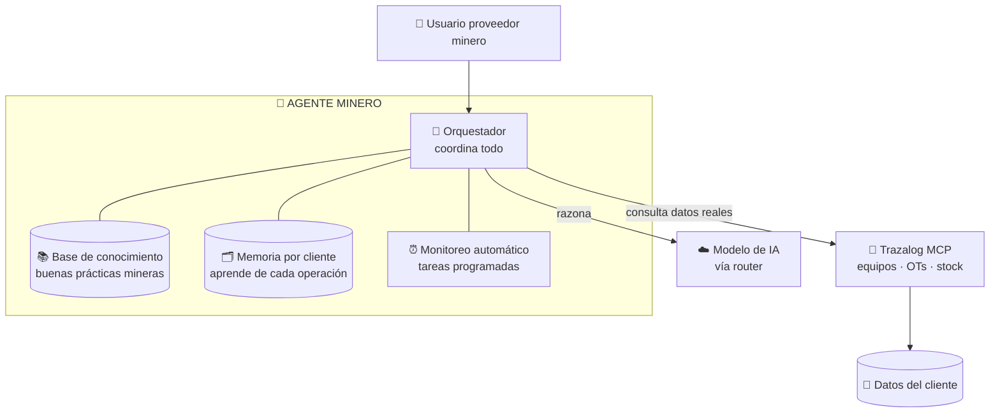
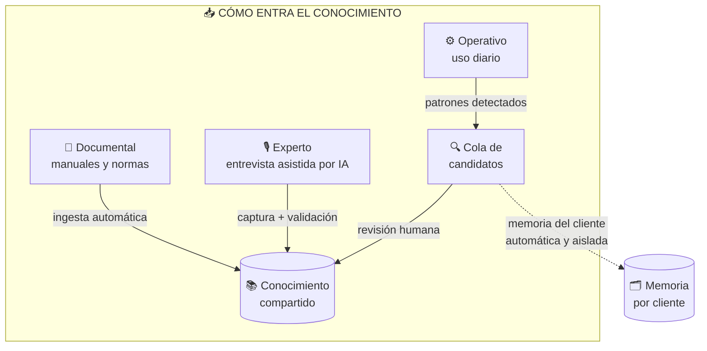
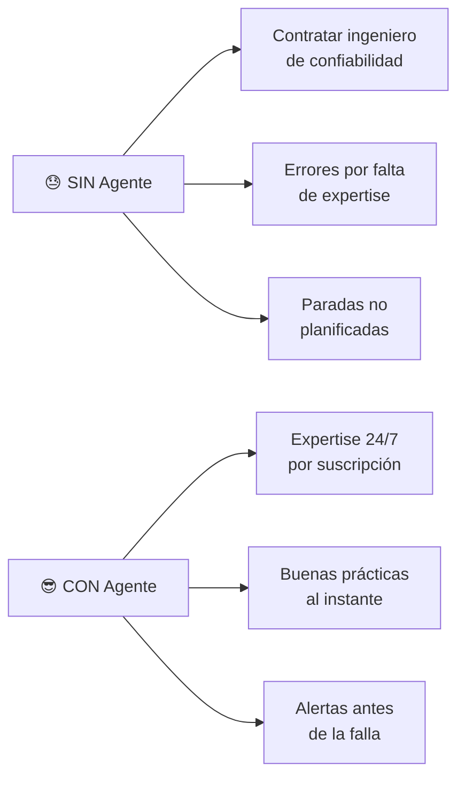
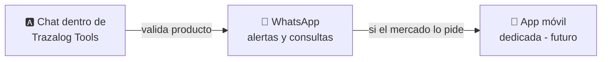

# 🏔️ Agente Minero Trazalog — Arquitectura Funcional y Caso de Negocio

**Audiencia:** Socios e inversores · **Versión:** 1.0 (borrador ejecutivo) · **Agosto 2026**

---

## 🎯 Qué es, en una frase

Un **asistente de inteligencia artificial experto en operación minera** que responde consultas sobre buenas prácticas y monitorea automáticamente la operación de cada cliente, apoyándose en los datos reales que ya viven en Trazalog. Se vende como suscripción a proveedores de servicios mineros.

---

## 🧩 Los componentes y para qué sirven

| Componente | Para qué sirve | Ciclo de vida |
|---|---|---|
| 🧠 **Orquestador** | El "director de orquesta": recibe la consulta, decide qué necesita, arma la respuesta | Siempre activo, escala con clientes |
| 📚 **Base de conocimiento** | El saber minero: normas, manuales, buenas prácticas. Es lo que lo hace "experto" | Se carga una vez, crece con curaduría |
| 🗂️ **Memoria por cliente** | Recuerda la operación de cada cliente y aprende de ella. Aislada y privada | Crece automáticamente con el uso |
| ⏰ **Monitoreo automático** | Chequea la operación sin que se lo pidan y alerta problemas | Corre en horarios programados |
| 🔌 **Trazalog MCP** | Las "manos": accede a los datos reales del cliente (ya construido) | Reutilizado, sin costo adicional |
| ☁️ **Modelo de IA** | El "cerebro" que razona. Intercambiable (elegimos el mejor por costo/calidad) | Servicio externo por consumo |

---

## 🔄 Ciclo de vida del conocimiento (y el equipo que requiere)

El conocimiento es **el activo central** del producto. Se alimenta y mantiene en tres flujos, cada uno con distinto esfuerzo humano de nuestro lado:

**1. 📄 Documental — el más barato.** Manuales, normas ISO, procedimientos ya escritos se suben a un panel y el sistema los procesa solo. Esfuerzo humano: bajo (subir y etiquetar).

**2. 🎙️ Experto — el diferenciador, el más costoso.** El conocimiento valioso está en la cabeza de los expertos y no está escrito. **Por qué así:** un formulario en blanco intimida y da resultados pobres; en cambio, una **IA entrevista al experto**, le repregunta y le pide ejemplos concretos — hablar es fácil, escribir estructurado no (con opción de **responder por voz**, clave para expertos de terreno). Las preguntas no son al azar: una **agenda priorizada** se arma cruzando la taxonomía del dominio con **los datos reales de la plataforma** (si las chancadoras generan el 40% de las OTs de los clientes, ese conocimiento va primero) y con los huecos que el uso diario revela. Cada hora de experto rinde al máximo. Con **3 expertos**, cada aporte se valida cruzándolo con los otros dos: si coinciden, es sólido; si difieren, se marca como zona gris.

**3. ⚙️ Operativo — automático pero controlado.** Lo que el agente aprende de cada cliente va a su **memoria privada** (automático, aislado). Solo cuando un patrón se repite en varios clientes se propone como conocimiento global — y **siempre pasa por revisión humana** antes de sumarse. Nunca dejamos que datos crudos se vuelvan "verdad" sin filtro.

### 👥 Dimensionamiento del equipo de expertos (nuestro costo real)

> La **curaduría** es el trabajo humano de: dirigir las entrevistas, validar el conocimiento capturado, resolver contradicciones entre expertos, y aprobar/rechazar los candidatos de la cola. Es lo que garantiza la calidad — y es donde está el costo de personal de nuestro lado.

| Fase | Equipo de expertos sugerido | Dedicación | Para qué |
|---|---|---|---|
| 🧪 **Carga inicial** (PoC/MVP) | 2-3 expertos mineros + 1 curador | Intensiva, acotada en el tiempo | Construir la base de conocimiento fundacional |
| 🌱 **Operación** (con clientes) | 1 experto part-time + 1 curador part-time | Baja, periódica | Revisar cola de candidatos, mantener actualizado |
| 📈 **Escala** | Curador dedicado + expertos on-demand | Según crecimiento | Curaduría continua a mayor volumen |

**Insight de costo:** el gasto fuerte en expertos es **inicial y acotado** (construir la base), no permanente. Una vez cargado el conocimiento fundacional, el mantenimiento requiere poca dedicación. Esto significa que el costo de expertos es principalmente una **inversión de arranque**, no un costo operativo continuo alto — clave para el modelo financiero. Además, el conocimiento capturado es un **activo que queda** (con los expertos bajo acuerdo de que lo capturado es de Trazalog).

---

## 💰 Cómo reduce costos al cliente (el argumento de venta)

- 👨‍🔧 **Costo de empleados:** un ingeniero de confiabilidad senior en Argentina cuesta millones de pesos al mes. El agente entrega buena parte de ese conocimiento por una fracción, disponible 24/7, sin licencias ni vacaciones.
- 🏭 **Costo de operación:** las paradas no planificadas de equipos son el mayor costo oculto de la minería. Anticipar una falla con monitoreo automático evita paradas que cuestan miles de dólares por hora.
- 🖥️ **Costo de infraestructura (nuestro):** el agente se monta sobre lo que ya tenemos (Trazalog + MCP). La inversión incremental es mínima y escala solo cuando hay clientes pagando.

---

## 🖥️ Experiencia del cliente: canales de uso

- 🅰️ **MVP: pantalla de chat dentro de Trazalog Tools.** El cliente ya vive ahí: cero instalación, cero login extra, upsell natural sobre la plataforma que ya paga. La regla de oro: *la mejor interfaz es la que no exige cambiar comportamientos.*
- 💬 **Fase 2: WhatsApp.** El canal donde el proveedor PyME argentino vive todo el día. Ideal para las **alertas proactivas** ("⚠️ el equipo X viene fallando más de lo normal") y consultas rápidas desde terreno.
- 📱 **Futuro: app dedicada** solo si clientes validados piden movilidad más rica. No antes: es inversión grande sobre hipótesis sin probar.
- 🔔 **Notificaciones:** el agente usa el **sistema de alertas ya probado de Asset Planner**, extendido a Trazalog Tools — reutilización en vez de construir de cero.

---

## 📈 Casos de negocio reales

1. **"¿Cómo mantengo esta chancadora?"** → El proveedor pregunta en lenguaje natural y recibe el procedimiento correcto según la norma + el historial de SU equipo. Reemplaza horas de consultoría.
2. **Alerta proactiva de MTBF** → El agente detecta que un equipo está fallando más seguido que el mes pasado y avisa antes de la parada. Evita una emergencia costosa.
3. **Onboarding de personal nuevo** → Un técnico junior consulta al agente en vez de interrumpir a un senior. Acelera la curva de aprendizaje.
4. **Cumplimiento y auditorías** → El agente ayuda a documentar procedimientos según normas ISO, requisito para calificar como proveedor de las grandes mineras.

---

## 🇦🇷 Posicionamiento en el mercado minero de San Juan

> **El momento es ahora.** Los datos del mercado respaldan la oportunidad:

- 🚀 **Vicuña** (Lundin + BHP) inicia construcción en **2027** e invierte ~US$7.100M en tres años; en el pico de construcción (2027-2030) demandará ~**12.000 empleos directos**.
- 📊 San Juan es la **jurisdicción argentina mejor rankeada** para inversión minera (puesto 18 mundial, Fraser Institute) y 2ª exportadora minera del país.
- 🏗️ Tres proyectos RIGI aprobados por **US$3.727M** (Los Azules, Gualcamayo, Veladero) más los megaproyectos Vicuña y El Pachón.
- 🔑 **El dato clave:** en proyectos como Los Azules, **~61% del presupuesto de proveedores debe ser local**; en Josemaría, el 78% de proveedores fueron sanjuaninos. La normativa **obliga** a las mineras a comprar local.

**La tesis:** una ola de proveedores PyME locales tiene que **profesionalizarse rápido** para calificar ante las grandes mineras (que exigen estándares ISO, trazabilidad, confiabilidad). El Agente Minero es la herramienta que les permite operar como una empresa grande sin tener el equipo de una empresa grande.

### 💡 Insights comerciales de cómo venderlo

- **No vender "IA", vender resultados:** "reducí paradas no planificadas" y "calificá como proveedor de las grandes" venden; "agente con RAG" no.
- **Puerta de entrada freemium:** el cliente ya usa Trazalog (Asset Planner, Almacenes). El Agente es el upsell premium natural sobre esa base instalada.
- **Diferenciador local imbatible:** conocimiento de normativa argentina y sanjuanina + datos operativos reales del cliente. Ningún competidor global tiene esto.
- **Efecto retención:** cada cliente que lo usa lo hace más valioso *para él* (memoria acumulada). Aumenta el costo de cambio → menor churn.
- **Timing de venta:** posicionarse **antes** del pico de construcción 2027, cuando la demanda de profesionalización de proveedores explote.

### 🎯 Mi lectura honesta del posicionamiento

El foso defensivo **no es la tecnología** (replicable), sino la combinación de tres cosas que sí son difíciles de copiar: (1) el **conocimiento minero curado** con expertos locales, (2) el **acceso a datos operativos reales** vía la base instalada de Trazalog, y (3) el **conocimiento regulatorio local**. Vendido a tiempo y enfocado en el proveedor PyME que necesita calificar ante las grandes, tiene una ventana de oportunidad clara en 2026-2027. El riesgo principal no es de mercado ni técnico: es **la calidad del conocimiento capturado**. Ahí es donde hay que invertir el esfuerzo.

---

## ⏭️ Próximo paso

**Enfoque elegido: versión inicial completa (agresiva).** En lugar de un piloto mínimo, se construye una primera versión con todo el alcance (chat en Tools, conocimiento, monitoreo proactivo, captura de expertos, notificaciones) para tomar contacto real con el primer cliente minero y de ahí derivar la lista de mejoras. El mecanismo de feedback está integrado desde el día uno: cada interacción puede calificarse y comentarse, alimentando la próxima iteración con evidencia de uso real.
