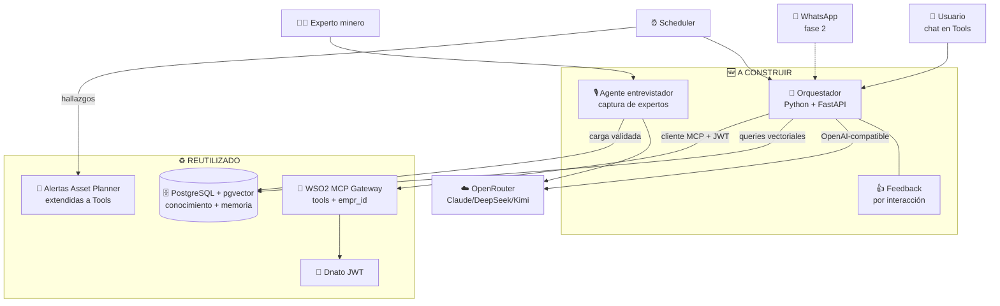
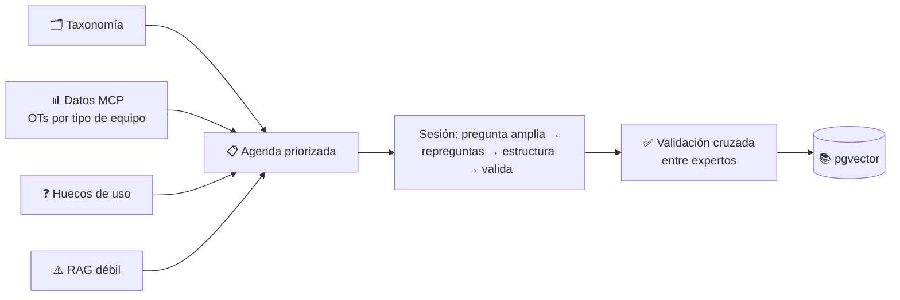
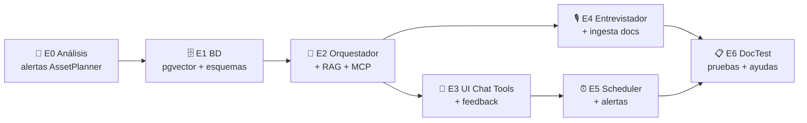

# ⚙️ Agente Minero Trazalog — Arquitectura Técnica

**Audiencia:** PM / Arquitecto / Desarrollo · **Versión:** 1.1 · **Septiembre 2026**
**Changelog v1.1:** captura de conocimiento experto (agente entrevistador), canales de interfaz, notificaciones vía alertas Asset Planner, mecanismo de feedback, integración DocTest, enfoque de versión inicial completa en rama `develop-v3.5`.

---

## 🏗️ Arquitectura de componentes

**Regla central:** 🧠 el cerebro razona vía **router**; 📚 el conocimiento por **query directa a pgvector**; 🔌 los datos del cliente **vía MCP** (aislamiento `empr_id` reutilizado); 🔔 las notificaciones por el **sistema de alertas existente**.

---

## 🧩 Artefactos a construir

| Artefacto | Rol | Justificación | Tecnología |
|---|---|---|---|
| 🧠 **Orquestador** | Loop del agente: recibe consulta, decide (RAG/MCP/ambos), responde | Componente central nuevo | Python + FastAPI |
| 💬 **UI Chat en Tools** | Interfaz del cliente final dentro de Trazalog Tools | Cero fricción de adopción, upsell natural | PHP/CodeIgniter (vista) + API al orquestador |
| 🎙️ **Agente entrevistador** | Captura conocimiento experto conversando, con agenda priorizada por datos reales | El conocimiento tácito es el foso defensivo | Orquestador + UI web simple |
| 📚 **Pipeline de ingesta** | Documentos → chunks + metadatos → embeddings → pgvector | Base documental del conocimiento | Python |
| 🗄️ **Esquema pgvector** | Conocimiento compartido + memoria particionada por `empr_id` + cola de candidatos | Reutiliza Postgres, costo $0 | Scripts SQL versionados |
| ⏰ **Scheduler** | Monitoreo proactivo programado | Habilita el modo proactivo | cron + jobs Python |
| 🔔 **Puente de alertas** | Conecta hallazgos del agente al sistema de alertas de Asset Planner, extendido a Tools | Reutiliza mecanismo probado en vez de construir | Estudio AssetPlanner → adaptación en Tools |
| 👍 **Feedback loop** | Calificación + comentario por interacción; alimenta mejoras | Requisito para iterar con evidencia | Tabla + endpoint + UI mínima |
| 🔌 **Cliente MCP interno** | El orquestador consume las tools como cualquier cliente | Reutiliza capa MCP completa | SDK MCP Python |

---

## 🎙️ Diseño de la captura de conocimiento experto

- **Agenda, no cuestionario fijo:** las preguntas se generan dinámicamente sobre una agenda de temas priorizada por 4 fuentes; la más potente son **los datos operativos reales** (qué equipos generan más OTs → ese conocimiento primero).
- **Interfaz web de chat** para MVP; **entrada por voz** (transcripción) como mejora temprana — clave para expertos de terreno.
- **Ritmo:** carga inicial intensiva y acotada; luego por evento (cola de huecos revisada mensualmente).
- **Regla de calidad:** el conocimiento compartido solo crece con validación del experto + curaduría; la memoria por cliente es automática pero aislada (ADR-A4).

---

## 🔔 Notificaciones: reutilizar alertas de Asset Planner

Asset Planner ya tiene un sistema de alertas probado. Decisión: **estudiarlo y extenderlo a Trazalog Tools** en lugar de construir uno nuevo, y que el agente lo use como canal de salida del monitoreo proactivo. Trabajo en dos pasos: (1) análisis del mecanismo actual en AssetPlanner (disparadores, canales, persistencia, configuración por usuario); (2) puente desde Tools/orquestador. Beneficio doble: el agente notifica con infraestructura conocida, y Tools gana un sistema de alertas que hoy no tiene.

---

## 🔐 Decisiones técnicas (ADRs del Agente)

- **ADR-A1 — Modelo configurable vía OpenRouter.** LLM como parámetro; overhead ~5,5%; failover; pago unificado desde Argentina; routing por costo/calidad.
- **ADR-A2 — RAG por acceso directo, NO vía MCP.** El conocimiento es maquinaria interna; MCP en el medio solo agrega latencia y costo.
- **ADR-A3 — Datos del cliente SIEMPRE vía MCP.** Reutiliza aislamiento `empr_id` (TAD-IDENT); el agente usa el token del cliente.
- **ADR-A4 — Conocimiento compartido solo con revisión humana.** Memoria por cliente automática y aislada; lo global pasa por cola de candidatos + curaduría.
- **ADR-A5 — Canal MVP: chat embebido en Tools; WhatsApp fase 2; app diferida.** Menor fricción de adopción; el MCP es plomería, no interfaz del cliente final.
- **ADR-A6 — Notificaciones vía sistema de alertas de Asset Planner extendido a Tools.** Reutilización sobre construcción; requiere análisis previo del mecanismo actual.

---

## 💵 Costos por etapa de madurez

| Etapa | Infra | Costo IA (variable) | Total aprox. mensual |
|---|---|---|---|
| 🧪 **Versión inicial** (1 cliente piloto) | 1 VM chica + pgvector sobre Postgres actual | ~US$5-15 | **~US$30-50** |
| 🌱 **MVP comercial** (3-5 clientes) | 1 VM mediana + embeddings vía API | ~US$25-50/cliente | **~US$150-300** |
| 📈 **Escala** (20+ clientes) | VM dedicada + routing optimizado | ~US$5-30/cliente | **cubierto por suscripciones** |

> El costo de IA se traslada vía suscripción (objetivo: ≤30% del precio del tier). La premisa "costo $0" no aplica a esta capa: es costo variable que escala con ingresos.

---

## 📅 Plan de trabajo — versión inicial completa (rama `develop-v3.5`)

**Enfoque acordado:** construir una primera versión con **todo el alcance** para tomar contacto real y derivar mejoras desde el uso, con feedback integrado desde el día uno. Desarrollo delegado a Claude Code bajo prompt dirigido (ver `PROMPT_CC_AGENTE_MINERO.md`).

| Etapa | Interacción PM/Arq/Dev requerida |
|---|---|
| 🔎 E0 Análisis alertas | 🟡 Validás conclusiones del estudio antes de conectar |
| 🗄️ E1 Base de datos | 🟢 Revisión de esquema (PR) |
| 🧠 E2 Orquestador | 🔴 Definís prompts de sistema, apruebas selección de modelos, validás aislamiento `empr_id` end-to-end |
| 💬 E3 UI Chat | 🟡 Validás UX y el flujo de feedback |
| 🎙️ E4 Entrevistador | 🔴 Definís taxonomía inicial y priorización; probás con un experto real |
| ⏰ E5 Proactivo | 🟡 Definís qué se monitorea y umbral de alertas |
| 📋 E6 DocTest | 🟡 Aprobás catálogo antes de generar artefactos (gate DocTest habitual) |

**Gates de decisión:** (1) conclusiones E0 sobre alertas; (2) banco de pruebas de modelos con tool-calling real; (3) tiers y topes de consumo; (4) validación multi-tenant antes de exponer a cliente.

---

## ⚠️ Riesgo principal

**La calidad del conocimiento, no la tecnología.** La arquitectura es replicable; el foso es el conocimiento curado + los datos operativos reales. El enfoque agresivo acelera el contacto con la realidad, pero el agente solo será tan bueno como el conocimiento cargado — la Fase de captura con expertos sigue siendo el determinante del valor.
