# Trazalog v3 — Estrategia de CI/CD y Branching

> **Documento de referencia operativa**
> Versión: 1.1
> Fecha: Abril 2026
> Autor: Rodolfo (Co-founder & Lead Developer) + Claude (AI Engineering Advisor)
> Estado: Aprobado para implementación
>
> **Cambios v1.1 (29-Abr-2026):**
> - Corregido: rama productiva es `master` (no `main`), respetando la convención del repo actual de Trazalog
> - Aclarado: testing en v2 sigue 100% manual con QC; v3 nace automatizado desde día 1
> - Detallado: cómo construimos la suite de regresión partiendo de pruebas manuales (sección 6.2)

---

## Tabla de contenidos

1. [Resumen ejecutivo](#1-resumen-ejecutivo)
2. [Modelo de branching](#2-modelo-de-branching)
3. [Flujo de trabajo por escenario](#3-flujo-de-trabajo-por-escenario)
4. [CI/CD — Pipelines y automatización](#4-cicd--pipelines-y-automatización)
5. [Estrategia de testing](#5-estrategia-de-testing)
5-bis. [Metodología de trabajo PM + Claude Code (v2)](#5-bis-metodología-de-trabajo-pm--claude-code-v2)
6. [Suite de regresión v2 → v3](#6-suite-de-regresión-v2--v3)
7. [Migraciones de base de datos](#7-migraciones-de-base-de-datos)
8. [Convergencia v2 → v3 (cutover)](#8-convergencia-v2--v3-cutover)
9. [Roles y responsabilidades](#9-roles-y-responsabilidades)
10. [Riesgos y mitigaciones](#10-riesgos-y-mitigaciones)
11. [Plan de implementación](#11-plan-de-implementación)

---

## 1. Resumen ejecutivo

### Contexto

Trazalog Tools v2 está vivo en producción (cloudtrazalog.com). Hoy **no hay clientes on-premise activos**, lo cual simplifica significativamente la estrategia. El equipo de soporte trabaja sobre la rama `develop` con un flujo que funciona y que **no debe modificarse**.

En paralelo, se desarrolla Trazalog Tools v3, que incorpora la capa MCP (Model Context Protocol) y otras mejoras arquitectónicas. La versión 3 debe poder desarrollarse sin afectar la operación normal de soporte de v2.

### Premisas de diseño

| # | Premisa | Implicancia |
|---|---|---|
| 1 | No hay clientes on-premise activos | No se mantiene rama LTS de v2 |
| 2 | El equipo de soporte sigue trabajando sobre `develop` | No se renombra ni reorganiza la rama existente |
| 3 | Mismo equipo trabaja en v2 y v3 | El flujo debe minimizar context-switching |
| 4 | v3 reemplaza completamente a v2 cuando esté lista | Convergencia única al final, no convivencia indefinida |
| 5 | Las migraciones de BD son críticas y manuales | No se automatiza el deploy de cambios de esquema |
| 6 | Regresión: top 10-15 flujos críticos | Enfoque Pareto, no cobertura total |
| 7 | v2 hoy se prueba 100% manual con QC | v2 sigue así; v3 nace automatizado desde día 1 |
| 8 | Las ramas productivas se llaman `master` (no `main`) | Convención del repo actual de Trazalog |

### Estrategia en una frase

> **La rama `develop` actual sigue siendo la línea de soporte v2 sin cambios; v3 vive en `develop-v3` con su propio CI/CD; cuando v3 está validado, se hace cutover único: merge de `develop-v3` a `develop`, ejecución de la suite completa de regresión, y promoción a `master`.**

### Diagrama general

```mermaid
%%{init: {'theme':'base', 'themeVariables': {
  'primaryColor':'#1e40af',
  'primaryTextColor':'#ffffff',
  'primaryBorderColor':'#1e3a8a',
  'lineColor':'#475569',
  'background':'#ffffff'
}}}%%
gitGraph
  commit id: "v2 actual"
  branch develop
  checkout develop
  commit id: "soporte v2"
  branch develop-v3
  checkout develop-v3
  commit id: "v3 MCP setup"
  commit id: "v3 tools MVP"
  checkout develop
  commit id: "fix v2 prod"
  checkout develop-v3
  commit id: "v3 metering"
  checkout develop
  commit id: "feature v2"
  checkout develop-v3
  commit id: "v3 HSE"
  commit id: "v3 ready"
  checkout develop
  merge develop-v3 tag: "cutover-v3"
  commit id: "regresión OK"
  checkout master
  merge develop tag: "v3.0.0"
```

---

## 2. Modelo de branching

### 2.1 Las tres ramas largas

| Rama | Propósito | Quién mergea | Protección |
|---|---|---|---|
| `master` | Código en producción (cloudtrazalog.com). Hoy v2, en el futuro v3. | Solo merge desde `develop` con tag de release | PR + 1 approval + CI verde + sin force-push |
| `develop` | Línea de soporte v2: bugfixes, hotfixes, mejoras menores. **Flujo de trabajo actual del equipo intacto.** | Merges desde `feature/*` y `hotfix/*` siguiendo el proceso actual | PR + CI verde |
| `develop-v3` | Línea de desarrollo v3. Aislada de soporte. | Merges desde `feature/v3-*` | PR + CI verde |

### 2.2 Ramas de trabajo

| Patrón | Ramo de origen | Destino | Vida |
|---|---|---|---|
| `feature/<issue>-<desc>` | `develop` | Vuelve a `develop` (soporte v2) | 1-5 días |
| `feature/v3-<issue>-<desc>` | `develop-v3` | Vuelve a `develop-v3` (desarrollo v3) | 1-10 días |
| `hotfix/<issue>-<desc>` | `master` | `master` + cherry-pick a `develop` y a `develop-v3` si aplica | Horas |
| `release/v2.x.y.z` | `develop` | `master` (con tag) | Horas |
| `release/v3.0.0` | `develop` (post-cutover) | `master` (con tag) | Días |

### 2.3 Comparación con el flujo actual

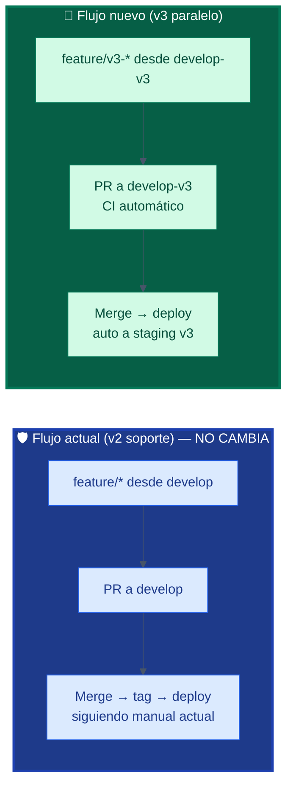

### 2.4 Setup técnico (comandos)

Para cada repositorio del ecosistema (`traz-tools` + cada submódulo que va a tener trabajo de v3):

```bash
# 1. Asegurarse de estar al día
git checkout develop
git pull origin develop

# 2. Crear develop-v3 desde develop
git checkout -b develop-v3
git push -u origin develop-v3

# 3. Configurar branch protection en GitHub (UI)
# Settings → Branches → Add rule:
#   - Branch name pattern: develop-v3
#     ✓ Require pull request before merging
#     ✓ Require status checks to pass
#     ✓ Require branches to be up to date
#     ✓ Do not allow bypassing
```

Para repos que no van a tener trabajo de v3 (módulos que se mantienen tal cual), no hace falta crear `develop-v3` — solo se crea cuando aparezca el primer feature v3 que toque ese repo.

### 2.5 Sincronización periódica `develop → develop-v3`

Para evitar divergencia, **una vez por semana** (o cuando haya un fix relevante en `develop`), se sincroniza:

```bash
git checkout develop-v3
git pull origin develop-v3
git merge origin/develop --no-ff -m "chore: sync v2 fixes from develop"
# Resolver conflictos si los hay
git push origin develop-v3
```

Esto mantiene `develop-v3` "viviendo encima" de los fixes de v2, y reduce el riesgo de explosión de conflictos en el cutover final.

---

## 3. Flujo de trabajo por escenario

### 3.1 Escenarios y su flujo

| Escenario | Rama origen | Rama destino | Quién |
|---|---|---|---|
| **Bug en producción v2** | `master` → `hotfix/*` | `master` + `develop` + `develop-v3` | Soporte |
| **Bugfix descubierto en QC v2** | `develop` → `feature/*` | `develop` | Soporte |
| **Mejora menor v2** | `develop` → `feature/*` | `develop` | Soporte |
| **Feature v3 (MCP gateway, etc.)** | `develop-v3` → `feature/v3-*` | `develop-v3` | Equipo v3 |
| **Refactor compartido** | `develop` → `feature/*` | `develop` (luego sync a `develop-v3`) | Soporte |
| **Release planificado v2** | `develop` → `release/v2.x.y.z` | `master` | Líder de release |
| **Cutover v3** | `develop-v3` | `develop` → `master` | Líder técnico (Rodolfo) |

### 3.2 Hotfix de producción — el caso crítico

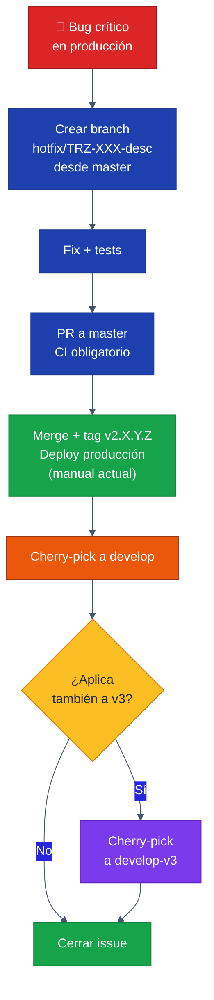

**Comandos del cherry-pick:**

```bash
# Desde master, anotamos el SHA del commit del hotfix
git checkout master
git log -1 --format="%H"  # copiar el SHA

# A develop
git checkout develop
git pull origin develop
git cherry-pick <SHA>
# Si hay conflictos, resolver y "git cherry-pick --continue"
git push origin develop

# A develop-v3 si aplica
git checkout develop-v3
git pull origin develop-v3
git cherry-pick <SHA>
git push origin develop-v3
```

### 3.3 Feature v3 — flujo estándar

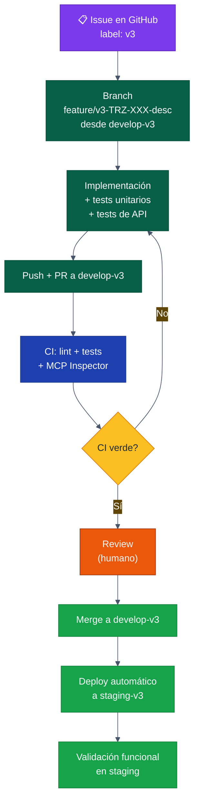

### 3.4 Soporte v2 — flujo intacto

El equipo de soporte sigue trabajando como hoy. Lo único que se agrega es un CI básico que **no bloquea su forma de trabajar**, solo valida automáticamente:

- Lint (no falla por ahora — modo "warning")
- Tests existentes (los que haya — no se exigen tests nuevos a soporte)
- Schema de BD coherente con migraciones documentadas

El despliegue sigue el manual actual con `deploytools.sh`, GitKraken, DBeaver compare. **Cero cambios para el equipo de soporte.**

---

## 4. CI/CD — Pipelines y automatización

### 4.1 Visión general

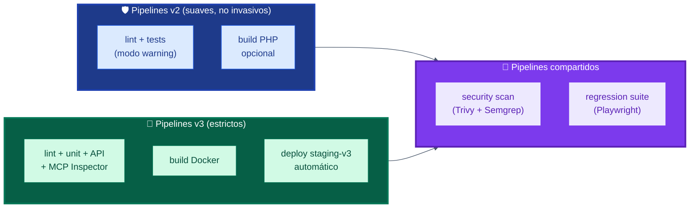

### 4.2 Workflows en `traz-tools/.github/workflows/`

| Archivo | Trigger | Qué hace |
|---|---|---|
| `v2-ci.yml` | PR a `develop` o `master` | Lint (warning), tests existentes, smoke check |
| `v3-ci.yml` | PR a `develop-v3` | Lint estricto, unit tests, API tests, MCP Inspector |
| `v3-deploy-staging.yml` | Push a `develop-v3` | Build Docker, deploy a staging-v3 GCP |
| `regression.yml` | Manual (workflow_dispatch) o schedule semanal | Ejecuta suite de regresión Playwright |
| `security.yml` | Diario (cron) + en cada PR | Trivy + Semgrep + secret scan |
| `compatibility-check.yml` | PR a `develop`, `develop-v3`, `master` | Verifica que los punteros de submódulos sean válidos |

### 4.3 Stack de herramientas — todo open source

| Función | Herramienta | Licencia | Por qué |
|---|---|---|---|
| CI/CD runner | **GitHub Actions** | Free para repos privados (2.000 min/mes) | Nativo, sin servidor adicional |
| Containerización | **Docker + docker-compose** | Apache 2.0 | Estándar, ya conocido |
| Registry | **GitHub Container Registry** | Free | Junto al repo |
| Config management | **Ansible** | GPL | Sin agentes, declarativo |
| Migraciones BD (scripts versionados, no automáticos) | **Phinx** | MIT | PHP nativo, soporta Oracle/MySQL/PostgreSQL |
| Linting PHP | **PHP_CodeSniffer + PHPStan** | BSD / MIT | Estándar |
| Tests unitarios | **PHPUnit** | BSD | Estándar PHP |
| Tests de API | **Hurl** + **Bruno** | Apache 2.0 / MIT | Hurl es ideal para CI, Bruno para devs |
| Tests E2E | **Playwright** | Apache 2.0 | Mejor que Cypress para multi-browser |
| Tests MCP | **MCP Inspector** + custom scripts | MIT | Oficial de Anthropic |
| BDD | **Behat** | MIT | Gherkin sobre PHP |
| Tests de carga | **k6** | AGPL | Open source, sintaxis JavaScript |
| Security scan | **Trivy + Semgrep + gitleaks** | Apache 2.0 / LGPL / MIT | Stack DevSecOps completo |
| Feature flags | **Unleash self-hosted** | Apache 2.0 | Para rollout gradual de tools MCP |
| Observabilidad | **SigNoz** | Apache 2.0 | Métricas + logs + traces unificados |

### 4.4 Estrategia de deployment por entorno

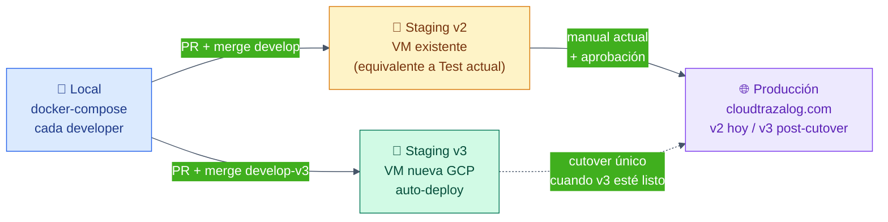

| Entorno | Frecuencia deploy | Trigger | Aprobación |
|---|---|---|---|
| Local | Continuo | Cada commit | Auto |
| Staging v2 | Según necesidad de soporte | Manual o merge a `develop` | Auto si CI verde |
| Staging v3 | Diaria (varias x día) | Merge a `develop-v3` | Auto si CI verde |
| Producción v2 | Cuando hay release | Tag `v2.X.Y.Z` en `master` | **Manual (Rodolfo)** + manual actual |
| Producción v3 | Una sola vez (cutover) | Tag `v3.0.0` en `master` | **Manual (Rodolfo)** + checklist completo |

---

## 5. Estrategia de testing

### 5.1 Premisa fundamental: v2 y v3 tienen mecánicas distintas de testing

Esta es probablemente la decisión más importante del documento, y conviene dejarla explícita:

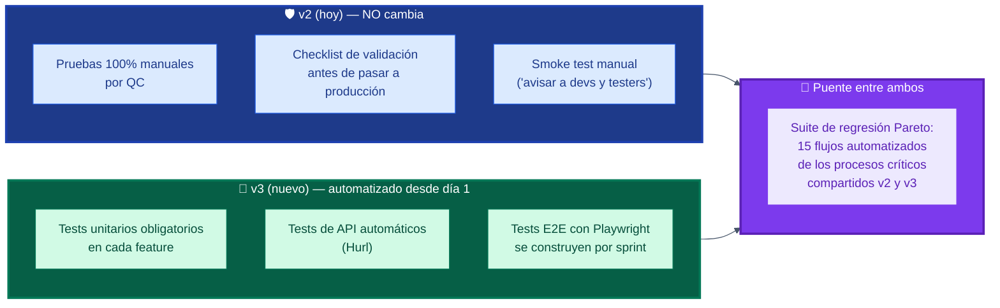

### Por qué v2 sigue manual y v3 nace automatizado

**v2 ya está vivo y funcionando**. Retrofittear unit tests a código legacy de CodeIgniter es un proyecto de meses con beneficio incremental bajo. **No tiene sentido** dedicar el equipo a eso cuando el objetivo estratégico es v3. El QC humano sigue cubriendo v2 con su checklist actual.

**v3 nace desde cero**. Es la oportunidad para hacerlo bien desde el primer commit: cada feature trae sus tests, el CI los ejecuta automáticamente, los bugs no llegan a producción. Esto **no es opcional ni "nice-to-have" en v3** — es Definition of Done de cada PR.

### El puente: la suite de regresión Pareto

Acá viene la parte interesante. Necesitamos automatizar **los 10-15 flujos más críticos** que existen en v2 y van a seguir existiendo en v3 (login, OTs, stock, KPIs, etc.). Esa suite se construye gradualmente durante el desarrollo de v3, contra el sistema v2 actual, y al momento del cutover se ejecuta contra v3 para garantizar que esos flujos no se rompieron.

Esto se detalla en la **sección 6**.

### 5.2 Pirámide de testing para v3

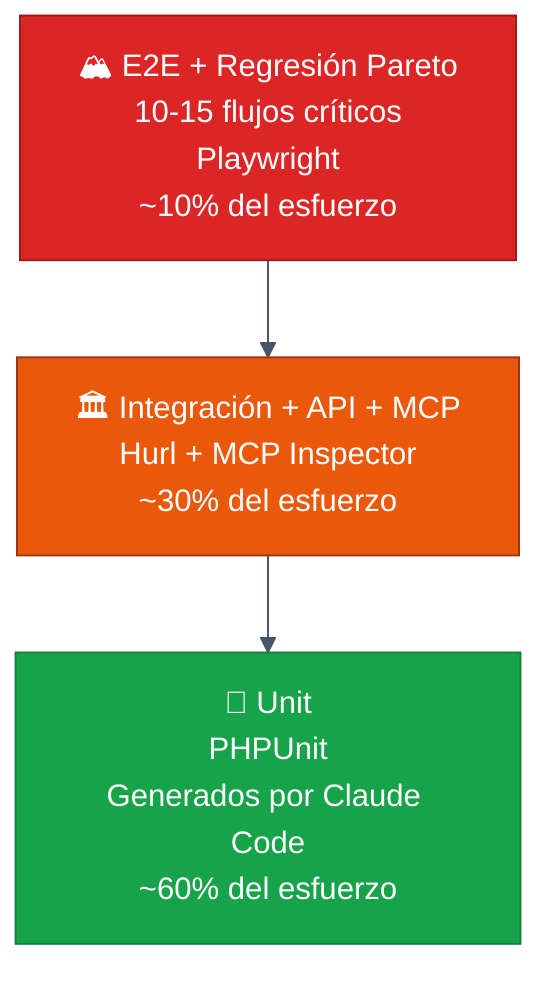

### 5.3 Niveles de testing — quién hace qué

| Nivel | Aplica a | Herramienta | Quién las escribe | Quién valida | Frecuencia ejecución |
|---|---|---|---|---|---|
| **Manual QC checklist** | v2 (no cambia) | Documentos / Asana | QC humano | QC humano | Antes de pasar a producción |
| **Unit** | v3 | PHPUnit | Claude Code, junto al código | CI bloquea si falla | Cada commit |
| **Integración + API** | v3 | Hurl + Bruno | Claude Code (genera) + vos (revisás 1ª vez) | CI bloquea si falla | Cada PR |
| **MCP tools** | v3 | MCP Inspector + scripts | Claude Code + vos (1ª vez por tool) | CI bloquea si falla | Cada PR |
| **E2E flujos críticos** | v3 | Playwright | Vos definís el flujo, Claude Code lo implementa | Vos antes del cutover | Diaria + cada release |
| **Regresión Pareto v2→v3** | Ambos | Playwright | Equipo + Claude Code (ver sección 6.5) | Vos + QC | **Crítico antes del cutover** |
| **Carga / performance** | v3 | k6 | Claude Code | Vos revisás thresholds | Pre-release |
| **Security** | v3 | Trivy + Semgrep + gitleaks | CI automático | Vos revisás hallazgos | Diaria + cada PR |

### 5.3-bis Cómo se coordina la generación de tests

> **Nota de versión (Jul 2026):** esta sub-sección reemplaza al flujo original "Gherkin → Behat → TDD inverso con el PM escribiendo criterios antes del código", que nunca se aplicó en la práctica durante el Sprint 2 (ver retro en `doc/v3/trazalog-v3-sprint-2-retro.md`). El proceso de coordinación vigente entre PM, Rodolfo y Claude Code está definido en la **sección 5-bis** de este documento. En síntesis, para testing: Claude Code genera los tests junto al código como parte de su DoD (columna "Quién las escribe" de la tabla 5.3), los reporta en la descripción del PR ("Cómo lo verifiqué"), y Rodolfo los revisa en el diff. Los criterios de aceptación viajan en el DoD de la tarea emitida por Claude Web — no en features Gherkin separados.

### 5.4 Lo que NO automatizamos

- ❌ **Validación de UX/UI**: requiere ojo humano
- ❌ **Validación semántica de respuestas IA**: que la tool responda con datos *útiles*, no solo correctos. Esto lo probás con clientes reales en staging.
- ❌ **Decisiones de pricing/negocio**: el código las implementa, las reglas las define la gente.
- ❌ **Migraciones de BD**: ver sección 7.

---
---

## 5-bis. Metodología de trabajo PM + Claude Code (v2)

> **Nota de versión (Jul 2026):** esta sección define el proceso de coordinación vigente entre Claude Web (PM), Rodolfo y Claude Code. Reemplaza al flujo Gherkin→Behat→TDD-inverso que describía la sub-sección 5.3 original (nunca aplicado en la práctica — ver retro del Sprint 2). La estrategia técnica de testing (5.1–5.4: pirámide, niveles, herramientas) sigue vigente y esta sección no la modifica.

### 5-bis.1 Principio rector

> **"El repo es la única fuente de verdad. El chat es efímero. Todo lo que importa se materializa en git o no existe."**

El Sprint 2 mostró cinco puntos críticos, todos derivados de una misma causa: el estado del proyecto vivía en la conversación con Claude Web, no en el repositorio.

| # | Punto crítico detectado |
|---|---|
| 1 | Estado fantasma — docs desincronizados, trabajo "hecho" que no estaba, auditorías de emergencia |
| 2 | Contexto degradado hacia Claude Code — reconstruido de memoria en cada prompt, causó violaciones de restricciones (PHP 5.6 x2) e implementación de mecanismos ya deprecados |
| 3 | Git sin barandas — commits directos a ramas de integración *(ya mitigado, ver §2.4 y CLAUDE.md)* |
| 4 | Burocracia sin ciclo de vida — backlog en xlsx congelado, scripts de un solo uso en el repo, issues creados retroactivamente |
| 5 | Validación contra resúmenes en lugar de contra el repo real |

### 5-bis.2 Los tres actores y sus roles

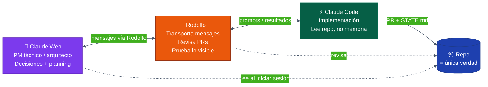

Claude Web y Claude Code **no tienen canal directo** — Rodolfo transporta los mensajes entre ambos. Lo que cambia respecto al Sprint 2 no es ese hecho (es una limitación de la herramienta), sino **cuánto contexto pesa cada mensaje transportado**: pasa de prompts artesanales de ~80 líneas reconstruidos de memoria, a prompts de ~10 líneas que remiten a documentos versionados que Claude Code lee por su cuenta.

### 5-bis.3 Los dos documentos que sostienen todo

| Documento | Ubicación | Quién lo escribe | Quién lo lee |
|---|---|---|---|
| **CONTEXT-PACK.md** | `doc/v3/CONTEXT-PACK.md` (uno por repo) | Se actualiza junto con cada ADR nuevo | Claude Code, al inicio de cada tarea |
| **STATE.md** | `traz-tools/doc/v3/STATE.md` (único, aunque haya 2 repos) | Claude Code, al cierre de cada tarea | Claude Web, al inicio de cada sesión |

**CONTEXT-PACK.md** es el resumen operativo de arquitectura, restricciones y regla de repos — pero es explícito en que **no es la fuente de verdad**: remite a `TRAZALOG_v3_MCP_ARCHITECTURE.md`, a los ADR individuales, y a los documentos de negocio (investigación del sector minero, pricing) como fuentes canónicas. Ver plantilla completa en `doc/v3/CONTEXT-PACK.md`.

**STATE.md** es el tablero de qué está pasando ahora: sprint activo, tareas en curso con su clase de riesgo, próxima acción, últimas decisiones, bloqueos. Reemplaza al kickoff como documento de estado — el kickoff vuelve a ser lo que siempre debió ser: un plan inicial inmutable, no un documento que se reescribe cada semana.

### 5-bis.4 El ciclo de una tarea — 4 pasos, 1 compuerta humana

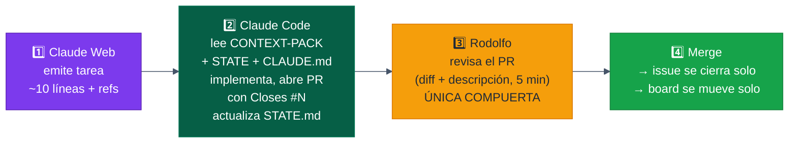

Ejemplo de tarea emitida por Claude Web (formato real, no ilustrativo):

```
Leé doc/v3/CONTEXT-PACK.md y doc/v3/STATE.md antes de empezar.
Tarea: E1-API-16 — Tool list_overdue_preventives (equipos con preventivo vencido)
DoD:
- [ ] Query filtra por empr_id vía el mecanismo ADR-009 (X-JWT-Assertion)
- [ ] Ordenado por criticidad descendente
- [ ] Spec OpenAPI en doc/api/equipos.yaml actualizada
- [ ] PR con Closes #421, descripción funcional, STATE.md actualizado
```

**Qué desaparece respecto al Sprint 2:** el paso "Claude Code pega su resumen en el chat para que Claude Web lo valide". Claude Web ya no necesita ese resumen — si necesita saber algo, lee el PR o el STATE.md directamente del repo. Esto elimina el punto crítico #5 (validar contra resúmenes en lugar de la realidad).

**Formato obligatorio de la descripción del PR** (para que el review de Rodolfo sea de 5 minutos, no de 30):
```markdown
## Qué cambia
[1-2 líneas, en términos funcionales]

## Por qué
[referencia a la tarea / decisión que lo origina]

## Cómo lo verifiqué
[build / tests / curls ejecutados — con resultado]

Closes #NNN
```

### 5-bis.5 Clasificación de tareas por riesgo

El proceso debe ser proporcional al costo de un error, no uniforme. En el Sprint 2, una corrección de `.gitignore` pasó por el mismo ceremonial que el rediseño del mecanismo de identidad — eso es desperdicio de proceso.

| Clase | Qué incluye | Ejemplos en Trazalog | Proceso |
|---|---|---|---|
| 🟢 **Rutina** | Docs, scripts de dev, tests, configs menores. Nada que toque runtime de producción ni datos | Agregar un test Hurl, corregir un typo en un doc, un script de mantenimiento del Project board | Claude Code solo, sin pasar por Claude Web. Rodolfo revisa y mergea |
| 🟡 **Estándar** | Features, endpoints, tools MCP nuevas o modificadas | Agregar la tool `update_ot`, un nuevo campo en `equipos.yaml`, un Virtual MCP Server | Claude Web emite la tarea → Claude Code ejecuta → review de PR de Rodolfo |
| 🔴 **Decisión** | ADRs, cambios de arquitectura, migraciones de BD, seguridad, **cambios al modelo de negocio** (pricing, tiers, límites, alcance del freemium) | El pivote ADR-008→ADR-009, agregar una migración de `seg.oauth_codes`, cambiar límites de un tier | Workshop Claude Web + Rodolfo PRIMERO → decisión documentada en ADR → recién ahí Claude Code implementa |

### 5-bis.6 Reglas de escalamiento — cuándo Claude Code te pregunta

Claude Code puede y debe pedir interacción cuando hay ambigüedad. La regla de oro: **ante la duda de si algo es menor o funcional, preguntá — el costo de preguntar es un minuto; el costo de un desvío de arquitectura son semanas** (evidencia: el pivote ADR-008→ADR-009 costó tres semanas de trabajo a reencauzar).

| Tipo de duda | Qué hace Claude Code | Ejemplo real del Sprint 2 |
|---|---|---|
| **Técnica menor** — dos formas válidas de resolver lo mismo | Decide solo, documenta la elección en la descripción del PR | Nombre de una sequence, estructura interna de un test |
| **Funcional o de negocio** — variantes con impacto distinto para el usuario o el modelo comercial | PARA y pregunta a Rodolfo con las opciones + su recomendación. No avanza sin respuesta | "¿El rollback de `create_ot` hace DELETE o deja la solicitud en draft?" |
| **Arquitectura** — contradice o no está cubierto por el CONTEXT-PACK / los ADRs | PARA, marca la tarea como "requiere decisión de arquitectura" (queda registrada en STATE.md como bloqueo clase 🔴) | "La operation policy del gateway no puede leer el JWT" — esto fue lo que originó ADR-009 |

### 5-bis.7 Cuándo prueba Rodolfo — review vs. prueba manual

Son dos actividades distintas y no siempre coinciden en el tiempo.

**Review de PR** = leer el diff + la descripción funcional. Siempre pasa antes del merge, en toda tarea 🟡 y 🔴. Toma ~5 minutos porque Claude Code ya ejecutó las verificaciones técnicas (build, tests, curls) y las reporta en la descripción.

**Prueba manual** = Rodolfo ejecuta el flujo con sus manos contra un entorno levantado. No siempre hace falta, y cuando hace falta no siempre es antes del merge:

| Clase / tipo | ¿Prueba manual? | Cuándo |
|---|---|---|
| 🟢 | No | — |
| 🟡 interna (DataService, sequence, endpoint sin cara visible) | Opcional | Antes del merge, solo si Rodolfo desconfía del resultado |
| 🟡 visible (tool MCP nueva, pantalla, flujo OAuth) | Sí — smoke test | **Después** del merge, agrupando 2-3 features en una sola sesión de entorno levantado (WSO2 + MI + Dnato + ngrok) |
| 🔴 (identidad, seguridad, BD) | Sí, siempre | **Antes** del merge — el PR queda abierto hasta que Rodolfo lo prueba |

La razón de probar "después del merge" en las 🟡 visibles: levantar el entorno completo (WSO2, MI, Dnato, ngrok) tiene un costo fijo alto. Agrupar varias features por sesión de prueba evita que Rodolfo se convierta en cuello de botella feature por feature. Si algo falla, el historial de commits/PRs dice exactamente qué introdujo el problema.

### 5-bis.8 Ritual semanal — 15 minutos, Claude Web + Rodolfo

Agenda fija, sin improvisación:

1. **Leer STATE.md juntos** — ¿refleja la realidad del repo? Si no, se corrige ahí mismo. Esto incluye chequear la frescura del CONTEXT-PACK (¿hay ADRs nuevos sin reflejar?).
2. **Sincronizar el proyecto Claude** — subir al proyecto los documentos del repo que cambiaron esa semana (lista corta: CONTEXT-PACK, STATE, ADRs nuevos).
3. **Definir el foco de la semana** — máximo 3 tareas activas en paralelo simultáneamente.

Esto reemplaza a las auditorías de emergencia tipo "alineemos las naves" que en el Sprint 2 consumieron sesiones completas: la deriva se corrige semanalmente cuando es chica, no trimestralmente cuando ya es una crisis. Deriva máxima aceptada: 1 semana.

### 5-bis.9 Burocracia que se elimina

| Se elimina | Se reemplaza por |
|---|---|
| Backlog en xlsx | GitHub Issues puro (ya era la fuente real de facto) |
| Scripts de cierre de sprint (ej. `close-sprint-2.sh`) | `Closes #N` en la descripción de cada PR — cierre automático al mergear |
| Issues creados retroactivamente | No existen: si no hubo issue antes del trabajo, se anota en STATE.md y se sigue |
| Kickoff como documento vivo con múltiples versiones | Kickoff inmutable (plan inicial) + STATE.md (realidad actual) |
| Resúmenes de Claude Code pegados al chat de Claude Web para validar | Claude Web lee el PR o el STATE.md directamente del repo cuando lo necesita |
| Prompts artesanales de ~80 líneas reconstruidos de memoria | ~10 líneas + referencias a CONTEXT-PACK.md y STATE.md |

### 5-bis.10 Trade-offs aceptados

1. **Claude Code gana autonomía en tareas 🟢** — menos control fino de Claude Web, a cambio de velocidad. La baranda es la definición restrictiva de 🟢 (nada que toque runtime de producción ni datos).
2. **El review de PR de Rodolfo es la única compuerta en tareas estándar** — mayor responsabilidad en leer diffs, mitigada por el formato obligatorio de descripción funcional del PR.
3. **STATE.md puede desactualizarse si Claude Code omite el paso** — mitigado por estar en el DoD del CLAUDE.md y auditado en el ritual semanal.


## 6. Suite de regresión v2 → v3

### 6.1 El problema que resuelve

Cuando llegue el cutover (`develop-v3` → `develop` → `master`), necesitamos **una alta confianza** de que ningún flujo crítico de v2 dejó de funcionar. La regresión es el "seguro de vida" del cutover.

### 6.2 La pregunta de fondo: ¿cómo automatizamos si hoy es todo manual?

Esta es la duda más legítima. Hoy QC prueba manualmente siguiendo un checklist mental + experiencia. Nadie en el equipo escribe código de testing. Entonces ¿cómo construimos una suite Playwright si nadie sabe Playwright?

**Respuesta corta:** la unión de tres conocimientos.

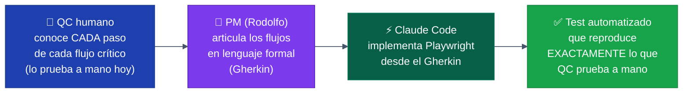

**Lo que hace cada uno:**

| Actor | Aporte | Por qué es clave |
|---|---|---|
| 👤 **QC** | Describe el flujo paso a paso, como lo prueba hoy | Es el único que conoce el comportamiento real esperado del sistema |
| 🧑 **PM (Rodolfo)** | Toma esa descripción y la formaliza en Gherkin con ayuda de Claude Web | Convierte conocimiento tácito en especificación ejecutable |
| ⚡ **Claude Code** | Lee el Gherkin y genera el test Playwright | Aporta el conocimiento técnico de la herramienta |

**Sesión típica de captura de un flujo (~1.5 horas por flujo):**

1. **QC ejecuta el flujo en pantalla** mientras lo narra ("entro al menú X, elijo Y, cargo este formulario, valido Z…")
2. **Vos tomás nota estructurada** en formato Gherkin con Claude Web abierto en otra pestaña
3. **Claude Web propone el `.feature`** completo, vos lo revisás
4. **Claude Code recibe el archivo** y genera el `.spec.ts` de Playwright
5. **El test se ejecuta contra staging v2** — si pasa, baseline establecida; si falla, ajustes
6. **QC valida que el test cubra todo** lo que él valida manualmente

### 6.3 Filosofía Pareto + construcción gradual

No podemos automatizar el 100% de v2 (sería un proyecto de 6 meses solo para tests). Pero **el 20% de los flujos generan el 80% del valor de negocio**. Apuntamos a 10-15 flujos críticos.

**Cómo se construye en el tiempo:**

```mermaid
%%{init: {'theme':'base', 'themeVariables': {
  'primaryColor':'#1e40af',
  'primaryTextColor':'#ffffff',
  'primaryBorderColor':'#1e3a8a',
  'lineColor':'#475569',
  'background':'#ffffff'
}}}%%
gantt
    title Construcción gradual de la suite de regresión (en paralelo al desarrollo de v3)
    dateFormat YYYY-MM-DD
    axisFormat %b
    section Sprint 0-1
    Sesión: definir 15 flujos con QC      :2026-05-01, 14d
    Setup Playwright + primer flujo (login):2026-05-08, 10d
    section Sprints 2-7
    1 flujo por sprint (×6 flujos)        :2026-05-22, 90d
    section Sprints 8-12
    1 flujo por sprint (×6 flujos)        :2026-08-22, 90d
    section Pre-cutover
    Suite completa contra staging v2      :2026-12-01, 21d
    Suite completa contra staging v3      :2026-12-15, 14d
```

**Ritmo realista:** 1 flujo nuevo cada sprint quincenal. En 6 meses tenés los 12-15 flujos cubiertos. Esto **se hace en paralelo al desarrollo de v3**, no en una fase separada.

### 6.4 Cómo identificar los 10-15 flujos críticos

Esta lista la armás vos + el equipo de QC. Los criterios para incluir un flujo:

1. ¿Lo usa el cliente todos los días? → 🟢 Sí
2. ¿Si se rompe, el cliente abre un ticket inmediato? → 🟢 Sí
3. ¿Tiene impacto en datos críticos (OTs, stock, KPIs)? → 🟢 Sí
4. ¿Está expuesto vía MCP en v3? → 🟢 Sí (doble criticidad)

### 6.5 Lista propuesta de flujos a regresionar

Esta es una propuesta inicial, validable con tu equipo:

| # | Flujo | Módulo | Criticidad | Tiempo estimado |
|---|---|---|---|---|
| 1 | Login + selección de empresa | Core | 🔴 Crítico | 1 hora |
| 2 | Crear OT correctiva manual | Asset Planner | 🔴 Crítico | 3 horas |
| 3 | Crear OT preventiva (programada) | Asset Planner | 🔴 Crítico | 3 horas |
| 4 | Asignar técnico a OT y cerrar OT | Asset Planner | 🔴 Crítico | 4 horas |
| 5 | Consumir material/repuesto en OT | Asset Planner + Almacén legacy | 🔴 Crítico | 4 horas |
| 6 | Visualizar dashboard de KPIs (MTBF/MTTR/Disp.) | Asset Planner | 🟡 Alto | 2 horas |
| 7 | Generar informe KoolReport semanal | Asset Planner | 🟡 Alto | 3 horas |
| 8 | Crear movimiento de stock (entrada/salida/transferencia) | traz-comp-almacenes | 🔴 Crítico | 4 horas |
| 9 | Generar QR de artículo y consultarlo | traz-comp-almacenes | 🟡 Alto | 2 horas |
| 10 | Iniciar workflow Bonita y completar primera tarea | Procesos/BPM | 🟡 Alto | 3 horas |
| 11 | Carga de formulario dinámico con archivo adjunto | Formularios | 🟡 Alto | 2 horas |
| 12 | Registrar residuo (módulo RESI) | Residuos | 🟢 Medio | 2 horas |
| 13 | Crear registro de producción | Producción | 🟢 Medio | 3 horas |
| 14 | Gestión de usuarios y permisos | Dnato (seguridad) | 🟡 Alto | 2 horas |
| 15 | Multi-empresa: cambiar contexto de empresa | Core | 🟡 Alto | 1 hora |

**Total estimado**: ~40 horas de esfuerzo de Claude Code para implementar (con tu validación). Esto **debe estar listo antes del cutover** — idealmente, durante el desarrollo de v3, en paralelo.

### 6.6 Implementación técnica de la regresión

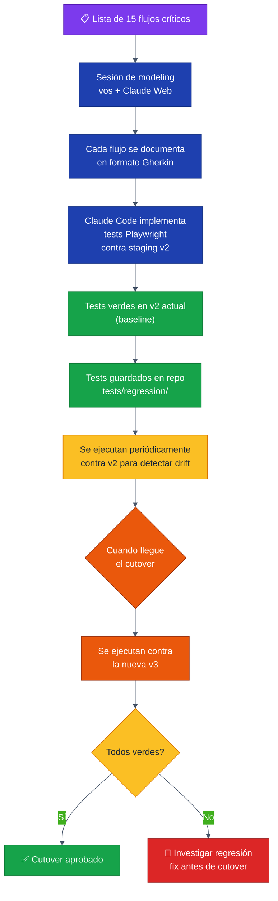

### 6.7 Estructura de la suite de regresión en el repo

```
tests/
├── regression/
│   ├── playwright.config.ts          # Config para correr contra v2 o v3
│   ├── fixtures/
│   │   ├── test-data.sql             # Datos de prueba versionados
│   │   └── test-users.json
│   ├── flows/
│   │   ├── 01-login-and-company.spec.ts
│   │   ├── 02-create-corrective-ot.spec.ts
│   │   ├── 03-create-preventive-ot.spec.ts
│   │   ├── 04-assign-and-close-ot.spec.ts
│   │   ├── 05-consume-material-in-ot.spec.ts
│   │   ├── 06-kpi-dashboard.spec.ts
│   │   ├── 07-koolreport-weekly.spec.ts
│   │   ├── 08-stock-movement.spec.ts
│   │   ├── 09-qr-article.spec.ts
│   │   ├── 10-bonita-workflow.spec.ts
│   │   ├── 11-dynamic-form-attachment.spec.ts
│   │   ├── 12-waste-registration.spec.ts
│   │   ├── 13-production-record.spec.ts
│   │   ├── 14-user-permissions.spec.ts
│   │   └── 15-multi-company-context.spec.ts
│   ├── helpers/
│   │   ├── auth.ts                   # Login helper
│   │   ├── data-setup.ts             # Setup/teardown de datos
│   │   └── api-client.ts             # Cliente API reutilizable
│   └── README.md
```

### 6.8 Cuándo se ejecuta la regresión

| Momento | Frecuencia | Target |
|---|---|---|
| Durante desarrollo v3 | Semanal (cron) | staging v2 (baseline) |
| Pre-cutover | Diaria | staging v3 |
| Día del cutover | Una vez completa | producción v3 (post-deploy) |
| Post-cutover (1 mes) | Semanal | producción v3 |

### 6.9 Definition of Done de la suite de regresión

**Para considerar la suite "lista para cutover":**

- ✅ Los 15 flujos están automatizados con Playwright
- ✅ Todos pasan contra `staging v2` durante 7 días consecutivos
- ✅ Todos pasan contra `staging v3` durante 3 días consecutivos
- ✅ Documentación de cada flujo en `tests/regression/README.md`
- ✅ Pipeline `regression.yml` corriendo y notificando vía Slack/email

---

## 7. Migraciones de base de datos

### 7.1 Premisa: NO automatizamos el deploy de cambios de esquema

Las migraciones de BD son críticas y serán supervisadas manualmente. **Nunca se aplican automáticamente en producción**. Lo que hacemos es **mejorar el proceso actual sin volverlo automático**.

### 7.2 Cambios respecto al proceso actual

| Aspecto | Hoy (manual) | Propuesta (semi-asistido) |
|---|---|---|
| Detección de cambios | DBeaver compare | DBeaver compare (sigue) **+** scripts versionados en repo |
| Generación del SQL | Manual a partir del compare | Manual + asistido por Claude Code |
| Almacenamiento del SQL | Tickets de Asana, archivos sueltos | **Versionado en `db/migrations/<release>/`** |
| Aplicación en TEST | Manual con DBeaver/psql | Manual con DBeaver/psql (sigue) |
| Aplicación en PROD | Manual con backup previo | Manual con backup previo (sigue) **+** registro de quién/cuándo |
| Rollback | Backup pre-deploy | Backup pre-deploy (sigue) **+** scripts de rollback opcionales |

### 7.3 Estructura de migraciones en el repo

```
db/
├── migrations/
│   ├── v2.15.3/
│   │   ├── 001-add-column-criticidad-equipos.sql
│   │   ├── 002-create-index-ot-fecha.sql
│   │   ├── 002-create-index-ot-fecha.rollback.sql
│   │   └── README.md
│   ├── v2.15.4/
│   │   └── 001-modify-tabla-stock-lotes.sql
│   ├── v3.0.0-alpha.1/
│   │   ├── 001-create-mcp-tool-calls-table.sql
│   │   ├── 002-create-mcp-subscriptions-table.sql
│   │   └── README.md
│   └── README.md            # Cómo aplicar migraciones
└── compare-reports/         # Reports de DBeaver compare archivados
    ├── 2026-04-test-vs-prod.html
    └── 2026-05-test-vs-prod.html
```

### 7.4 Proceso semi-asistido propuesto

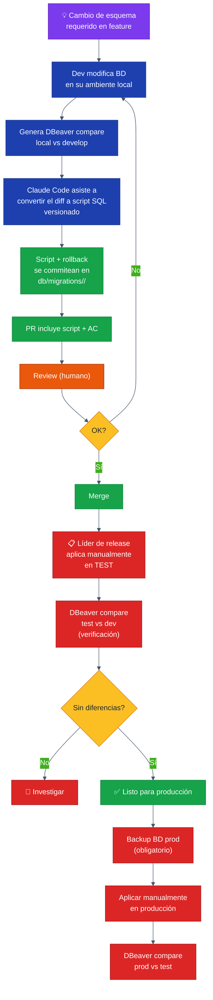

### 7.5 Beneficios del proceso versionado (sin automatizar deploy)

- 📜 **Trazabilidad**: cada cambio de esquema queda en el git, asociado a un release y a un PR
- 🔄 **Replicabilidad**: cualquier developer puede recrear el estado de BD aplicando los scripts en orden
- 🤖 **Asistencia de Claude Code**: pero solo en la generación del script, no en la ejecución
- 🛡️ **Sin riesgo en producción**: el deploy sigue siendo 100% manual con backup previo
- 📋 **Auditoría**: queda en GitHub quién creó la migración, quién la aprobó, cuándo
- 🔙 **Rollback documentado**: cada migración tiene su contraparte de rollback (cuando es posible)

### 7.6 Migraciones de v3 — estrategia específica

Para v3, donde habrá tablas nuevas para MCP (analytics de tool calls, suscripciones, etc.):

1. **Tablas nuevas** (no afectan v2): se aplican en producción **antes del cutover** sin riesgo
2. **Modificaciones a tablas existentes**: se evalúan caso por caso, se prefieren cambios aditivos (agregar columna nullable, no modificar estructura)
3. **Eliminaciones**: se postergan al menos 2 releases después del cutover, para tener rollback fácil

### 7.7 Herramienta de versionado: ¿por qué scripts SQL planos y no Phinx aún?

Originalmente propuse Phinx (migraciones en PHP), pero dado que **mantenemos el flujo manual de aplicación**, el valor de Phinx es menor. Lo que sí queremos es:

- ✅ Scripts SQL versionados en git (lo planteado arriba)
- ✅ Documentación clara por release
- ❌ NO ejecución automática

Phinx queda como **opción a evaluar para v4** o cuando quieras dar el siguiente paso de automatización (con todas las salvaguardas adicionales).

---

## 8. Convergencia v2 → v3 (cutover)

### 8.1 Definición de "v3 listo para cutover"

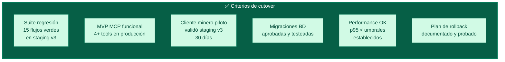

### 8.2 El cutover paso a paso

**Día -7 a -1: Preparación**

1. Freeze de features en `develop-v3` — solo bugfixes
2. Sync final `develop → develop-v3` (importante para no perder fixes recientes de v2)
3. Resolver todos los conflictos del sync
4. Re-ejecutar suite completa de regresión + tests v3 en staging-v3
5. Backup completo de producción v2 (BD + archivos + configs)
6. Snapshot de la VM productiva

**Día 0: Cutover**

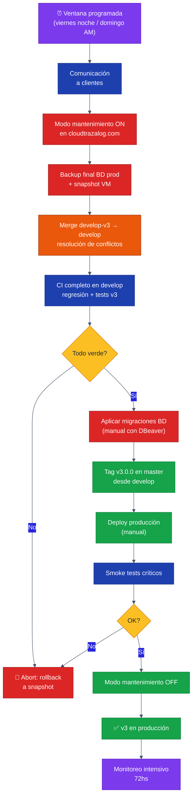

**Día +1 a +7: Estabilización**

1. Monitoreo intensivo (SigNoz dashboards, alertas configuradas)
2. Ventana de hotfixes ágiles si aparecen issues
3. Comunicación proactiva al cliente piloto
4. Retrospectiva del cutover con el equipo

**Día +7 a +30: Vida nueva**

1. Suite de regresión semanal contra producción
2. Stories de mejora basadas en feedback real
3. Apertura del MCP a más clientes (rollout gradual con feature flags)

### 8.3 Plan de rollback

**Si algo sale mal en el cutover:**

1. Modo mantenimiento ON
2. Restaurar snapshot de VM (15-30 min)
3. Restaurar BD desde backup
4. Verificar integridad
5. Modo mantenimiento OFF
6. Comunicar a clientes
7. Postmortem
8. Re-planificar cutover

**Tiempo total de rollback estimado: 1-2 horas**

### 8.4 Post-cutover: ¿qué pasa con `develop-v3`?

Después del cutover exitoso:

1. `develop-v3` se mantiene **una semana** como referencia, por si hace falta consultar algo
2. Después se elimina (`git branch -d develop-v3` + `git push origin --delete develop-v3`)
3. Todo el desarrollo futuro vuelve a usar `develop` como única rama de desarrollo
4. El modelo se simplifica a `master` ↔ `develop` ↔ `feature/*` / `hotfix/*`

---

## 9. Roles y responsabilidades

### 9.1 Matriz RACI

| Actividad | PM (Rodolfo) | Equipo soporte v2 | Claude Code | Cliente piloto |
|---|---|---|---|---|
| Definir AC de stories | **R** | C | I | C |
| Implementar features v3 | A | I | **R** | I |
| Implementar features v2 (soporte) | A | **R** | C | I |
| Escribir tests unitarios | A | C | **R** | — |
| Validar tests primera vez | **R** | C | I | — |
| Definir flujos de regresión | **R** | **R** | I | C |
| Implementar regresión Playwright | A | C | **R** | — |
| Aprobar PRs v3 | **R** | I | — | — |
| Aprobar PRs v2 | A | **R** | — | — |
| Ejecutar deploy a staging | I | I | **R** (auto) | — |
| Ejecutar deploy a producción v2 | **R** | C | I | I |
| Ejecutar cutover v3 | **R** | **R** | C | I |
| Aplicar migraciones de BD | **R** | C | C | — |
| Validación funcional v3 | A | C | I | **R** |
| Monitoreo post-deploy | **R** | C | I | — |

**Leyenda**: R = Responsible (hace) · A = Accountable (responde) · C = Consulted (consultado) · I = Informed (informado)

### 9.2 Tiempo estimado por persona

```
PM (Rodolfo) — ~5 hs/semana en proceso de v3 (en Fase 1 MVP)
├── Refinement backlog: 1-2 hs
├── Review de PRs v3: 30 min/día = 2.5 hs
├── Aprobaciones de deploy: 15-30 min
├── Retros y planificación: 30 min/quincena
└── Monitoreo y feedback: 10 min/día = 1 hs

Equipo soporte — Sin cambios respecto a hoy
├── Sigue su ciclo normal en `develop`
├── Solo se les pide: definir flujos de regresión (sesión única ~2 hs)
└── Y: cherry-pick de hotfixes a develop-v3 cuando aplique (raro)

Claude Code — La mayor parte del trabajo de implementación
├── Stories v3: implementación + tests
├── Regresión Playwright: implementación
├── CI/CD workflows: setup
└── Documentación
```

---

## 10. Riesgos y mitigaciones

| # | Riesgo | Impacto | Probabilidad | Mitigación |
|---|---|---|---|---|
| 1 | Divergencia explosiva entre `develop` y `develop-v3` | 🔴 Alto | 🟡 Media | Sync semanal automático, alertar si > 50 commits de drift |
| 2 | Equipo confunde en qué rama trabajar | 🟡 Medio | 🟡 Media | Issue templates con campo "Target version", labels obligatorios |
| 3 | Regresión no se mantiene actualizada durante desarrollo v3 | 🔴 Alto | 🟡 Media | CI ejecuta regresión semanal contra v2; alerta si falla |
| 4 | Cutover encuentra bugs no detectados en staging | 🔴 Alto | 🟢 Baja | Cliente piloto valida 30 días en staging antes del cutover |
| 5 | Migraciones de BD complejas en cutover | 🔴 Alto | 🟡 Media | Tablas nuevas se crean ANTES del cutover; cambios destructivos se evitan |
| 6 | Hotfixes urgentes durante el desarrollo v3 ralentizan v3 | 🟡 Medio | 🟡 Media | Flujo de cherry-pick automático de hotfixes a develop-v3 |
| 7 | El cliente minero piloto encuentra issues semánticos en MCP que no detectamos | 🟡 Medio | 🟡 Media | Sesiones de validación quincenales con el cliente en staging |
| 8 | Performance v3 peor que v2 (p95 latencia) | 🔴 Alto | 🟡 Media | Tests k6 con thresholds estrictos; comparación continua v2 vs v3 en staging |
| 9 | Rollback del cutover falla | 🔴 Alto | 🟢 Baja | Plan de rollback probado en staging; snapshot + backup verificados antes del cutover |
| 10 | Suite de regresión tiene falsos positivos que se ignoran | 🟡 Medio | 🟡 Media | Política: regresión roja bloquea merge a develop-v3, no se "reintentar y ya" |

---

## 11. Plan de implementación

### 11.1 Sprint 0 — Setup (Semana 1-2)

| # | Tarea | Responsable | Tiempo |
|---|---|---|---|
| 1 | Validar este documento con socio comercial | PM | 30 min |
| 2 | Crear `develop-v3` en `traz-tools` y submódulos relevantes | PM | 1 hr |
| 3 | Configurar branch protection en GitHub | PM | 30 min |
| 4 | Crear issue templates con labels v2/v3 | Claude Code | — |
| 5 | Crear PR template con checklist | Claude Code | — |
| 6 | Setup workflow `v3-ci.yml` mínimo (lint + tests) | Claude Code | — |
| 7 | Setup workflow `compatibility-check.yml` | Claude Code | — |
| 8 | Documentar `BRANCHING.md` y `CLAUDE.md` en repos | Claude Code | — |
| 9 | Comunicar al equipo el nuevo flujo (sesión 1 hr) | PM | 1 hr |

### 11.2 Sprint 1-2 — Foundations v3 (Semanas 3-6)

| # | Tarea | Responsable |
|---|---|---|
| 10 | Setup VM staging-v3 en GCP | Claude Code (vía Ansible) |
| 11 | Setup workflow `v3-deploy-staging.yml` | Claude Code |
| 12 | Setup SigNoz en staging-v3 | Claude Code |
| 13 | Sesión: definir top 15 flujos de regresión | PM + soporte |
| 14 | Implementar primer flujo Playwright (login) como prueba de concepto | Claude Code |
| 15 | Validar flujo Playwright contra staging v2 | PM |

### 11.3 Sprint 3-N — Desarrollo v3 (Semanas 7-?)

Aquí entra el backlog real de v3. En paralelo:

- 🚧 **Stream 1**: Features de v3 (MCP gateway, tools, metering, etc.)
- 🧪 **Stream 2**: Suite de regresión Playwright (1 flujo por sprint, hasta cubrir los 15)
- 🛡️ **Stream 3**: Soporte v2 sigue su ritmo natural

### 11.4 Pre-cutover — Validación (4-6 semanas antes)

| # | Tarea | Responsable |
|---|---|---|
| N+1 | Cliente minero piloto usa staging-v3 30 días | Cliente + PM |
| N+2 | Suite regresión 100% en verde durante 7 días en staging-v3 | Claude Code (CI) |
| N+3 | Performance test k6: comparativa v2 vs v3 | Claude Code |
| N+4 | Plan de rollback probado | PM |
| N+5 | Migraciones BD nuevas aplicadas en producción (anticipadas) | PM (manual) |
| N+6 | Comunicación a clientes de ventana de cutover | Socio comercial |

### 11.5 Cutover (1 día)

Ver sección 8.

### 11.6 Post-cutover (4 semanas)

| # | Tarea | Responsable |
|---|---|---|
| P+1 | Monitoreo intensivo 72 hs | PM |
| P+2 | Hotfixes ágiles si aparecen | Claude Code + PM |
| P+3 | Eliminar `develop-v3` (después de 1 semana sin issues) | PM |
| P+4 | Rollout MCP a más clientes (feature flags) | PM |
| P+5 | Retrospectiva del cutover y lecciones aprendidas | Equipo completo |

---

## Apéndices

### Apéndice A — Glosario

| Término | Definición |
|---|---|
| **Cutover** | Momento de migración única de v2 a v3 en producción |
| **Pareto regression** | Suite de regresión que cubre el 20% de flujos que generan el 80% del valor |
| **Feature flag** | Mecanismo para activar/desactivar funcionalidades sin redeployar |
| **Sync** | Proceso periódico de traer cambios de `develop` a `develop-v3` |
| **Cherry-pick** | Aplicar un commit específico de una rama a otra |
| **Smoke test** | Conjunto reducido de tests que validan que lo básico funciona post-deploy |

### Apéndice B — Checklist diario del PM

```
Mañana (15 min):
[ ] Revisar dashboards SigNoz: ¿hay alertas?
[ ] Revisar PRs pendientes de review
[ ] Revisar issues con label "needs-triage"

Durante el día:
[ ] Responder PRs (target: < 4 hs)
[ ] Refinar 1-2 stories del backlog si hay tiempo

Tarde (10 min):
[ ] Revisar staging-v3: ¿deploys OK del día?
[ ] Verificar regresión: ¿corrió hoy? ¿está verde?
```

### Apéndice C — Comandos frecuentes

```bash
# Sincronizar develop-v3 con develop (semanal)
git checkout develop-v3 && git pull
git merge origin/develop --no-ff -m "chore: sync v2 fixes from develop"
git push origin develop-v3

# Cherry-pick de hotfix a develop-v3
git checkout develop-v3 && git pull
git cherry-pick <SHA-del-hotfix>
git push origin develop-v3

# Crear feature de v3
git checkout develop-v3 && git pull
git checkout -b feature/v3-TRZ-XXX-mi-feature

# Crear feature de v2 (soporte)
git checkout develop && git pull
git checkout -b feature/TRZ-XXX-mi-feature

# Ejecutar regresión local
cd tests/regression
npx playwright test --project=staging-v2  # contra v2
npx playwright test --project=staging-v3  # contra v3
```

### Apéndice D — Referencias

- Manual de despliegue v2 (vigente, sin cambios): `docs/Manual_de_Despliegue.docx`
- Documento de arquitectura MCP: `TRAZALOG_v3_MCP_ARCHITECTURE.md`
- Estrategia de pricing: `TRAZALOG_v3_PRICING_STRATEGY.docx`
- Investigación sector minero: `investigacion-sector-minero-trazalog-v3-2.md`

---

*Documento generado en sesión de diseño — Abril 2026*
*Trazalog Tools v3 · San Juan, Argentina*
