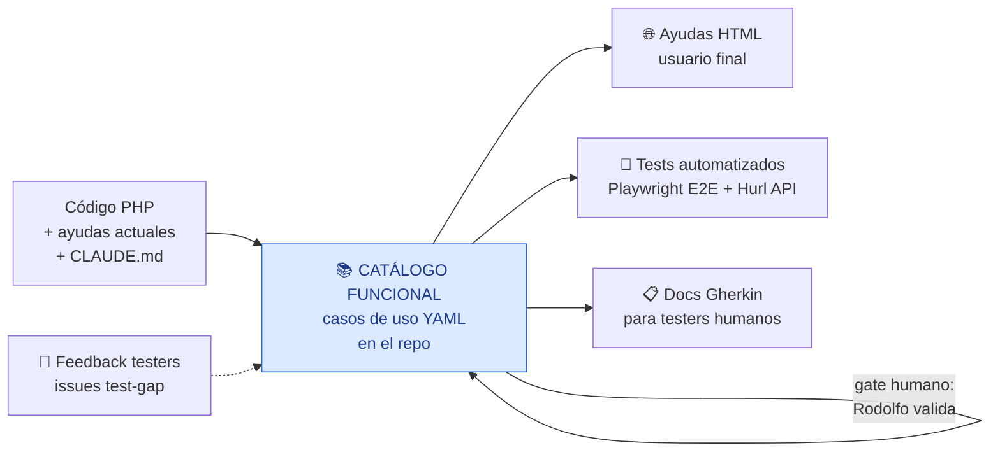

# Trazalog v3 — DocTest · Documento 1: Requerimientos y Análisis Funcional

> **Solución:** DocTest — Pipeline de Catálogo Funcional → Ayudas de usuario + Pruebas automatizadas
> Versión: 1.1 · Fecha: Agosto 2026
> **Cambios v1.1:** RF-05 reformulado sobre el sitio de ayudas real (`ayudatrazalogtools` + `CLAUDE-mperez.md`): convenciones obligatorias (RF-05.2), searchData automático (RF-05.3), repo como fuente canónica del sitio (RF-05.7). RF-02.2: manuales legacy como input formal del relevamiento.
> Autor: Rodolfo (PM) + Claude Web (PM técnico/arquitecto)
> Estado: Aprobado para implementación por Claude Code
> Documentos relacionados: `TRAZALOG_v3_DOCTEST_02_CICLO_VIDA_CICD.md`, `TRAZALOG_v3_DOCTEST_03_ARQUITECTURA.md`, `TRAZALOG_v3_CICD_STRATEGY.md`, `brief-metodologia-v2.md`

---

## 1. Resumen ejecutivo

### 1.1 Problema

Trazalog v3 tiene tres necesidades hoy desconectadas entre sí:

1. **Ayudas de usuario final** estáticas (trazalog.com/ayudatools), generadas manualmente, que se desactualizan con cada cambio funcional.
2. **Testing de regresión** inexistente en forma automatizada: v2 se prueba 100% manual con QC; la estrategia CI/CD ya define que v3 nace automatizado (premisa 7 del doc CICD), pero falta la maquinaria concreta.
3. **Conocimiento funcional** disperso: los flujos reales viven en el código PHP y en la cabeza del equipo; no hay un inventario formal de casos de uso.

### 1.2 Solución

Un **Catálogo Funcional** versionado en el repo como pieza central única, del cual se **derivan** tres salidas sincronizadas:

Principio rector (heredado de metodología v2): **el repo es la única fuente de verdad**. El catálogo vive en git; ayudas, tests y docs Gherkin se regeneran desde él, nunca se editan de forma divergente.

### 1.3 Etapas de la solución

- **Etapa 1 (baseline):** análisis de código → catálogo → validación humana → generación de las 3 salidas. Se ejecuta una vez por módulo.
- **Etapa 2 (delta continuo):** componente en CI/CD que analiza el diff de cada PR contra el catálogo, propone casos nuevos/modificados (catálogo + tests + Gherkin + ayudas) e incorpora feedback de testers. Detalle en Documento 2.

---

## 2. Alcance

### 2.1 Módulos y olas de cobertura

| Ola | Módulos | Repos fuente | Justificación |
|---|---|---|---|
| **Ola 1** | DNATO (registración + administración de cuenta) → MAN (mantenimiento) → ALM (almacén) → MCP | `traz-comp-dnato`, `traz-prod-assetplanner`, `traz-tools` | Clientes actuales + piloto minero. DNATO va primero por dependencia técnica: provee fixtures de login/empresa para todo lo demás. MCP puede correr en paralelo (no depende de fixtures UI) |
| **Ola 2** | PAN (pañol) | `traz-tools` | Variante de almacén; método ya calibrado |
| **Ola 3** | PRD (producción) + TAR (tareas) | `traz-tools` | Flujos definibles sobre Bonita/BPM — los más complejos. Se abordan con el loop de delta ya operativo |

**Piloto de calibración:** MAN · "Alta de Equipos y Componentes" (ya documentado en manual MA.007 vigente — sirve de referencia validada del flujo).

### 2.2 Fuera de alcance (esta versión)

- Testing unitario PHP (PHPUnit) — sigue la estrategia CICD existente, no lo gobierna DocTest.
- Performance testing (k6) — stream separado según doc CICD.
- Generación de imágenes con modelos generativos (Nano Banana/Gemini) — se difiere; las ayudas usan mockups HTML y SVG. El diseño deja el punto de extensión previsto (ver Doc 3 §7).
- Migración de las ayudas de v2 existentes que no correspondan a módulos de las olas definidas.

---

## 3. Actores

| Actor | Rol en DocTest |
|---|---|
| **Rodolfo (PM)** | Valida el catálogo funcional (gate obligatorio). Revisa PRs. Prioriza feedback de testers |
| **Claude Code (CC)** | Analiza código, genera catálogo/tests/ayudas/Gherkin, implementa la infraestructura, mantiene STATE.md |
| **Claude Web (CW)** | PM técnico: emitió estos documentos; audita alineamiento en ritual semanal |
| **Developers** | Corren la suite smoke antes de push; leen resultados de la suite en sus PRs; responden propuestas de delta |
| **Testers humanos (QC)** | Leen los docs Gherkin; reportan casos faltantes o flujos no considerados vía issues `test-gap` |
| **Usuario final** | Consume las ayudas HTML generadas |

---

## 4. Requerimientos funcionales

### RF-01 — Catálogo Funcional

1. Cada caso de uso se registra como archivo YAML individual en `doctest/catalogo/<modulo>/`, con el esquema definido en Doc 3 §3.
2. Campos mínimos: id (`<MOD>-UC-<NNN>`), título, perfil de usuario, precondiciones, flujo principal (pasos con resultado esperado), flujos alternativos, validaciones, referencias al código fuente, datos de prueba, estado (`borrador` / `validado` / `obsoleto`), origen (`baseline` / `delta-PR#N` / `feedback-issue#N`).
3. **Ningún artefacto derivado (test, ayuda, Gherkin) se genera desde un caso en estado `borrador`.** Solo `validado` habilita derivación.
4. La validación la realiza Rodolfo vía review de PR (el catálogo entra por PR como cualquier otro artefacto).

### RF-02 — Relevamiento desde código (Etapa 1)

1. CC analiza controladores, vistas, modelos y rutas de los repos fuente para inferir casos de uso: pantallas, acciones, validaciones, permisos por perfil.
2. Inputs complementarios obligatorios: los 5 manuales HTML del sitio de ayudas actual + su `CLAUDE.md` (commiteados al repo — describen la intención funcional validada y el vocabulario de roles), `CLAUDE.md` de cada repo de código, documentos ancla de `doc/v3/`. En particular, `manual_mantenimiento_correrctivo.html` (9 secciones: roles → ingreso → equipos → artículos → solicitud → análisis → planificar OT → ejecutar OT → verificación) es prácticamente un mapa de casos de uso del flujo correctivo completo: el relevamiento de MAN parte de ahí y lo contrasta contra el código.
3. **Modo conservador:** el código dice *qué* hace, no *para qué*. Si CC no puede inferir la intención de negocio de un flujo, lo marca con `estado: borrador` y campo `dudas:` explícito — nunca inventa intención. Aplican las reglas de escalamiento de metodología v2.
4. Salida del relevamiento por módulo: lote de YAMLs en `borrador` + un `RESUMEN-RELEVAMIENTO-<MOD>.md` (inventario, cobertura estimada, dudas abiertas) para la sesión de validación con Rodolfo.

### RF-03 — Documentación para tester humano (Gherkin)

1. Por cada caso `validado` se genera un archivo `.feature` en español (sintaxis Gherkin: `Dado / Cuando / Entonces`) en `doctest/features/<modulo>/`.
2. Gherkin es **formato de documentación**, no runtime: no se adopta Cucumber. Cada `.feature` referencia el id del caso y el test automatizado que lo implementa.
3. Debe ser legible por un tester sin conocimientos de programación: pantallas nombradas como las ve el usuario, sin selectores ni tecnicismos.

### RF-04 — Tests automatizados

1. **E2E UI (DNATO, MAN, ALM, PAN, PRD, TAR):** Playwright + TypeScript. Un spec por caso de uso, organizado con page objects. Convención de selectores `data-testid` (implica cambios menores en vistas PHP — ver Doc 3 §5).
2. **API/contrato (MCP):** Hurl. Valida las tools del gateway (`man_get_equipos`, `alm_crear_pedido_materiales`, etc.): autenticación, resolución de `empr_id` vía X-JWT-Assertion (ADR-009/013), esquema de respuesta, casos de error.
3. Toda suite corre headless en CI y localmente en la máquina de cada developer.
4. **Suite smoke:** subconjunto etiquetado `@smoke` (5–10 flujos críticos, < 2 min) para uso pre-push de developers.
5. Trazabilidad bidireccional: cada spec declara en cabecera el id del caso de uso; el YAML del caso lista sus derivados.

### RF-05 — Ayudas de usuario final

1. **Base canónica: el sitio existente `ayudatrazalogtools`** (index + 5 manuales) **y su `CLAUDE.md`** (CLAUDE-mperez.md), que Rodolfo commitea al repo como insumo de la fase F2. La plantilla se extrae de esos HTML reales — no se diseña desde cero.
2. **Convenciones del sitio actual que se preservan obligatoriamente** (documentadas en su CLAUDE.md):
   - Español Argentina/Latam con tuteo ("podés", "ingresá").
   - Paleta y tipografías por variables CSS (`--red`, `--dark`, `--amber`; DM Sans / DM Serif Display / JetBrains Mono). Al generar, las variables se centralizan (hoy están duplicadas al inicio de cada HTML — deuda que la generación resuelve).
   - Anclas de sección `id="s01"`, `id="s02"`… — `index.html` linkea directo a `manual_x.html#sNN`. Los ids existentes no se renumeran (romperían links externos ya compartidos).
   - **Los nombres de archivo con typo (`manual_mantenimiento_correrctivo.html`, `manual_mantenimeinto_preventivo.html`) se mantienen tal cual** — son URLs publicadas.
   - Estructura de portada: hero con buscador + tarjetas por manual + FAQ inline.
3. **Deuda conocida a resolver en la generación:** el índice de búsqueda `searchData` de `index.html` está incompleto (solo cubre correctivo y preventivo). El generador de ayudas debe construir `searchData` automáticamente desde el contenido de todos los manuales — nunca más mantenido a mano.
4. Vocabulario de roles fijo del dominio, consistente en ayudas, catálogo y Gherkin: **Solicitante** (genera solicitudes de servicio), **Supervisor** (acepta/rechaza, alta de equipos, verifica informe), **Planificador** (programa, preventivos, asigna OTs), **Mantenedor** (ejecuta OTs, informe de servicio) — más los roles de administración de cuenta que surjan del relevamiento DNATO.
5. Mejoras requeridas sobre el formato actual: navegación por secciones colapsables, mockups interactivos de formularios, diagramas SVG de flujos, versión imprimible. El buscador ya existe — se completa (punto 3), no se reinventa.
6. Las ayudas indican versión y fecha de generación, y el id de los casos de uso que cubren (en comentario HTML, no visible al usuario).
7. El sitio actual no está en git (lo dice su CLAUDE.md): al incorporarse a `doctest/ayudas/src`, **el repo pasa a ser la fuente canónica** y el hosting actual (trazalog.com/ayudatools) recibe el build publicado. Se acabó la edición manual de HTML productivo.

### RF-06 — Feedback de testers (cierre del loop)

1. Canal único: GitHub Issues con label `test-gap` en `traz-tools`. Template de issue con campos: módulo, pantalla/flujo, qué falta probar o qué flujo no está contemplado, severidad.
2. La Etapa 2 (delta) consume los issues `test-gap` abiertos como input; al incorporar el caso al catálogo, el PR correspondiente cierra el issue (`Closes #N`).
3. Alternativa de baja fricción para testers sin cuenta GitHub: Rodolfo transcribe a issues (decisión operativa suya).

### RF-07 — Delta continuo (Etapa 2)

1. Ante un PR que modifica código funcional (paths de vistas/controladores/modelos/DataServices), un job de CI analiza el diff contra el catálogo y propone: casos nuevos, casos modificados, casos obsoletos, y las actualizaciones derivadas (tests, Gherkin, ayudas).
2. La propuesta llega como comentario en el PR + commits en rama separada `doctest/delta-pr-<N>`; **jamás se auto-mergea**.
3. El job consume además los issues `test-gap` abiertos del módulo afectado.
4. Momento de ejecución y control de costos: definidos en Doc 2 §4 (en el PR, activado por label — no en el deploy).

---

## 5. Requerimientos no funcionales

| # | Requerimiento |
|---|---|
| RNF-01 | **Cero costo de licencias:** todo el stack es open source (Playwright Apache-2.0, Hurl Apache-2.0, GitHub Actions incluido en el plan actual). Consumo de tokens de IA controlado: Etapa 2 se activa por label, no en cada PR |
| RNF-02 | Suite smoke < 2 min; suite completa por módulo < 15 min; suite completa total < 45 min (paralelizable) |
| RNF-03 | Tests deterministas: prohibido `sleep()` fijo; auto-wait de Playwright + asserts explícitos. Un test flaky se marca `@quarantine` y se abre issue — no se ignora silenciosamente (riesgo 10 del doc CICD) |
| RNF-04 | Los tests corren contra staging-v3 (o entorno local del dev); **nunca contra producción** |
| RNF-05 | Datos de prueba: empresa(s) de test dedicadas con datos semilla versionados (seeds reproducibles); los tests no dependen de datos de clientes reales |
| RNF-06 | Todo artefacto de DocTest entra al repo vía feature branch + PR (metodología git obligatoria de los CLAUDE.md) |

---

## 6. Criterios de aceptación de la Ola 1

1. ✅ Catálogo funcional de DNATO, MAN, ALM y MCP con el 100% de los casos en estado `validado` u `obsoleto` (cero `borrador` residual).
2. ✅ Piloto Alta de Equipos: caso de uso + test Playwright + `.feature` + ayuda regenerada, aprobados por Rodolfo, corriendo en verde en CI.
3. ✅ Suite smoke ejecutable por un developer con un solo comando documentado.
4. ✅ Suite completa integrada como gate en el pipeline (Doc 2) y en verde 7 días consecutivos en staging-v3.
5. ✅ Suite Hurl de MCP validando las tools publicadas del gateway.
6. ✅ Al menos un ciclo de feedback de tester procesado de punta a punta (issue `test-gap` → caso al catálogo → test → issue cerrado).
7. ✅ Job de delta (Etapa 2) operativo y probado sobre al menos 2 PRs reales.

---

## 7. Riesgos funcionales

| # | Riesgo | Mitigación |
|---|---|---|
| 1 | La interpretación funcional desde código tiene huecos (código dice *qué*, no *por qué*) | Gate humano estructural (RF-01.3) + ayudas actuales como fuente de intención + loop de testers |
| 2 | Catálogo y código divergen con el tiempo | Etapa 2 (delta en PR) + verificación en ritual semanal de metodología v2 |
| 3 | Testers no reportan por fricción de la herramienta | Template simple + opción de transcripción por el PM |
| 4 | Ola 1 subestimada (4 módulos, baseline puro) | Piloto Alta de Equipos mide el costo real por módulo antes de comprometer el resto; replanificación permitida tras el piloto |
| 5 | Asset Planner es aplicación separada (no migrada a Tools) | Se trata como sistema bajo prueba independiente con su propia URL de staging y sus propias fixtures de login (ver Doc 3 §6) |

---

*Documento generado en sesión de diseño PM (Claude Web) — Agosto 2026*
*Trazalog Tools v3 · San Juan, Argentina*
