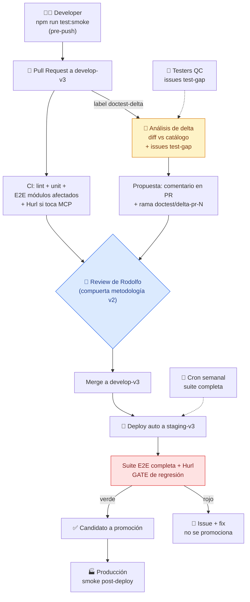
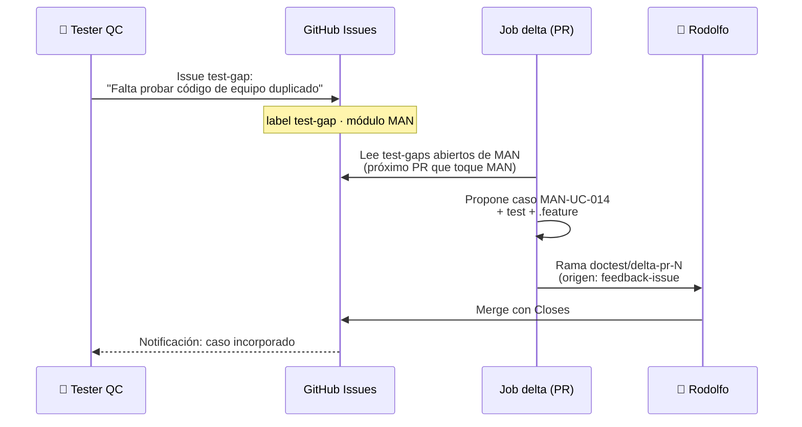

# Trazalog v3 — DocTest · Documento 2: Ciclo de Vida en CI/CD y Pruebas de Developers

> **Solución:** DocTest — Pipeline de Catálogo Funcional → Ayudas + Pruebas automatizadas
> Versión: 1.0 · Fecha: Agosto 2026
> Autor: Rodolfo (PM) + Claude Web (PM técnico/arquitecto)
> Estado: Aprobado para implementación por Claude Code
> **Este documento extiende `TRAZALOG_v3_CICD_STRATEGY.md` (v1.1) — no lo reemplaza.** Branching, cutover y roles generales siguen rigiendo desde aquel documento.

---

## 1. Resumen ejecutivo

- 🧑‍💻 **Developer local:** suite smoke (`@smoke`, < 2 min) antes de cada push — un comando, opcionalmente automatizado con hook pre-push
- 🔀 **Pull Request:** CI ejecuta la suite E2E del/los módulos afectados + Hurl si toca MCP. El **análisis de delta (Etapa 2) corre acá**, activado por label — nunca en el deploy
- 🚀 **Deploy a staging-v3:** suite completa como gate post-deploy; rojo = rollback/fix, no se promociona
- 🏭 **Deploy a producción:** solo smoke post-deploy (verificación de vida, no regresión — la regresión ya ocurrió antes)
- 📅 **Semanal:** suite completa programada contra staging (detecta drift de entorno y flaky tests)
- 🔁 **Feedback de testers:** issues `test-gap` → consumidos por el delta del siguiente PR que toque el módulo

---

## 2. Momento 1 — Developer local (pre-commit / pre-push)

### 2.1 Qué corre y cuándo

| Momento | Qué | Duración objetivo | Obligatoriedad |
|---|---|---|---|
| Durante el desarrollo | Test(s) del caso de uso que está tocando: `npx playwright test specs/man/alta-equipo` | segundos–1 min | A criterio del dev |
| **Antes de push** | **Suite smoke completa: `npm run test:smoke`** | **< 2 min** | **Obligatoria (política de equipo) — automatizable con hook pre-push** |
| Antes de abrir PR | Suite del módulo afectado: `npm run test:module -- man` | < 15 min | Recomendada |

### 2.2 Decisión de diseño: smoke en pre-push, no suite completa en pre-commit

Un hook de pre-commit lento (> 30 seg) provoca que los devs lo salteen con `--no-verify` y muera la práctica. Por eso:

- **Pre-commit:** solo lint (rápido, ya previsto en CICD).
- **Pre-push:** smoke E2E (< 2 min). Se instala con Husky (o hook git plano si se prefiere cero dependencias) y **puede** saltearse en emergencias con `--no-verify` — pero el CI del PR lo va a atrapar igual: la baranda real es el CI, el hook es cortesía de feedback temprano.

### 2.3 Entorno local del developer

Los tests apuntan por variable de entorno (`DOCTEST_BASE_URL`) a: (a) el entorno local del dev si tiene la app levantada, o (b) staging-v3 como fallback. Fixtures de login usan credenciales de las empresas de test (nunca reales), inyectadas por `.env` no commiteado (plantilla `.env.example` sí commiteada).

---

## 3. Momento 2 — Pull Request

### 3.1 Suite de regresión en el PR

Workflow `doctest-e2e.yml` (extiende el `v3-ci.yml` existente):

1. Detecta módulos afectados por paths del diff (mapa path→módulo en configuración, ver Doc 3 §8).
2. Ejecuta la suite E2E de esos módulos contra staging-v3 (o entorno efímero si en el futuro se dockeriza la app — fuera de alcance hoy).
3. Si el diff toca DataServices/WSO2/MCP: ejecuta además la suite Hurl completa (es barata, corre entera siempre).
4. Publica el reporte Playwright (HTML + traces de fallos) como artifact del workflow.
5. **Rojo bloquea el merge** (branch protection de `develop-v3` ya exige checks verdes — riesgo 10 del doc CICD: prohibido "reintentar y ya").

### 3.2 Análisis de delta (Etapa 2) — cuándo y cómo corre

**Buena práctica adoptada: el delta se analiza en el PR, nunca en el deploy.** Razones: el diff es chico y el contexto está fresco; el autor está disponible; el deploy debe ser rápido y determinístico; el PR ya tiene la compuerta humana de la metodología v2.

**Disparador: label `doctest-delta` aplicado manualmente al PR** (por el dev o por Rodolfo). No corre automático en cada PR por dos motivos:

1. **Control de consumo de tokens** (restricción de costo cero / gasto innecesario): PRs de CSS, configs o docs no justifican análisis.
2. Arranque gradual: al inicio conviene elegir en qué PRs se prueba el mecanismo.

> Evolución prevista (post-Ola 1, cuando el mecanismo esté maduro): automatizar el disparo por path-filter (solo paths funcionales) manteniendo el label como override. Decisión 🟡 para ese momento, no ahora.

**Qué hace el job** (`doctest-delta.yml`, usando el GitHub Action oficial de Claude Code — `anthropics/claude-code-action`):

1. Lee: diff del PR, catálogo funcional del/los módulos afectados, issues `test-gap` abiertos de esos módulos.
2. Clasifica el impacto: `sin impacto funcional` / `caso(s) nuevo(s)` / `caso(s) modificado(s)` / `caso(s) obsoleto(s)`.
3. Genera propuesta: YAMLs de catálogo (en `borrador` si hay dudas de intención), specs Playwright, `.feature` Gherkin, secciones de ayuda actualizadas.
4. Entrega: comentario resumen en el PR + rama `doctest/delta-pr-<N>` con los commits, lista para abrir PR complementario.
5. **Nunca mergea nada.** La propuesta sigue el ciclo normal: review de Rodolfo → merge → el `Closes #N` cierra los `test-gap` incorporados.

### 3.3 Reglas para el bot de delta

- Los casos que agregue a partir de issues `test-gap` referencian el issue en el campo `origen:` del YAML.
- Si detecta que el PR **rompe** un caso `validado` existente (test que va a fallar), lo dice explícitamente en el comentario — es la señal de regresión más temprana posible.
- Respeta el modo conservador: dudas de intención → `borrador` + campo `dudas:`, no inventa.

---

## 4. Momento 3 — Deploy a staging-v3 (gate de regresión)

Extiende el `v3-deploy-staging.yml` existente:

1. Deploy automático al mergear a `develop-v3` (flujo actual, sin cambios).
2. **Post-deploy: suite E2E completa + suite Hurl completa contra staging-v3.**
3. Verde → el build queda marcado como candidato sano. Rojo → issue automático con el reporte + traces; **no se promociona nada a producción hasta resolver** (política, alineada con riesgo 10 del doc CICD).
4. El reporte queda como artifact 30 días para auditoría.

**Por qué acá y no antes del merge:** la suite completa (< 45 min) es demasiado lenta para cada PR; el PR corre lo afectado, staging corre todo. Es el balance estándar velocidad/cobertura.

---

## 5. Momento 4 — Deploy a producción

1. La promoción a `master` sigue el proceso del doc CICD (tag de release, migraciones manuales, etc.) — DocTest no lo modifica.
2. **Precondición de release:** suite completa en verde en staging-v3 (criterio de aceptación 4 del Doc 1: 7 días en verde para el release v3.0.0; para releases posteriores basta el último run verde).
3. **Post-deploy a producción: solo smoke** (login, home de cada módulo, una tool MCP de lectura) contra producción con la empresa de test productiva. Verifica *vida*, no regresión — la regresión ya se validó en staging. Ninguna prueba escribe datos reales de clientes.

---

## 6. Momento 5 — Ejecución semanal programada

Workflow `doctest-weekly.yml` (cron, ej. domingo 22:00 ART): suite completa + Hurl contra staging-v3.

Propósito: detectar **drift** que no proviene de PRs — cambios de entorno, datos semilla corruptos, tests que se volvieron flaky, certificados vencidos. Si falla, issue automático con label `doctest-drift` que Rodolfo tría en el checklist diario (apéndice B del doc CICD).

---

## 7. Loop de feedback de testers

- Los testers leen los `.feature` de `doctest/features/` (o su publicación HTML junto a las ayudas) para revisar cobertura.
- Si un `test-gap` es urgente y no hay PR próximo del módulo, Rodolfo puede disparar el delta manualmente (workflow_dispatch) o emitir tarea directa a CC (clase 🟢/🟡 según metodología v2).

---

## 8. Clasificación de tareas DocTest según metodología v2

| Tarea | Clase | Compuerta |
|---|---|---|
| Infraestructura de tests, workflows CI, page objects, fixtures | 🟢 Rutina | Merge de Rodolfo |
| Agregar `data-testid` a vistas PHP (cambio cosmético de vistas) | 🟢 Rutina | Merge de Rodolfo |
| Generación de catálogo por módulo (relevamiento) | 🟡 Estándar | **Validación funcional de Rodolfo sobre el catálogo (gate DocTest) + review de PR** |
| Generación de tests/ayudas/Gherkin desde casos validados | 🟢 Rutina | Merge de Rodolfo |
| Job de delta y sus reglas | 🟡 Estándar | Review de PR |
| Cambios al esquema del catálogo o a esta política CI/CD | 🔴 Decisión | Workshop CW + Rodolfo |
| Seeds/fixtures que toquen BD de staging | 🟡 Estándar | Review + prueba de Rodolfo si toca datos |

---

## 9. Métricas de salud (revisión en ritual semanal)

| Métrica | Fuente | Umbral de alarma |
|---|---|---|
| % casos `validado` vs `borrador` por módulo | Catálogo | > 20% en borrador por > 2 semanas |
| Duración suite smoke / completa | CI | > 2 min / > 45 min |
| Tests en `@quarantine` | Repo | > 3 simultáneos |
| Issues `test-gap` abiertos > 30 días | GitHub | > 0 |
| Runs semanales consecutivos en verde | CI | < 2 |
| PRs funcionales mergeados sin delta corrido | GitHub | Tendencia creciente (indica que el label no se usa) |

---

*Documento generado en sesión de diseño PM (Claude Web) — Agosto 2026*
*Trazalog Tools v3 · San Juan, Argentina*
