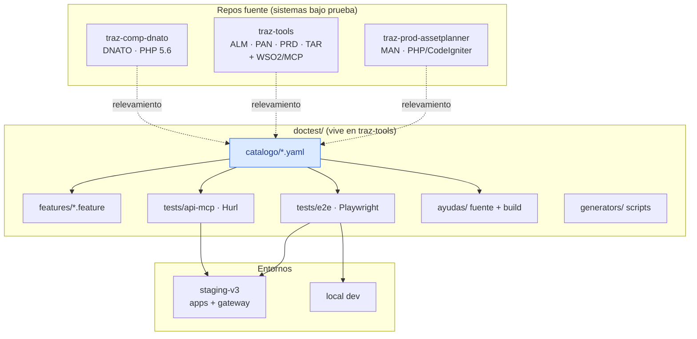

# Trazalog v3 — DocTest · Documento 3: Arquitectura Técnica y Diseño

> **Solución:** DocTest — Pipeline de Catálogo Funcional → Ayudas + Pruebas automatizadas
> Versión: 1.0 · Fecha: Agosto 2026
> Autor: Rodolfo (PM) + Claude Web (PM técnico/arquitecto)
> Estado: Aprobado para implementación por Claude Code
> Documentos relacionados: Doc 1 (requerimientos), Doc 2 (ciclo de vida CI/CD), `TRAZALOG_v3_MCP_ARCHITECTURE.md` (ADRs), `CLAUDE.md` de cada repo

---

## 1. Vista general

### 1.1 Stack (100% open source, cero licencias)

| Componente | Tecnología | Licencia | Rol |
|---|---|---|---|
| E2E UI | **Playwright** + TypeScript | Apache-2.0 | Simulación de interacción humana en navegador |
| API/contrato MCP | **Hurl** | Apache-2.0 | Tests declarativos HTTP contra el gateway WSO2 |
| Catálogo | YAML + JSON Schema | — | Fuente de verdad de casos de uso |
| Docs tester | Gherkin (`.feature`, solo formato) | — | Legible por humanos, sin runtime Cucumber |
| Ayudas | HTML + CSS + SVG estáticos | — | Sitio de usuario final (formato del manual actual como base) |
| CI | GitHub Actions | incluido | Workflows de Doc 2 |
| Delta IA | `anthropics/claude-code-action` | MIT (action) | Análisis de diff en PR (consumo de tokens controlado por label) |
| Hooks | Husky (o hook git plano) | MIT | Smoke pre-push |

### 1.2 Diagrama de componentes



**Decisión — dónde vive DocTest:** todo el árbol `doctest/` vive en `traz-tools` (repo hub, ya contiene los documentos ancla y el STATE.md master). Los tests de MAN apuntan a Asset Planner como sistema externo bajo prueba (URL de staging propia); no se fragmenta la suite entre repos para no multiplicar CI, fixtures y mantenimiento. Los `data-testid` sí se agregan en cada repo fuente (son cambios en sus vistas).

---

## 2. Estructura de directorios (`traz-tools/doctest/`)

```
doctest/
├── README.md                      # entrada: qué es, comandos, cómo contribuir
├── catalogo/
│   ├── SCHEMA.md                  # esquema documentado + JSON Schema
│   ├── dnato/  DNATO-UC-001.yaml ...
│   ├── man/    MAN-UC-001.yaml ...
│   ├── alm/    ALM-UC-001.yaml ...
│   └── mcp/    MCP-UC-001.yaml ...
├── features/
│   ├── dnato/  ... .feature
│   ├── man/    alta-equipo.feature ...
│   └── alm/    ...
├── tests/
│   ├── e2e/
│   │   ├── playwright.config.ts   # projects: local / staging-v3
│   │   ├── fixtures/              # auth, contexto empresa, datos
│   │   ├── pages/                 # page objects por app y pantalla
│   │   │   ├── dnato/  ├── man/  └── alm/
│   │   ├── specs/
│   │   │   ├── dnato/  ├── man/  └── alm/
│   │   └── seeds/                 # datos semilla reproducibles
│   └── api-mcp/
│       ├── hurl/                  # un .hurl por tool + casos de error
│       └── env/                   # variables por entorno (sin secretos)
├── ayudas/
│   ├── plantilla/                 # base extraída del manual actual
│   ├── src/                       # fuentes por módulo
│   └── build/                     # HTML final publicable
├── generators/                    # scripts de derivación catálogo→salidas
└── feedback/PROCESO.md            # cómo reportar test-gaps (para testers)
```

---

## 3. Esquema del Catálogo Funcional

Un archivo YAML por caso de uso. Esquema (se formaliza con JSON Schema en `catalogo/SCHEMA.md`; la validación corre en CI con `ajv-cli` o script Node):

```yaml
id: MAN-UC-001
modulo: MAN
titulo: Alta de equipo con componentes
perfil: Supervisor                 # perfil funcional que ejecuta el flujo
estado: validado                   # borrador | validado | obsoleto
version: 1.2
origen: baseline                   # baseline | delta-PR#123 | feedback-issue#45
fecha_validacion: 2026-09-02
referencias_codigo:                # trazabilidad al fuente
  - repo: traz-prod-assetplanner
    path: application/controllers/Equipos.php
pantallas:
  - "Mantenimiento → Equipos → Agregar"
precondiciones:
  - Usuario autenticado con perfil Supervisor
  - Empresa de test con establecimiento activo
flujo_principal:
  - paso: "Hace clic en 'Agregar' en el listado de equipos"
    resultado: "Se abre el formulario de alta vacío"
  - paso: "Completa Código, Descripción, Criticidad y guarda"
    resultado: "El equipo aparece en el listado con estado Activo"
flujos_alternativos:
  - nombre: "Campos obligatorios incompletos"
    pasos:
      - paso: "Guarda sin completar Código de Equipo"
        resultado: "Error de campo obligatorio; el equipo no se registra"
validaciones:
  - "Código de equipo único por empresa"
datos_prueba:
  empresa: EMPRESA_TEST_1
  equipo_codigo_prefijo: "EQ-TEST-"
dudas: []                          # obligatorio no-vacío si estado: borrador
derivados:
  test_e2e: tests/e2e/specs/man/MAN-UC-001.alta-equipo.spec.ts
  feature: features/man/MAN-UC-001.alta-equipo.feature
  ayuda: ayudas/src/man/alta_equipos.html#uc-001
```

Reglas duras:

1. `estado: borrador` ⇒ `dudas` no vacío y `derivados` vacío. La validación de CI lo exige.
2. Cambiar `flujo_principal`/`flujos_alternativos`/`validaciones` de un caso `validado` ⇒ bump de `version` y regeneración de derivados en el mismo PR.
3. `obsoleto` no se borra: conserva historia; sus derivados se eliminan.

---

## 4. Diseño de la suite Playwright

### 4.1 Configuración

- **TypeScript**, `@playwright/test`. Projects: `local` y `staging-v3` (base URL por proyecto; override con `DOCTEST_BASE_URL`). Asset Planner y Tools son apps distintas ⇒ base URLs separadas por app en config (`APP_URLS.man`, `APP_URLS.tools`, `APP_URLS.dnato`).
- Navegador: Chromium en CI (Firefox/WebKit opcionales local). Trace `on-first-retry`, screenshot y video solo en fallo.
- Tags Playwright: `@smoke`, `@quarantine`, y `@<modulo>` (`@man`, `@alm`...) para ejecutar por módulo con `--grep`.
- Scripts npm: `test:smoke`, `test:module -- <mod>`, `test:all`, `test:report`.

### 4.2 Page Objects

Un page object por pantalla, por app: `pages/man/EquiposListPage.ts`, `pages/man/EquipoFormPage.ts`, `pages/dnato/LoginPage.ts`, `pages/dnato/RegistroPage.ts`. Regla: los specs no contienen selectores — solo llaman métodos de page objects (`equipoForm.completar({...}); equipoForm.guardar();`). Así un cambio de UI se arregla en un solo lugar.

### 4.3 Fixtures (la pieza que DNATO habilita primero)

Fixtures de Playwright (test.extend) que proveen:

- `authSupervisor`, `authOperario`, `authAdmin`: sesión iniciada con el perfil indicado en la empresa de test. **Implementación con `storageState`**: el login real corre una vez por worker (global setup), la sesión se serializa y se reutiliza — evita loguear en cada test (lento y frágil).
- `empresaTest`: contexto de empresa activa (multi-empresa de Trazalog).
- `datosSemilla`: garantiza el estado base (seeds §4.4) antes de suites que lo requieran.

⚠️ Nota de compatibilidad a verificar por CC durante implementación: si la sesión PHP (CodeIgniter/Dnato) es incompatible con reutilización de `storageState` entre contexts (p. ej. session fixation controls), fallback = login por API/form una vez por worker. Documentar la decisión en el PR.

### 4.4 Datos semilla

- Empresas dedicadas de test en staging-v3 (mínimo 2, para verificar aislamiento multi-empresa) con establecimientos, perfiles y datos base conocidos.
- Seeds versionados en `tests/e2e/seeds/` (SQL o scripts contra la app según lo que exista). Deben ser **idempotentes** (re-ejecutables sin duplicar).
- Convención de datos creados por tests: prefijo `EQ-TEST-`/`PED-TEST-` + timestamp, y cleanup best-effort en teardown. La verdad última de limpieza es el re-seed periódico (job manual o semanal).
- 🔴 Cualquier seed que requiera tocar BD de staging directamente sigue la política de migraciones del doc CICD (manual, revisada).

### 4.5 Convención `data-testid`

Cambio requerido en vistas PHP de los tres repos (tarea 🟢 por módulo, PR separado del resto):

```html
<button data-testid="man-equipos-btn-agregar">Agregar</button>
<input  data-testid="man-equipo-form-codigo" name="codigo">
```

Formato: `<modulo>-<pantalla>-<tipo>-<nombre>`, en minúsculas. Se agregan **solo** a elementos que los tests usan (no alfombrar todo el HTML). Los page objects usan `getByTestId()` como selector primario; `getByRole()/getByLabel()` como secundario; XPath/CSS estructural prohibido salvo excepción justificada en comentario.

---

## 5. Diseño de la suite Hurl (MCP)

- Un archivo `.hurl` por tool del gateway (`man_get_equipos.hurl`, `alm_crear_pedido_materiales.hurl`, ...) + archivos de casos transversales: `auth_errores.hurl` (token vencido, sin token, tool no habilitada), `contrato_mcp.hurl` (initialize, tools/list, protocolVersion 2025-06-18 según CONTEXT-PACK).
- Cada archivo valida: status, esquema de respuesta (asserts jsonpath), y **aislamiento de empresa** — con token de empresa A no se ven datos de empresa B (verificación directa del mecanismo ADR-009/013 de `empr_id`).
- Autenticación: obtención de token OAuth de Dnato en paso previo del mismo archivo Hurl (capítulos encadenados con capturas) — credenciales de empresas de test por variables de entorno (`--variables-file` en local, secrets en CI).
- Las tools de escritura (`alm_crear_pedido_materiales`, `man_create_ot`) crean datos con prefijo TEST y validan además el efecto (GET posterior del pedido/OT creado).

---

## 6. Generación de derivados (`generators/`)

Scripts Node/TypeScript ejecutados por CC (y por cualquier humano) — **la generación asistida por IA produce el contenido; los scripts validan y ensamblan**, garantizando estructura determinista:

| Script | Función |
|---|---|
| `validate-catalog.ts` | Valida todos los YAML contra el JSON Schema + reglas duras §3. Corre en CI en cada PR que toque `doctest/` |
| `catalog-to-feature.ts` | Deriva `.feature` Gherkin desde YAML (transformación mecánica 1:1 — pasos → Cuando/Entonces). Regenerable; los `.feature` no se editan a mano |
| `scaffold-spec.ts` | Genera el esqueleto del spec Playwright desde el YAML (describe, tags, referencias). El cuerpo lo completa CC/dev |
| `build-ayudas.ts` | Ensambla `ayudas/build/` desde `ayudas/src/` + plantilla + índice + buscador client-side (lunr.js o similar, open source) |
| `coverage-report.ts` | Cruza catálogo vs specs existentes: casos validados sin test, tests sin caso — sale en el ritual semanal |

Punto de extensión imágenes generativas (RF fuera de alcance, previsto): `ayudas/src` admite bloques `<figure data-genimg-prompt="...">`; hoy renderizan el SVG/mockup incluido; a futuro un generador podrá resolverlos contra una tool MCP de generación de imágenes.

---

## 7. Workflows de CI (especificación para implementación)

| Workflow | Trigger | Jobs |
|---|---|---|
| `doctest-validate.yml` | PR que toca `doctest/**` | validate-catalog + lint TS + dry-run de generators |
| `doctest-e2e.yml` | PR a `develop-v3` (paths funcionales, mapa path→módulo en `doctest/ci/module-map.json`) | Playwright módulos afectados vs staging-v3 + Hurl si toca MCP/DataServices. Artifacts: reporte HTML + traces |
| `doctest-delta.yml` | Label `doctest-delta` en PR · `workflow_dispatch` | claude-code-action: análisis según Doc 2 §3.2. Secrets: `ANTHROPIC_API_KEY`. Permisos mínimos: contents:write (solo ramas `doctest/delta-*`), pull-requests:write (comentar) |
| `doctest-full-staging.yml` | Post-deploy staging-v3 (workflow_run del deploy existente) | Suite completa + Hurl. Rojo ⇒ issue automático |
| `doctest-weekly.yml` | Cron dom 22:00 ART | Ídem full + label `doctest-drift` si falla |
| `doctest-smoke-prod.yml` | Post-deploy producción (manual dispatch por ahora) | Solo `@smoke` de lectura + 1 tool MCP GET |

Notas duras: el job de delta corre con `concurrency` por PR (no se pisa a sí mismo); todos los workflows con `timeout-minutes` explícito; ningún secret en logs (Hurl con `--very-verbose` prohibido en CI).

---

## 8. Seguridad y datos

1. Credenciales de empresas de test: GitHub Secrets (CI) + `.env` local no commiteado. Rotación si se filtran; jamás usuarios reales.
2. Tests nunca apuntan a producción salvo `doctest-smoke-prod.yml` (solo lectura, empresa de test productiva).
3. `ANTHROPIC_API_KEY` solo accesible al workflow de delta; el label como trigger evita que forks/PRs externos lo disparen (además: `pull_request_target` prohibido — usar `pull_request` + label de mantenedor).
4. Los reportes de Playwright pueden contener screenshots con datos de test — retención 30 días, repos privados, suficiente.

---

## 9. Decisiones de diseño registradas (candidatas a ADR si Rodolfo lo requiere)

| # | Decisión | Alternativa descartada | Por qué |
|---|---|---|---|
| DT-1 | Playwright sobre Selenium | Selenium WebDriver | Auto-wait (menos flaky), trace viewer, codegen, paralelismo nativo, un solo runner para las 3 apps |
| DT-2 | Gherkin como formato, sin Cucumber runtime | Cucumber-js completo | La capa BDD ejecutable duplica mantenimiento; el valor buscado es la legibilidad humana, no el binding |
| DT-3 | Catálogo YAML propio sobre herramienta de test management | TestLink/Kiwi TCMS | Fuente de verdad en el repo (principio metodología v2); cero infraestructura extra; diffs revisables en PR |
| DT-4 | DocTest centralizado en traz-tools | Suite por repo | Un CI, unas fixtures, un reporte; los repos fuente solo reciben `data-testid` |
| DT-5 | Delta por label, no automático | Delta en cada PR | Control de costo de tokens + rollout gradual; evolución a path-filter prevista post-Ola 1 |
| DT-6 | Hurl para MCP sobre Playwright API-testing | Playwright request context | Declarativo, ultra-rápido, sin Node para correrlo, ya estaba en el stack CICD previsto |

---

*Documento generado en sesión de diseño PM (Claude Web) — Agosto 2026*
*Trazalog Tools v3 · San Juan, Argentina*
