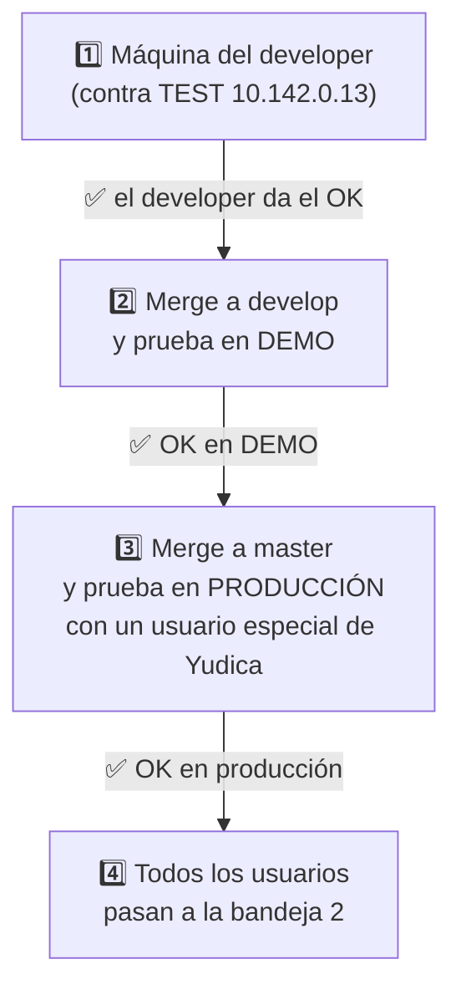
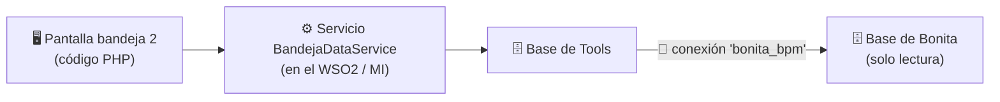
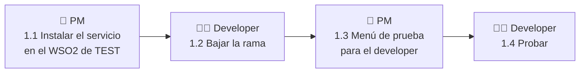
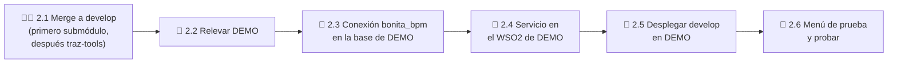
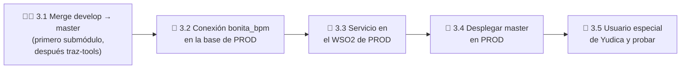
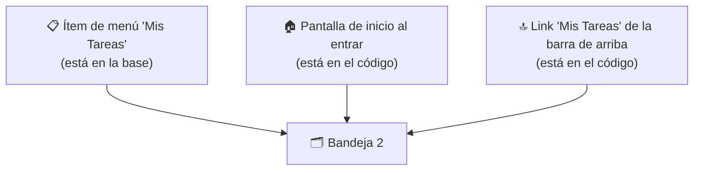

# 🗂️ Bandeja de entrada 2: guía paso a paso

## Objetivo

Guía para llevar la **bandeja de entrada 2** (la que busca rápido) desde la máquina del developer hasta producción, en 4 etapas: 1️⃣ probarla en la máquina del developer, 2️⃣ pasarla a `develop` y probarla en DEMO, 3️⃣ pasarla a `master` y probarla en producción con un usuario especial de Yudica, y 4️⃣ dejarla para todos en producción. Es para el **PM** y el **developer**, y se sigue en orden, de arriba hacia abajo. No explica cómo funciona por dentro: eso está en [`bandeja-paginado-real-referencia.md`](bandeja-paginado-real-referencia.md).

---

## 🧭 El camino completo



### 📌 Lo que hay que saber antes de empezar

- 🆕 **Hay dos bandejas.** La de siempre, **"Mis Tareas"**, sigue igual y nadie la toca. La nueva, la **bandeja 2**, convive con ella hasta la etapa 4. Así se pueden comparar las dos con los mismos datos.
- 🌿 **La rama** se llama `feat/bandeja-paginado-real` y existe en **dos repositorios**: `traz-tools` y el submódulo `traz-comp-bpm`. Siempre se trabaja con los dos.
- 🧩 **Qué necesita la bandeja 2 en cada ambiente** (TEST, DEMO, producción). Son 3 piezas, y las 3 se instalan antes de usarla:



| Pieza | Qué es | Cómo se instala |
|---|---|---|
| 🔗 **Conexión `bonita_bpm`** | Permite que la base de Tools lea las tareas de Bonita | Un script SQL, **una vez** por ambiente |
| ⚙️ **Servicio `BandejaDataService`** | Hace la consulta rápida (tareas + empresa + búsqueda) | Copiar **un archivo** al WSO2 del ambiente |
| 🖥️ **Código PHP** | La pantalla de la bandeja 2 | Viene con la rama: `develop` → DEMO, `master` → producción |

- 🧾 **Dónde se ejecuta cada cosa:** cada paso lo dice al principio:
  - 🖥️ **En tu PC:** tu terminal, con la VPN conectada.
  - 🔐 **SSH:** conectado por SSH al servidor que se indica.
  - 🌐 **Navegador:** en Tools, en el navegador.
- ⚠️ **Al medir tiempos:** al entrar a Tools se abre sola "Mis Tareas", la lenta. Si abrís la bandeja 2 mientras "Mis Tareas" todavía carga, la 2 **espera** a que termine. **Esperá a que "Mis Tareas" termine de cargar y recién ahí abrí la bandeja 2.**

---

## 1️⃣ Etapa 1: que funcione en la máquina del developer



> ℹ️ En TEST la **conexión `bonita_bpm` ya está creada** (se hizo el 2026-10-07). Solo falta el servicio.

### 1.1 👤 PM: instalar el servicio en el WSO2 de TEST (10.142.0.13)

1. 🖥️ **En tu PC**, desde la carpeta de `traz-tools` en la rama `feat/bandeja-paginado-real`, copiá el archivo del servicio al servidor:

   ```bash
   scp _backend/api/ToolsAPIProject/ToolsAPIProject/src/main/wso2mi/artifacts/data-services/BandejaDataService.dbs \
     <tu usuario>@10.142.0.13:/tmp/
   ```

2. 🔐 **SSH a 10.142.0.13:** averiguá en qué carpeta está instalado el WSO2. Buscá en la salida una ruta del estilo `/opt/wso2.../` o `/home/.../wso2...`:

   ```bash
   ps aux | grep -i wso2 | grep -v grep
   ```

3. 🔐 **SSH a 10.142.0.13:** copiá el archivo a la carpeta `repository/deployment/server/dataservices/` de ese WSO2. Se instala solo en unos segundos, **sin reiniciar nada**:

   ```bash
   cp /tmp/BandejaDataService.dbs <carpeta del WSO2>/repository/deployment/server/dataservices/
   ```

4. 🖥️ **En tu PC:** probá que el servicio responde. Tiene que devolver un texto que empieza con `{"tareas":`:

   ```bash
   curl -s -H "Accept: application/json" \
     "http://10.142.0.13:8280/services/BandejaDataService/bandeja/tareas/usuario/623/empresa/777/offset/0/limit/1?buscar=&procesos=%7B%7D"
   ```

   - ✅ Si devuelve `{"tareas":{"tarea":[...]}}`, listo.
   - ❌ Si devuelve error o nada, esperá 30 segundos y probá de nuevo. Si sigue igual, revisá el log del WSO2 (`<carpeta del WSO2>/repository/logs/wso2carbon.log`) buscando `BandejaDataService`.

### 1.2 👩‍💻 Developer: bajar la rama

1. 🖥️ **En tu PC**, en la carpeta de tu `traz-tools`, fijate que no tengas cambios sin guardar. Si `git status` muestra archivos modificados, guardalos antes con `git stash`:

   ```bash
   git status
   ```

2. 🖥️ **En tu PC:** bajá la rama. El segundo comando pone el submódulo `traz-comp-bpm` en la versión correcta:

   ```bash
   git fetch origin && git checkout feat/bandeja-paginado-real
   git submodule update --init
   ```

3. 🖥️ **En tu PC:** comprobá que tenés los archivos nuevos. Tienen que aparecer los dos, sin error:

   ```bash
   ls application/modules/traz-comp-bpm/controllers/Proceso2.php application/modules/traz-comp-bpm/models/Procesos2.php
   ```

> ℹ️ No hay que configurar nada más. Tu Tools local ya usa los servicios de TEST, y la bandeja 2 busca el servicio en el mismo WSO2 (`http://10.142.0.13:8280`).

### 1.3 👤 PM: menú de prueba para el developer, en TEST

El menú "Mis Tareas 2 (prueba)" lo ve **solo** el usuario que se indique. Para la prueba local, ese usuario es el developer.

1. 🖥️ **En tu PC:** mirá cómo se llama la empresa con la que va a probar el developer (en TEST, Yudica es `Yudica`). Anotá el valor de la columna `group`:

   ```bash
   psql -h 10.142.0.13 -U postgres -d tools_prod_t -c "SELECT DISTINCT \"group\" FROM seg.memberships_users WHERE \"group\" ILIKE '%yudi%'"
   ```

2. 🖥️ **En tu PC**, desde la carpeta de `traz-tools` en la rama: creá el menú para el usuario del developer, que tiene que existir en Tools:

   ```bash
   psql -h 10.142.0.13 -U postgres -d tools_prod_t -v ON_ERROR_STOP=1 \
     -v email='<email del developer en Tools>' -v grupo='Yudica' \
     -f _backend/database/scripts/versiones/bandeja2_menu_prueba.sql
   ```

   - ✅ Al final muestra **una fila** con el email: listo.
   - ❌ Si dice que el email no está en `users`, ese usuario no existe en Tools. Usá el email exacto con el que entra.

### 1.4 👩‍💻 Developer: probar

1. 🌐 **Navegador:** entrá a tu Tools local como siempre y elegí la empresa Yudica.
2. 🌐 Esperá a que termine de cargar "Mis Tareas".
3. 🌐 En el menú de la izquierda vas a ver **"Mis Tareas 2 (prueba)"**. Abrila.
4. 🌐 Compará las dos bandejas, con el mismo usuario y la misma empresa:

| ✔️ | Qué hacer | Qué tiene que pasar |
|---|---|---|
| ☐ | Abrir las dos bandejas | Mismo total ("de un total de N registros"), mismas tareas, mismo orden, misma info en cada fila |
| ☐ | Pasar de página. Cambiar a 25 y 50 registros | Lo mismo en las dos. En la 2, cada página tarda lo mismo que la primera |
| ☐ | **Buscar apenas entrás** a la bandeja 2: un n° de pedido, un estado, un nombre de tarea, un n° de case, `2025/` | Mismas filas que en la vieja. En la 2, la **primera** búsqueda es rápida (segundos, no minutos) |
| ☐ | Buscar algo que no existe | Las dos dicen 0 registros |
| ☐ | Borrar la búsqueda con la ✕ | Vuelve la lista completa |
| ☐ | Abrir una tarea desde la bandeja 2 | Se abre igual que en la vieja |
| ☐ | Tomar y soltar una tarea desde la bandeja 2 | Funciona; cambia el ícono de asignado |
| ☐ | Cerrar una tarea desde la bandeja 2 | Se cierra y volvés a la **bandeja 2**, sin esa tarea |
| ☐ | Cambiar de empresa (si el usuario tiene varias) | Cada bandeja muestra solo las tareas de esa empresa |

> ⚠️ En TEST, tomar, soltar y cerrar tareas **cambia datos de verdad** en el ambiente. Usá tareas de prueba.

> 📝 Si algo da distinto, anotá usuario, empresa, texto buscado y qué tarea aparece en una bandeja y no en la otra (con su n° de case).

**✅ Etapa 1 lista cuando:** todos los ☐ de la tabla están bien y el developer da el OK.

---

## 2️⃣ Etapa 2: pasar a `develop` y probar en DEMO



### 2.1 👩‍💻 Developer: merge a `develop`

El orden importa: **primero el submódulo, después `traz-tools`**.

1. 🖥️ **En tu PC:** confirmá que la rama trae **solo** cambios de la bandeja. El primer comando muestra unos pocos commits de la bandeja; el segundo, solo archivos con "bandeja", `Proceso2`, `Procesos2`, `constants.php`, `STATE.md` o `traz-comp-bpm` en el nombre:

   ```bash
   git fetch origin && git log --oneline origin/develop..origin/feat/bandeja-paginado-real
   git diff --stat origin/develop origin/feat/bandeja-paginado-real
   ```

2. 🌐 **En GitHub, repositorio `traz-comp-bpm`:** abrí un PR de `feat/bandeja-paginado-real` hacia `develop` y mergealo. Agrega solo 3 archivos nuevos.
3. 🌐 **En GitHub, repositorio `traz-tools`:** abrí un PR de `feat/bandeja-paginado-real` hacia `develop` y mergealo.

### 2.2 👤 PM: relevar DEMO

Antes de instalar, completá esta tabla. Producción es igual a DEMO, así que en la etapa 3 se repite con los datos de producción.

| Dato | Dónde se ve | DEMO | Producción |
|---|---|---|---|
| 🗄️ Base de Tools: servidor, base, usuario | 🔐 SSH al servidor de la app → archivo `application/config/database.php`, la conexión de PostgreSQL (`hostname`, `database`, `username`) | | |
| 🗄️ Base de Bonita: servidor, puerto, base | 🔐 SSH al servidor de Bonita → `grep -h "jdbc:" <carpeta de Tomcat>/conf/Catalina/localhost/bonita.xml` | | |
| ⚙️ WSO2: dirección y carpeta | 🔐 SSH al servidor de la app → `HOST` en `application/config/constants.php`. 🔐 SSH al servidor del WSO2 → `ps aux \| grep -i wso2` | | |
| ¿Base de Tools y base de Bonita en la **misma** máquina? | Comparando las dos primeras filas | ☐ sí ☐ no | ☐ sí ☐ no |

> ℹ️ Como referencia, en TEST todo está en 10.142.0.13. La base de Bonita es `localhost:6432/bonita` y la base de Tools es `tools_prod_t`, las dos en la misma máquina.

### 2.3 👤 PM: crear la conexión `bonita_bpm` en la base de Tools de DEMO

1. 🖥️ **En tu PC:** abrí el archivo `_backend/database/scripts/versiones/bandeja_bonita_dblink.sql` y cambiá, con los datos del relevamiento:
   - en `CREATE SERVER ... OPTIONS (...)`: `host`, `port` y `dbname` de la **base de Bonita**. Si las dos bases están en la misma máquina, `host` queda `127.0.0.1`;
   - en `CREATE USER MAPPING FOR postgres`: si el usuario de la base de Tools no es `postgres`, poné el que anotaste.

   ⚠️ No guardes contraseñas en git.
2. 🖥️ **En tu PC:** ejecutá el script en la **base de Tools** de DEMO:

   ```bash
   psql -h <servidor base Tools DEMO> -U postgres -d <base Tools DEMO> -v ON_ERROR_STOP=1 \
     -f _backend/database/scripts/versiones/bandeja_bonita_dblink.sql
   ```

3. 🖥️ **En tu PC:** comprobá que la base de Tools llega a Bonita. Tiene que mostrar la versión de PostgreSQL de Bonita:

   ```bash
   psql -h <servidor base Tools DEMO> -U postgres -d <base Tools DEMO> -Atc "SELECT * FROM dblink('bonita_bpm', 'select version()') AS t(v text)"
   ```

   - ✅ Muestra algo como `PostgreSQL 9.4...`: listo.
   - ❌ Si dice "could not connect" o "password authentication failed", la base de Bonita no acepta la conexión. Si las bases están en **máquinas distintas**, hay que permitir la conexión desde la base de Tools en `pg_hba.conf` de Bonita (detalle en la referencia, sección 4.2).

### 2.4 👤 PM: instalar el servicio en el WSO2 de DEMO

Es lo mismo que el paso **1.1**, pero con el servidor y la carpeta del WSO2 de DEMO. Para comprobar, usá la dirección (`HOST`) de DEMO en el `curl`, con `usuario/1/empresa/1`.

### 2.5 👤 PM: desplegar `develop` en DEMO

- Con el **procedimiento habitual** de DEMO. La bandeja 2 viene en `develop` desde el paso 2.1.
- Al desplegar, actualizá también los submódulos (`git submodule update`). Si no, falta la pantalla nueva.

### 2.6 👤 PM: menú de prueba y probar en DEMO

1. 🌐 **DNATO de DEMO:** si no existe, creá el **usuario especial**, con el alta habitual, en la empresa Yudica y con el **mismo rol** que los operadores de Yudica. Así ve las mismas tareas que ellos.
2. 🖥️ **En tu PC:** creá el menú de prueba para ese usuario, igual que en el **1.3**, pero con la base de Tools de DEMO y el email del usuario especial.
3. 🌐 **Navegador:** entrá a DEMO con el usuario especial y repetí la tabla de pruebas del **1.4**.

**✅ Etapa 2 lista cuando:** la tabla del 1.4 da bien en DEMO.

---

## 3️⃣ Etapa 3: pasar a `master` y probar en PRODUCCIÓN



Son **los mismos pasos que en DEMO**, con los datos de producción de la tabla del 2.2:

1. 👩‍💻 **3.1 Merge de `develop` a `master`**, como en cada pase a producción: primero el submódulo `traz-comp-bpm`, después `traz-tools`.
2. 👤 **3.2 Conexión `bonita_bpm`:** igual que el **2.3**, con la base de Tools de producción.
   - 💡 Recomendado en producción: que la conexión use un usuario de Bonita que **solo pueda leer**. Los comandos están en la referencia, sección 4.2.
3. 👤 **3.3 Servicio:** igual que el **1.1**, con el WSO2 de producción.
4. 👤 **3.4 Desplegar `master`** en producción con el procedimiento habitual, incluidos los submódulos.
5. 👤 **3.5 Usuario especial y menú de prueba:** igual que el **2.6**, con la base y el DNATO de producción.

> ⚠️ **Cuidado en producción:** el usuario especial ve **tareas reales de Yudica**. Mirar y buscar no cambia nada. **Tomar, soltar o cerrar una tarea sí**, igual que en la bandeja vieja. Coordiná con Yudica antes de accionar una tarea.

**✅ Etapa 3 lista cuando:** con el usuario especial, "Mis Tareas" y "Mis Tareas 2 (prueba)" muestran lo mismo, y la búsqueda de la 2 es rápida desde la primera vez.

---

## 4️⃣ Etapa 4: dejar la bandeja 2 para todos en PRODUCCIÓN

Hay **tres lugares** que abren la bandeja. Los tres tienen que pasar a la versión 2:



### 4A 👩‍💻 Código: pantalla de inicio y barra de arriba

Es un cambio chico, en una rama nueva que sale de `develop` y sigue el camino de siempre (`develop` → DEMO → `master` → producción).

- 📄 `application/config/constants.php`, **línea 208**: cambiar
  `define('DEF_VIEW',BPM.'Proceso');` por `define('DEF_VIEW',BPM.'Proceso2');`
- 📄 `application/views/layout/perfil.php`, **línea 12**: en `onclick="linkTo('traz-comp-bpm/Proceso')"`, cambiar `Proceso` por `Proceso2`.

> ℹ️ Este cambio **no** está en la rama `feat/bandeja-paginado-real` a propósito. Si estuviera, todos los usuarios pasarían a la bandeja 2 apenas llega a producción, antes de la prueba con el usuario especial.

### 4B 👤 PM: el ítem de menú, el mismo día que se despliega el 4A en producción

1. 🖥️ **En tu PC**, desde la carpeta de `traz-tools`: el script cambia "Mis Tareas" para que abra la bandeja 2 y borra el menú de prueba:

   ```bash
   psql -h <servidor base Tools PROD> -U postgres -d <base Tools PROD> -v ON_ERROR_STOP=1 \
     -f _backend/database/scripts/versiones/bandeja2_menu_pasar_a_todos.sql
   ```

2. ✅ Al final muestra **una sola fila**: `PRD | tareas | Mis Tareas | traz-comp-bpm/Proceso2`.
3. 🌐 **Navegador:** entrá con un usuario cualquiera de Yudica. Al entrar, y desde "Mis Tareas", tiene que abrirse la **bandeja 2**: dice "Bandeja de Tareas 2" en el título.

**✅ Etapa 4 lista cuando:** todos entran directo a la bandeja 2 y nadie ve más "Mis Tareas 2 (prueba)".

---

## 🆘 Volver atrás (en cualquier etapa)

- 🧯 **La bandeja vieja nunca se tocó.** Volver atrás es dejar de mandar a la gente a la 2:

| Si querés deshacer… | Qué hacer |
|---|---|
| El paso a todos (etapa 4B) | 🖥️ En tu PC: `psql -h <servidor> -U postgres -d <base> -c "UPDATE seg.menues SET url = 'traz-comp-bpm/Proceso' WHERE modulo = 'PRD' AND opcion = 'tareas'"` |
| La pantalla de inicio y la barra (etapa 4A) | Revertir ese cambio chico en git y volver a desplegar |
| El menú de prueba (etapas 1 a 3) | 🖥️ En tu PC: los 3 `DELETE` que están al principio de `bandeja2_menu_prueba.sql` |
| Todo el código de la bandeja 2 | Revertir los merges en git y volver a desplegar. Sin el menú, nadie llega a la bandeja 2, así que no es urgente |
| El servicio | 🔐 SSH al WSO2: borrar `<carpeta del WSO2>/repository/deployment/server/dataservices/BandejaDataService.dbs` |
| La conexión `bonita_bpm` | 🖥️ En tu PC: `psql -h <servidor> -U postgres -d <base> -c "DROP USER MAPPING IF EXISTS FOR postgres SERVER bonita_bpm; DROP SERVER IF EXISTS bonita_bpm;"` |

---

## 📎 Para saber más

En [`bandeja-paginado-real-referencia.md`](bandeja-paginado-real-referencia.md):
- 🔍 cómo funciona por dentro y por qué la empresa se filtra con `core.case_empresa`;
- 🔒 usuario de solo lectura en Bonita y conexión entre máquinas distintas;
- 🧪 cómo se verificó que busca exactamente igual que la bandeja vieja;
- 🛠️ **mantenimiento**: si cambia lo que muestra un proceso en la bandeja, hay que actualizar también el servicio.
