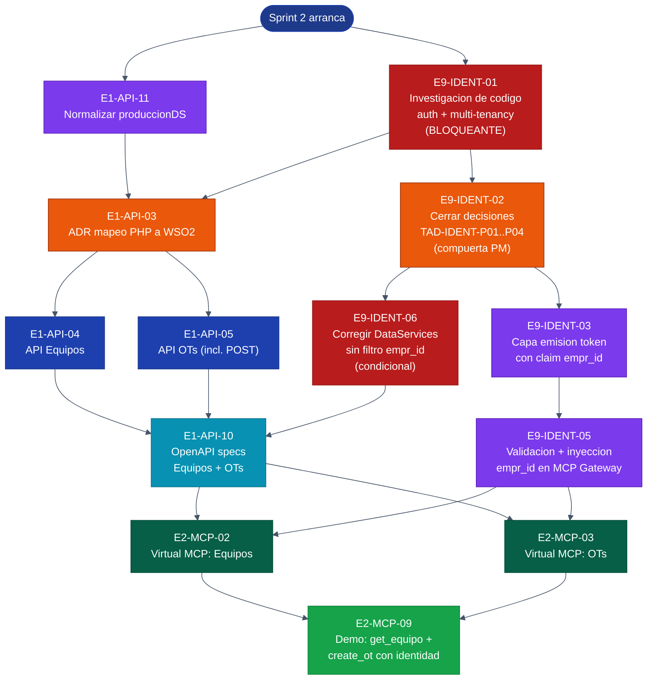

# Trazalog v3 — Sprint 2 Kickoff Guide

### Historial de cambios

| Versión | Fecha | Cambios |
|---|---|---|
| 1.0 | Mayo 2026 | Versión inicial: 4 tools MCP + demo |
| 2.0 | Mayo 2026 | Replanificación identidad-primero. La capa de identidad pasa a ser el foco principal; la demo se acota a 2 tools (`get_equipo` + `create_ot`). Incorpora épica E9 |
| **2.1** | **Mayo 2026** | **Cierre de decisiones P01–P04 (post-investigación E9-IDENT-01). Sección 5 actualizada con las 4 decisiones cerradas + decisión derivada. Prompts 4, 5, 8 y 9 reescritos con detalles concretos del cierre. Sección 6 ya no tiene compuerta de decisiones — apunta directo a Sección 6.8 del MCP Architecture Doc** |

> Este kickoff doc unifica:
> - Objetivo y criterio de éxito del sprint
> - Mapa de dependencias entre tareas
> - Decisiones tomadas (incluyendo el cierre P01–P04)
> - Prompts ejecutables para Claude Code
> - Definition of Done y estimación

---

## 1. Objetivo del Sprint 2

> **Implementar la capa de identidad multi-tenant COMPLETA de Trazalog v3 — flujo OAuth de punta a punta: pantalla de login + emisión de token con claim `empr_id` + validación en el gateway — y demostrarla con 2 tools MCP reales (`get_equipo` y `create_ot`) corriendo desde el DEV local vía ngrok, antes del 1 de junio de 2026.**

### Criterio de éxito (la demo)

Un evaluador abre Claude.ai, agrega el custom connector de Trazalog, y el flujo OAuth real se dispara: el navegador lo lleva a una **pantalla de login propia de Trazalog**, ingresa credenciales ahí (Claude nunca las ve), y queda autenticado. Luego puede:

1. Preguntar *"dame el detalle del equipo X"* → Claude responde con datos reales **solo de la empresa del usuario logueado**
2. Pedir *"creá una orden de trabajo correctiva para el equipo X"* → Claude crea la OT **en la empresa del usuario**
3. El pitch de seguridad: *"el usuario se autentica contra Trazalog, no contra Claude; el `empr_id` viaja firmado criptográficamente dentro del token; Claude nunca puede ver ni escribir datos de otro contratista, ni siquiera si se lo pide explícitamente"*

Todo corriendo en tu workstation Ubuntu 24, expuesto por ngrok, con flujo OAuth y aislamiento multi-tenant **reales de punta a punta**.

### ⚠️ Cláusula de protección de fecha

El objetivo es identidad completa **con flujo OAuth visual** (E9-IDENT-04 incluido). Pero E9-IDENT-04 es la pieza más impredecible del sprint: su esfuerzo real depende de qué tan reutilizable sea el login actual de Trazalog, y eso **solo se sabe cuando termine la investigación E9-IDENT-01** (primeros días del sprint).

Por eso: **E9-IDENT-04 es el primer candidato del plan de corte (sección 7).** Si la investigación revela que el login actual no es reutilizable y la pantalla OAuth se vuelve un esfuerzo desproporcionado, se cae al *token de prueba emitido por el sistema* para la demo — el JWT sigue siendo real, el claim real, la validación real; solo se pospone la UI de login a Sprint 3. Esa decisión se toma **con la investigación en mano, no a ciegas.**

### Qué NO entra en este sprint

- Tools de OTs read-only, KPIs y stock de almacenes → Sprint 3
- VM TEST en GCP (E0-INF-02) → diferido
- OAuth 2.1 + DCR (Dynamic Client Registration) completo para el Connectors Directory → Q2 2027

---

## 2. Por qué identidad va primero — la decisión

El MCP Architecture Doc (sección 6) es explícito: **el modelo de identidad es un prerequisito bloqueante del Sprint 2**, no un complemento.

### El problema

```
Hoy (web):   usuario → login → empr_id en sesión PHP → queries filtran por empresa
MCP (v3):    NO hay login en la conversación, NO hay sesión PHP
             → el empr_id debe viajar de otra forma, verificable en cada request
```

Sin esta capa, una tool como `create_ot` escribiría órdenes de trabajo sin saber a qué empresa pertenecen — o peor, en la empresa equivocada. La spec de seguridad de MCP **prohíbe** atar la autorización al identificador de sesión.

### Las decisiones ya tomadas (firmes — TAD-IDENT-01 a 04)

| ID | Decisión |
|---|---|
| TAD-IDENT-01 | El `empr_id` viaja como **claim del token OAuth**, nunca como sesión ni como parámetro de tool |
| TAD-IDENT-02 | El MVP asume **una empresa por usuario**, pero el `empr_id` se modela como claim explícito (puerta abierta a multi-empresa) |
| TAD-IDENT-03 | El aislamiento multi-tenant se **enforza en el WSO2 MCP Gateway** |
| TAD-IDENT-04 | El usuario se autentica contra **Trazalog**, no contra Claude ni WSO2 |

> 🔒 **Regla de oro:** el `empr_id` NUNCA es un parámetro que el LLM pueda completar. Si lo fuera, un prompt injection podría hacer que Claude acceda a datos de otra empresa. El tenant jamás lo decide el modelo — viaja firmado en el token.

### Las decisiones pendientes (a cerrar en Sprint 2 — TAD-IDENT-P01 a P04)

Estas dependen de la investigación de código y **no deben asumirse resueltas** antes de ella:

- **P01:** ¿Quién es el Authorization Server — WSO2 o el stack Trazalog actual?
- **P02:** ¿Qué hace el sistema si un usuario tiene más de una empresa en Bonita?
- **P03:** ¿Cómo se consultan los Memberships de Bonita?
- **P04:** ¿Hay DataServices que no filtran por empresa? (auditoría)

---

## 3. Mapa de dependencias



### Reglas de dependencia que NO se pueden saltar

| Regla | Por qué |
|---|---|
| `E9-IDENT-01` antes de `E9-IDENT-02` | No se pueden cerrar las decisiones P01-P04 sin la investigación |
| `E9-IDENT-02` antes de `E9-IDENT-03` | El diseño del token depende de quién sea el Authorization Server (P01) |
| `E9-IDENT-05` antes de exponer cualquier tool MCP | Una tool sin validación de token = agujero de seguridad multi-tenant |
| `E9-IDENT-06` antes de `E1-API-10` | No publicar specs de APIs cuyos DataServices no filtran por empresa |
| `E1-API-11` antes de las APIs de Asset Planner | Datasource normalizado primero |

### Qué se puede paralelizar

- `E9-IDENT-01` (investigación) y `E1-API-11` (normalizar datasource) — arrancan **el día 1, en paralelo**
- Una vez aprobado el ADR: `E1-API-04` y `E1-API-05` son independientes entre sí
- La capa de identidad (E9-IDENT-03/05) y la generación de APIs (E1-API-04/05) corren **en paralelo** — son trabajos independientes que solo se encuentran en E1-API-10

---

## 4. Secuencia de ejecución por bloques

### Bloque 0 — Arranque inmediato (día 1) — PARALELIZABLE

| # | Issue | Quién | Bloquea a |
|---|---|---|---|
| 1 | **E9-IDENT-01** Investigación de código auth + multi-tenancy | Claude Code | Todo el bloque de identidad |
| 2 | **E1-API-11** Normalizar `produccionDS` → `ToolsDataSource` | Claude Code | APIs de Asset Planner |

> 🚀 Estos dos arrancan **hoy**. No dependen de nada. Podés lanzar dos sesiones de Claude Code o hacerlas en secuencia.

### Bloque 1 — Cierre de decisiones (día 2-3)

| # | Issue | Quién | Bloquea a |
|---|---|---|---|
| 3 | **E9-IDENT-02** Cerrar decisiones TAD-IDENT-P01..P04 | Claude Web + **vos** | Toda la implementación de identidad |
| 4 | **E1-API-03** ADR mapeo PHP→WSO2 | Claude Code redacta → **vos aprobás** | Generación de APIs |

> 🚦 **Dos compuertas humanas.** E9-IDENT-02 es un workshop conmigo (Claude Web) usando la investigación como insumo — produce el ADR-007. E1-API-03 lo redacta Claude Code y vos lo aprobás.

### Bloque 2 — Implementación (día 3-10) — DOS FRENTES PARALELOS

**Frente A — Identidad:**

| # | Issue | Quién | Depende de |
|---|---|---|---|
| 5 | **E9-IDENT-03** Capa de emisión de token con claim `empr_id` | Claude Code | E9-IDENT-02 |
| 6 | **E9-IDENT-04** Pantalla de login Trazalog OAuth 2.1 + PKCE | Claude Code | E9-IDENT-03 |
| 7 | **E9-IDENT-05** Validación + inyección de `empr_id` en MCP Gateway | Claude Code + vos en consola WSO2 | E9-IDENT-03 |
| 8 | **E9-IDENT-06** Corregir DataServices sin filtro por empresa *(condicional)* | Claude Code | E9-IDENT-02 (auditoría P04) |

> ⚠️ **E9-IDENT-04 es la pieza de riesgo del sprint.** Su esfuerzo depende de la investigación E9-IDENT-01. Ver cláusula de corte en sección 1 y plan de corte en sección 7.

**Frente B — APIs:**

| # | Issue | Quién | Depende de |
|---|---|---|---|
| 9 | **E1-API-04** API Equipos | Claude Code | E1-API-03 |
| 10 | **E1-API-05** API OTs (incluye `POST /api/ot`) | Claude Code | E1-API-03 |

### Bloque 3 — OpenAPI specs (día 10-11)

| # | Issue | Quién | Depende de |
|---|---|---|---|
| 11 | **E1-API-10** OpenAPI specs (parcial: solo Equipos + OTs) | Claude Code + vos validás en Publisher | E1-API-04, E1-API-05, E9-IDENT-06 |

### Bloque 4 — Virtual MCP Servers (día 11-13)

| # | Issue | Quién | Depende de |
|---|---|---|---|
| 12 | **E2-MCP-02** Virtual MCP: Equipos (tool `get_equipo`) | Claude Code + vos en consola WSO2 | E1-API-10, E9-IDENT-05 |
| 13 | **E2-MCP-03** Virtual MCP: OTs (tool `create_ot`) | Claude Code + vos en consola WSO2 | E1-API-10, E9-IDENT-05 |

### Bloque 5 — Demo (día 13-14)

| # | Issue | Quién | Depende de |
|---|---|---|---|
| 14 | **E2-MCP-09** Smoke test demo: `get_equipo` + `create_ot` con identidad | Vos | Bloque 4 completo |

---

## 5. Decisiones tomadas para este sprint
### 5.1 La demo usa el flujo OAuth real de punta a punta

El evaluador agrega el connector, el navegador lo lleva a la pantalla de login propia de Trazalog (E9-IDENT-04), ingresa credenciales, y queda autenticado con un token real. Cero simulación.

> 📝 La "cláusula de corte" que existía en v2.0 del kickoff fue **eliminada** en v2.1: la investigación E9-IDENT-01 confirmó que el login actual es adaptable a OAuth + PKCE sin reescritura mayor, y el acoplamiento a Bonita no es un problema (Bonita es prerequisito operacional del sistema completo, no solo del login). E9-IDENT-04 queda en Sprint 2 sin condición de corte.

### 5.2 `create_ot` es la única tool destructiva — usar BD de desarrollo reseteable

`create_ot` escribe en la base. Para la demo:
- Usar la **base de datos de desarrollo** con datos de prueba, accesible vía VPN
- Tener forma de resetear/limpiar las OTs de prueba entre ensayos
- `create_ot` lleva `destructiveHint: true` en sus annotations

### 5.3 `get_equipo` lleva `readOnlyHint: true`

Consulta de detalle de equipo, sin efectos secundarios.

### 5.4 OAuth 2.1 + DCR completo se difiere

El flujo OAuth con Dynamic Client Registration es requisito del Connectors Directory (Q2 2027), no de la demo. Sprint 2 implementa emisión y validación de token; el flujo público completo es posterior.

### 5.5 Cierre de decisiones P01–P04 — referencias a la fuente

Las 4 decisiones pendientes del modelo de identidad (TAD-IDENT-P01 a P04) quedaron cerradas en la **Sección 6.8** del documento `TRAZALOG_v3_MCP_ARCHITECTURE.md` (v1.2). Resumen rápido para el sprint:

| Decisión | Cierre |
|---|---|
| **P01** Authorization Server | Dnato emite JWT, WSO2 valida (Opción 3.2) |
| **P02** Multi-empresa | Dropdown solo si memberships > 1. Token inmutable |
| **P03** Memberships Bonita | WSO2 MI proxy + fix `c=10` → `c=100` |
| **P04** Auditoría DataServices | E9-IDENT-06 obligatorio. Fase A: `MANDataService` + `ALMDataService`. Lista negra de 12 DataServices para Fase B |
| **Derivada** | Cambio de empresa NO soportado en MCP |

Ver `TRAZALOG_v3_MCP_ARCHITECTURE.md` Sección 6.8 para justificación completa y restricciones derivadas.

---

## 6. Prompts de arranque para Claude Code

> **Convención:** Claude Code se ejecuta desde la terminal en el repo. Para máxima autonomía:
> ```bash
> cd /mnt/win/dev/git/traz-tools
> claude --dangerously-skip-permissions
> ```
> El `CLAUDE.md` del repo define el comportamiento (branch `develop-v3`, carpeta `doc/`, formato de commits).

---

### Prompt 1 — E9-IDENT-01 — Investigación de código de autenticación y multi-tenancy

```
Tarea: E9-IDENT-01 — Investigar el modelo de autenticación y multi-tenancy actual de Trazalog.

Contexto: Trazalog v3 va a exponer tools MCP que requieren aislamiento multi-tenant. El empr_id (id de empresa) hoy se resuelve en el login y se guarda en sesion PHP. Para MCP necesitamos que viaje como claim de un token. Antes de implementar nada, hay que entender como funciona hoy el login y la resolucion de empresa. Esta investigacion es BLOQUEANTE: las decisiones de arquitectura TAD-IDENT-P01 a P04 dependen de sus resultados.

Esta tarea es de SOLO LECTURA del codigo — no modifica nada, solo investiga y documenta.

Repos a investigar:
- traz-tools (este repo) — modulo Tools, helper de login, integracion Bonita
- /mnt/win/dev/git/traz-prod-assetplanner/ — Asset Planner usa id_empresa

Preguntas a responder:
1. FLUJO DE LOGIN ACTUAL:
   - Donde esta implementado el login? (controller, library, helper)
   - Como autentica las credenciales? Contra que tabla/servicio?
   - Como se resuelve el empr_id despues de autenticar?
   - Donde y como se guarda el empr_id en la sesion?
2. INTEGRACION CON BONITA:
   - Como consulta Trazalog los Memberships de Bonita?
   - Existe una API de Memberships? Cual es su contrato (endpoint, parametros, respuesta)?
   - Trazalog usa el "group" de Bonita para representar una empresa — confirmar como se mapea group a empr_id
3. VIABILIDAD OAUTH:
   - El stack PHP actual podria participar de un flujo OAuth 2.1 (authorization code + PKCE) sin una reescritura mayor?
   - Que tan acoplado esta el login a Bonita?
4. AUDITORIA DE AISLAMIENTO (critico):
   - Revisar los DataServices (.dbs) y APIs bajo _backend/api/
   - Identificar CUALES filtran por empr_id / id_empresa y CUALES NO
   - Listar explicitamente los DataServices que NO filtran por empresa — son un riesgo de seguridad

Entregable: crear doc/identity/auth-research-2026.md con:
(a) Diagrama del flujo de login actual (en Mermaid)
(b) Existencia y contrato de la API de Memberships de Bonita
(c) Conclusion sobre viabilidad de reutilizar el login actual en un flujo OAuth
(d) Lista de riesgos e inconsistencias — especialmente DataServices sin filtro por empresa
(e) Para cada decision pendiente (P01, P02, P03, P04), un resumen de los hallazgos que la informan

Definition of Done:
- [ ] doc/identity/auth-research-2026.md creado con las 5 secciones
- [ ] Diagrama Mermaid del flujo de login
- [ ] Lista explicita de DataServices que no filtran por empresa
- [ ] Commit en develop-v3

Commit message: docs(identity): add auth and multi-tenancy code research [E9-IDENT-01]

IMPORTANTE: cuando termines, avisa que la investigacion esta lista. El PM la va a
revisar en Claude Web para cerrar las decisiones P01-P04 antes de implementar.
```

> 🚦 **Compuerta humana.** Cuando Claude Code entregue la investigación, traémela a Claude Web. Cerramos juntos las decisiones P01-P04 (eso es E9-IDENT-02).

---

### Prompt 2 — E1-API-11 — Normalizar `produccionDS`

```
Tarea: E1-API-11 — Normalizar el datasource produccionDS a ToolsDataSource.

Contexto: el inventario E1-API-01 detecto que algunos artefactos WSO2 referencian un datasource produccionDS que es el mismo ToolsDataSource mal nombrado por una copia entre ambientes. Corregir antes de generar los DataServices nuevos del Sprint 2.

Path de artefactos: _backend/api/ToolsAPIProject/ToolsAPIProject/src/main/wso2mi/artifacts/

Acciones:
1. grep -rn "produccionDS" _backend/api/ToolsAPIProject/
2. Reemplazar produccionDS por ToolsDataSource en cada .dbs o .xml que lo referencie.
3. Verificar: el grep debe devolver cero resultados despues del reemplazo.
4. Actualizar doc/api/inventory-2026.md con la nota de normalizacion.

Definition of Done:
- [ ] grep -rn "produccionDS" no devuelve resultados bajo artifacts/
- [ ] doc/api/inventory-2026.md actualizado
- [ ] Commit en develop-v3

Commit message: chore(api): normalize produccionDS datasource to ToolsDataSource [E1-API-11]
```

---

### Prompt 3 — E1-API-03 — ADR mapeo PHP → WSO2

```
Tarea: E1-API-03 — Redactar el ADR de mapeo de orquestaciones PHP a estrategia WSO2.

Contexto: para cada operacion que vamos a exponer (Equipos y OTs en este sprint), formalizar la decision: DataService SQL puro, sequence de mediacion WSO2, o excepcion Python Phase 2. Criterio ADR-003: maximizar WSO2, Python solo para AI/ML/RAG.

Prerequisito: E1-API-11 (datasource normalizado), E9-IDENT-01 (investigacion — para saber que DataServices ya filtran por empresa).

Acciones:
1. Leer doc/api/codeigniter-models-survey.md, doc/api/inventory-2026.md, doc/identity/auth-research-2026.md.
2. Crear doc/adr/ADR-003-php-to-wso2-mapping.md con tabla por operacion:
   nombre | entidad (Equipos/OTs) | estrategia (DataService/Sequence/Python-Phase2) | filtra por empr_id (si/no/a corregir) | justificacion
3. Foco en las operaciones necesarias para los 2 Virtual MCP Servers del sprint: detalle de Equipo y creacion de OT.
4. No generar codigo — solo la decision documentada.

Definition of Done:
- [ ] doc/adr/ADR-003-php-to-wso2-mapping.md creado
- [ ] Tabla cubre las operaciones de Equipos y OTs del sprint
- [ ] Cada operacion indica si filtra por empr_id
- [ ] Commit en develop-v3

Commit message: docs(adr): add ADR-003 PHP to WSO2 mapping strategy [E1-API-03]

IMPORTANTE: avisa cuando este listo para revision del PM. No generes APIs hasta la aprobacion.
```

---

### Prompt 4 — E9-IDENT-03 — Emisión de JWT en Dnato (con claim `empr_id`)

```
Tarea: E9-IDENT-03 — Implementar la emisión de JWT con claim empr_id en traz-comp-dnato.

Contexto: La Sección 6.8 del MCP Architecture Doc cerró que Trazalog (Dnato) es el
Authorization Server (decisión P01). Dnato ya autentica usuarios contra seg.users con bcrypt
y resuelve empr_id desde memberships. Esta tarea le agrega un paso final: emitir un JWT
firmado con el claim empr_id que viaje en cada tool call MCP.

PREREQUISITO: leer Sección 6.8 de TRAZALOG_v3_MCP_ARCHITECTURE.md y doc/identity/auth-research-2026.md
ANTES de implementar.

Repo de trabajo: traz-comp-dnato
Archivos relevantes (de la investigación E9-IDENT-01):
- application/controllers/Main.php (login() en línea 1362)
- application/models/User_model.php (checkLogin())
- application/libraries/BPM.php (getMemeberships() en línea 448 — TIENE BUG c=10)
- application/config/constants.php

Acciones:

1. AGREGAR DEPENDENCIA: librería firebase/php-jwt vía composer.
   composer require firebase/php-jwt

2. CONFIGURACIÓN DEL FIRMADOR:
   - Crear application/config/jwt.php con: clave de firma cargada desde env (NO hardcoded),
     issuer "trazalog-dnato", audience "trazalog-mcp", TTL del token 1 hora para MVP.
   - Usar RS256 (par público/privado). La clave PRIVADA queda solo en Dnato; la PÚBLICA se
     exporta para WSO2 (E9-IDENT-05).
   - Generar el par con openssl. Documentar en doc/identity/jwt-keys-setup.md.

3. CORREGIR BUG DE MEMBERSHIPS (decisión P03 — Sección 6.8):
   - En application/libraries/BPM.php método getMemeberships(): cambiar c=10 a c=100.
   - Deuda de v2 que se corrige acá para no truncar memberships en usuarios multi-empresa.

4. NUEVO COMPONENTE — application/libraries/JwtIssuer.php:
   - Método issue(array $userInfo, int $empr_id, string $groupBpm): string
   - Claims mínimos:
       sub: usernick
       email: email
       empr_id: empr_id (resuelto en el login)
       role: role
       userIdBpm: userIdBpm
       groupBpm: groupBpm
       iss: "trazalog-dnato"
       aud: "trazalog-mcp"
       iat: timestamp
       exp: timestamp + 3600
   - Firma con RS256 usando la clave privada cargada desde config.

5. ENDPOINTS OAUTH — application/controllers/Oauth.php:
   - GET /oauth/authorize — endpoint de autorización OAuth 2.1.
     Params: client_id, redirect_uri, response_type=code, code_challenge,
     code_challenge_method=S256, state
     Si no autenticado: redirect a pantalla de login (E9-IDENT-04)
     Si autenticado: emite authorization code, redirect a redirect_uri?code=...&state=...
   - POST /oauth/token — intercambio de code por token.
     Params: grant_type=authorization_code, code, code_verifier, client_id, redirect_uri
     Valida code y code_verifier (PKCE)
     Devuelve: { access_token: <JWT>, token_type: "Bearer", expires_in: 3600 }

6. ENDPOINT DE TOKEN DE PRUEBA (CLI para debugging y emergencias):
   - Script: application/cli/issue_test_token.php
     Uso: php index.php cli issue_test_token <email> [empr_id]
     Si memberships=1: autoselecciona (P02). Si memberships>1 sin empr_id pasado: error
     indicando que se debe pasar empr_id explícito.
     Output: el JWT a stdout para testing manual con curl/Postman.
   - NO exponer este endpoint via HTTP en producción — solo CLI accesible al admin.

7. ALMACENAMIENTO DE AUTHORIZATION CODES:
   - Codes de un solo uso, expiran en 60 segundos.
   - Crear tabla seg.oauth_codes (id_code, email, empr_id, code_challenge, redirect_uri,
     created_at, used_at).
   - Limpiar codes expirados con cron o on-the-fly al validar.

8. EXPORTAR CLAVE PÚBLICA:
   - doc/identity/jwt-keys-setup.md explica cómo compartir la clave pública con WSO2
     (vía JWKS endpoint o archivo .pem).
   - Implementar opcionalmente GET /oauth/.well-known/jwks.json devolviendo la clave pública
     en formato JWKS (estándar OAuth).

9. TESTS:
   - PHPUnit para JwtIssuer (genera, firma, expira correctamente).
   - Test de integración del flujo OAuth: authorize → code → token → JWT válido.
   - Test del fix c=100 en memberships.

10. DOCUMENTACIÓN:
    - doc/identity/token-issuance.md con:
      * Estructura del JWT y descripción de cada claim
      * Cómo usar el endpoint OAuth desde un cliente
      * Cómo emitir un token de prueba via CLI
      * Cómo rotar las claves de firma (procedimiento manual para MVP)

Definition of Done:
- [ ] composer firebase/php-jwt instalado
- [ ] Par de claves RS256 generado y documentado
- [ ] Bug c=10 → c=100 corregido en BPM::getMemeberships()
- [ ] JwtIssuer::issue() funcional con tests PHPUnit
- [ ] Endpoints /oauth/authorize y /oauth/token funcionales
- [ ] CLI issue_test_token funcional
- [ ] Tabla seg.oauth_codes creada con migración
- [ ] doc/identity/token-issuance.md commiteado
- [ ] doc/identity/jwt-keys-setup.md commiteado
- [ ] Commit en develop-v3

Commit message: feat(identity): add OAuth JWT issuance in Dnato with empr_id claim [E9-IDENT-03]
```

---

### Prompt 5 — E9-IDENT-04 — Pantalla de login OAuth con PKCE en Dnato

```
Tarea: E9-IDENT-04 — Implementar la pantalla de login compatible con OAuth 2.1 + PKCE.

Contexto: La Sección 6.8 del MCP Architecture Doc confirmó que esta story va en Sprint 2
(no se difiere). El acoplamiento a Bonita no es un problema — Bonita es prerequisito
operacional del sistema completo. Esta tarea NO reescribe el login: agrega un wrapper que
adapta el login existente al flujo OAuth 2.1 + PKCE para que Claude pueda autenticar usuarios.

La Sección 6.8 también definió el comportamiento multi-empresa (decisión P02):
- 0 memberships: error explícito
- 1 membership: autoselección sin dropdown
- >1 memberships: dropdown de empresas, el usuario elige

PREREQUISITO: E9-IDENT-03 ya commiteado (endpoints /oauth/authorize y /oauth/token existen)
+ Sección 6.8 + doc/identity/auth-research-2026.md leídos.

Repo de trabajo: traz-comp-dnato

Acciones:

1. ESTUDIAR el login existente en application/controllers/Main.php (método login() en línea
   1362) y entender el flujo:
   - getBpmGroups() popula el dropdown de empresas
   - explode("-", empr_id) parsea el valor seleccionado
   - chekEmpresa() valida membership
   - checkLogin() valida bcrypt
   - getUser() resuelve userIdBpm

2. NUEVA VISTA — application/views/oauth/login.php:
   - Formulario propio de Trazalog con campos email, password
   - Dropdown empresa CONDICIONAL: solo si el backend determina memberships > 1
   - Para el MVP el dropdown se evalúa después de validar credenciales: primero email/password,
     después se consultan memberships, y si hay >1 se muestra una segunda pantalla.
   - Esto implica dos pasos:
       Paso 1: email + password
       Paso 2: selección de empresa (solo si memberships > 1)
   - Estilo: coherente con el branding existente. Logo, nombre del cliente que solicita acceso
     ("Claude solicita acceder a Trazalog").

3. CONTROLLER — application/controllers/OauthLogin.php:
   - GET /oauth/login?<oauth_params>  — muestra formulario Paso 1
     Guarda los params OAuth (client_id, redirect_uri, code_challenge, state) en sesión
     temporal para no perderlos entre pasos.
   - POST /oauth/login/credentials  — valida email + password con checkLogin()
     Si OK, consulta memberships:
       - 0: error "Usuario sin empresa asignada"
       - 1: autoselecciona y va al Paso 3 (emisión del code)
       - >1: redirect a /oauth/login/select-company
   - GET /oauth/login/select-company  — muestra Paso 2 con dropdown
   - POST /oauth/login/select-company  — recibe empr_id elegido, valida pertenencia
     (chekEmpresa()), y va al Paso 3
   - Paso 3 interno: arma el contexto (userInfo + empr_id + userIdBpm + groupBpm), llama al
     /oauth/authorize de E9-IDENT-03 que genera el authorization code, redirect a
     redirect_uri?code=...&state=...

4. CONSULTA DE MEMBERSHIPS:
   - Usar el proxy WSO2 MI según decisión P03 (Sección 6.8):
     GET http://10.142.0.13:8280/tools/bpm/memberships/xUserid/{userIdBpm}/session/dd
   - NO usar BPM::getMemeberships() directo (aunque tenga el fix de c=100 — la decisión es
     usar el proxy en todo el flujo OAuth para consistencia).

5. VALIDACIÓN DE PKCE:
   - Almacenar el code_challenge recibido junto con el authorization code (en
     seg.oauth_codes según E9-IDENT-03).
   - El endpoint /oauth/token validará en E9-IDENT-03 que SHA256(code_verifier) === code_challenge.

6. SEGURIDAD:
   - state parameter: validar contra CSRF
   - redirect_uri whitelist: solo redirigir a URIs registradas en config. Para MVP, la
     whitelist contiene los redirect_uri de Claude.ai (ver docs Anthropic).
   - CSRF token en el formulario de login (CodeIgniter lo soporta nativo).

7. NO ROMPER EL LOGIN WEB EXISTENTE:
   - Main::login() existente sigue funcionando para el flujo web de v2.
   - OauthLogin es un controller SEPARADO que no modifica Main::login().
   - Los dos coexisten — web usa Main, MCP usa OauthLogin.

8. TESTING END-TO-END:
   - Levantar Dnato + WSO2 + ngrok.
   - Configurar custom connector en Claude.ai apuntando a la URL ngrok.
   - Validar:
     a. Usuario con 1 membership: login fluye sin dropdown
     b. Usuario con 2+ memberships: dropdown aparece, elección queda en el JWT
     c. Usuario con 0 memberships: error claro
     d. Tras login, una tool call de prueba llega a WSO2 con el JWT correcto

9. DOCUMENTACIÓN:
   - doc/identity/oauth-login-flow.md con:
     * Diagrama de secuencia del flujo completo (Claude → Dnato → WSO2)
     * Estructura de los endpoints OauthLogin
     * Lista de redirect_uri whitelist
     * Procedimiento para registrar un nuevo cliente OAuth (futuro)

Definition of Done:
- [ ] Vista oauth/login.php con dos pasos (credenciales + empresa condicional)
- [ ] Controller OauthLogin con todos los endpoints
- [ ] Validación de PKCE end-to-end funcional
- [ ] redirect_uri whitelist configurada y validada
- [ ] CSRF protection activo
- [ ] El login web existente (Main::login) sigue funcionando
- [ ] doc/identity/oauth-login-flow.md commiteado
- [ ] Probado end-to-end desde Claude.ai con ngrok
- [ ] Commit en develop-v3

Commit message: feat(identity): add OAuth 2.1 PKCE login screen in Dnato [E9-IDENT-04]
```

---

### Prompt 6 — E1-API-04 — API Equipos

```
Tarea: E1-API-04 — Generar la API WSO2 de Equipos / Activos.

Contexto: alimenta el Virtual MCP Server de Equipos (E2-MCP-02), tool get_equipo de la demo. Fuente: Asset Planner. Estrategia de implementacion definida en doc/adr/ADR-003-php-to-wso2-mapping.md (aprobado).

Prerequisitos: E1-API-11, E1-API-03 aprobado.

Acciones:
1. Leer doc/adr/ADR-003-php-to-wso2-mapping.md seccion Equipos y codeigniter-models-survey.md seccion Equipos.
2. Generar artefactos WSO2 para:
   - GET /api/equipos/{id} — detalle completo del equipo (jerarquia sistema/componente, estado, ubicacion, datos tecnicos)
   - GET /api/equipos — lista con filtros: estado, criticidad, area, sector (util para que la demo liste equipos antes de pedir el detalle)
3. CRITICO — aislamiento: las queries DEBEN filtrar por empr_id / id_empresa. El empr_id NO es
   un parametro que el cliente pasa libremente — va a ser inyectado por el MCP Gateway desde
   el claim del token (E9-IDENT-05). Disenar el DataService para RECIBIR el empr_id como
   parametro que el gateway inyecta, y filtrar por el en el SQL.
4. Datasource: ToolsDataSource.
5. Tests Hurl para cada endpoint.

Definition of Done:
- [ ] Artefactos WSO2 para GET /api/equipos y GET /api/equipos/{id}
- [ ] Las queries filtran por empr_id (recibido como parametro inyectable)
- [ ] Tests Hurl
- [ ] Build Maven OK
- [ ] Commit en develop-v3

Commit message: feat(api): add WSO2 Equipos API with tenant filtering [E1-API-04]
```

---

### Prompt 7 — E1-API-05 — API Órdenes de Trabajo (con POST)

```
Tarea: E1-API-05 — Generar la API WSO2 de Ordenes de Trabajo.

Contexto: alimenta el Virtual MCP Server de OTs (E2-MCP-03), tool create_ot de la demo. Fuente: Asset Planner. El inventario E1-API-01 confirmo que toolsMANAPI POST /solicitudServicio ya existe — reusar esa logica para el POST.

Prerequisitos: E1-API-11, E1-API-03 aprobado.

Acciones:
1. Leer doc/adr/ADR-003-php-to-wso2-mapping.md seccion OTs y codeigniter-models-survey.md seccion OTs.
2. Generar artefactos WSO2 para:
   - POST /api/ot — crear una OT correctiva (la tool create_ot de la demo). Reusar la logica
     existente de solicitudServicio. Campos: equipo_id, tipo, descripcion, prioridad.
   - GET /api/ot/{id} — detalle de OT (para que la demo pueda confirmar la OT recien creada)
   - GET /api/ot — lista con filtros: equipo_id, estado, tipo (soporte para la demo)
3. CRITICO — aislamiento: tanto el POST como los GET DEBEN operar dentro del empr_id que el
   MCP Gateway inyecta desde el claim del token. El POST debe crear la OT EN la empresa del
   token — nunca en una empresa pasada como parametro. Disenar para recibir el empr_id
   inyectado por el gateway.
4. Datasource: ToolsDataSource.
5. Tests Hurl para cada endpoint, incluyendo el POST.

Definition of Done:
- [ ] Artefactos WSO2 para POST /api/ot, GET /api/ot/{id}, GET /api/ot
- [ ] El POST reusa la logica de solicitudServicio
- [ ] Todas las operaciones filtran/operan por empr_id inyectado
- [ ] Tests Hurl incluyendo el POST
- [ ] Build Maven OK
- [ ] Commit en develop-v3

Commit message: feat(api): add WSO2 Ordenes de Trabajo API with tenant isolation [E1-API-05]
```

---

### Prompt 8 — E9-IDENT-05 — Validación de JWT e inyección de `empr_id` en WSO2 MCP Gateway

```
Tarea: E9-IDENT-05 — Configurar WSO2 MCP Gateway para validar JWT firmado por Dnato e inyectar empr_id downstream.

Contexto: La Sección 6.8 del MCP Architecture Doc cerró que Dnato emite los JWT y WSO2 los
valida (decisión P01). Esta tarea configura el gateway para validar criptográficamente el
JWT en cada request entrante, extraer el claim empr_id, e inyectarlo como header/parámetro
en la llamada al DataService o API downstream.

PREREQUISITO: E9-IDENT-03 commiteado (la clave pública RS256 de Dnato debe estar disponible
para WSO2) + Sección 6.8 leída.

Repo de trabajo: traz-tools (artefactos WSO2 MI bajo _backend/api/ToolsAPIProject/)

Acciones:

1. CONFIGURACIÓN DE LA CLAVE PÚBLICA:
   - Obtener la clave pública RS256 de Dnato (procedimiento en doc/identity/jwt-keys-setup.md
     de E9-IDENT-03).
   - Configurarla en WSO2 según las dos opciones que admite:
     a. JWKS endpoint: WSO2 hace pull de la clave desde un endpoint público de Dnato
        (recomendado para rotación de claves)
     b. Clave estática: cargar el .pem en el truststore de WSO2 (más simple, requiere
        re-deploy para rotar)
   - Para el MVP, usar la opción (b). Documentar (a) como mejora para Sprint 3+.

2. ARTEFACTO DE MEDIACIÓN — JWT Validator:
   - Crear sequence de mediación WSO2 que se ejecute ANTES de cualquier API expuesta como
     MCP tool.
   - La sequence debe:
     a. Extraer header Authorization: Bearer <JWT>
     b. Validar la firma RS256 con la clave pública de Dnato
     c. Validar exp (no expirado), iss (== "trazalog-dnato"), aud (== "trazalog-mcp")
     d. Si alguna validación falla: responder 401 con mensaje claro y NO continuar
     e. Si todo OK: extraer el claim empr_id del payload del JWT

3. ARTEFACTO DE MEDIACIÓN — empr_id Injector:
   - Después del validator, una sequence inyecta el empr_id en la llamada downstream.
   - Forma de inyección: agregar header X-Empr-Id: <valor> a la llamada al backend.
   - Los DataServices del MVP (E1-API-04, E1-API-05) van a leer este header y pasarlo a las
     queries SQL como parámetro :empr_id.

4. CONFIGURACIÓN EN LA CONSOLA WSO2:
   - Asociar la sequence de validación + inyección a las APIs publicadas (lo hace el PM
     siguiendo el procedimiento documentado).
   - Importante: la sequence se aplica SOLO a las APIs MCP — el resto del tráfico de WSO2
     (v2, otros consumers) no debe pasar por la validación de JWT.

5. ARTEFACTOS A VERSIONAR EN GIT:
   - sequences/JwtValidator.xml en _backend/api/ToolsAPIProject/.../wso2mi/artifacts/sequences/
   - sequences/EmprIdInjector.xml en la misma carpeta
   - registry/jwt-public-key.pem (o referencia a su path en deployment)

6. TESTS DE SEGURIDAD (críticos):
   Crear tests Hurl que validen:
   a. Request sin Authorization header → 401
   b. Authorization header malformado → 401
   c. JWT firmado con clave diferente → 401
   d. JWT expirado → 401
   e. JWT válido pero sin claim empr_id → 401
   f. JWT válido → backend recibe el header X-Empr-Id correcto
   g. JWT de empresa A pidiendo datos de empresa B → backend NO devuelve datos de B (el
      filtrado lo hace el DataService con el empr_id inyectado, no el gateway; el test
      verifica el resultado end-to-end)

7. DOCUMENTACIÓN:
   - doc/identity/gateway-token-validation.md con:
     * Diagrama del flujo de validación
     * Configuración de la clave pública (paso a paso para PROD)
     * Procedimiento para asociar la sequence a una API nueva en la consola
     * Casos de error y mensajes esperados
     * Procedimiento de rotación de claves (manual para MVP)

Definition of Done:
- [ ] Clave pública RS256 cargada en WSO2 truststore
- [ ] sequences/JwtValidator.xml versionado en git
- [ ] sequences/EmprIdInjector.xml versionado en git
- [ ] Sequence asociada a las APIs MCP del MVP
- [ ] Tests Hurl de seguridad pasan los 7 casos
- [ ] doc/identity/gateway-token-validation.md commiteado
- [ ] Demostrado: token de empresa A no accede a datos de empresa B
- [ ] Commit en develop-v3

Commit message: feat(identity): add JWT validation and empr_id injection in WSO2 MCP Gateway [E9-IDENT-05]
```

---

### Prompt 9 — E9-IDENT-06 — Remediación de DataServices Fase A

```
Tarea: E9-IDENT-06 — Corregir DataServices para que filtren por empresa (Fase A — MVP).

Contexto: La Sección 6.8 del MCP Architecture Doc (decisión P04) reveló que el aislamiento
en SQL es deuda técnica grave. La estrategia es dos fases:
- FASE A (Sprint 2): solo los DataServices que se van a exponer en la demo del MVP. ESTA
  tarea cubre Fase A.
- FASE B (Sprint 3+): los DataServices listados en la Sección 6.8 bajo "Fase B". NO se tocan
  en este sprint.

⚠️ Esta story dejó de ser "condicional" — es OBLIGATORIA. La investigación E9-IDENT-01
confirmó múltiples DataServices sin filtro adecuado.

PREREQUISITO: Sección 6.8 leída + doc/identity/auth-research-2026.md sección 4 (Auditoría)
consultable para detalles de los hallazgos.

Repo de trabajo: traz-tools, artefactos bajo
_backend/api/ToolsAPIProject/ToolsAPIProject/src/main/wso2mi/artifacts/data-services/

Acciones:

1. AUDITAR MANDataService.dbs:
   - Listar TODAS las queries del DataService.
   - Para cada query identificar:
     a. ¿Es una query de Equipos, OTs, KPIs, o algo más?
     b. ¿Es una query que vamos a exponer como tool MCP en el MVP? (Equipos = get_equipo,
        OTs = create_ot)
     c. ¿Filtra actualmente por empr_id / id_empresa?

2. CORREGIR las queries de MANDataService que vayan a usarse en el MVP y NO filtren:
   - Agregar AND id_empresa = :id_empresa al WHERE (recordar: MAN usa id_empresa, no
     empr_id — inconsistencia documentada en Sección 6.8, mantener el naming legacy).
   - Asegurar que :id_empresa es parámetro inyectable, no hardcoded.

3. CORREGIR ALMDataService.dbs:
   - Buscar las 2 queries hardcodeadas a empr_id = 1: getArticulos2 y getArticulo
     (según auth-research-2026.md sección 4.4).
   - Cambiar WHERE A.empr_id = 1 por WHERE A.empr_id = :empr_id (parámetro).
   - El MVP NO usa estas queries, pero el patrón hardcoded es inaceptable y debe corregirse
     ahora.

4. NO TOCAR los DataServices de Fase B en este sprint. Son: semaresiduosDS,
   ProduccionDataService, PRDDataService, PRDLoteDataService, PRDEtapaDataService,
   TARDataService, LOGDataService, FRMDataService, TareasSTD, TrazabilidadDataService,
   semaresiduosDS2, QRDataService, COREDataService.

5. DOCUMENTAR LA LISTA NEGRA — actualizar doc/api/inventory-2026.md:
   - Sección nueva "DataServices restringidos para MCP" listando los de Fase B con su
     estado de remediación (TODO).
   - Para cada uno: "No exponer como tool MCP hasta remediar" como nota destacada.

6. TESTS HURL:
   - Para cada query corregida de MANDataService:
     a. Llamada con id_empresa=X → devuelve solo datos de X
     b. Llamada con id_empresa=Y (otra empresa) → no devuelve datos de X
     c. Llamada sin id_empresa → error (404/400 según corresponda)
   - Para getArticulos2 y getArticulo de ALM (que ya no están hardcodeadas):
     a. Mismo set de tests
     b. Especialmente: empr_id=2 debe devolver datos de empresa 2 (verifica que ya no
        está hardcoded a 1)

7. VERIFICAR EL BUILD MAVEN:
   cd _backend/api/ToolsAPIProject/ToolsAPIProject && ./mvnw clean install
   El .car generado no debe tener errores de sintaxis SQL.

8. CRÍTICO — REGRESIÓN EN V2:
   - MANDataService es usado por la app web de v2 también. Verificar que las correcciones
     NO rompen el flujo web actual.
   - El test es: la app web v2 sigue pasando id_empresa en sus llamadas (siempre lo hizo).
     Las queries corregidas ahora REQUIEREN ese parámetro — si v2 alguna vez llamaba sin
     pasarlo, se rompe.
   - Mitigación si se encuentra una llamada v2 sin id_empresa: dejar la query original
     intacta y crear una NUEVA query (sufijo _isolated) para MCP. NO romper la query
     original.

9. DOCUMENTAR LO CORREGIDO:
   - doc/identity/dataservices-remediation-phase-a.md con:
     * Lista de queries auditadas y su estado pre/post
     * Tabla de tests Hurl y resultados
     * Confirmación de no-regresión en v2
     * Referencia a Fase B con su lista pendiente

Definition of Done:
- [ ] MANDataService: todas las queries del MVP filtran por id_empresa
- [ ] ALMDataService: getArticulos2 y getArticulo ya no tienen hardcoded empr_id = 1
- [ ] Tests Hurl pasan todos los casos de aislamiento
- [ ] Build Maven OK
- [ ] No-regresión en v2 verificada
- [ ] doc/api/inventory-2026.md actualizado con lista de DataServices restringidos
- [ ] doc/identity/dataservices-remediation-phase-a.md commiteado
- [ ] Commit en develop-v3

Commit message: fix(identity): add empr_id filtering to MAN and ALM DataServices [E9-IDENT-06]
```

---

### Prompt 10 — E1-API-10 — OpenAPI specs (Equipos + OTs)

```
Tarea: E1-API-10 — Generar y preparar las OpenAPI 3.0 specs de Equipos y OTs.

Contexto: el MCP Gateway virtualiza APIs como Virtual MCP Servers derivando las tools desde
la OpenAPI spec. Las descripciones de cada operacion se vuelven las descripciones de los MCP
tools — Claude las usa para decidir cuando invocar cada tool.

Prerequisito: E1-API-04, E1-API-05, E9-IDENT-06.

Acciones:
1. Generar/actualizar las OpenAPI 3.0 specs de la API de Equipos y la de OTs.
2. Cada operacion con: descripcion semantica clara orientada a lenguaje natural, ejemplo de
   request y response, tipos y descripciones de parametros.
3. IMPORTANTE: el empr_id NO debe aparecer como parametro en la OpenAPI spec de cara al
   cliente MCP. El gateway lo inyecta; el agente de IA nunca lo ve ni lo pasa. La spec
   describe solo los parametros que el agente si completa (equipo_id, tipo, etc.).
4. Guardar en doc/api/: equipos.yaml, ot.yaml.
5. Documentar en doc/api/openapi-publish-procedure.md los pasos para publicar cada spec en
   el WSO2 API Publisher.

Definition of Done:
- [ ] equipos.yaml y ot.yaml en doc/api/
- [ ] Cada operacion con descripcion semantica + ejemplos
- [ ] El empr_id NO aparece como parametro de cara al cliente MCP
- [ ] doc/api/openapi-publish-procedure.md
- [ ] Commit en develop-v3

Commit message: docs(api): add OpenAPI specs for Equipos and OTs [E1-API-10]
```

---

### Prompts 11-12 — E2-MCP-02 / E2-MCP-03 — Virtual MCP Servers

Mismo patrón para los dos. La creación es trabajo de consola WSO2 — Claude Code prepara la configuración, vos hacés los clicks.

```
Tarea: E2-MCP-0X — Preparar la configuracion del Virtual MCP Server de <ENTIDAD>.

Contexto: virtualizar la API <ENTIDAD> (ya publicada en E1-API-10) como Virtual MCP Server
en el WSO2 MCP Gateway. El gateway ya valida el token e inyecta el empr_id (E9-IDENT-05).

Acciones:
1. Leer doc/mcp/tool-annotations-standard.md (estandar de annotations).
2. Para la API <ENTIDAD>, definir cada MCP tool: nombre snake_case, descripcion semantica,
   annotation (readOnlyHint o destructiveHint).
3. Crear doc/mcp/virtual-mcp-<entidad>.md con: nombre del Virtual MCP Server, tabla de tools,
   pasos exactos de consola WSO2.
4. No se escribe codigo — es configuracion documentada.

Definition of Done:
- [ ] doc/mcp/virtual-mcp-<entidad>.md con tabla de tools y pasos de consola
- [ ] Annotations correctas
- [ ] Commit en develop-v3

Commit message: docs(mcp): add Virtual MCP Server config for <entidad> [E2-MCP-0X]
```

| Prompt | Issue | Entidad | Virtual MCP Server | Tool | Annotation |
|---|---|---|---|---|---|
| 11 | E2-MCP-02 | Equipos | `trazalog-equipos` | `get_equipo` | readOnlyHint |
| 12 | E2-MCP-03 | OTs | `trazalog-ot` | `create_ot` | destructiveHint |

---

### Prompt 13 — E2-MCP-09 — Smoke test de la demo

Tarea manual tuya, no hay prompt de Claude Code:

1. Levantar WSO2 con los 2 Virtual MCP Servers configurados y la validación de token activa
2. Emitir un token de prueba con el `empr_id` de una empresa de prueba (script de E9-IDENT-03)
3. Levantar ngrok: `ngrok http https://localhost:8243`
4. Configurar el custom connector en Claude.ai con el token de prueba
5. Ejecutar el guion de demo:
   - *"dame el detalle del equipo X"* → verificar que devuelve datos solo de la empresa del token
   - *"creá una OT correctiva para el equipo X"* → verificar que crea la OT en la empresa correcta
   - **Prueba de seguridad:** intentar con un token de otra empresa y verificar que NO ve los datos de la primera
6. Documentar en `doc/mcp/demo-smoke-test.md`: qué funcionó, la prueba de aislamiento, latencias

---

## 7. Definition of Done del Sprint 2

- [ ] Investigación de auth/multi-tenancy completa (E9-IDENT-01)
- [ ] Decisiones TAD-IDENT-P01..P04 cerradas en ADR-007, **aprobado por el PM** (E9-IDENT-02)
- [ ] `produccionDS` normalizado a `ToolsDataSource` (E1-API-11)
- [ ] ADR-003 redactado y aprobado (E1-API-03)
- [ ] Emisión de token JWT con claim `empr_id` funcional (E9-IDENT-03)
- [ ] Pantalla de login Trazalog OAuth 2.1 + PKCE funcional, o decisión de corte documentada (E9-IDENT-04)
- [ ] API de Equipos con filtrado por empresa (E1-API-04)
- [ ] API de OTs con `POST /api/ot` y aislamiento (E1-API-05)
- [ ] DataServices del MVP corregidos para filtrar por empresa (E9-IDENT-06, si aplica)
- [ ] Gateway valida JWT e inyecta `empr_id`; rechaza tokens inválidos (E9-IDENT-05)
- [ ] OpenAPI specs de Equipos y OTs publicadas (E1-API-10)
- [ ] 2 Virtual MCP Servers creados: `get_equipo` + `create_ot` (E2-MCP-02, E2-MCP-03)
- [ ] Demo end-to-end con identidad: las 2 tools funcionan y el aislamiento multi-tenant está verificado (E2-MCP-09)
- [ ] `doc/mcp/demo-smoke-test.md` con el resultado, incluyendo la prueba de aislamiento

### Plan de corte si el tiempo aprieta

El **núcleo no negociable** es la capa de identidad (E9-IDENT-01/02/03/05) — sin ella no hay sprint. El orden de corte, de primero a último:

1. **Primer corte — E9-IDENT-04 (pantalla de login OAuth).** Es la pieza más impredecible. Si la investigación E9-IDENT-01 revela que el login actual no es reutilizable y la pantalla OAuth se vuelve desproporcionada, se cae al *token de prueba* de E9-IDENT-03 para la demo y E9-IDENT-04 pasa a Sprint 3. La demo sigue mostrando el flujo de validación real — solo cambia cómo se obtiene el token. Esta decisión se toma con la investigación en mano, no a ciegas.
2. **Segundo corte — `create_ot`** (E1-API-05 + E2-MCP-03). La demo queda solo con `get_equipo` — read-only, sin riesgo, igual demuestra el aislamiento multi-tenant.
3. **Mínimo demo-able:** capa de identidad (emisión + validación) + `get_equipo`. Con eso ya mostrás lo más importante: *"Claude consulta Trazalog y solo ve datos de su empresa, garantizado criptográficamente"*.

> La demo de identidad + 1 tool read-only es un resultado válido y vendible. La identidad es el diferenciador real frente a cualquier competidor — una tool más o menos no cambia el pitch.

---

## 8. Estimación y capacidad

| Issue | Tarea | SP | Bloque |
|---|---|---|---|
| E9-IDENT-01 | Investigación auth + multi-tenancy | 5 | 0 |
| E1-API-11 | Normalizar produccionDS | 2 | 0 |
| E9-IDENT-02 | Cerrar decisiones P01-P04 (ADR-007) | 2 | 1 |
| E1-API-03 | ADR mapeo PHP→WSO2 | 3 | 1 |
| E9-IDENT-03 | Emisión de token con claim empr_id | 8 | 2 |
| E9-IDENT-04 | Pantalla de login OAuth 2.1 + PKCE | 5 | 2 |
| E9-IDENT-05 | Validación + inyección en gateway | 5 | 2 |
| E9-IDENT-06 | Corregir DataServices sin filtro *(condicional)* | 3 | 2 |
| E1-API-04 | API Equipos | 5 | 2 |
| E1-API-05 | API OTs (con POST) | 5 | 2 |
| E1-API-10 | OpenAPI specs (Equipos + OTs) | 2 | 3 |
| E2-MCP-02 | Virtual MCP: Equipos | 3 | 4 |
| E2-MCP-03 | Virtual MCP: OTs | 3 | 4 |
| E2-MCP-09 | Demo smoke test | 2 | 5 |
| **TOTAL** | | **53 SP** | |

> **53 SP es alto y la fecha del 1 de junio queda ajustada.** Gran parte es trabajo de Claude Code que corre rápido con `--dangerously-skip-permissions`, pero la cadena crítica de identidad (investigación → ADR-007 → emisión token → login OAuth → validación gateway) es secuencial y tiene la pieza de mayor riesgo: E9-IDENT-04. La estrategia es: comprometer identidad completa como objetivo, y usar el plan de corte de la sección 7 — con E9-IDENT-04 como primer candidato — si la investigación revela que el login no es reutilizable. La decisión de cortar se toma temprano (apenas termina E9-IDENT-01), no al final del sprint, para no comprometer la fecha de la demo.

---

*Documento generado como guía de arranque del Sprint 2 de Trazalog v3 — versión 2, enfoque identidad-primero.*
*Sprint 2 — objetivo: capa de identidad multi-tenant + demo con 2 tools MCP antes del 1 de junio de 2026.*
*Mantener vivo: actualizar al cierre del sprint con lecciones aprendidas.*
