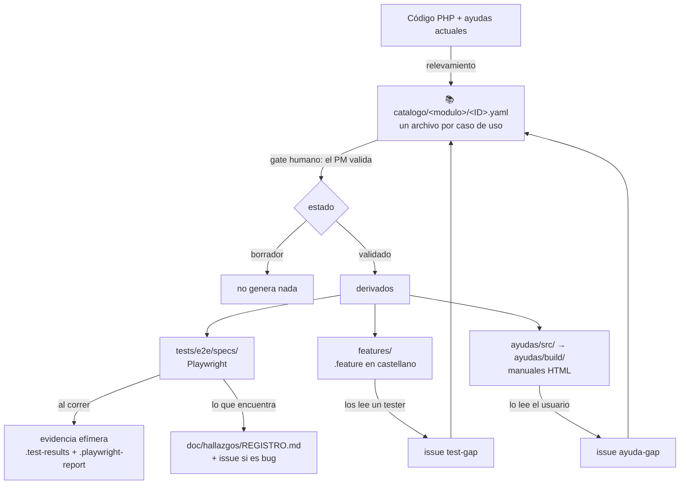

# DocTest — dónde está cada cosa

## Objetivo

Responde dos preguntas concretas: **dónde viven las pruebas** (los casos, la evidencia de cada
corrida, los hallazgos) y **cómo funciona el circuito de las ayudas** de usuario (cómo se opina
sobre ellas, cómo se publican, cómo se enlazan desde el sistema). Está escrito para el PM y para
cualquiera que se sume al proyecto sin haber estado en la construcción.

**No** cubre el diseño de la solución ni por qué se decidió así — eso está en los tres documentos
ancla de [`../doc/v3/`](../doc/v3/) — ni el detalle de cómo se instala el entorno, que está en el
[README](README.md).

> **Estado al 2026-08-25.** DNATO es el único módulo cubierto de punta a punta. Todo lo que sigue
> está andando salvo lo que aparece explícitamente marcado como **pendiente**, que se resume en la
> [sección 3](#3-lo-que-todavía-no-está).

---

## El mapa en una pantalla



La idea de fondo: **el caso de uso es la única fuente**. El test, el `.feature` y la ayuda son tres
traducciones del mismo caso — a código, a castellano para el tester, y a manual para el usuario. Por
eso nada derivado se corrige por su cuenta: se corrige el caso y se regenera.

---

# 1. Pruebas

## 1.1 Dónde están los casos

Cada caso de uso existe en tres archivos, todos versionados en git:

| Qué | Dónde | Para quién | Se edita a mano |
|---|---|---|---|
| **El caso** | `doctest/catalogo/<modulo>/<ID>.yaml` | el PM, que lo valida | **sí — es la fuente** |
| El escenario en castellano | `doctest/features/<modulo>/<ID>.<titulo>.feature` | el tester humano | no: `npm run features` |
| El test automatizado | `doctest/tests/e2e/specs/<modulo>/<ID>.<nombre>.spec.ts` | la máquina | sí, pero siguiendo el caso |

Los tres se encuentran desde cualquiera de ellos: el YAML declara sus derivados al final
(`derivados: ayuda / test_e2e / feature`), el spec abre con un comentario que apunta al YAML, y cada
test lleva el id como etiqueta (`@DNATO-UC-014`), así que `npm run test:list` te dice qué prueba
cubre qué caso.

Hoy hay **28 casos de DNATO**. Los otros módulos (`man/`, `alm/`, `mcp/`) tienen la carpeta creada y
vacía.

**El estado de un caso decide qué se genera** — está en el campo `estado` del YAML:

| Estado | Qué significa | Genera derivados |
|---|---|---|
| `borrador` | Se relevó del código pero **hay una duda de intención de negocio** que solo el PM puede resolver. Las dudas están listadas en el campo `dudas` | **no** |
| `validado` | El PM confirmó que es lo que el negocio espera. Lleva `fecha_validacion` | sí |
| `obsoleto` | La pantalla existe pero se declaró fuera de uso | no |

Un caso en borrador no genera nada **a propósito**: es la garantía de que ninguna ayuda le explique
a un usuario un comportamiento que nadie confirmó.

### Cómo se valida un caso

**Dónde:** en una terminal, parado en `traz-tools/doctest/`.

```bash
npm run hoja:validacion -- dnato
```

Deja `.validacion/dnato.html`. Se abre en el navegador (doble clic) y muestra los casos en prosa,
con las dudas al frente y un control para marcar cada uno como validado, borrador u obsoleto. El
botón **Copiar** arma un texto con todas las decisiones, listo para pegarle a Claude Code, que las
aplica al YAML. La hoja no se commitea: se regenera cuando el catálogo cambia.

## 1.2 Cómo se corren las pruebas

**Dónde:** en una terminal, parado en `traz-tools/doctest/`. La primera vez hay que hacer la puesta
a punto del [README](README.md#puesta-a-punto-una-sola-vez) (`npm install`, el navegador, el `.env`).

| Comando | Qué corre | Cuánto tarda |
|---|---|---|
| `npm run test:smoke` | los 6 flujos críticos. **Es el que se corre antes de cada push** | ~1,5 min |
| `npm run test:all` | los 55 tests, sin lo que esté en cuarentena | ~8 min |
| `npm run test:module -- dnato` | un módulo entero | según el módulo |
| `npm run test:list` | lista qué tests hay, sin ejecutarlos | segundos |
| `npm run test:alta-empresa` | el alta completa de una empresa. **Crea una empresa real**, por eso está fuera de las corridas normales | ~2 min |

**Contra qué entorno corre:** contra el que diga `DOCTEST_ENV` (`demo` por defecto), con las URLs de
`doctest/.env`. Los entornos declarados son `local`, `demo` y `staging-v3`. **Producción no es un
entorno posible** para esta suite: `config/apps.ts` rechaza cualquier URL que apunte a
`cloudtrazalog.com` sin subdominio. La única excepción prevista es un workflow aparte y de **solo
lectura** (`doctest-smoke-prod.yml`, todavía sin construir), con sus propias variables. Y si falta
una variable, el test falla diciendo exactamente cuál — nunca inventa un valor.

## 1.3 Dónde queda la evidencia

> ⚠️ **La evidencia de una corrida es efímera y local.** Playwright limpia esas carpetas al empezar
> la corrida siguiente, y están en `.gitignore`. Si un test falló y querés conservar la prueba,
> guardala en otro lado **antes** de volver a correr.

| Artefacto | Dónde queda | Cuándo se genera |
|---|---|---|
| **Reporte HTML navegable** | `tests/e2e/.playwright-report/` | siempre. Se abre con `npm run test:report` |
| Captura de pantalla | `tests/e2e/.test-results/<test>/` | **solo si el test falla** |
| Video de la corrida | `tests/e2e/.test-results/<test>/` | **solo si el test falla** |
| `error-context.md` — el estado de la pantalla en el momento del fallo, en texto | `tests/e2e/.test-results/<test>/` | solo si falla |
| Traza navegable paso a paso | `tests/e2e/.test-results/<test>/` | solo en el reintento, y **solo en CI**: localmente los reintentos están apagados |
| Sesiones de ingreso | `tests/e2e/.auth/` | en el arranque de cada corrida |

**Cuando algo falla, el orden para mirar es este:** primero `npm run test:report`, que abre el
reporte con la captura y el video embebidos; el mensaje de error dice qué esperaba y qué encontró.
Si el mensaje no alcanza, `error-context.md` tiene el árbol de la pantalla tal como estaba en ese
instante — sirve para distinguir "el sistema hizo otra cosa" de "el selector del test quedó viejo".

**Qué corre hoy en GitHub Actions.** El workflow `doctest-validate.yml` corre en todo PR que toque
`doctest/`: valida el catálogo, tipa el TypeScript, corre los generadores en seco y carga los specs
sin abrir navegador. **No ejecuta la suite** — no toca ningún entorno ni necesita credenciales.

**Pendiente:** el workflow que ejecuta la suite de verdad y publica la evidencia como artifact
descargable del run (`doctest-e2e.yml`) es parte de **F5** y todavía no existe. Hasta entonces, la
evidencia solo existe en la máquina de quien corrió los tests.

## 1.4 Dónde se recopilan los hallazgos

**Un solo lugar: [`doc/hallazgos/REGISTRO.md`](../doc/hallazgos/REGISTRO.md).** Ahí van los bugs,
las deudas y las mejoras que aparecen mientras se hace otra cosa y que **no se corrigen en esa misma
tarea**. Hoy tiene 35 hallazgos.

Cada fila lleva id (`H-NNN`, nunca se reutiliza), fecha, origen, módulo, tipo, severidad, resumen,
**evidencia concreta** (archivo y línea, o la consulta que lo demuestra — un hallazgo sin evidencia
no entra) y estado.

Las reglas están en el propio archivo; las tres que importan:

1. **Si es un bug** — el sistema hace algo distinto de lo que dice hacer — además se abre issue con
   label `hallazgo` + `bug`, y el número va en la fila. Hoy hay 17 así.
2. **Si es una mejora o una deuda**, queda solo en el registro hasta que el PM decida. Es lo que
   está esperando triaje.
3. **No se corrige en la tarea que lo encontró**, salvo que el PM lo pida: corregir de paso mezcla
   el diff y rompe la revisión.

**La división de trabajo entre el registro y la evidencia de la corrida:** el `.test-results` prueba
que *hoy* falló; el registro es donde queda **para siempre** qué está mal y por qué, con la línea de
código que lo explica. Un hallazgo se escribe con la causa encontrada, no con el mensaje de error.

> **Lección de método que quedó escrita en el registro:** un hallazgo de interfaz no se reporta sin
> verificarlo contra la pantalla real. Cuatro hallazgos leídos del controlador resultaron falsos —
> la vista ya protegía lo que el controlador parecía dejar abierto.

---

# 2. Ayudas

## 2.1 Dónde vive la ayuda

| Carpeta | Qué es | ¿Se edita? |
|---|---|---|
| `ayudas/legacy/` | El sitio de ayuda que ya existía, tal como estaba, con sus 5 manuales. **Es un insumo histórico** | no se toca |
| `ayudas/plantilla/` | `theme.css` + el esqueleto HTML, extraídos de esos manuales reales | sí, si cambia el diseño |
| `ayudas/src/<modulo>/` | **El contenido nuevo. Acá se escribe** | sí — es la fuente |
| `ayudas/build/` | El sitio armado y publicable | **no**: se regenera y te pisa el cambio |

**Para regenerar el sitio** — en una terminal, parado en `doctest/`:

```bash
npm run ayudas
```

Copia los manuales viejos tal cual, ensambla los nuevos con la plantilla, agrega su tarjeta a la
portada y **regenera el buscador del inicio recorriendo el contenido de todos los manuales**. Hoy
son 7 manuales y 26 secciones indexadas. Esto último era una deuda del sitio anterior: el buscador
se mantenía a mano y solo encontraba dos de los cinco manuales.

Cada sección de un manual tiene un ancla estable (`#s01`, `#s02`, …) y, en un comentario HTML
invisible para el usuario, la versión, la fecha de generación y **los casos de uso que cubre**.

## 2.2 Cómo dar feedback sobre una ayuda

**Dónde:** en el navegador, en <https://github.com/Trazalog/traz-tools/issues/new/choose> →
plantilla **"La ayuda está mal o falta (ayuda-gap)"**.

Pide cuatro cosas: qué pasa (dice algo que ya no es así / falta un paso / se entiende mal / no
existe), el manual y la sección, qué dice y qué debería decir, y el caso de uso si lo sabés. Nada
más.

Si no tenés cuenta de GitHub, se lo pasás a Rodolfo y él lo transcribe. El proceso completo, escrito
para testers, está en [`feedback/PROCESO.md`](feedback/PROCESO.md).

**Qué pasa después, y por qué no se edita el HTML directamente:** un error en la ayuda es casi
siempre un error en el caso de uso, porque la ayuda se escribe desde ahí. Así que la corrección
entra por el caso: se corrige el YAML, se regenera la ayuda, y el PR que lo hace cierra tu issue.
Si alguien editara el HTML de `build/` a mano, la próxima generación lo pisaría y el caso seguiría
mal.

> Los mismos tres canales sirven para el resto: **test-gap** si falta probar un flujo, **ayuda-gap**
> para las ayudas, y un issue con label `bug` si el sistema está roto.

## 2.3 Cómo se publican

El destino está definido: **`trazalog.com/ayudatools`** recibe el build publicado, y desde que las
ayudas entraron al repo, **el repo es la fuente canónica** — se terminó la edición manual de HTML
productivo (RF-05.7 del Doc 1).

Lo que hay hoy es el sitio armado y listo. **Dónde:** terminal, parado en `doctest/`.

```bash
npm run ayudas
ls ayudas/build/
```

Quedan 7 manuales, `index.html`, `theme.css` y `manual.js`. Son archivos estáticos, sin backend:
alcanza con copiarlos al directorio que sirve ese hosting.

> ⚠️ **Pendiente — requiere una decisión tuya.** El paso de "están en `build/`" a "están en
> `trazalog.com/ayudatools`" **no está definido**: el sitio anterior lo servía un XAMPP y el repo no
> registra ni por dónde se sube ni quién lo sirve hoy. Es lo primero que hay que resolver para que
> esto se publique solo. Las opciones y lo que hace falta saber están en la
> [sección 3](#3-lo-que-todavía-no-está).

## 2.4 Cómo se referencian desde el código

**Hoy, ninguna pantalla del sistema enlaza a su ayuda** — lo verifiqué buscando en todo
`application/`: no hay una sola referencia a los manuales. La ayuda se llega escribiendo la
dirección.

Lo que sí está listo para que eso se pueda hacer:

- Las **anclas son estables**: `manual_registracion_y_cuenta.html#s04` apunta siempre a la misma
  sección, y el generador no las reordena.
- **Cada caso de uso sabe cuál es su sección de ayuda**: el campo `derivados.ayuda` del YAML, que el
  validador verifica que exista. Ese es el mapeo pantalla → ayuda, ya escrito para los 28 casos de
  DNATO.

Falta el otro extremo del mapeo: qué controlador o vista corresponde a qué caso. También está en el
YAML (`referencias_codigo`), así que la tabla "vista PHP → sección de ayuda" se puede generar del
catálogo sin escribir nada a mano.

> ⚠️ **Pendiente — requiere una decisión tuya.** Antes de tocar el PHP hacen falta tres definiciones
> que son de producto, no técnicas: cuál es la URL base de la ayuda publicada, **dónde va el acceso**
> (un signo de pregunta en la barra de cada pantalla, una entrada de menú, o un enlace al pie), y si
> abre en pestaña nueva o dentro del sistema. Mi recomendación está en la sección 3; con eso
> definido, la implementación es un helper de CodeIgniter y una línea por vista.

---

# 3. Lo que todavía no está

| Qué falta | Quién lo destraba | Nota |
|---|---|---|
| **Publicar las ayudas a `trazalog.com/ayudatools`** | vos | Hace falta saber quién sirve ese sitio hoy y por dónde se sube (¿FTP, SSH, panel?). Con eso, se automatiza en un script y después en el CI. **Mi recomendación:** que lo publique el mismo pipeline que despliega el frontend, para que ayuda y sistema no se separen de versión |
| **Enlazar la ayuda desde las pantallas** | vos | Tres definiciones: URL base, dónde va el acceso, y si abre en pestaña nueva. **Mi recomendación:** un signo de pregunta en la barra superior que abra en pestaña nueva la sección exacta de esa pantalla; es lo más barato de implementar y lo menos invasivo para el usuario |
| **Ejecutar la suite en CI** (`doctest-e2e.yml`) y guardar la evidencia como artifact | F5 | Necesita un entorno donde correr y sus credenciales como secrets. Hasta que exista staging-v3, correría contra DEMO |
| **Triaje de 18 hallazgos** sin issue | vos | Casi todos mejoras, en el registro |
| **2 casos de DNATO en borrador** | vos | `DNATO-UC-020` (usuario externo) y `DNATO-UC-024` (ABM de menúes): falta definición de negocio |
| Cobertura de los demás módulos | F2/F3/F4 | ALM es el próximo |

---

## Referencias

- [`README.md`](README.md) — puesta a punto, comandos, cómo se contribuye
- [`feedback/PROCESO.md`](feedback/PROCESO.md) — cómo reporta un tester
- [`catalogo/SCHEMA.md`](catalogo/SCHEMA.md) — todos los campos de un caso
- [`../doc/hallazgos/REGISTRO.md`](../doc/hallazgos/REGISTRO.md) — el registro de hallazgos
- [`../doc/v3/TRAZALOG_v3_DOCTEST_01_REQUERIMIENTOS.md`](../doc/v3/TRAZALOG_v3_DOCTEST_01_REQUERIMIENTOS.md) — qué se pidió y por qué
- [`../doc/v3/STATE.md`](../doc/v3/STATE.md) — en qué está el proyecto
