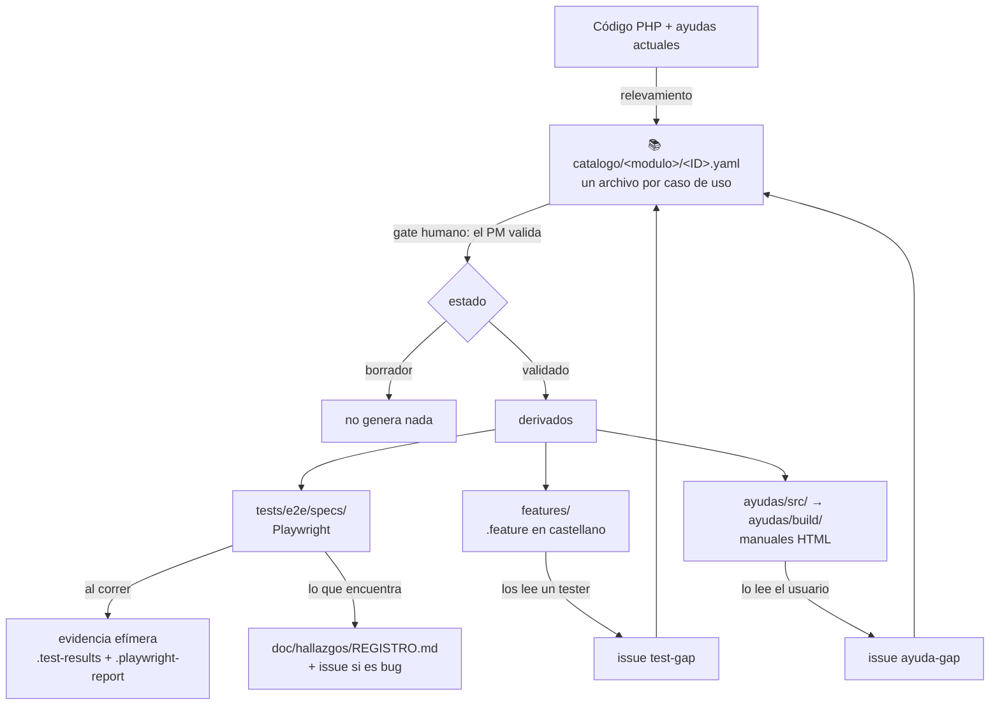

# DocTest — dónde está cada cosa

## Objetivo

Responde dos preguntas concretas: **dónde viven las pruebas** (los casos, la evidencia de cada
corrida, los hallazgos) y **cómo funciona el circuito de las ayudas** de usuario (cómo se opina
sobre ellas, cómo se publican, cómo se enlazan desde el sistema). Está escrito para el PM y para
cualquiera que se sume al proyecto sin haber estado en la construcción.

**No** cubre el diseño de la solución ni por qué se decidió así — eso está en los tres documentos
ancla de [`../doc/v3/`](../doc/v3/) — ni el detalle de cómo se instala el entorno, que está en el
[README](README.md).

> **Estado al 2026-08-25.** DNATO es el único módulo cubierto de punta a punta. Todo lo que sigue
> está andando salvo lo que aparece explícitamente marcado como **pendiente**, que se resume en la
> [sección 3](#3-lo-que-todavía-no-está).

---

## El mapa en una pantalla



La idea de fondo: **el caso de uso es la única fuente**. El test, el `.feature` y la ayuda son tres
traducciones del mismo caso — a código, a castellano para el tester, y a manual para el usuario. Por
eso nada derivado se corrige por su cuenta: se corrige el caso y se regenera.

---

# 1. Pruebas

## 1.1 Dónde están los casos

Cada caso de uso existe en tres archivos, todos versionados en git:

| Qué | Dónde | Para quién | Se edita a mano |
|---|---|---|---|
| **El caso** | `doctest/catalogo/<modulo>/<ID>.yaml` | el PM, que lo valida | **sí — es la fuente** |
| El escenario en castellano | `doctest/features/<modulo>/<ID>.<titulo>.feature` | el tester humano | no: `npm run features` |
| El test automatizado | `doctest/tests/e2e/specs/<modulo>/<ID>.<nombre>.spec.ts` | la máquina | sí, pero siguiendo el caso |

Los tres se encuentran desde cualquiera de ellos: el YAML declara sus derivados al final
(`derivados: ayuda / test_e2e / feature`), el spec abre con un comentario que apunta al YAML, y cada
test lleva el id como etiqueta (`@DNATO-UC-014`), así que `npm run test:list` te dice qué prueba
cubre qué caso.

Hoy hay **28 casos de DNATO**. Los otros módulos (`man/`, `alm/`, `mcp/`) tienen la carpeta creada y
vacía.

**El estado de un caso decide qué se genera** — está en el campo `estado` del YAML:

| Estado | Qué significa | Genera derivados |
|---|---|---|
| `borrador` | Se relevó del código pero **hay una duda de intención de negocio** que solo el PM puede resolver. Las dudas están listadas en el campo `dudas` | **no** |
| `validado` | El PM confirmó que es lo que el negocio espera. Lleva `fecha_validacion` | sí |
| `obsoleto` | La pantalla existe pero se declaró fuera de uso | no |

Un caso en borrador no genera nada **a propósito**: es la garantía de que ninguna ayuda le explique
a un usuario un comportamiento que nadie confirmó.

### Cómo se valida un caso

**Dónde:** en una terminal, parado en `traz-tools/doctest/`.

```bash
npm run hoja:validacion -- dnato
```

Deja `.validacion/dnato.html`. Se abre en el navegador (doble clic) y muestra los casos en prosa,
con las dudas al frente y un control para marcar cada uno como validado, borrador u obsoleto. El
botón **Copiar** arma un texto con todas las decisiones, listo para pegarle a Claude Code, que las
aplica al YAML. La hoja no se commitea: se regenera cuando el catálogo cambia.

## 1.2 Cómo se corren las pruebas

**Dónde:** en una terminal, parado en `traz-tools/doctest/`. La primera vez hay que hacer la puesta
a punto del [README](README.md#puesta-a-punto-una-sola-vez) (`npm install`, el navegador, el `.env`).

| Comando | Qué corre | Cuánto tarda |
|---|---|---|
| `npm run test:smoke` | los 6 flujos críticos. **Es el que se corre antes de cada push** | ~1,5 min |
| `npm run test:all` | los 55 tests, sin lo que esté en cuarentena | ~8 min |
| `npm run test:module -- dnato` | un módulo entero | según el módulo |
| `npm run test:list` | lista qué tests hay, sin ejecutarlos | segundos |
| `npm run test:alta-empresa` | el alta completa de una empresa. **Crea una empresa real**, por eso está fuera de las corridas normales | ~2 min |

**Contra qué entorno corre:** contra el que diga `DOCTEST_ENV` (`demo` por defecto), con las URLs de
`doctest/.env`. Los entornos declarados son `local`, `demo` y `staging-v3`. **Producción no es un
entorno posible** para esta suite: `config/apps.ts` rechaza cualquier URL que apunte a
`cloudtrazalog.com` sin subdominio. La única excepción prevista es un workflow aparte y de **solo
lectura** (`doctest-smoke-prod.yml`, todavía sin construir), con sus propias variables. Y si falta
una variable, el test falla diciendo exactamente cuál — nunca inventa un valor.

## 1.3 Dónde queda la evidencia

> ⚠️ **La evidencia de una corrida es efímera y local.** Playwright limpia esas carpetas al empezar
> la corrida siguiente, y están en `.gitignore`. Si un test falló y querés conservar la prueba,
> guardala en otro lado **antes** de volver a correr.

| Artefacto | Dónde queda | Cuándo se genera |
|---|---|---|
| **Reporte HTML navegable** | `tests/e2e/.playwright-report/` | siempre. Se abre con `npm run test:report` |
| Captura de pantalla | `tests/e2e/.test-results/<test>/` | **solo si el test falla** |
| Video de la corrida | `tests/e2e/.test-results/<test>/` | **solo si el test falla** |
| `error-context.md` — el estado de la pantalla en el momento del fallo, en texto | `tests/e2e/.test-results/<test>/` | solo si falla |
| Traza navegable paso a paso | `tests/e2e/.test-results/<test>/` | solo en el reintento, y **solo en CI**: localmente los reintentos están apagados |
| Sesiones de ingreso | `tests/e2e/.auth/` | en el arranque de cada corrida |

**Cuando algo falla, el orden para mirar es este:** primero `npm run test:report`, que abre el
reporte con la captura y el video embebidos; el mensaje de error dice qué esperaba y qué encontró.
Si el mensaje no alcanza, `error-context.md` tiene el árbol de la pantalla tal como estaba en ese
instante — sirve para distinguir "el sistema hizo otra cosa" de "el selector del test quedó viejo".

**Qué corre hoy en GitHub Actions.** El workflow `doctest-validate.yml` corre en todo PR que toque
`doctest/`: valida el catálogo, tipa el TypeScript, corre los generadores en seco y carga los specs
sin abrir navegador. **No ejecuta la suite** — no toca ningún entorno ni necesita credenciales.

**Pendiente:** el workflow que ejecuta la suite de verdad y publica la evidencia como artifact
descargable del run (`doctest-e2e.yml`) es parte de **F5** y todavía no existe. Hasta entonces, la
evidencia solo existe en la máquina de quien corrió los tests.

## 1.4 Cómo relevar contra lo que está desplegado, sin tocar tu rama

Es una trampa concreta de este repo: **`develop-v3` no es lo que corre en el DEMO.** Hay un programador trabajando en `develop`, y ahí es donde están varias pantallas que los usuarios ya usan. Relevar contra el árbol equivocado da un catálogo incompleto.

Al 2026-08-25, **cuatro submódulos** difieren entre las dos ramas: `traz-comp-almacenes` (25 commits), `traz-comp-bpm`, `traz-comp-pan` y `traz-prod-trazasoft`. En el repo padre casi no hay diferencia.

**La regla: no cambies de rama. Leé la otra rama sin moverte.** `git show` y `git grep` aceptan una referencia, así que se puede leer `develop` estando parado en `develop-v3` sin tocar nada del working tree.

**Dónde se ejecuta:** en una terminal, parado en `traz-tools/` o en el submódulo, según el caso.

```bash
# Qué commit de cada submódulo usa cada rama — esto es lo primero a mirar
git ls-tree origin/develop application/modules/ | grep commit
git ls-tree origin/develop-v3 application/modules/ | grep commit

# Leer un archivo de la otra rama, sin cambiar de rama
git show origin/develop:controllers/Notapedido.php | less

# Buscar en la otra rama
git grep -n 'empr_id' origin/develop -- models/

# Qué cambió entre las dos, en el repo padre
git diff --name-only origin/develop-v3 origin/develop -- application/
```

Dentro de un submódulo hay un paso previo: `git fetch --all` para tener las ramas remotas, y después las mismas órdenes contra `origin/develop`.

**Cómo confirmar que estás leyendo lo desplegado.** El commit de `origin/develop` del submódulo tiene que coincidir con el que apunta `origin/develop` del repo padre:

```bash
git ls-tree origin/develop application/modules/traz-comp-almacenes
cd application/modules/traz-comp-almacenes && git rev-parse origin/develop
```

Si coinciden, lo que estás leyendo es lo que corre. Si no, mirá primero qué está más adelante.

**Lo que no hay que hacer:** mover el puntero del submódulo para "ponerse al día". Eso cambia qué código corre y es una decisión de integración, no de relevamiento — va por su propio PR, mirando antes qué entró en los commits del medio.

---

## 1.5 Dónde se recopilan los hallazgos

**Un solo lugar: [`doc/hallazgos/REGISTRO.md`](../doc/hallazgos/REGISTRO.md).** Ahí van los bugs,
las deudas y las mejoras que aparecen mientras se hace otra cosa y que **no se corrigen en esa misma
tarea**. Hoy tiene 35 hallazgos.

Cada fila lleva id (`H-NNN`, nunca se reutiliza), fecha, origen, módulo, tipo, severidad, resumen,
**evidencia concreta** (archivo y línea, o la consulta que lo demuestra — un hallazgo sin evidencia
no entra) y estado.

Las reglas están en el propio archivo; las tres que importan:

1. **Si es un bug** — el sistema hace algo distinto de lo que dice hacer — además se abre issue con
   label `hallazgo` + `bug`, y el número va en la fila. Hoy hay 17 así.
2. **Si es una mejora o una deuda**, queda solo en el registro hasta que el PM decida. Es lo que
   está esperando triaje.
3. **No se corrige en la tarea que lo encontró**, salvo que el PM lo pida: corregir de paso mezcla
   el diff y rompe la revisión.

**La división de trabajo entre el registro y la evidencia de la corrida:** el `.test-results` prueba
que *hoy* falló; el registro es donde queda **para siempre** qué está mal y por qué, con la línea de
código que lo explica. Un hallazgo se escribe con la causa encontrada, no con el mensaje de error.

> **Lección de método que quedó escrita en el registro:** un hallazgo de interfaz no se reporta sin
> verificarlo contra la pantalla real. Cuatro hallazgos leídos del controlador resultaron falsos —
> la vista ya protegía lo que el controlador parecía dejar abierto.

---

# 2. Ayudas

## 2.1 Dónde vive la ayuda

| Carpeta | Qué es | ¿Se edita? |
|---|---|---|
| `ayudas/legacy/` | El sitio de ayuda que ya existía, tal como estaba, con sus 5 manuales. **Es un insumo histórico** | no se toca |
| `ayudas/plantilla/` | `theme.css` + el esqueleto HTML, extraídos de esos manuales reales | sí, si cambia el diseño |
| `ayudas/src/<modulo>/` | **El contenido nuevo. Acá se escribe** | sí — es la fuente |
| `../ayuda/` (raíz del repo) | **El sitio armado, ya servido por el frontend** | **no**: se regenera y te pisa el cambio |

**Para regenerar el sitio** — en una terminal, parado en `doctest/`:

```bash
npm run ayudas
```

Copia los manuales viejos tal cual, ensambla los nuevos con la plantilla, agrega su tarjeta a la
portada y **regenera el buscador del inicio recorriendo el contenido de todos los manuales**. Hoy
son 7 manuales y 26 secciones indexadas. Sale en **`ayuda/`, en la raíz del repo del frontend**, y
esa carpeta **va versionada**: el resultado se commitea como cualquier otro archivo. Esto último era una deuda del sitio anterior: el buscador
se mantenía a mano y solo encontraba dos de los cinco manuales.

Cada sección de un manual tiene un ancla estable (`#s01`, `#s02`, …) y, en un comentario HTML
invisible para el usuario, la versión, la fecha de generación y **los casos de uso que cubre**.

### Las pantallas se dibujan, no se capturan

Los manuales muestran las pantallas del sistema **reconstruidas en HTML**, no con capturas. Es el
patrón que estrenó el manual de Alta de Equipos y conviene mantenerlo: se ve nítido en cualquier
resolución, pesa nada, y —lo que más importa— **se versiona y se diffea como texto**, así que cuando
la interfaz cambia se corrige la línea que cambió en vez de rehacer una imagen.

El marcado es éste, y las clases `screen-*` viven en `ayudas/plantilla/theme.css`:

```html
<figure class="screen">
  <div class="screen-card">
    <div class="screen-bar">
      <div class="screen-dots"><span class="d1"></span><span class="d2"></span><span class="d3"></span></div>
      <span class="screen-caption">Trazalog Tools · Pedido de Materiales</span>
    </div>
    <div class="screen-body">
      <div class="screen-app-bar">
        <span class="marca">TRAZA<span>LOG</span> TOOLS</span>
        <span class="ruta">/ Almacenes / Pedido Materiales</span>
      </div>
      <!-- paneles (.screen-panel), campos (.screen-campo), tabla (.screen-tabla),
           estados (.screen-estado) y botones (.screen-btn) -->
    </div>
  </div>
  <figcaption class="screen-footer">Qué es lo que hay que mirar acá.</figcaption>
</figure>
```

Dos reglas al dibujar una pantalla: **datos verosímiles del dominio** —un artículo real del rubro, no
"Lorem"— y un **pie que diga qué mirar**, porque una pantalla sin pie es decoración. Las tablas anchas
van dentro de `.screen-scroll`, para que scrolleen solas sin arrastrar la página.

> En los manuales legacy estas clases se usaban pero **nunca tuvieron CSS**: verificado renderizándolos,
> el marco de ventana no se dibujaba y el título quedaba suelto encima del contenido. Quedó resuelto en
> el theme, así que los manuales nuevos sí muestran el marco. Los legacy no se tocan — se copian tal
> cual porque son URLs vivas.

## 2.2 Cómo dar feedback sobre una ayuda

**Dónde:** en el navegador, en <https://github.com/Trazalog/traz-tools/issues/new/choose> →
plantilla **"La ayuda está mal o falta (ayuda-gap)"**.

Pide cuatro cosas: qué pasa (dice algo que ya no es así / falta un paso / se entiende mal / no
existe), el manual y la sección, qué dice y qué debería decir, y el caso de uso si lo sabés. Nada
más.

Si no tenés cuenta de GitHub, se lo pasás a Rodolfo y él lo transcribe. El proceso completo, escrito
para testers, está en [`feedback/PROCESO.md`](feedback/PROCESO.md).

**Qué pasa después, y por qué no se edita el HTML directamente:** un error en la ayuda es casi
siempre un error en el caso de uso, porque la ayuda se escribe desde ahí. Así que la corrección
entra por el caso: se corrige el YAML, se regenera la ayuda, y el PR que lo hace cierra tu issue.
Si alguien editara el HTML de `build/` a mano, la próxima generación lo pisaría y el caso seguiría
mal.

> Los mismos tres canales sirven para el resto: **test-gap** si falta probar un flujo, **ayuda-gap**
> para las ayudas, y un issue con label `bug` si el sistema está roto.

## 2.3 Cómo se publican

**Decisión del PM (2026-08-25): las ayudas son parte de `traz-tools`, no un sitio aparte.** Se
sirven desde el propio frontend, en `<base_url>ayuda/`.

Eso funciona sin agregar nada: el `.htaccess` de la raíz manda a CodeIgniter **solo lo que no existe
en disco** (`RewriteCond %{REQUEST_FILENAME} !-f` y `!-d`), así que una carpeta estática en la raíz
se sirve tal cual — es lo mismo que ya pasa con `assets/` y `user_guide/`.

| | |
|---|---|
| Dónde sale el build | `ayuda/`, en la raíz del repo |
| Cómo se ve | `https://demo.cloudtrazalog.com/traz-tools/ayuda/` en el DEMO; `base_url()` lo resuelve en cada entorno |
| ¿Versionado? | **Sí.** El frontend no tiene build step: el deploy es el mismo de siempre y no necesita Node |
| Cómo se actualiza | `npm run ayudas` desde `doctest/`, y se commitea el resultado |

Publicar una corrección de la ayuda es, entonces, **un commit más**: entra por PR, se revisa como
código y se despliega con el sistema. No hay un segundo lugar que pueda quedar desactualizado.

> El sitio anterior, `trazalog.com/ayudatools`, sigue siendo el que ve **v2**. Se apaga cuando v3
> pase a producción; hasta entonces conviven y no se pisan.

## 2.4 Cómo se referencian desde el código

**Hay un acceso a la ayuda en la barra superior**, a la izquierda de las notificaciones: el ícono de
signo de pregunta (`fa-question-circle`), que abre la ayuda en una pestaña nueva.

Lo agregó el equipo en la rama `develop` (v2) apuntando a `https://trazalog.com/ayudatools/`. En
`develop-v3` apunta a la carpeta propia:

```php
<a href="<?php echo base_url(); ?>ayuda/" target="_blank" title="Ayuda">
```

**Dónde está:** `application/views/layout/perfil.php`, que es la barra que comparten todas las
pantallas — o sea que el acceso aparece en todas sin tocar ninguna vista más.

> ⚠️ **Ojo con la sincronización semanal de v2 → v3.** Esa línea existe en las dos ramas con destinos
> distintos, así que el sync la va a marcar como conflicto. **Se resuelve quedándose con la versión
> de v3** (la de `base_url()`). Está anotado en un comentario en la propia vista para que quien lo
> resuelva no tenga que acordarse.

### El paso que sigue: que cada pantalla abra su propia sección

Hoy el ícono abre la portada de la ayuda. Lo que falta para que abra **la sección de la pantalla en
la que estás** ya existe como dato, no hay que escribirlo a mano:

- las **anclas son estables** (`manual_registracion_y_cuenta.html#s04`) y el generador no las reordena;
- **cada caso sabe cuál es su sección de ayuda** (`derivados.ayuda` en el YAML, que el validador
  verifica que exista) **y qué código la implementa** (`referencias_codigo`).

Con esos dos campos, la tabla "vista PHP → sección de ayuda" se genera del catálogo. Queda pendiente
de hacer.

# 3. Lo que todavía no está

| Qué falta | Quién lo destraba | Nota |
|---|---|---|
| **Que cada pantalla abra su propia sección de ayuda** | pendiente de hacer | El ícono de la barra abre la portada. El mapeo vista → sección ya está en el catálogo (§2.4); falta generarlo y usarlo |
| **Ejecutar la suite en CI** (`doctest-e2e.yml`) y guardar la evidencia como artifact | F5 | Necesita un entorno donde correr y sus credenciales como secrets. Hasta que exista staging-v3, correría contra DEMO |
| **2 casos de DNATO en borrador** | vos | `DNATO-UC-020` (usuario externo) y `DNATO-UC-024` (ABM de menúes): falta definición de negocio. Son las dos únicas preguntas abiertas |
| Cobertura de los demás módulos | F2/F3/F4 | ALM es el próximo |
| La carga masiva de Equipos no corre contra MariaDB | issue #470 | El PM lo quiere en el corto plazo |

**Ya resuelto** (2026-08-25): las ayudas se publican desde el propio repo (§2.3), el acceso está en
la barra superior de todas las pantallas (§2.4), y el triaje de hallazgos quedó hecho — 8 pasaron a
issue (#470 a #477) y 10 se quedan en el registro porque ya tienen decisión tomada.

---

## Referencias

- [`README.md`](README.md) — puesta a punto, comandos, cómo se contribuye
- [`feedback/PROCESO.md`](feedback/PROCESO.md) — cómo reporta un tester
- [`catalogo/SCHEMA.md`](catalogo/SCHEMA.md) — todos los campos de un caso
- [`../doc/hallazgos/REGISTRO.md`](../doc/hallazgos/REGISTRO.md) — el registro de hallazgos
- [`../doc/v3/TRAZALOG_v3_DOCTEST_01_REQUERIMIENTOS.md`](../doc/v3/TRAZALOG_v3_DOCTEST_01_REQUERIMIENTOS.md) — qué se pidió y por qué
- [`../doc/v3/STATE.md`](../doc/v3/STATE.md) — en qué está el proyecto
