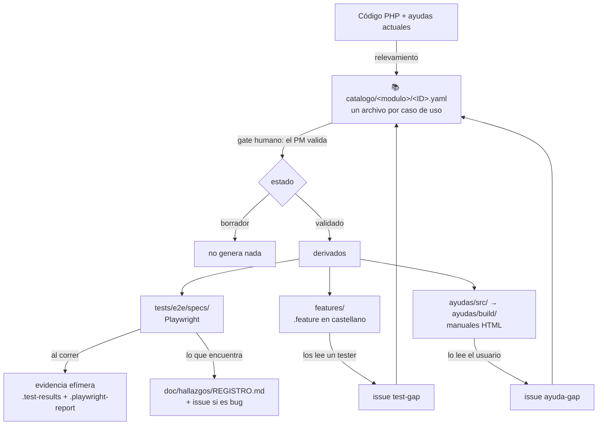
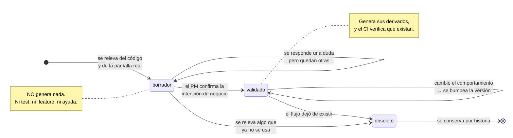
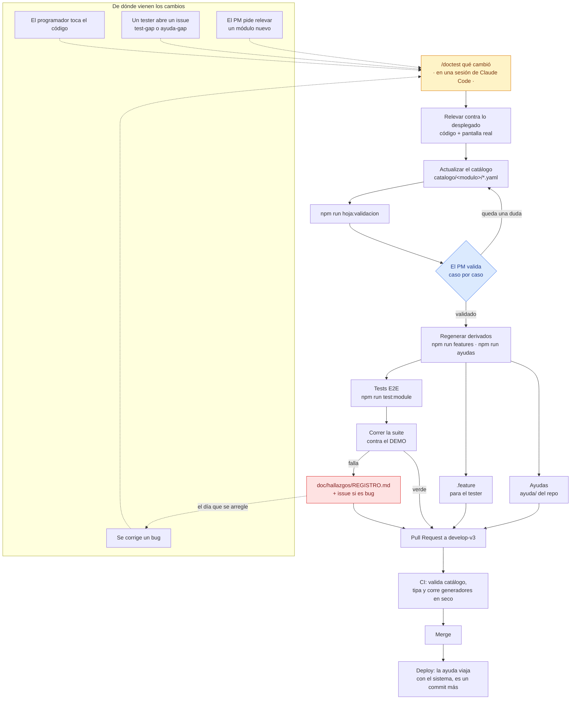

# DocTest — dónde está cada cosa

## Objetivo

Responde tres preguntas concretas: **dónde viven las pruebas** (los casos, la evidencia de cada
corrida, los hallazgos), **cómo funciona el circuito de las ayudas** de usuario (cómo se opina sobre
ellas, cómo se publican, cómo se enlazan desde el sistema) y **cómo se mantiene todo al día** cuando
el sistema cambia. Está escrito para el PM y para
cualquiera que se sume al proyecto sin haber estado en la construcción.

> **Si sos el programador y lo único que querés es verificar que tu cambio no rompió nada**, andá
> derecho a [§1.6](#16-correr-las-pruebas-contra-tu-propia-máquina-para-el-programador): tiene los
> pasos para correr la suite en tu máquina, contra tu servidor local, sin leer el resto.

**No** cubre el diseño de la solución ni por qué se decidió así — eso está en los tres documentos
ancla de [`../doc/v3/`](../doc/v3/) — ni el detalle de cómo se instala el entorno, que está en el
[README](README.md).

> **Estado al 2026-08-25.** DNATO es el único módulo cubierto de punta a punta. Todo lo que sigue
> está andando salvo lo que aparece explícitamente marcado como **pendiente**, que se resume en la
> [sección 3](#3-lo-que-todavía-no-está).

---

## El mapa en una pantalla



La idea de fondo: **el caso de uso es la única fuente**. El test, el `.feature` y la ayuda son tres
traducciones del mismo caso — a código, a castellano para el tester, y a manual para el usuario. Por
eso nada derivado se corrige por su cuenta: se corrige el caso y se regenera.

---

# 1. Pruebas

## 1.1 Dónde están los casos

Cada caso de uso existe en tres archivos, todos versionados en git:

| Qué | Dónde | Para quién | Se edita a mano |
|---|---|---|---|
| **El caso** | `doctest/catalogo/<modulo>/<ID>.yaml` | el PM, que lo valida | **sí — es la fuente** |
| El escenario en castellano | `doctest/features/<modulo>/<ID>.<titulo>.feature` | el tester humano | no: `npm run features` |
| El test automatizado | `doctest/tests/e2e/specs/<modulo>/<ID>.<nombre>.spec.ts` | la máquina | sí, pero siguiendo el caso |

Los tres se encuentran desde cualquiera de ellos: el YAML declara sus derivados al final
(`derivados: ayuda / test_e2e / feature`), el spec abre con un comentario que apunta al YAML, y cada
test lleva el id como etiqueta (`@DNATO-UC-014`), así que `npm run test:list` te dice qué prueba
cubre qué caso.

Hoy hay **28 casos de DNATO**. Los otros módulos (`man/`, `alm/`, `mcp/`) tienen la carpeta creada y
vacía.

**El estado de un caso decide qué se genera** — está en el campo `estado` del YAML:

| Estado | Qué significa | Genera derivados |
|---|---|---|
| `borrador` | Se relevó del código pero **hay una duda de intención de negocio** que solo el PM puede resolver. Las dudas están listadas en el campo `dudas` | **no** |
| `validado` | El PM confirmó que es lo que el negocio espera. Lleva `fecha_validacion` | sí |
| `obsoleto` | La pantalla existe pero se declaró fuera de uso | no |

Un caso en borrador no genera nada **a propósito**: es la garantía de que ninguna ayuda le explique
a un usuario un comportamiento que nadie confirmó.

### Cuántos casos tiene una pantalla

No uno. La regla que salió de relevar Mantenimiento:

- **Un caso por cada acción del listado.** La columna *Acciones* de una grilla esconde el grueso de
  la funcionalidad: el listado de equipos tiene once acciones —editar, eliminar, habilitar,
  inhabilitar, asignar contratistas, cargar una lectura, ver el historial, asignar una meta,
  adjuntos— y un solo caso "ver el listado" las dejaba todas afuera. Al relevar una pantalla, lo
  primero es enumerar sus acciones.
- **Un caso de ciclo de vida por entidad.** No describe una pantalla sino el recorrido completo: qué
  le puede pasar a un equipo, a una orden de trabajo o a un pedido a lo largo del tiempo, con sus
  estados y quién los cambia. Es lo que contesta *"¿cómo funciona esto?"* en vez de *"¿dónde
  aprieto?"*, y es lo que más le sirve a alguien que arranca solo.

Los estados se relevan del código, pero **su traducción a lenguaje de usuario se pregunta, no se
deduce**: un `CE` o un `ASC` en la base no dicen cómo se llaman en pantalla.

### Cómo se valida un caso

**Dónde:** en una terminal, parado en `traz-tools/doctest/`.

```bash
npm run hoja:validacion -- dnato
```

Deja `.validacion/dnato.html`. Se abre en el navegador (doble clic) y muestra los casos en prosa,
con las dudas al frente y un control para marcar cada uno como validado, borrador u obsoleto. El
botón **Copiar** arma un texto con todas las decisiones, listo para pegarle a Claude Code, que las
aplica al YAML. La hoja no se commitea: se regenera cuando el catálogo cambia.

## 1.2 Cómo se corren las pruebas

**Dónde:** en una terminal, parado en `traz-tools/doctest/`. La primera vez hay que hacer la puesta
a punto del [README](README.md#puesta-a-punto-una-sola-vez) (`npm install`, el navegador, el `.env`).

| Comando | Qué corre | Cuánto tarda |
|---|---|---|
| `npm run test:smoke` | los 11 flujos críticos. **Es el que se corre antes de cada push** | ~1,5 min |
| `npm run test:all` | los 71 tests, sin lo que esté en cuarentena | ~8 min |
| `npm run test:module -- dnato` | un módulo entero | según el módulo |
| `npm run test:list` | lista qué tests hay, sin ejecutarlos | segundos |
| `npm run test:alta-empresa` | el alta completa de una empresa. **Crea una empresa real**, por eso está fuera de las corridas normales | ~2 min |

> Estos comandos corren contra el entorno que diga `DOCTEST_ENV`. **Para correrlos contra tu propia
> máquina** —el caso del programador que quiere verificar que su cambio no rompió nada— está
> [§1.6](#16-correr-las-pruebas-contra-tu-propia-máquina-para-el-programador), con la configuración,
> los datos que hacen falta y qué hacer cuando algo falla.

**Contra qué entorno corre:** contra el que diga `DOCTEST_ENV` (`demo` por defecto), con las URLs de
`doctest/.env`. Los entornos declarados son `local`, `demo` y `staging-v3`. **Producción no es un
entorno posible** para esta suite: `config/apps.ts` rechaza cualquier URL que apunte a
`cloudtrazalog.com` sin subdominio. La única excepción prevista es un workflow aparte y de **solo
lectura** (`doctest-smoke-prod.yml`, todavía sin construir), con sus propias variables. Y si falta
una variable, el test falla diciendo exactamente cuál — nunca inventa un valor.

## 1.3 Dónde queda la evidencia

> ⚠️ **La evidencia de una corrida es efímera y local.** Playwright limpia esas carpetas al empezar
> la corrida siguiente, y están en `.gitignore`. Si un test falló y querés conservar la prueba,
> guardala en otro lado **antes** de volver a correr.

| Artefacto | Dónde queda | Cuándo se genera |
|---|---|---|
| **Reporte HTML navegable** | `tests/e2e/.playwright-report/` | siempre. Se abre con `npm run test:report` |
| Captura de pantalla | `tests/e2e/.test-results/<test>/` | **solo si el test falla** |
| Video de la corrida | `tests/e2e/.test-results/<test>/` | **solo si el test falla** |
| `error-context.md` — el estado de la pantalla en el momento del fallo, en texto | `tests/e2e/.test-results/<test>/` | solo si falla |
| Traza navegable paso a paso | `tests/e2e/.test-results/<test>/` | solo en el reintento, y **solo en CI**: localmente los reintentos están apagados |
| Sesiones de ingreso | `tests/e2e/.auth/` | en el arranque de cada corrida |

**Cuando algo falla, el orden para mirar es este:** primero `npm run test:report`, que abre el
reporte con la captura y el video embebidos; el mensaje de error dice qué esperaba y qué encontró.
Si el mensaje no alcanza, `error-context.md` tiene el árbol de la pantalla tal como estaba en ese
instante — sirve para distinguir "el sistema hizo otra cosa" de "el selector del test quedó viejo".

**Qué corre hoy en GitHub Actions.** El workflow `doctest-validate.yml` corre en todo PR que toque
`doctest/`: valida el catálogo, tipa el TypeScript, corre los generadores en seco y carga los specs
sin abrir navegador. **No ejecuta la suite** — no toca ningún entorno ni necesita credenciales.

**Pendiente:** el workflow que ejecuta la suite de verdad y publica la evidencia como artifact
descargable del run (`doctest-e2e.yml`) es parte de **F5** y todavía no existe. Hasta entonces, la
evidencia solo existe en la máquina de quien corrió los tests.

## 1.4 Cómo relevar contra lo que está desplegado, sin tocar tu rama

Es una trampa concreta de este repo: **`develop-v3` no es lo que corre en el DEMO.** Hay un programador trabajando en `develop`, y ahí es donde están varias pantallas que los usuarios ya usan. Relevar contra el árbol equivocado da un catálogo incompleto.

Al 2026-08-25, **cuatro submódulos** difieren entre las dos ramas: `traz-comp-almacenes` (25 commits), `traz-comp-bpm`, `traz-comp-pan` y `traz-prod-trazasoft`. En el repo padre casi no hay diferencia.

**La regla: no cambies de rama. Leé la otra rama sin moverte.** `git show` y `git grep` aceptan una referencia, así que se puede leer `develop` estando parado en `develop-v3` sin tocar nada del working tree.

**Dónde se ejecuta:** en una terminal, parado en `traz-tools/` o en el submódulo, según el caso.

```bash
# Qué commit de cada submódulo usa cada rama — esto es lo primero a mirar
git ls-tree origin/develop application/modules/ | grep commit
git ls-tree origin/develop-v3 application/modules/ | grep commit

# Leer un archivo de la otra rama, sin cambiar de rama
git show origin/develop:controllers/Notapedido.php | less

# Buscar en la otra rama
git grep -n 'empr_id' origin/develop -- models/

# Qué cambió entre las dos, en el repo padre
git diff --name-only origin/develop-v3 origin/develop -- application/
```

Dentro de un submódulo hay un paso previo: `git fetch --all` para tener las ramas remotas, y después las mismas órdenes contra `origin/develop`.

**Cómo confirmar que estás leyendo lo desplegado.** El commit de `origin/develop` del submódulo tiene que coincidir con el que apunta `origin/develop` del repo padre:

```bash
git ls-tree origin/develop application/modules/traz-comp-almacenes
cd application/modules/traz-comp-almacenes && git rev-parse origin/develop
```

Si coinciden, lo que estás leyendo es lo que corre. Si no, mirá primero qué está más adelante.

**Lo que no hay que hacer:** mover el puntero del submódulo para "ponerse al día". Eso cambia qué código corre y es una decisión de integración, no de relevamiento — va por su propio PR, mirando antes qué entró en los commits del medio.

---

## 1.5 Dónde se recopilan los hallazgos

**Un solo lugar: [`doc/hallazgos/REGISTRO.md`](../doc/hallazgos/REGISTRO.md).** Ahí van los bugs,
las deudas y las mejoras que aparecen mientras se hace otra cosa y que **no se corrigen en esa misma
tarea**. Hoy tiene 60 hallazgos.

Cada fila lleva id (`H-NNN`, nunca se reutiliza), fecha, origen, módulo, tipo, severidad, resumen,
**evidencia concreta** (archivo y línea, o la consulta que lo demuestra — un hallazgo sin evidencia
no entra) y estado.

Las reglas están en el propio archivo; las tres que importan:

1. **Si es un bug** — el sistema hace algo distinto de lo que dice hacer — además se abre issue con
   label `hallazgo` + `bug`, y el número va en la fila. Hoy hay 17 así.
2. **Si es una mejora o una deuda**, queda solo en el registro hasta que el PM decida. Es lo que
   está esperando triaje.
3. **No se corrige en la tarea que lo encontró**, salvo que el PM lo pida: corregir de paso mezcla
   el diff y rompe la revisión.

**La división de trabajo entre el registro y la evidencia de la corrida:** el `.test-results` prueba
que *hoy* falló; el registro es donde queda **para siempre** qué está mal y por qué, con la línea de
código que lo explica. Un hallazgo se escribe con la causa encontrada, no con el mensaje de error.

> **Lección de método que quedó escrita en el registro:** un hallazgo de interfaz no se reporta sin
> verificarlo contra la pantalla real. Cuatro hallazgos leídos del controlador resultaron falsos —
> la vista ya protegía lo que el controlador parecía dejar abierto.

---

## 1.6 Correr las pruebas contra tu propia máquina (para el programador)

**Para quién es esta sección.** Sos el programador, modificaste código en tu máquina y querés saber
**antes de pushear** si rompiste algo que ya andaba. Todo lo de acá se ejecuta **en tu máquina**,
contra **tu propio servidor local**: no toca el DEMO, no toca producción, y no depende de que nadie
te habilite nada.

> ⚠️ **El estado real de esto, para que no pierdas tiempo:** hasta hoy la suite solo se corrió contra
> el DEMO. El entorno `local` está declarado y soportado por la configuración, pero **nadie la
> ejecutó todavía contra un Apache local**. Si un paso de acá no cierra en tu máquina, no es que lo
> estés haciendo mal: es un hueco de esta sección. Avisá y se corrige.

### Qué cubre la suite hoy — y qué significa que dé verde

| Etiqueta | Qué prueba | Qué repo estás tocando si te importa |
|---|---|---|
| `@dnato` | registro de empresa, ingreso, cierre de sesión, recuperación de contraseña, perfil, alta y edición de usuarios, roles, carga masiva, empresas del superusuario | `traz-comp-dnato` |
| `@man` | equipos, componentes, solicitudes de servicio, órdenes de trabajo, plan preventivo, backlog, predictivo, informes y reportes | `traz-prod-assetplanner` |
| `@alm` | almacenes — **todavía no está en esta rama**, entra con el PR #482 | `application/modules/traz-comp-almacenes` |

Son **71 tests en 24 archivos**.

**Verde no quiere decir "no rompí nada".** Quiere decir *"no rompí nada de lo que está cubierto"*. Si
tocaste `traz-comp-pan`, `traz-comp-formularios`, `traz-prod-trazasoft` o cualquier módulo que
todavía no tiene casos, **la suite te va a dar verde igual**. Mirá la tabla antes de sacar
conclusiones.

### Paso 0 — puesta a punto (una sola vez)

**Dónde:** en una terminal de tu máquina, parado en `traz-tools/doctest/`. Hace falta Node 20 o más
nuevo.

```bash
npm install
npx playwright install chromium
cp .env.example .env
```

### Paso 1 — apuntar el `.env` a tus URLs

**Dónde:** editás a mano el archivo `doctest/.env` que acabás de crear. No se commitea.

| Línea a tocar | Qué dice hoy | Qué le ponés |
|---|---|---|
| `DOCTEST_ENV=` | `demo` | `local` |
| `DOCTEST_LOCAL_URL_TOOLS=` | vacía | la URL con la que abrís Trazalog Tools en tu navegador — ej. `http://localhost/traz-tools` |
| `DOCTEST_LOCAL_URL_DNATO=` | vacía | la **pantalla de ingreso** de Dnato — ej. `http://localhost/traz-comp-dnato/main/login` |
| `DOCTEST_LOCAL_URL_MAN=` | vacía | la raíz de AssetPlanner — ej. `http://localhost/traz-prod-assetplanner` |

Si no tenés AssetPlanner levantado, dejá `DOCTEST_LOCAL_URL_MAN` vacía y no corras `@man`: esos
tests fallan con un mensaje que dice exactamente qué variable falta. Al revés es igual.

**Lo único que la suite no te va a dejar hacer** es apuntar a `cloudtrazalog.com` sin subdominio:
`config/apps.ts` lo rechaza con un error explícito. Los subdominios (`demo.`, `mcp.`) sí se aceptan,
porque son entornos de trabajo.

### Paso 2 — que tu base tenga con qué probar

Esto es lo que **no** es automático, y conviene saberlo antes de arrancar: la suite no crea los datos
que necesita, entra con usuarios que ya existen.

| Variable de `.env` | Qué usuario es | Qué pasa si falta |
|---|---|---|
| `DOCTEST_EMPRESA1_USER` / `_PASS` | un usuario de una empresa cualquiera de tu base local | el arranque avisa `empresa1: sin credenciales configuradas` y sigue; los tests que la usan fallan |
| `DOCTEST_EMPRESA2_USER` / `_PASS` | un usuario de **otra** empresa — es lo que permite verificar que una empresa no ve los datos de la otra | igual que arriba |
| `DOCTEST_MAN_USER` / `_PASS` | usuario de **AssetPlanner**, que tiene padrón propio: **no son los de Tools** (issue #489) | los `@man` fallan diciéndolo |

Dos formas de conseguirlos:

- **La rápida:** dos empresas que ya estén en el dump de tu base local. Solo completás las variables.
- **La completa:** `npm run seed:empresa` recorre el registro real —empresa, 16 roles,
  establecimiento, depósito y 5 usuarios— contra lo que diga `DOCTEST_ENV`. Con `DOCTEST_ENV=local`
  lo hace en tu máquina, pero **necesita que tu local pueda mandar el mail de activación**. Si no
  puede, quedate con la forma rápida.

### Paso 3 — correr lo que corresponde a lo que tocaste

**Dónde:** terminal, en `traz-tools/doctest/`.

| Situación | Comando | Cuánto |
|---|---|---|
| Chequeo rápido antes de pushear | `npm run test:smoke` | 11 tests, ~1,5 min |
| Tocaste Dnato | `npm run test:module -- dnato` | 19 archivos |
| Tocaste AssetPlanner | `npm run test:module -- man` | 6 archivos |
| Querés la suite entera | `npm run test:all` | 71 tests, ~8 min |
| Un caso puntual | `node scripts/pw.mjs --grep @MAN-UC-010` | segundos |
| Un archivo puntual | `node scripts/pw.mjs tests/e2e/specs/man/MAN-UC-010.ordenes-trabajo.spec.ts` | segundos |
| Ver qué hay, sin correr nada | `npm run test:list` | segundos |

**Para mirar el navegador mientras corre** —que es lo que más sirve cuando algo falla y no se
entiende por qué— agregale `--headed`, o `--debug` para ir paso a paso:

```bash
node scripts/pw.mjs --grep @MAN-UC-010 --headed
```

Dos cosas de cómo está configurada la corrida, para que no te sorprendan:

- **Corre en serie** (`workers: 1`), a propósito. En paralelo, contra una máquina chica, empiezan a
  fallar tests al azar por lentitud y no por el sistema. No lo subas para que termine antes.
- **El navegador está fijado en `es-AR` y zona horaria San Juan.** Los casos que miran fechas asumen
  ese formato.

> ⚠️ **Los tests escriben.** `npm run test:alta-empresa` **crea una empresa de verdad** —por eso está
> fuera de `test:all`— y varios casos de Dnato dan de alta usuarios, los editan y los habilitan.
> Contra tu base local eso es tuyo y no molesta a nadie. Contra el DEMO deja rastro en el entorno que
> el PM usa para mostrar el sistema.

### Paso 4 — falló un test: ¿es mi cambio o es el test?

Es la pregunta que importa, y tiene tres respuestas posibles. El orden para averiguarlo:

1. **Abrí el reporte:** `npm run test:report`. Trae la captura y el video del momento del fallo, y el
   mensaje dice qué esperaba y qué encontró. Si no alcanza,
   `tests/e2e/.test-results/<test>/error-context.md` tiene el árbol de la pantalla tal como estaba en
   ese instante — sirve justo para distinguir "el sistema hizo otra cosa" de "el selector quedó
   viejo".
2. **Reproducilo a mano** en tu local, en esa misma pantalla.
3. Según lo que veas:

| Lo que ves | Qué es | Qué hacés |
|---|---|---|
| La pantalla hace algo distinto de lo que el caso dice, y vos no querías cambiar eso | **rompiste algo** | lo arreglás — el test tenía razón |
| La pantalla hace algo distinto **porque lo cambiaste a propósito** | el caso quedó viejo | **no edites el spec** — ver abajo |
| Falla una vez, a la siguiente pasa, con un tiempo agotado | ruido del banco de pruebas | volvé a correrlo. Si falla siempre, no era ruido |

**Si el caso quedó viejo:** el archivo de `tests/e2e/specs/` es **derivado** de
`catalogo/<modulo>/<ID>.yaml`. Editarlo a mano para que pase deja el catálogo mintiendo — y la ayuda
de usuario, que sale del mismo catálogo, también. Pedí la actualización: `/doctest <qué cambiaste>`
en una sesión de Claude Code parada en `traz-tools/`, o un issue con la plantilla **"Falta probar
algo (test-gap)"**. Contá qué cambió **funcionalmente**, no qué selector se rompió; el circuito
completo está en [§3](#3-cómo-se-mantiene-actualizado).

**Si de paso encontraste otra cosa rota**, no la arregles en el mismo diff: va al registro de
hallazgos ([§1.5](#15-dónde-se-recopilan-los-hallazgos)). Mezclar arreglos ajenos es lo que hace
imposible revisar un PR.

### Paso 5 — antes de pushear

**Dónde:** terminal, en `traz-tools/doctest/`.

```bash
npm run validate:catalog
npm run typecheck
npm run test:smoke
```

Las dos primeras son las que corre `doctest-validate.yml` en todo PR que toque `doctest/`. **La
tercera no la corre nadie más que vos:** CI todavía no ejecuta la suite contra ningún entorno —falta
`doctest-e2e.yml`, que es parte de F5—, así que si no la corrés vos, no se corre.

### Las cuatro cosas que no hay que hacer

1. **No edites un spec para que pase.** Es derivado; el original es el YAML del caso.
2. **No apuntes el `.env` a producción.** La suite lo rechaza, pero ni lo intentes.
3. **No commitees el `.env`.** Tiene contraseñas.
4. **No confundas verde con cubierto.** Volvé a la tabla del principio de la sección.

---

# 2. Ayudas

## 2.1 Dónde vive la ayuda

| Carpeta | Qué es | ¿Se edita? |
|---|---|---|
| `ayudas/legacy/` | El sitio de ayuda que ya existía, tal como estaba, con sus 5 manuales. **Es un insumo histórico** | no se toca |
| `ayudas/plantilla/` | `theme.css` + el esqueleto HTML, extraídos de esos manuales reales | sí, si cambia el diseño |
| `ayudas/src/<modulo>/` | **El contenido nuevo. Acá se escribe** | sí — es la fuente |
| `../ayuda/` (raíz del repo) | **El sitio armado, ya servido por el frontend** | **no**: se regenera y te pisa el cambio |

**Para regenerar el sitio** — en una terminal, parado en `doctest/`:

```bash
npm run ayudas
```

Copia los manuales viejos tal cual, ensambla los nuevos con la plantilla, agrega su tarjeta a la
portada y **regenera el buscador del inicio recorriendo el contenido de todos los manuales**.

**Para revisar el sitio antes de publicarlo**, `npm run ayudas:unico` lo empaqueta entero en un solo
archivo —`.validacion/sitio-ayudas.html`— con el índice y todos los manuales enlazados entre sí. Se
abre con doble clic y se recorre como lo haría un usuario, sin desplegar nada. No reemplaza al sitio:
es la copia para mirar.

> **Un manual solo se publica si algún caso `validado` lo declara como derivado.** Es la misma regla
> que rige para los tests y los `.feature`: un caso en `borrador` no genera nada. Se puede escribir un
> manual mientras sus casos todavía se están validando —queda en `ayudas/src/` y el generador avisa
> que no lo publica— pero no llega al sitio hasta que el PM valide. Así ninguna ayuda le explica a un
> usuario algo que nadie confirmó, ni siquiera por un descuido al generar. Hoy
son 7 manuales y 26 secciones indexadas. Sale en **`ayuda/`, en la raíz del repo del frontend**, y
esa carpeta **va versionada**: el resultado se commitea como cualquier otro archivo. Esto último era una deuda del sitio anterior: el buscador
se mantenía a mano y solo encontraba dos de los cinco manuales.

Cada sección de un manual tiene un ancla estable (`#s01`, `#s02`, …) y, en un comentario HTML
invisible para el usuario, la versión, la fecha de generación y **los casos de uso que cubre**.

### Las pantallas se dibujan, no se capturan

Los manuales muestran las pantallas del sistema **reconstruidas en HTML**, no con capturas. Es el
patrón que estrenó el manual de Alta de Equipos y conviene mantenerlo: se ve nítido en cualquier
resolución, pesa nada, y —lo que más importa— **se versiona y se diffea como texto**, así que cuando
la interfaz cambia se corrige la línea que cambió en vez de rehacer una imagen.

El marcado es éste, y las clases `screen-*` viven en `ayudas/plantilla/theme.css`:

```html
<figure class="screen">
  <div class="screen-card">
    <div class="screen-bar">
      <div class="screen-dots"><span class="d1"></span><span class="d2"></span><span class="d3"></span></div>
      <span class="screen-caption">Trazalog Tools · Pedido de Materiales</span>
    </div>
    <div class="screen-body">
      <div class="screen-app-bar">
        <span class="marca">TRAZA<span>LOG</span> TOOLS</span>
        <span class="ruta">/ Almacenes / Pedido Materiales</span>
      </div>
      <!-- paneles (.screen-panel), campos (.screen-campo), tabla (.screen-tabla),
           estados (.screen-estado) y botones (.screen-btn) -->
    </div>
  </div>
  <figcaption class="screen-footer">Qué es lo que hay que mirar acá.</figcaption>
</figure>
```

**Toda sección que explique una función importante lleva su pantalla.** Una sección de puro texto se
lee como teoría, y en un manual operativo eso es exactamente lo que no sirve: quien lo abre está
frente al sistema tratando de hacer algo. Si una sección no tiene pantalla, la pregunta no es "¿hace
falta?" sino "¿por qué no la tiene?".

Dos reglas al dibujar una pantalla: **datos verosímiles del dominio** —un artículo real del rubro, no
"Lorem"— y un **pie que diga qué mirar**, porque una pantalla sin pie es decoración. Las tablas anchas
van dentro de `.screen-scroll`, para que scrolleen solas sin arrastrar la página.

### Para quién se escribe

**Para alguien que se registró solo y no tiene a quién preguntarle.** En el plan gratuito no hay
soporte: la ayuda es el único lugar donde esa persona puede resolver. Eso cambia cómo se escribe cada
sección:

- **Una pantalla estática no alcanza para un formulario.** Si los campos se habilitan en cadena —como
  en el ajuste de stock, donde al entrar está casi todo gris— hay que mostrar **la secuencia**: el
  bloque `.secuencia` encadena pasos numerados, y en los que importa va una pantalla del formulario
  *en ese momento*, con lo todavía bloqueado en gris (`.screen-panel.off`, `.screen-campo.off`).
- **Decir qué hace cada campo, no solo nombrarlo.** Una tabla campo por campo con qué poner y qué
  pasa si se deja vacío vale más que la lista de campos.
- **Anticipar los mensajes de error.** Una tabla de "si aparece esto, pasó aquello" evita el bloqueo
  más caro: el que no sabés cómo se llama para buscarlo.
- **Explicar por qué el sistema no te deja**, no solo que no te deja. "No podés dar de baja un
  artículo con stock" se entiende mejor con el motivo al lado.
- **Empezar por el principio.** Un manual de módulo abre con el orden en que hay que cargar las cosas
  para poder operar; la mayoría de los "no me aparece nada" son un paso salteado de esa cadena, no un
  problema de permisos.

> En los manuales legacy estas clases se usaban pero **nunca tuvieron CSS**: verificado renderizándolos,
> el marco de ventana no se dibujaba y el título quedaba suelto encima del contenido. Quedó resuelto en
> el theme, así que los manuales nuevos sí muestran el marco. Los legacy no se tocan — se copian tal
> cual porque son URLs vivas.

## 2.2 Cómo dar feedback sobre una ayuda

**Dónde:** en el navegador, en <https://github.com/Trazalog/traz-tools/issues/new/choose> →
plantilla **"La ayuda está mal o falta (ayuda-gap)"**.

Pide cuatro cosas: qué pasa (dice algo que ya no es así / falta un paso / se entiende mal / no
existe), el manual y la sección, qué dice y qué debería decir, y el caso de uso si lo sabés. Nada
más.

Si no tenés cuenta de GitHub, se lo pasás a Rodolfo y él lo transcribe. El proceso completo, escrito
para testers, está en [`feedback/PROCESO.md`](feedback/PROCESO.md).

**Qué pasa después, y por qué no se edita el HTML directamente:** un error en la ayuda es casi
siempre un error en el caso de uso, porque la ayuda se escribe desde ahí. Así que la corrección
entra por el caso: se corrige el YAML, se regenera la ayuda, y el PR que lo hace cierra tu issue.
Si alguien editara el HTML de `build/` a mano, la próxima generación lo pisaría y el caso seguiría
mal.

> Los mismos tres canales sirven para el resto: **test-gap** si falta probar un flujo, **ayuda-gap**
> para las ayudas, y un issue con label `bug` si el sistema está roto.

## 2.3 Cómo se publican

**Decisión del PM (2026-08-25): las ayudas son parte de `traz-tools`, no un sitio aparte.** Se
sirven desde el propio frontend, en `<base_url>ayuda/`.

Eso funciona sin agregar nada: el `.htaccess` de la raíz manda a CodeIgniter **solo lo que no existe
en disco** (`RewriteCond %{REQUEST_FILENAME} !-f` y `!-d`), así que una carpeta estática en la raíz
se sirve tal cual — es lo mismo que ya pasa con `assets/` y `user_guide/`.

| | |
|---|---|
| Dónde sale el build | `ayuda/`, en la raíz del repo |
| Cómo se ve | `https://demo.cloudtrazalog.com/traz-tools/ayuda/` en el DEMO; `base_url()` lo resuelve en cada entorno |
| ¿Versionado? | **Sí.** El frontend no tiene build step: el deploy es el mismo de siempre y no necesita Node |
| Cómo se actualiza | `npm run ayudas` desde `doctest/`, y se commitea el resultado |

Publicar una corrección de la ayuda es, entonces, **un commit más**: entra por PR, se revisa como
código y se despliega con el sistema. No hay un segundo lugar que pueda quedar desactualizado.

> El sitio anterior, `trazalog.com/ayudatools`, sigue siendo el que ve **v2**. Se apaga cuando v3
> pase a producción; hasta entonces conviven y no se pisan.

### Cuando `ayuda/` da conflicto de merge

Pasa, y va a seguir pasando: `ayuda/` es **salida generada** que además se versiona, así que dos
ramas que toquen las ayudas van a chocar en los mismos archivos. La regla es corta:

**No se resuelve el conflicto de `ayuda/` a mano. Se resuelven las fuentes y se regenera.**

**Dónde:** terminal, parado en `traz-tools/`.

```bash
git checkout --ours -- ayuda/
git add ayuda/
```

Con eso `ayuda/` deja de bloquear el merge. Después se resuelven de verdad los archivos que **sí**
son fuente —`doctest/ayudas/src/`, `doctest/ayudas/plantilla/`, `doctest/generators/`— y recién ahí:

```bash
cd doctest && npm run ayudas
```

Eso reescribe `ayuda/` entero desde las fuentes ya mergeadas. Cualquier resolución hecha a mano
sobre el HTML generado se pierde en la siguiente regeneración, así que hacerla es trabajo tirado.

Dos cosas que reducen el problema, ya aplicadas:

- **Los manuales generados no llevan fecha.** Estampar el día de generación hacía que regenerar
  produjera un diff en *todos* los manuales aunque el contenido fuera idéntico. La versión, que sale
  del caso de uso, sí queda: es lo que de verdad cambia.
- **`.gitattributes` marca `ayuda/**` como `linguist-generated`**, así GitHub la colapsa en el diff
  del PR. Sin eso, un PR de ayudas muestra veinte mil líneas de HTML y el cambio real queda
  enterrado.

## 2.4 Cómo se referencian desde el código

**Hay un acceso a la ayuda en la barra superior**, a la izquierda de las notificaciones: el ícono de
signo de pregunta (`fa-question-circle`), que abre la ayuda en una pestaña nueva.

Lo agregó el equipo en la rama `develop` (v2) apuntando a `https://trazalog.com/ayudatools/`. En
`develop-v3` apunta a la carpeta propia:

```php
<a href="<?php echo base_url(); ?>ayuda/" target="_blank" title="Ayuda">
```

**Dónde está:** `application/views/layout/perfil.php`, que es la barra que comparten todas las
pantallas — o sea que el acceso aparece en todas sin tocar ninguna vista más.

> ⚠️ **Ojo con la sincronización semanal de v2 → v3.** Esa línea existe en las dos ramas con destinos
> distintos, así que el sync la va a marcar como conflicto. **Se resuelve quedándose con la versión
> de v3** (la de `base_url()`). Está anotado en un comentario en la propia vista para que quien lo
> resuelva no tenga que acordarse.

### El paso que sigue: que cada pantalla abra su propia sección

Hoy el ícono abre la portada de la ayuda. Lo que falta para que abra **la sección de la pantalla en
la que estás** ya existe como dato, no hay que escribirlo a mano:

- las **anclas son estables** (`manual_registracion_y_cuenta.html#s04`) y el generador no las reordena;
- **cada caso sabe cuál es su sección de ayuda** (`derivados.ayuda` en el YAML, que el validador
  verifica que exista) **y qué código la implementa** (`referencias_codigo`).

Con esos dos campos, la tabla "vista PHP → sección de ayuda" se genera del catálogo. Queda pendiente
de hacer.

# 3. Cómo se mantiene actualizado

El sistema cambia: el programador agrega una pantalla, se corrige un bug, cambia una regla. Nada de
eso actualiza el catálogo solo. **Hoy hay que pedirlo, y hay un comando para eso.**

## El ciclo de vida de un caso

Un caso de uso nace, se valida, genera cosas, y a veces muere. Estos son todos sus estados y qué lo
mueve de uno a otro:



Que un caso en `borrador` no genere nada es la garantía de fondo: **ninguna ayuda le explica a un
usuario un comportamiento que nadie confirmó**, y ningún test da por buena una regla inventada.

## El circuito completo, hoy

Lo que sigue es el circuito **real**, no el de destino. Los recuadros punteados son los pasos que
todavía son manuales.



**Tres cosas que conviene leer de ese dibujo:**

1. **Todo pasa por el gate del PM.** No hay camino que llegue a un test o a una ayuda sin que alguien
   haya confirmado la intención de negocio. Es a propósito: el código dice *qué* hace el sistema, no
   *para qué*.
2. **El lazo de abajo es el que más rinde.** Cuando la suite encuentra un bug, el caso ya describe el
   comportamiento correcto y el test queda con `test.fail()` esperando: el día que se arregle, avisa
   solo. Nadie tiene que acordarse.
3. **Hoy el disparador es manual.** Ese recuadro amarillo debería ser un job de CI (§4).

## Cómo se ve la diferencia con el circuito de destino

El Doc 2 dibuja el circuito completo, con cosas que todavía no existen. Para no confundirlos:

| Paso | En el Doc 2 (destino) | Hoy |
|---|---|---|
| Disparar la actualización | job de delta en cada PR | **el comando `/doctest`** |
| Entorno de las pruebas | staging-v3 | **el DEMO de v2** |
| Ejecutar la suite | en CI, en cada PR | **a mano, antes de pushear** |
| Evidencia de la corrida | artifact del run | **local y efímera** (§1.3) |
| Regresión completa | cron semanal | **a demanda** |
| Feedback de testers | issues `test-gap` | ✅ igual, ya funciona |
| Gate del PM | validación caso por caso | ✅ igual, ya funciona |

## El comando

**Dónde se ejecuta:** en una sesión de Claude Code, parado en `traz-tools/`.

```
/doctest <qué cambió>
```

Por ejemplo:

```
/doctest se corrigió el bug #467, ahora recuperar la contraseña sí funciona
/doctest el programador agregó la pantalla de Movimientos Internos en almacenes
/doctest cambió la regla: ahora un pedido se puede editar mientras esté en Creada
/doctest revisá el módulo ALM contra lo que hay en develop, entró código nuevo
```

No hace falta ser preciso ni decir qué caso tocar: el comando arranca buscando qué casos toca el
cambio, a partir de las `referencias_codigo` que cada caso declara.

**Qué hace por dentro**, y por qué conviene usarlo en vez de pedirlo suelto: releva contra lo
desplegado y no contra la rama de trabajo (§1.4), decide si el cambio actualiza un caso, crea uno
nuevo o vuelve obsoleto a otro, bumpea la versión si hacía falta, regenera los `.feature` y las
ayudas, corre la suite y abre el PR con el formato de la metodología. Y respeta la regla de oro: si
aparece una duda de intención de negocio, **el caso queda en `borrador` con la duda escrita** en vez
de inventar una respuesta.

El comando vive en `.claude/commands/doctest.md` y está versionado, así que lo tiene cualquiera que
clone el repo.

## Los tres tipos de cambio, y qué esperar de cada uno

| Lo que pasó | Qué hace el comando |
|---|---|
| **Funcionalidad nueva o modificada** | Releva el código y la pantalla real, actualiza o agrega el caso, y regenera lo derivado. Si hay una duda de negocio, el caso queda en `borrador` esperándote |
| **Un bug corregido** | Los casos describen el comportamiento **esperado**, así que el caso ya dice lo correcto: lo que se hace es **sacar el `test.fail()`** del test y verificar que ahora pasa de verdad. Si pasa, el issue se cierra en ese PR |
| **Un `test-gap` o `ayuda-gap` reportado** | Se convierte en caso nuevo o corrección, y el PR lo cierra con `Closes #N` |

Ese segundo caso es el que más se aprovecha: cuando la suite marca un bug, el test queda listo para
avisar el día que se arregle. No hay que acordarse de nada.

## Qué NO hace falta pedir

- **Regenerar los `.feature` o las ayudas** después de editar un caso: el comando ya lo hace, y de
  todos modos son un `npm run features` y un `npm run ayudas`.
- **Avisar de un cambio que no toca funcionalidad** —un refactor, un cambio de estilos— porque el
  catálogo describe qué hace el sistema, no cómo está escrito.

## Lo que falta para que esto sea automático

Está diseñado y no construido. El Doc 1 lo llama **Etapa 2 (delta continuo)**: un job de CI que,
ante cada PR que toque código funcional, analiza el diff contra el catálogo y **propone** los casos
nuevos, los modificados y los obsoletos, más sus derivados. El gate humano sigue siendo el mismo —
vos validás— pero deja de depender de que alguien se acuerde de avisar.

Es parte de **F5** y no existe todavía. Hasta entonces, el comando de arriba es el disparador.

---

# 4. Lo que todavía no está

| Qué falta | Quién lo destraba | Nota |
|---|---|---|
| **El delta automático** — que el CI proponga solo los casos nuevos ante un PR que toque código funcional | F5 | Hoy el disparador es el comando `/doctest` (§3). El diseño está en el Doc 1 como "Etapa 2" |
| **Que cada pantalla abra su propia sección de ayuda** | pendiente de hacer | El ícono de la barra abre la portada. El mapeo vista → sección ya está en el catálogo (§2.4); falta generarlo y usarlo |
| **Ejecutar la suite en CI** (`doctest-e2e.yml`) y guardar la evidencia como artifact | F5 | Necesita un entorno donde correr y sus credenciales como secrets. Hasta que exista staging-v3, correría contra DEMO |
| **2 casos de DNATO en borrador** | vos | `DNATO-UC-020` (usuario externo) y `DNATO-UC-024` (ABM de menúes): falta definición de negocio. Son las dos únicas preguntas abiertas |
| Cobertura de los demás módulos | F2/F3/F4 | ALM es el próximo |
| La carga masiva de Equipos no corre contra MariaDB | issue #470 | El PM lo quiere en el corto plazo |

**Ya resuelto** (2026-08-25): las ayudas se publican desde el propio repo (§2.3), el acceso está en
la barra superior de todas las pantallas (§2.4), y el triaje de hallazgos quedó hecho — 8 pasaron a
issue (#470 a #477) y 10 se quedan en el registro porque ya tienen decisión tomada.

---

## Referencias

- [`README.md`](README.md) — puesta a punto, comandos, cómo se contribuye
- [`../.claude/commands/doctest.md`](../.claude/commands/doctest.md) — el comando `/doctest`, que actualiza el catálogo cuando algo cambia
- [`feedback/PROCESO.md`](feedback/PROCESO.md) — cómo reporta un tester
- [`catalogo/SCHEMA.md`](catalogo/SCHEMA.md) — todos los campos de un caso
- [`../doc/hallazgos/REGISTRO.md`](../doc/hallazgos/REGISTRO.md) — el registro de hallazgos
- [`../doc/v3/TRAZALOG_v3_DOCTEST_01_REQUERIMIENTOS.md`](../doc/v3/TRAZALOG_v3_DOCTEST_01_REQUERIMIENTOS.md) — qué se pidió y por qué
- [`../doc/v3/STATE.md`](../doc/v3/STATE.md) — en qué está el proyecto
